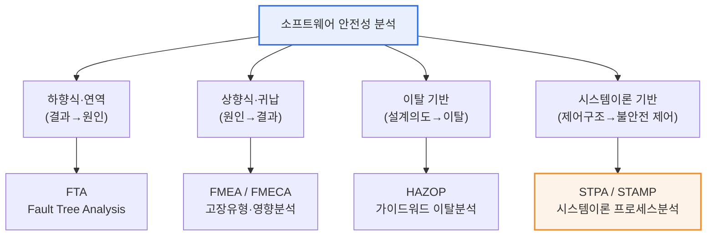
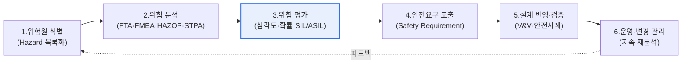

# 소프트웨어 안전성 분석(Software Safety Analysis)

## 1. 개요

### 가. 정의 및 필요성
> 소프트웨어 안전성 분석은 **소프트웨어에 내재한 잠재적 위험(Hazard)을 개발 생애주기 전반에 걸쳐 사전에 식별·분석·제거하여 사고(Accident)를 예방**하는 체계적 공학 활동으로, 자율주행·의료기기·항공·철도·원전 등 오류가 곧 인명·재산 피해로 이어지는 안전필수(Safety-Critical) 시스템에서 필수적으로 요구된다.

소프트웨어 안전성 분석이 독립된 공학 분야로 자리 잡은 근본 배경은, 소프트웨어가 이제 화면 속 정보 처리를 넘어 **물리 세계를 직접 제어**한다는 데 있다. 과거 소프트웨어 결함은 화면 오류나 데이터 손상에 그쳤지만, 오늘날 자동차의 제동 제어, 인공호흡기의 산소 공급, 항공기 플라이바이와이어(Fly-by-wire) 소프트웨어의 결함은 곧바로 사고와 인명 피해로 직결된다. 실제로 1985~1987년 방사선 치료기 Therac-25의 소프트웨어 경쟁상태(Race Condition) 결함은 환자에게 정상량의 수백 배에 달하는 방사선을 조사해 최소 3명이 사망한 대표적 사례로, 물리 세계를 제어하는 소프트웨어의 위험을 상징하는 사건으로 남아 있다.

이러한 위험은 결함을 먼저 만든 뒤 테스트로 찾아내는 사후적(Reactive) 접근만으로는 충분히 통제할 수 없다. 안전필수 시스템에서 요구하는 신뢰도는 통상 시간당 위험발생확률 10⁻⁷~10⁻⁹ 수준(IEC 61508의 SIL 3~4에 해당)으로, 이는 유한한 테스트만으로는 통계적으로 입증조차 불가능한 영역이다. 따라서 설계 초기부터 "무엇이 잘못될 수 있는가(What can go wrong)"를 체계적으로 예측하고 제거하는 예방적(Proactive) 분석이 반드시 병행되어야 한다.

분석 기법은 논리 전개의 방향에 따라 크게 두 갈래로 나뉜다. 우려되는 결과(사고)에서 출발해 그 원인을 거슬러 추적하는 **하향식(연역, Deductive)** 기법과, 개별 구성요소의 고장 원인에서 출발해 그것이 어떤 결과를 낳는지 따져가는 **상향식(귀납, Inductive)** 기법이 그것이다. 여기에 정상 설계 의도로부터의 이탈을 탐색하는 가이드워드 기반 기법과, 최근의 시스템이론 기반 기법이 더해진다.

### 나. 안전성(Safety)과 보안(Security)의 융합
전통적으로 안전성 분석은 무작위·우발적 고장(Random Failure)을, 보안 분석은 악의적 공격(Malicious Attack)을 다루는 별개 영역이었다. 그러나 자율주행차·스마트 의료기기·산업 IoT처럼 물리 제어와 네트워크 연결이 결합되면서, 오작동(Safety)과 해킹(Security)이 결합해 하나의 사고를 유발하는 상황이 늘고 있다. 예컨대 원격에서 브레이크 ECU를 조작하는 공격은 명백히 보안 사건이지만 그 결과는 인명 사고, 즉 안전 문제다. 그래서 SAE J3061, ISO/SAE 21434 등 최신 표준은 안전성 분석과 보안 위협 분석(TARA)을 통합적으로 수행할 것을 권고하며, "Safety of the Intended Functionality(SOTIF, ISO 21448)"처럼 오작동이 아니라 기능적 한계로 인한 위험까지 다루는 개념도 확산되고 있다.

## 2. 안전성 분석 기법 개관

```mermaid
flowchart TB
  S["소프트웨어 안전성 분석"] --> D["하향식·연역<br/>(결과→원인)"]
  S --> U["상향식·귀납<br/>(원인→결과)"]
  S --> G["이탈 기반<br/>(설계의도→이탈)"]
  S --> T["시스템이론 기반<br/>(제어구조→불안전 제어)"]
  D --> FTA["FTA<br/>Fault Tree Analysis"]
  U --> FMEA["FMEA / FMECA<br/>고장유형·영향분석"]
  G --> HAZOP["HAZOP<br/>가이드워드 이탈분석"]
  T --> STPA["STPA / STAMP<br/>시스템이론 프로세스분석"]
  style S fill:#e8f0fe,stroke:#2f6fed,stroke-width:2px
  style STPA fill:#fef3e8,stroke:#ed8f2f,stroke-width:2px
```

소프트웨어 안전성 분석 기법은 위 그림처럼 접근 논리에 따라 하향식·상향식·이탈 기반·시스템이론 기반으로 계열화된다. 이 네 계열은 경쟁 관계가 아니라 **서로 다른 각도에서 위험을 비추는 상호 보완적 도구**로 이해해야 한다. 하나의 기법이 놓치는 위험을 다른 기법이 포착하기 때문이다. 아래에서 각 기법의 원리와 절차, 적용 맥락을 차례로 설명한다.

### 가. FTA(Fault Tree Analysis, 결함수 분석)
> FTA는 우려하는 하나의 정상사건(Top Event, 최상위 사고)에서 출발해 그 원인을 **논리게이트(AND·OR·억제 게이트 등)로 하향 전개**하며 근본원인까지 추적하는 연역적 분석 기법이다.

FTA의 사고 흐름은 "이 사고가 일어나려면 그 아래에서 어떤 하위 사건들이, 어떤 논리적 조합으로 결합되어야 하는가"를 묻는 데 있다. 최상위 사고를 뿌리로 두고 그 원인을 가지처럼 아래로 펼쳐, 각 중간사건을 다시 하위 원인으로 분해한다. AND 게이트는 하위 사건이 모두 동시에 발생해야 상위 사건이 일어남을(중복설계·다중방어의 효과), OR 게이트는 하나만 발생해도 상위 사건이 일어남을(단일고장점의 취약성) 나타낸다.

FTA의 가장 큰 강점은 여러 원인이 복합적으로 얽혀 사고를 일으키는 경로를 시각적으로 명확히 드러낸다는 점이다. 특히 각 기본사건(Basic Event)에 발생확률을 부여하면, 불리언 대수를 이용해 최소 절단집합(Minimal Cut Set)을 구하고 최상위 사고의 발생확률을 정량적으로 산출할 수 있다. 예컨대 항공기 제어 시스템에서 "3중화된 비행제어 컴퓨터가 모두 실패"라는 사고는 세 컴퓨터 실패의 AND 조합이므로, 개별 실패확률이 10⁻³이라면 이론적으로 10⁻⁹ 수준으로 낮아진다는 식의 정량 근거를 제시한다.

다만 FTA는 분석 대상을 하나의 특정 사고(Top Event)로 한정하므로, 분석자가 미처 상상하지 못한 유형의 사고는 애초에 트리에 등장하지 못하는 한계가 있다. 또한 소프트웨어처럼 상태·타이밍·상호작용이 복잡한 대상에서는 "확률"의 의미가 모호해져, 정량 분석보다는 정성적 원인 구조 파악 용도로 쓰이는 경우가 많다.

### 나. FMEA / FMECA(고장유형·영향분석)
> FMEA는 시스템을 구성하는 각 요소의 **고장 유형(Failure Mode)을 빠짐없이 나열하고 그 영향(Effect)과 원인을 평가**하는 상향식·귀납적 분석 기법이며, 심각도·발생도·검출도를 곱한 **위험 우선순위 수(RPN, Risk Priority Number)** 로 대응 순서를 정한다.

FMEA는 FTA와 정반대 방향으로 접근한다. 사고가 아니라 **부품·모듈·기능 단위의 고장**에서 출발해, "이 요소가 이렇게 고장 나면 시스템 전체에 어떤 영향이 파급되는가"를 표 형태로 낱낱이 점검한다. 각 고장 유형에 대해 심각도(Severity, 1~10), 발생도(Occurrence, 1~10), 검출도(Detection, 1~10)를 평가하고 이 셋을 곱해 RPN(최대 1000)을 산출한다. RPN이 높은 고장부터 설계 개선·검출 강화 등 대응 자원을 우선 투입한다.

FMEA에 위험도(Criticality) 평가를 강화한 확장이 FMECA(Failure Mode, Effects and Criticality Analysis)이며, 자동차 산업에서는 AIAG-VDA가 2019년 발표한 개정판에서 RPN 대신 **조치 우선순위(AP, Action Priority)** 를 도입해 숫자의 곱만으로 판단하던 관행의 한계를 보완했다. 이는 RPN이 같은 값이라도 심각도가 높은 고장이 검출도가 나쁜 고장보다 더 위험하다는 실무적 통찰을 반영한 것이다.

FMEA의 강점은 요소별로 빠짐없이 훑는 망라성과 예방 중심성에 있지만, 각 고장을 독립적으로 다루기 때문에 **여러 요소의 동시·상호작용으로 발생하는 복합 고장**을 포착하기 어렵다는 한계가 있다. 이 지점이 바로 FTA(복합 원인 추적)나 STPA(상호작용 분석)와 상호 보완이 필요한 이유다.

### 다. HAZOP(Hazard and Operability Analysis, 위험 및 운용성 분석)
> HAZOP은 설계 의도(Design Intent)에 **가이드워드(No·More·Less·Reverse·Part of·As well as 등)를 대입**해 정상에서 벗어난 이탈(Deviation)과 그로 인한 위험·운용상 문제를 체계적으로 도출하는 정성 분석 기법이다.

HAZOP은 원래 1960년대 영국 화학공정 산업(ICI)에서 출발했으나, 이후 소프트웨어·시스템 운용의 위험 분석으로 확장되었다. 핵심은 "정상 설계 의도"를 명시한 뒤, 각 매개변수(유량·압력·데이터·타이밍 등)에 가이드워드를 조합해 "유량이 없다면(No Flow)", "데이터가 너무 많이 온다면(More)", "신호가 반대라면(Reverse)" 같은 이탈 시나리오를 강제로 생성하는 데 있다. 이렇게 함으로써 분석자의 상상력에만 의존하지 않고 누락 없이 위험을 발굴한다.

HAZOP의 특징은 안전성(Safety)뿐 아니라 **운용성(Operability)** 까지 함께 점검한다는 점, 그리고 공정·계측·제어·운전 등 다분야 전문가가 참여하는 구조화된 워크숍 형태로 진행된다는 점이다. 이 협업적 성격 덕분에 개인이 놓치기 쉬운 조직·운영 차원의 위험까지 드러난다. 다만 회의체 중심이라 시간·비용이 크고, 대규모 시스템에서는 조합 폭발로 분석량이 방대해지는 단점이 있다.

## 3. 기법 비교

기법 간 차이는 단순히 "방향이 다르다"는 데 그치지 않고, **어떤 종류의 위험을 잘 포착하고 무엇을 놓치는가**라는 실무적 함의로 이어진다. FTA는 특정 사고의 원인 구조와 확률을 잘 다루지만 미상상 사고에 취약하고, FMEA는 요소별 망라성이 뛰어나지만 상호작용 고장에 약하며, HAZOP은 운용 이탈 발굴에 강하나 비용이 크다. 따라서 시스템의 성격과 개발 단계에 맞춰 조합해야 한다.

| 구분 | FTA | FMEA / FMECA | HAZOP | STPA |
|---|---|---|---|---|
| **방향** | 하향식(연역) | 상향식(귀납) | 이탈 분석 | 시스템이론(하향) |
| **출발점** | 사고(Top Event) | 구성요소 고장 | 설계 의도 | 제어 구조 |
| **핵심 도구** | 논리게이트·확률·절단집합 | RPN / AP 우선순위 | 가이드워드 | 불안전 제어행위(UCA) |
| **강점** | 사고 경로·정량 확률 | 요소별 예방·망라성 | 운용 이탈·협업 발굴 | 상호작용·SW/인적요인 |
| **한계** | 미상상 사고 누락 | 복합·상호작용 고장 약함 | 시간·비용 과다 | 정량 위험평가 미흡 |
| **적합 대상** | HW 신뢰도·다중화 | 부품·기능 단위 시스템 | 공정·운용 시스템 | 소프트웨어 집약 시스템 |

주목할 점은, 전통적 FTA·FMEA가 "구성요소의 고장"을 사고의 원인으로 보는 데 반해, 뒤에서 설명할 STPA는 "**어떤 요소도 고장 나지 않았지만 상호작용이 안전하지 못한 경우**"까지 다룬다는 것이다. 소프트웨어는 마모·파손 같은 물리적 고장이 없고 대부분의 사고가 요구사항 오류나 구성요소 간 잘못된 상호작용에서 비롯되므로, 소프트웨어 집약 시스템일수록 시스템이론 기반 기법의 중요성이 커진다.

## 4. 분석 절차와 표준 연계

```mermaid
flowchart LR
  A["1.위험원 식별<br/>(Hazard 목록화)"] --> B["2.위험 분석<br/>(FTA·FMEA·HAZOP·STPA)"]
  B --> C["3.위험 평가<br/>(심각도·확률·SIL/ASIL)"]
  C --> D["4.안전요구 도출<br/>(Safety Requirement)"]
  D --> E["5.설계 반영·검증<br/>(V&V·안전사례)"]
  E --> F["6.운영·변경 관리<br/>(지속 재분석)"]
  F -. 피드백 .-> A
  style C fill:#e8f0fe,stroke:#2f6fed,stroke-width:2px
```

안전성 분석은 일회성 활동이 아니라 위 그림과 같이 **위험원 식별 → 분석 → 평가 → 안전요구 도출 → 설계 반영·검증 → 운영·변경관리**의 순환 프로세스로 수행된다. 특히 3단계의 위험 평가는 기능안전 표준의 무결성 등급과 직접 연결된다.

산업 전반의 기본 표준인 **IEC 61508**은 위험 감소 요구 수준을 SIL(Safety Integrity Level) 1~4로 정의하며, 등급이 높을수록 요구되는 개발 엄격도와 검증 수준이 강화된다. 자동차 분야의 파생 표준인 **ISO 26262**는 위험분석·위험평가(HARA)를 통해 심각도(S)·노출빈도(E)·제어가능성(C) 세 요소를 조합해 ASIL(A~D, 비안전 기능은 QM) 등급을 결정한다는 점에서, 하나의 위험 확률만으로 SIL을 정하는 IEC 61508과 결정 방식이 다르다. 예컨대 제동장치 상실처럼 심각도·노출·제어불가가 모두 높은 기능은 최고 등급인 ASIL D로 분류되어, 형식검증·MC/DC 커버리지 등 가장 엄격한 개발·검증이 요구된다.

이 밖에 항공(DO-178C), 의료기기(IEC 62304), 철도(EN 50128/50657) 등 도메인별 표준이 각각 안전성 분석과 그에 상응하는 개발 프로세스를 요구한다. 이처럼 분석 기법은 표준이 요구하는 무결성 등급을 근거 있게 뒷받침하는 수단이므로, 개발 초기부터 표준과 통합해 계획해야 한다.

특히 무결성 등급은 단순한 라벨이 아니라 이후 개발 전 과정의 강도를 좌우하는 '조절 손잡이'로 작동한다. 등급이 높아질수록 요구되는 검증 활동—정적 분석, 커버리지 기준, 독립 검증팀(Independent V&V), 형식 기법의 적용 범위—이 단계적으로 강화되며, 이 모든 근거가 하나의 **안전사례(Safety Case)** 로 엮여 인증기관을 설득하는 논증 체계가 된다. 따라서 안전성 분석의 결과물은 그 자체로 끝나지 않고, 요구·설계·구현·시험의 각 산출물과 양방향 추적성(Bidirectional Traceability)으로 연결되어야 비로소 그 가치를 인정받는다.

## 5. 심화 — 시스템이론 기반 분석(STPA/STAMP)과 최신 동향

전통적 기법(FTA·FMEA)은 "고장의 연쇄(Chain of Events)"라는 사고 모델에 기반한다. 그러나 현대의 소프트웨어 집약 시스템에서 발생하는 사고의 상당수는 어느 부품도 고장 나지 않았는데도 **구성요소 간 상호작용과 요구사항 자체의 결함**에서 비롯된다. 이 통찰에서 출발한 것이 MIT의 Nancy Leveson 교수가 제안한 **STAMP(System-Theoretic Accident Model and Processes)** 사고 모델과 이에 기반한 분석 기법 **STPA(System-Theoretic Process Analysis)** 이다.

STPA는 시스템을 "제어자(Controller)–제어행위(Control Action)–피제어 프로세스–피드백"으로 이루어진 **계층적 제어 구조(Control Structure)** 로 모델링하고, 이 구조에서 발생 가능한 **불안전 제어행위(UCA, Unsafe Control Action)** 를 도출한다. UCA는 (1) 필요한 제어를 하지 않음, (2) 불안전한 제어를 함, (3) 잘못된 시점·순서로 제어함, (4) 너무 오래/짧게 지속함의 네 유형으로 체계화된다. 이후 각 UCA가 발생하는 원인 시나리오(Loss Scenario)를 분석해 안전 요구사항을 도출한다.

STPA의 강점은 소프트웨어 로직 오류, 요구사항의 불완전성, 인적 요인(Human Factor)까지 하나의 틀에서 다룰 수 있다는 점이다. 자율주행·항공·국방 분야에서 채택이 빠르게 늘고 있으며, 안전과 보안을 함께 다루는 확장인 STPA-Sec, 사고 사후분석용인 CAST(Causal Analysis based on STAMP)도 함께 쓰인다. 다만 STPA는 대부분의 국제 안전표준이 요구하는 정량적 위험 평가(확률 산출)를 자체적으로 제공하지 않으므로, 실무에서는 STPA로 시나리오를 발굴하고 FMEA·FTA로 정량 평가를 보완하는 **하이브리드 접근**이 권장된다. 예상 출제 방향으로는 "FTA/FMEA와 STPA의 사고 모델 차이", "자율주행·SOTIF와 안전분석의 연계", "Safety-Security 통합 분석" 등이 유력하다.

## 6. 고려사항 및 시사점

1. **기법을 상호 보완적으로 병행하라.** 단일 기법은 반드시 사각지대를 갖는다. FTA로 특정 사고의 경로와 확률을, FMEA로 요소별 고장을, HAZOP으로 운용 이탈을, STPA로 상호작용·요구사항 결함을 분석하면 서로 다른 각도에서 위험을 포괄적으로 발굴할 수 있다. 기술사 관점에서는 "무엇을 언제 어떤 조합으로 쓸지"를 시스템 성격(HW 중심 vs SW 집약)에 맞춰 설계하는 것이 핵심 역량이다.

2. **개발 초기 적용으로 비용을 최소화하라.** 결함 수정 비용은 요구·설계 단계에서 운영 단계로 갈수록 기하급수적으로 증가한다(통상 1:10:100 법칙). 위험은 설계 단계에서 발견·제거할수록 적은 비용으로 큰 효과를 내므로, 안전성 분석을 V-모델의 좌측(요구·설계)부터 통합하는 Shift-Left 전략이 요구된다.

3. **기능안전 표준과 정합적으로 연계하라.** ISO 26262(자동차)·IEC 61508(범용)·IEC 62304(의료)·DO-178C(항공) 등은 각 무결성 등급(ASIL·SIL)에 상응하는 분석 기법과 검증 수준을 요구한다. 분석 결과는 궁극적으로 **안전사례(Safety Case)** 로 구조화되어 인증·감사에 활용되므로, 추적성(Traceability)을 갖춘 문서화가 트레이드오프로 함께 관리되어야 한다.

4. **안전(Safety)과 보안(Security)을 통합적으로 다뤄라.** 커넥티드·자율 시스템에서는 해킹이 곧 안전사고로 이어진다. ISO/SAE 21434(자동차 사이버보안), ISO 21448(SOTIF)과 연계해 위협 분석(TARA)과 안전성 분석을 통합 수행하는 방향으로 진화하고 있다.

5. **분석을 지속적 활동으로 운영하라.** 시스템은 변경·업데이트되며 위험도 함께 변한다. OTA(무선 업데이트)·AI 기반 기능 도입처럼 배포 후 동작이 바뀌는 시대에는, 변경관리(Change Management)와 연동한 지속적 재분석(Continuous Safety Assurance) 체계가 필요하다.

## 참고자료
- itemis, "Functional Safety: ISO 26262, IEC 61508, ASIL, Safety Case" — https://www.itemis.com/en/compliance-intelligence/functional-safety/
- Wikipedia, "Automotive Safety Integrity Level(ASIL)" — https://en.wikipedia.org/wiki/Automotive_safety_integrity_level
- UL Solutions, "Understanding STAMP, STPA, and CAST: Safety Engineering" — https://www.ul.com/sis/blog/introduction-to-stamp-stpa-and-cast
- Software Quality Journal, "Comparison of the FMEA and STPA safety analysis methods" — https://dl.acm.org/doi/10.1007/s11219-017-9396-0

---

> **한 줄 요약**: 소프트웨어 안전성 분석은 안전필수 시스템의 위험을 설계 초기부터 사전 예방하며, *FTA(하향식 사고경로·확률)·FMEA(상향식 요소고장·RPN)·HAZOP(가이드워드 이탈)·STPA(시스템이론·상호작용)* 를 상호 보완적으로 병행하고, ISO 26262·IEC 61508 등 기능안전 표준 및 보안(TARA)과 통합해 안전사례로 입증한다.
