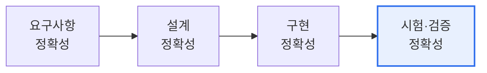

# 소프트웨어 안전성 진단 — 기능동작 정확성 진단

## 1. 개요

### 가. 개념
> **소프트웨어 안전성 진단**은 「소프트웨어 안전진단 가이드」에 따라, SW가 **예상 상황과 비정상 상황에서 안전하게 동작하는지를 체계적으로 진단**하는 활동이다. 그중 **기능동작 정확성 진단**은 SW가 요구된 기능을 정확하게 수행하는지를 검증하는 핵심 항목이다.

기능동작 정확성 진단이 중요한 이유는 '**SW가 산업·안전에 깊이 관여하며, 오작동이 곧 사고로 이어진다**'는 데 있다. 소프트웨어가 자동차·의료·발전·교통 등 안전이 중요한 영역에 널리 쓰이면서, SW가 정상 상황뿐 아니라 예외·비정상 입력에서도 정확하고 안전하게 동작하는지 확인하는 일이 필수가 되었다. 기능이 요구대로 정확히 수행되지 않으면(오동작·의도치 않은 동작), 물리적 피해로 직결될 수 있다. 안전진단 가이드는 이를 예방하기 위해 SW의 안전성을 여러 진단 항목으로 나눠 점검하며, 기능동작 정확성은 그 핵심이다. 요구사항이 명확한지, 설계가 요구를 정확히 반영하는지, 구현이 설계대로 동작하는지, 그리고 비정상 입력·경계 조건에서도 안전하게 처리하는지를 단계적으로 검증한다. 즉 요구→설계→구현→시험의 각 단계에서 정확성을 확인해 결함이 사고로 번지는 것을 막는다.

### 나. 필요성
SW의 사회 전반 확산으로 오작동의 피해가 커지면서, 개발 전 과정에서 안전성을 체계적으로 진단·확보할 필요가 커졌다.

## 2. 기능동작 정확성 진단의 단계별 절차

| 단계 | 주요 활동 |
|---|---|
| **요구사항 정확성** | 요구사항의 완전성·일관성·모호성 점검, 안전 요구 식별 |
| **설계 정확성** | 요구사항의 설계 반영 여부, 추적성 확인 |
| **구현 정확성** | 코드가 설계대로 구현됐는지, 코딩 표준·정적분석 |
| **시험·검증 정확성** | 정상·비정상·경계 조건 테스트, 커버리지 확보 |

각 단계는 **추적성(traceability)** 으로 연결된다. 요구사항이 설계·구현·시험에 빠짐없이 반영·검증됐는지를 추적해, 누락이나 왜곡을 찾아낸다. 특히 시험 단계에서는 정상 입력뿐 아니라 예외·경계값·오류 상황을 포함해 SW가 안전하게 처리하는지를 확인한다.

## 3. 주요 진단 기법

| 기법 | 내용 |
|---|---|
| **요구사항 검토** | 완전성·일관성·검증가능성 리뷰 |
| **정적 분석** | 코드 결함·표준 위반 자동 탐지 |
| **동적 시험** | 정상·비정상·경계 테스트, 커버리지 측정 |
| **추적성 분석** | 요구-설계-구현-시험 매핑 검증 |

## 4. 고려사항 및 시사점

1. **개발 전 과정의 정확성 확보**가 핵심이다. 안전성은 시험만으로 보장되지 않으며, 요구·설계·구현 각 단계에서 정확성을 확인해야 결함이 후단계로 전파되는 것을 막는다.
2. **기능안전 표준과 연계**한다. 자동차 ISO 26262, 산업 IEC 61508 등 도메인별 기능안전 표준의 요구(커버리지·검증 절차)와 연계해 진단해야 실효성이 있다. [[software-safety-analysis]]
3. **자동화·정적분석 활용**이 필요하다. 대규모 SW에서 수동 진단은 한계가 있으므로, 정적분석·테스트 자동화 도구로 결함을 조기·광범위하게 탐지하고 지속적으로 진단한다.

---

> **한 줄 요약**: SW 안전성 진단의 기능동작 정확성 진단은 *요구→설계→구현→시험 각 단계에서 정확성을 추적성 기반으로 검증* 하는 절차로, 정상·비정상·경계 조건을 포함해 SW 오작동이 사고로 이어지지 않도록 하며 기능안전 표준과 연계한다.
