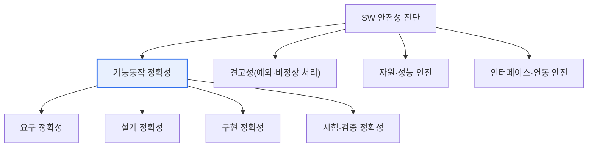
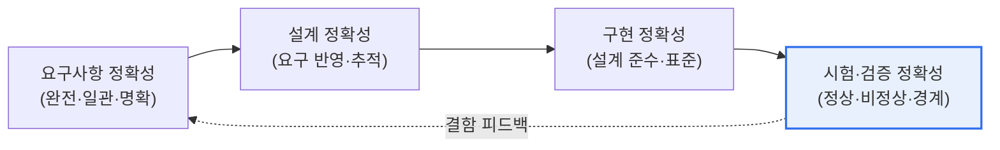

# 소프트웨어 안전성 진단 — 기능동작 정확성 진단

## 1. 개요

### 가. 개념
> **소프트웨어 안전성 진단**은 「소프트웨어 안전진단 가이드」에 따라, SW가 **예상 상황과 비정상 상황 모두에서 안전하게 동작하는지를 체계적으로 진단**하는 활동이다. 그중 **기능동작 정확성 진단**은 SW가 요구된 기능을 정확하게 수행하는지, 그리고 예외·경계 상황에서도 의도치 않은 동작 없이 안전하게 처리하는지를 검증하는 핵심 항목이다.

기능동작 정확성 진단이 중요한 이유는 '**SW가 산업·안전에 깊이 관여하며, 오작동이 곧 물리적 사고로 이어진다**'는 데 있다. 소프트웨어가 자동차·의료·발전·철도·교통 같은 안전필수(safety-critical) 영역에 널리 쓰이면서, SW가 정상 상황뿐 아니라 예외·비정상 입력에서도 정확하고 안전하게 동작하는지 확인하는 일이 필수가 되었다. 기능이 요구대로 정확히 수행되지 않으면(오동작·의도치 않은 동작·무응답), 그 결과는 화면 오류에 그치지 않고 제동 실패·투약량 오류·설비 폭주 같은 인명·재산 피해로 직결될 수 있다.

여기서 '기능동작 정확성'은 두 방향의 요구를 함께 담는다는 점을 이해해야 한다. 하나는 **의도한 기능이 요구대로 수행되는가(should-do, 정상 기능의 정확성)**이고, 다른 하나는 **의도하지 않은 동작이 발생하지 않는가(should-not-do, 안전 속성의 보장)**이다. 안전성 관점에서는 후자가 특히 중요하다. 정상 입력에서 잘 동작해도, 비정상 입력·경계 조건·고장 상황에서 예기치 않은 위험 동작이 나타나면 안전은 무너진다. 그래서 진단은 정상 시나리오뿐 아니라 예외·경계·오류 상황을 의도적으로 포함해 설계된다.

안전진단 가이드는 이를 예방하기 위해 SW의 안전성을 여러 진단 항목으로 나눠 점검하며, 기능동작 정확성은 그 핵심 축이다. 진단은 요구사항이 명확·완전한지, 설계가 요구를 정확히 반영하는지, 구현이 설계대로 동작하는지, 그리고 시험이 정상·비정상·경계 조건까지 충분히 검증했는지를 **단계적**으로 확인한다. 즉 요구→설계→구현→시험의 각 단계에서 정확성을 확인해, 앞 단계의 결함이 뒤 단계로 전파되어 결국 사고로 번지는 것을 막는다.

### 나. 필요성
SW의 사회 전반 확산으로 오작동의 파급이 커지면서, 시험 단계에서만 품질을 확인하는 사후적 접근으로는 안전을 보장하기 어려워졌다. 결함이 요구·설계 단계에서 이미 잉태되면 후단계에서 발견해도 수정 비용이 수십 배로 커지고 누락 위험도 높다. 따라서 개발 전 과정에서 정확성을 체계적으로 진단·확보하는 '예방적 안전' 접근이 필요하다.

## 2. 전체 구조 — 안전성 진단 항목 속 기능동작 정확성

기능동작 정확성 진단의 위치를 이해하려면, 안전성 진단이 여러 관점의 묶음이라는 전체 구조를 먼저 봐야 한다. 아래 구조도는 안전성 진단이 기능동작 정확성을 중심으로, 견고성·자원·인터페이스 등 인접 관점과 함께 하나의 체계를 이룸을 보여준다.

```mermaid
flowchart TB
  SAFE["SW 안전성 진단"] --> FUNC["기능동작 정확성"]
  SAFE --> ROB["견고성(예외·비정상 처리)"]
  SAFE --> RES["자원·성능 안전"]
  SAFE --> IF["인터페이스·연동 안전"]
  FUNC --> R["요구 정확성"]
  FUNC --> D["설계 정확성"]
  FUNC --> I["구현 정확성"]
  FUNC --> T["시험·검증 정확성"]
  style FUNC fill:#e8f0fe,stroke:#2f6fed,stroke-width:2px
```

**기능동작 정확성**은 이 체계의 중심으로, '요구된 기능이 각 개발 단계에서 왜곡 없이 정확히 전달·구현·검증되는가'를 본다. **견고성** 관점은 잘못된 입력·고장 상황에서의 방어적 처리를, **자원·성능 안전**은 메모리·타이밍 예산 준수를, **인터페이스 안전**은 모듈·외부 시스템 간 연동의 정확성을 다룬다. 이 관점들은 서로 겹치며 보완한다. 예컨대 기능은 정확해도 예외 입력에서 방어가 없으면 안전이 깨지므로, 기능동작 정확성 진단은 자연스럽게 견고성 진단과 맞물려 수행된다.

이런 구조가 필요한 이유는, 안전성이 단일 시험만으로 증명되지 않는 '전 과정의 산물'이기 때문이다. 요구가 모호하면 아무리 시험을 많이 해도 무엇이 옳은 동작인지 판정 기준 자체가 흔들린다. 따라서 진단은 시험 결과만 보는 것이 아니라, 그 앞 단계의 정확성과 단계 간 연결(추적성)을 함께 본다.

## 3. 기능동작 정확성 진단의 단계별 절차

각 개발 단계에서 정확성이 어떻게 확인되고 다음 단계로 이어지는지를 아래 절차도로 나타낸다. 핵심은 각 단계가 독립적으로 검사되는 것이 아니라 **추적성(traceability)**으로 앞뒤가 연결된다는 점이다.

```mermaid
flowchart LR
  R["요구사항 정확성<br/>(완전·일관·명확)"] --> D["설계 정확성<br/>(요구 반영·추적)"]
  D --> I["구현 정확성<br/>(설계 준수·표준)"]
  I --> T["시험·검증 정확성<br/>(정상·비정상·경계)"]
  T -. 결함 피드백 .-> R
  style T fill:#e8f0fe,stroke:#2f6fed,stroke-width:2px
```

**요구사항 정확성** 단계는 모든 정확성의 출발점이다. 요구사항이 불완전(누락)·비일관(모순)·모호하면, 그 위에 세운 설계·구현·시험이 모두 흔들린다. 이 단계에서는 안전 요구가 빠짐없이 식별됐는지, 각 요구가 검증 가능한 형태로 기술됐는지, 상충하는 요구가 없는지를 검토한다. 예컨대 '위험 상황에서 시스템은 안전 상태로 전이한다'는 요구는, 어떤 상황이 위험인지·안전 상태가 무엇인지·전이 시간 제약이 얼마인지까지 명확해야 진단 기준이 된다.

**설계 정확성** 단계는 요구가 설계에 정확히 반영됐는지, 설계가 요구를 초과하거나 누락하지 않았는지를 본다. 여기서 추적성 매트릭스가 핵심 수단이다. 각 요구가 어떤 설계 요소로 실현되는지, 반대로 각 설계 요소가 어떤 요구에서 비롯됐는지를 양방향으로 매핑해, 근거 없는 설계(요구 없는 기능)나 미실현 요구(설계 없는 요구)를 찾아낸다. 안전 요구가 특정 아키텍처(중복·감시·안전 상태)로 어떻게 실현되는지도 이 단계에서 확인한다.

**구현 정확성** 단계는 코드가 설계대로 구현됐는지, 그리고 코딩 규칙을 준수하는지를 검사한다. 정적 분석으로 표준 위반·잠재 결함(널 참조·경계 초과·미초기화·데드코드)을 자동 탐지하고, 코드 리뷰로 설계 의도와의 일치를 확인한다. 안전필수 코드에서는 위험한 언어 기능을 제한하는 코딩 표준(예: MISRA C)을 함께 적용해, 정의되지 않은 동작이나 애매한 구성을 원천 차단한다.

**시험·검증 정확성** 단계는 실제 실행으로 동작을 확인한다. 이때 정상 입력만이 아니라 **비정상 입력·경계값·오류 상황**을 반드시 포함한다. 경계값 분석·동등분할로 입력 공간을 체계적으로 나누고, 고장 주입으로 예외 경로를 자극하며, 커버리지(문장·분기·MC/DC)로 검증의 충분성을 정량화한다. 시험 결과에서 발견된 결함은 피드백되어 요구·설계의 결함까지 거슬러 올라가 교정된다.

| 단계 | 주요 활동 | 산출·근거 |
|---|---|---|
| **요구사항 정확성** | 완전성·일관성·모호성 점검, 안전 요구 식별 | 요구 검토 결과, 안전 요구 목록 |
| **설계 정확성** | 요구의 설계 반영·추적성 확인 | 추적성 매트릭스 |
| **구현 정확성** | 설계 준수·코딩 표준·정적분석 | 정적분석 리포트, 리뷰 기록 |
| **시험·검증 정확성** | 정상·비정상·경계 시험, 커버리지 | 시험 케이스·커버리지 리포트 |

## 4. 주요 진단 기법 — 비교와 실무 함의

진단 기법은 단독으로 완결되지 않으며, 서로의 한계를 메우는 방식으로 조합된다. 아래에서 대표 기법의 원리와 한계를 비교한다.

**요구사항 검토(리뷰·인스펙션)**는 실행 전 단계에서 결함을 잡는 가장 값싼 방법이다. 사람이 요구의 완전성·일관성·검증가능성을 점검하며, 형식적 인스펙션(체크리스트·역할 분담)을 쓰면 재현성이 높아진다. 다만 리뷰는 사람 판단에 의존하므로, 명세가 방대하면 누락이 생긴다는 한계가 있다.

**정적 분석**은 코드를 실행하지 않고 결함·표준 위반을 자동 탐지한다. 널 참조·경계 초과·미초기화 같은 결함을 광범위하게 조기에 잡는다는 것이 장점이다. 반면 실행 맥락을 완전히 알 수 없어 거짓양성(false positive)이 발생하며, 실제 실행 시 타이밍·환경 의존 문제는 잡지 못한다.

**동적 시험**은 실제 실행으로 동작을 확인한다. 정상·비정상·경계 조건 케이스를 만들어 실행하고 커버리지를 측정한다. 실제 동작을 직접 관찰한다는 강점이 있으나, 입력 공간이 넓으면 '실행하지 않은 경로'가 남는다는 근본 한계가 있다. 그래서 정적 분석으로 '전 경로의 성질'을 보완하고, 커버리지로 '얼마나 실행했는지'를 정량화한다.

**추적성 분석**은 요구-설계-구현-시험을 양방향으로 매핑해, 어떤 요구가 검증되지 않았는지·어떤 코드가 근거 없는지를 드러낸다. 이는 개별 기법이 놓치는 '단계 간 누락'을 잡아내는, 안전성 진단 특유의 수단이다.

이 기법들의 조합 원리는 '한 기법의 사각지대를 다른 기법이 덮는다'는 데 있다. 리뷰(사람·의미)+정적분석(자동·전경로)+동적시험(실제 동작)+추적성(단계 연결)을 함께 써야 정확성 진단이 실효적이다.

여기서 커버리지 지표는 '검증을 얼마나 했는가'를 정량화하는 공통 척도로 쓰인다. 문장 커버리지는 최소 기준이며, 분기·조건 커버리지, 그리고 안전무결성이 높은 코드에는 MC/DC까지 요구된다. 다만 커버리지는 '충분성의 하한'을 말할 뿐 정확성을 보장하지 않는다는 점을 유의해야 한다. 100% 커버리지라도 애초에 잘못된 기대값으로 판정했다면 결함은 통과한다. 그래서 커버리지 수치와 함께, 기대 결과의 타당성(오라클 문제)과 시나리오의 대표성을 함께 검토하는 것이 진단의 성숙도를 가른다.

| 기법 | 강점 | 한계 | 보완 |
|---|---|---|---|
| **요구사항 검토** | 조기·저비용 | 사람 의존·누락 | 체크리스트·인스펙션 |
| **정적 분석** | 광범위·전경로 | 거짓양성·환경 미반영 | 동적 시험으로 확인 |
| **동적 시험** | 실제 동작 관찰 | 미실행 경로 잔존 | 커버리지·정적분석 |
| **추적성 분석** | 단계 간 누락 탐지 | 관리 부담 | 도구 자동화 |

### 진단 결과의 판정과 재작업 루프

진단은 결함을 찾는 데서 끝나지 않는다. 발견된 결함은 근본 단계까지 거슬러 올라가 교정되어야 한다. 예컨대 시험 단계에서 경계값 오류가 반복적으로 나온다면, 그 원인이 구현의 실수인지, 설계가 경계 처리를 누락했는지, 애초에 요구가 경계 동작을 규정하지 않았는지를 판별해야 한다. 원인이 요구 단계에 있다면 코드만 고쳐도 재발한다. 따라서 절차도의 '결함 피드백' 경로처럼, 진단 결과는 요구·설계까지 되돌아가는 폐루프로 다뤄진다.

이 재작업 루프의 효율은 결국 추적성의 품질에 달려 있다. 요구-설계-구현-시험이 정확히 매핑돼 있으면, 하나의 결함이 어느 단계에서 비롯됐고 어떤 다른 산출물에 영향을 주는지 신속히 파악할 수 있다. 반대로 추적성이 부실하면 같은 결함이 여러 곳에서 되살아나고, 수정이 새로운 결함을 부르는 악순환에 빠진다. 안전성 진단이 '한 번의 시험'이 아니라 '지속되는 체계'여야 하는 이유가 여기에 있다.

## 5. 심화 — 기능안전 표준 연계와 실무 적용

기능동작 정확성 진단은 도메인별 **기능안전 표준**과 연계될 때 실효성을 갖는다. 자동차 분야의 ISO 26262는 위험도에 따라 ASIL(A~D) 등급을 부여하고, 등급이 높을수록 강한 검증(예: 상위 등급에서 MC/DC 커버리지, 형식 검증 권고)을 요구한다. 산업 일반의 IEC 61508은 SIL(1~4)로 안전무결성을 정의하며, 각 수준에 맞는 기법을 권고·요구한다. 의료기기(IEC 62304)는 SW 안전 등급(A~C)에 따라 요구·설계·검증의 엄격도를 달리한다. 이런 표준들은 '무엇을, 얼마나 정확히 검증했는지'에 대한 증거를 요구하므로, 기능동작 정확성 진단은 곧 안전 인증의 근거 자료를 생성하는 과정이 된다.

구체적 사례로, 안전필수 개발 조직은 커밋마다 정적 분석과 단위 시험을 자동 실행하고, 커버리지가 목표(예: 상위 등급에서 MC/DC 100%)에 미달하면 병합을 막는 게이트를 둔다. 또한 요구관리 도구와 시험관리 도구를 연동해 추적성을 자동 갱신함으로써, 요구가 바뀌면 영향받는 설계·시험을 즉시 식별한다. 이렇게 하면 대규모 SW에서도 수동 진단의 한계를 넘어, 변경마다 정확성을 지속적으로 재확인할 수 있다.

또 다른 사례로, 의료기기 SW(IEC 62304 등급 C)에서는 투약 펌프의 유량 제어 로직에 대해 정상 처방뿐 아니라 센서 이상·전원 순단·통신 지연 같은 비정상 상황을 고장 주입으로 시험하고, 그 결과가 '안전한 정지 상태로의 전이' 요구를 만족하는지 추적성으로 확인한다. 이처럼 기능동작 정확성 진단은 도메인마다 '무엇이 위험 동작인가'를 구체화하고, 그 위험을 회피하는 요구가 실제로 구현·검증됐는지를 끝까지 추적하는 형태로 적용된다.

최신 동향으로는 세 가지가 주목된다. 첫째, **정적 분석·형식 검증의 고도화**로, 수학적 방법으로 특정 오류(런타임 예외·정수 오버플로)의 부재를 증명하는 접근이 안전필수 영역에서 확대되고 있다. 둘째, **개발 파이프라인 내 지속 검증**으로, 진단이 별도 단계가 아니라 CI에 내장되어 상시 수행된다. 셋째, **AI 기반 SW의 정확성 진단** 문제로, 학습 기반 컴포넌트는 명세가 데이터로 암묵화되어 전통적 요구-추적성 진단이 그대로 적용되기 어려우며, 데이터 품질·분포·시나리오 커버리지 관점의 새로운 진단 기준이 요구된다. 이는 기능동작 정확성 진단의 대상과 방법이 확장되고 있음을 시사한다.

## 6. 고려사항 및 시사점

1. **개발 전 과정의 정확성 확보가 핵심이다.** 안전성은 시험만으로 보장되지 않으며, 요구·설계·구현 각 단계에서 정확성을 확인해야 결함이 후단계로 전파되는 것을 막는다. 특히 요구 단계의 모호성 제거가 이후 모든 진단의 판정 기준을 좌우하므로 가장 먼저 투자해야 한다.
2. **추적성을 진단의 척추로 삼는다.** 요구-설계-구현-시험의 양방향 매핑을 도구로 유지해, 미검증 요구와 근거 없는 코드를 드러내야 한다. 변경이 잦은 대규모 SW에서 추적성은 영향분석과 회귀 진단의 기반이 된다.
3. **기능안전 표준과 연계해 실효성을 확보한다.** ISO 26262·IEC 61508·IEC 62304 등 도메인 표준의 등급별 요구(커버리지·검증 절차)와 연계해 진단 계획을 세워야, 인증 근거를 자연스럽게 생성하고 재작업을 줄인다. [[software-safety-analysis]]
4. **정적·동적·리뷰·추적성을 조합해 사각지대를 없앤다.** 어떤 단일 기법도 완전하지 않으므로, 조기·저비용의 리뷰와 전경로의 정적 분석, 실제 동작의 동적 시험, 단계 연결의 추적성을 상호 보완적으로 결합한다.
5. **자동화·지속 진단과 AI 시대의 새 기준에 대비한다.** 대규모 SW에서 수동 진단은 한계가 있으므로 CI에 진단을 내장해 상시 수행하고, 학습 기반 컴포넌트에는 데이터·시나리오 커버리지 같은 새로운 정확성 판정 기준을 마련해야 한다.

## 참고자료
- ISO 26262 Road vehicles — Functional safety, https://www.iso.org/standard/68383.html
- IEC 61508 Functional safety of E/E/PE safety-related systems, https://www.iec.ch/functional-safety
- IEC 62304 Medical device software — Software life cycle processes, https://www.iso.org/standard/38421.html

---

> **한 줄 요약**: SW 안전성 진단의 기능동작 정확성 진단은 *요구→설계→구현→시험 각 단계의 정확성을 추적성 기반으로 검증* 하는 예방적 활동으로, 정상뿐 아니라 비정상·경계 조건을 포함해 '해야 할 동작'과 '하지 말아야 할 동작'을 함께 확인하며, ISO 26262·IEC 61508 등 기능안전 표준과 연계해 안전 인증의 근거를 생성한다.
