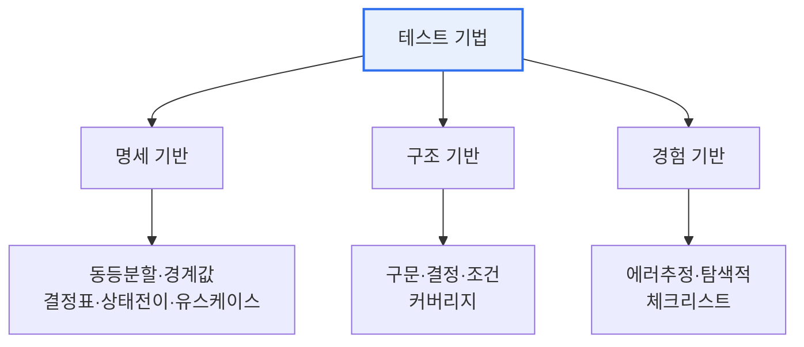

# 소프트웨어 테스트(Software Testing)

## 1. 개요

### 가. 정의
> 소프트웨어의 **결함을 발견**하고 요구사항 충족 여부를 확인·검증하여 품질을 확보하는 활동. 오류 예방과 품질 신뢰도 향상을 목적으로 한다.

## 2. 소프트웨어 테스트 원리 (가)

| 원리 | 내용 |
|---|---|
| **결함 존재 증명** | 테스트는 결함의 존재는 밝히나 없음을 증명 못함 |
| **완벽한 테스트 불가능** | 모든 입력·경로 조합 테스트는 불가(리스크 기반 선택) |
| **초기 집중(Early Testing)** | 개발 초기부터 테스트 → 결함 비용 절감 |
| **결함 집중(Pareto)** | 소수 모듈에 결함 집중 |
| **살충제 역설** | 같은 테스트 반복 시 새 결함 못 찾음 → 케이스 갱신 |
| **정황 의존** | 도메인·리스크에 따라 테스트 다르게 |
| **오류 부재의 궤변** | 결함 없어도 요구 불충족이면 품질 나쁨 |

## 3. 블랙박스 vs 화이트박스 테스트 (나)

| 구분 | 블랙박스 | 화이트박스 |
|---|---|---|
| **관점** | 명세 기반(내부 구조 모름) | 내부 구조·로직 기반 |
| **목적** | 기능·요구사항 충족 | 코드 커버리지·경로 검증 |
| **기법** | 동등분할, 경계값, 결정표, 상태전이 | 구문·결정·조건 커버리지 |
| **수행** | 주로 QA·사용자 관점 | 개발자 관점 |

## 4. 테스트 기법 (다)

| 기법 | 설명 |
|---|---|
| **명세 기반**(블랙박스) | 요구·명세로부터 케이스 도출(동등분할·경계값·결정표) |
| **구조 기반**(화이트박스) | 코드 구조 기반 커버리지(구문·결정·조건/MC-DC) |
| **경험 기반** | 테스터 경험·직관(에러 추정, 탐색적 테스트) |

## 5. 고려사항 및 시사점
- 명세+구조+경험 기법의 **조합**으로 커버리지 극대화
- 자동화(CI)·TDD·리스크 기반 테스트로 효율화

---

> **한 줄 요약**: 소프트웨어 테스트는 *7가지 원리* 를 바탕으로 *블랙박스(명세)·화이트박스(구조)* 관점에서 *명세·구조·경험 기반* 기법을 조합해 결함을 발견하고 품질을 확보한다.
