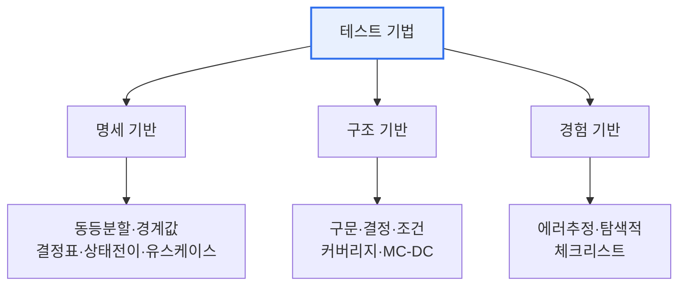

# 소프트웨어 테스트(Software Testing)

## 1. 개요

### 가. 정의
> 소프트웨어에 잠재된 **결함을 발견**하고 요구사항 충족 여부를 확인·검증하여 품질을 확보하는 활동. 오류 예방과 신뢰도 향상을 목적으로 한다.

테스트에 대한 흔한 오해는 "결함이 없음을 증명하는 일"이라는 것이다. 그러나 소프트웨어는 입력 조합이 사실상 무한하므로 모든 경우를 확인할 수 없고, 따라서 테스트가 할 수 있는 것은 **결함의 존재를 드러내는 일**뿐이다. 이 인식에서 출발해야 "제한된 자원으로 결함을 가장 효율적으로 찾는" 전략적 활동으로서의 테스트가 성립한다. 검증(Verification, 제대로 만들었는가)과 확인(Validation, 옳은 것을 만들었는가)을 아우르며, 품질을 사후에 검사하는 것을 넘어 **초기부터 결함을 예방**하는 방향으로 발전해 왔다.

### 나. 필요성
결함은 발견이 늦어질수록 수정 비용이 기하급수적으로 커진다. 요구·설계 단계의 오류가 운영 단계에서 발견되면 수십 배의 비용이 들 수 있다는 것이 오랜 경험칙이다. 따라서 테스트는 단순 검사가 아니라 **결함을 조기에·저비용으로 걸러내는 품질 확보 수단**이며, 아래 원리들은 이 목표를 달성하기 위한 실천 지침이다.

## 2. 소프트웨어 테스트 원리 (가)

테스트 7원리는 서로 연결된 하나의 논리다. "완벽한 테스트가 불가능"하기에 리스크에 따라 선택해야 하고(정황 의존), 결함이 "소수 모듈에 집중"되므로 그곳에 자원을 몰며, 그렇게 만든 케이스도 반복하면 효력을 잃으므로(살충제 역설) 계속 갱신해야 한다. 아래 표는 각 원리와 그 실천적 함의다.

| 원리 | 내용 및 함의 |
|---|---|
| **결함 존재 증명** | 결함의 존재는 밝히나 없음은 증명 못함 → 테스트 목적은 결함 발견 |
| **완벽한 테스트 불가능** | 모든 입력·경로 조합은 불가 → 리스크 기반 선택 |
| **초기 집중(Early Testing)** | 개발 초기부터 테스트 → 결함 수정 비용 절감 |
| **결함 집중(Pareto)** | 소수 모듈에 결함 집중 → 자원 우선 배분 |
| **살충제 역설** | 같은 테스트 반복 시 새 결함 못 찾음 → 케이스 갱신 |
| **정황 의존** | 도메인·리스크에 따라 테스트를 다르게 |
| **오류 부재의 궤변** | 결함이 없어도 요구 불충족이면 품질 나쁨 |

특히 "오류 부재의 궤변"은 기술적으로 버그가 없더라도 사용자가 원하는 것을 만들지 못하면 소용없음을 지적하는 것으로, 테스트가 코드 검증을 넘어 **요구사항 타당성 확인**까지 포함해야 함을 일깨운다.

## 3. 블랙박스 vs 화이트박스 테스트 (나)

두 접근은 "무엇을 근거로 케이스를 만드는가"로 갈린다. **블랙박스**는 내부 구조를 모른 채 명세만 보고 입력-출력의 정합성을 검증하므로 사용자·요구 관점의 결함을 잘 잡지만, 실행되지 않는 코드(데드 코드)나 내부 경로 누락은 알기 어렵다. **화이트박스**는 코드 내부 구조를 보고 모든 분기·경로가 실행되는지 검증하므로 논리 결함에 강하지만, 정작 명세에 없는 누락된 기능은 코드에 없으니 발견하지 못한다. 이 상호 보완성 때문에 둘을 병행해야 한다.

| 구분 | 블랙박스 | 화이트박스 |
|---|---|---|
| **관점** | 명세 기반(내부 구조 모름) | 내부 구조·로직 기반 |
| **목적** | 기능·요구사항 충족 확인 | 코드 커버리지·경로 검증 |
| **기법** | 동등분할, 경계값, 결정표, 상태전이 | 구문·결정·조건 커버리지 |
| **수행 주체** | 주로 QA·사용자 관점 | 개발자 관점 |
| **한계** | 내부 경로·데드코드 누락 | 명세상 누락 기능 발견 못함 |

예컨대 "1~100 입력 허용" 명세에서 블랙박스의 **경계값 분석**은 0·1·100·101을 집중 검증해 off-by-one 오류를 노린다. 결함이 경계에서 자주 발생한다는 경험칙을 활용한 것이다.

## 4. 테스트 기법 (다)

테스트 케이스 도출 기법은 근거에 따라 세 갈래로 나뉜다. 명세 기반은 무엇을 해야 하는가에서, 구조 기반은 코드가 어떻게 짜였는가에서, 경험 기반은 테스터의 직관에서 케이스를 이끌어낸다. 셋은 서로의 사각지대를 메운다.

**명세 기반(블랙박스)** 은 요구·명세에서 케이스를 도출하며, 입력을 대표값 그룹으로 묶는 동등분할, 경계에 집중하는 경계값, 조건 조합을 표로 정리하는 결정표가 대표적이다. **구조 기반(화이트박스)** 은 코드 구조를 얼마나 실행했는지를 커버리지로 측정하는데, 모든 문장을 실행하는 구문 커버리지보다 분기·조건을 함께 보는 결정/조건 커버리지, 나아가 안전필수 시스템에 요구되는 **MC-DC**가 더 엄격하다. **경험 기반** 은 테스터가 결함이 있을 법한 곳을 추정하는 에러 추정과, 사전 계획 없이 학습하며 탐색하는 탐색적 테스트가 있다.

| 기법 | 설명 |
|---|---|
| **명세 기반**(블랙박스) | 요구·명세에서 도출(동등분할·경계값·결정표·상태전이) |
| **구조 기반**(화이트박스) | 코드 구조 커버리지(구문·결정·조건·MC-DC) |
| **경험 기반** | 테스터 경험·직관(에러 추정, 탐색적 테스트) |

## 5. 고려사항 및 시사점
기술사 관점에서 효과적 테스트의 핵심은 **기법의 조합과 리스크 기반 우선순위**다. 명세·구조·경험 기법을 함께 써야 각 사각지대가 메워져 커버리지가 극대화되며, 자원은 결함 집중(Pareto)·리스크가 높은 영역에 우선 배분한다. 개발 방식의 변화도 반영해야 한다. CI/CD 환경에서는 회귀 결함을 빠르게 잡기 위해 **테스트 자동화**가 필수이고, 테스트를 먼저 작성해 설계를 이끄는 **TDD**, 코드 변경마다 자동 검증하는 파이프라인이 표준이 되었다. 최근에는 AI 기반 테스트 케이스 생성·시각 회귀 테스트 등으로 확장되지만, 기본은 여전히 "**초기부터, 리스크 중심으로, 여러 기법을 조합해**" 결함을 조기에 걸러내는 원리에 있다.

---

> **한 줄 요약**: 소프트웨어 테스트는 *결함의 존재만 증명 가능하다는 7원리* 위에서, *블랙박스(명세)·화이트박스(구조)* 의 상호 보완적 관점으로 *명세·구조·경험 기반* 기법을 리스크 중심으로 조합해 결함을 조기에 발견·예방하는 활동이다.
