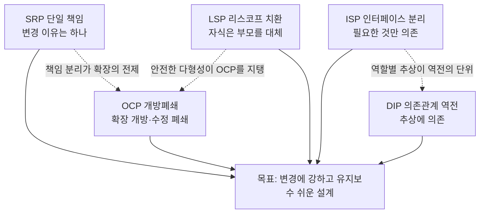
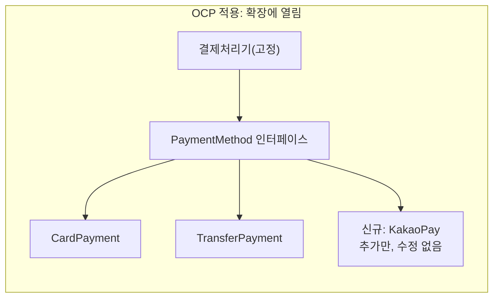
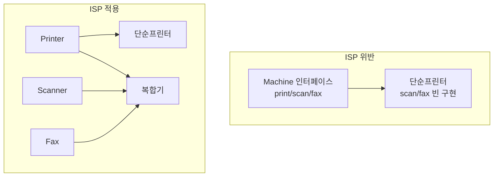
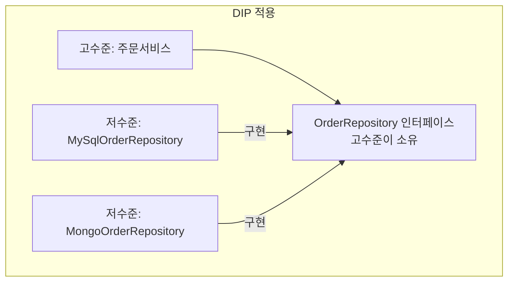

# SOLID 객체지향 설계 원칙(SOLID Principles)

## 1. 개요

### 가. 정의
> **SOLID**는 로버트 C. 마틴(Robert C. Martin, Uncle Bob)이 정리·명명한 **객체지향 설계(OOD)의 5대 원칙** — 단일 책임(SRP)·개방폐쇄(OCP)·리스코프 치환(LSP)·인터페이스 분리(ISP)·의존관계 역전(DIP) — 을 가리키는 두문자어로, **변경에 강하고(유연) 이해·확장·재사용이 쉬운(유지보수성 높은) 소프트웨어 구조**를 만들기 위한 지침이다.

SOLID를 관통하는 단 하나의 목표는 "**변경 비용의 최소화**"다. 소프트웨어는 요구가 바뀔 때마다 수정되는데, 결합도가 높고 응집도가 낮은 구조에서는 한 곳을 고치면 예상치 못한 여러 곳이 함께 깨진다. SOLID는 이런 "변경의 파급(ripple effect)"을 억제하기 위해, 책임을 잘게 나누고(SRP), 확장은 열되 수정은 닫으며(OCP), 다형성을 안전하게 보장하고(LSP), 필요 없는 의존을 끊고(ISP), 구체 대신 추상에 기대게(DIP) 하여 **의존성의 방향과 크기를 통제**하는 다섯 가지 처방을 제시한다.

주의할 점은 SOLID가 마틴이 "발명"한 것이 아니라, 1990년대 후반 그가 여러 선행 연구를 **수집·재정렬해 하나의 기억하기 쉬운 체계로 명명**한 것이라는 사실이다. 예컨대 LSP는 바버라 리스코프(Barbara Liskov)가 1987년 제시한 치환 개념이고, OCP는 버트런드 마이어(Bertrand Meyer)가 1988년 저서에서 언급한 개념이다. 따라서 SOLID는 개별 원칙의 독창성보다 "**함께 적용될 때 시너지를 내는 설계 감각의 묶음**"으로 이해해야 한다.

### 나. 등장 배경 및 필요성
객체지향 언어(C++, Java 등)가 보급되며 상속·다형성 같은 강력한 기법을 쓸 수 있게 되었지만, 역설적으로 잘못 쓰면 절차지향보다 더 복잡하고 취약한 구조가 만들어졌다. 상속을 남용해 부모-자식이 강하게 얽히거나, 하나의 거대한 클래스가 온갖 책임을 떠안는 "**갓 클래스(God Class)**"가 흔했다. 마틴은 이렇게 부패하기 쉬운 설계의 징후를 **경직성(Rigidity, 작은 변경이 연쇄 수정을 부름)**, **취약성(Fragility, 고치면 엉뚱한 곳이 깨짐)**, **부동성(Immobility, 재사용하려 해도 딸려오는 의존이 많아 못 뜯어냄)**, **점착성(Viscosity, 올바른 방법보다 편법이 쉬움)** 으로 규정하고, 이를 예방하는 설계 규범으로 SOLID를 제시했다.

필요성은 소프트웨어의 생애주기 비용 구조에서 나온다. 통상 소프트웨어 총비용의 60~80%가 개발 이후 **유지보수 단계**에서 발생하며, 그 대부분이 "코드를 이해하고 안전하게 고치는" 데 든다. SOLID는 바로 이 이해·수정 비용을 구조적으로 낮추는 투자다. 특히 애자일·DevOps 환경에서 짧은 주기로 기능을 추가·변경하고 마이크로서비스로 잘게 쪼개는 오늘날, 각 구성요소가 독립적으로 변경·배포 가능해야 하므로 SOLID의 결합도 통제 원리는 코드 레벨을 넘어 아키텍처 레벨까지 확장되어 적용된다.

## 2. SOLID 5대 원칙의 전체 구조

다섯 원칙은 독립적으로 나열되기보다 "**책임을 나누고(SRP) → 그 경계를 확장 가능하게 열며(OCP) → 다형적 대체를 안전히 보장하고(LSP) → 인터페이스를 잘게 갈라(ISP) → 의존 방향을 추상으로 역전(DIP)**"하는 하나의 흐름으로 연결된다. 아래 전체 구조도는 5원칙이 공통 목표(변경에 강한 설계)로 수렴하는 관계를 보여준다.

원칙 간에는 상호 의존이 있다. OCP(수정 없이 확장)를 실현하려면 새 기능을 다형성으로 끼워넣을 수 있어야 하는데, 그 다형성이 오작동하지 않으려면 LSP(자식이 부모를 온전히 대체)가 지켜져야 한다. 또 DIP(추상에 의존)를 제대로 하려면 그 추상이 비대하지 않도록 ISP(인터페이스를 역할별로 분리)가 선행되어야 한다. 따라서 SOLID는 "다섯 개의 규칙"이 아니라 "**서로를 지탱하는 하나의 설계 원리**"로 체득하는 것이 중요하다.

아래 표는 5원칙을 한눈에 정리한 것이나, 각 원칙의 "왜"는 이어지는 절에서 산문으로 설명한다.

| 원칙 | 핵심 명제 | 통제 대상 | 대표 기법 |
|---|---|---|---|
| **SRP** 단일 책임 | 클래스가 변경되는 이유는 하나여야 한다 | 응집도(책임의 분리) | 책임별 클래스 분리, 관심사 분리 |
| **OCP** 개방폐쇄 | 확장에는 열려 있고 수정에는 닫혀 있어야 한다 | 확장 지점의 안정성 | 추상화·다형성·전략 패턴 |
| **LSP** 리스코프 치환 | 자식형은 부모형을 대체해도 프로그램이 정상 동작해야 한다 | 상속의 안전성 | 계약(사전·사후조건) 준수 |
| **ISP** 인터페이스 분리 | 클라이언트는 쓰지 않는 메서드에 의존하면 안 된다 | 인터페이스 결합도 | 역할별 인터페이스 분할 |
| **DIP** 의존관계 역전 | 고수준·저수준 모두 추상에 의존해야 한다 | 의존 방향 | 인터페이스·DI(의존성 주입) |

## 3. 각 원칙의 원리와 적용

### 가. SRP — 단일 책임 원칙(Single Responsibility Principle)
SRP는 "**한 클래스는 하나의 책임만 가지며, 클래스가 변경되어야 하는 이유는 오직 하나여야 한다**"는 원칙이다. 여기서 "책임"은 마틴의 정교한 정의로는 "**변경을 요구하는 액터(actor, 이해관계자 그룹)**"를 뜻한다. 즉 서로 다른 이해관계자의 요구에 의해 함께 바뀌어야 할 코드는 한데 모으고, 다른 이유로 바뀌는 코드는 갈라놓으라는 것이다. 응집도(cohesion)를 높이고 변경의 파급을 국소화하는 것이 목적이다.

전형적 위반은 하나의 `Employee` 클래스가 급여 계산(회계팀 소관), 근무시간 리포트(인사팀 소관), DB 저장(DBA 소관)을 모두 담는 경우다. 회계팀 규정이 바뀌어 급여 로직을 고쳤는데 리포트 기능이 함께 깨지는 사고가 발생한다. 세 액터가 하나의 코드를 공유하기 때문이다. SRP를 적용하면 `PayCalculator`, `HourReporter`, `EmployeeRepository`로 책임을 분리해, 회계팀의 변경이 인사팀 기능에 영향을 주지 않도록 격리한다.

실무에서 SRP는 클래스뿐 아니라 함수·모듈·마이크로서비스 경계 설정의 기준이 된다. 다만 지나치게 잘게 쪼개면 클래스 수가 폭증하고 협력 관계가 복잡해져 오히려 이해가 어려워지는 역효과가 있다. 따라서 "변경의 축(누가, 왜 이 코드를 바꾸는가)"을 기준으로 나누되, 함께 변하는 것은 함께 두는 균형이 필요하다. 실제로 대규모 결제 시스템에서 "정산 규칙"과 "알림 발송"을 하나의 서비스에 넣었다가, 알림 채널(SMS→카카오톡) 추가마다 정산 코드까지 재배포·재검증해야 하는 비용이 누적되어 두 서비스로 분리한 사례는 SRP를 아키텍처 수준에서 적용한 대표 예다.

### 나. OCP — 개방폐쇄 원칙(Open-Closed Principle)
OCP는 "**소프트웨어 개체(클래스·모듈·함수)는 확장에는 열려 있고, 수정에는 닫혀 있어야 한다**"는 원칙이다. 새로운 요구가 생겼을 때 기존에 검증된 코드를 뜯어고치는 대신, **새 코드를 추가**하는 방식으로 대응할 수 있어야 한다는 뜻이다. 이미 테스트를 통과하고 운영 중인 코드를 건드리지 않으므로 회귀(regression) 위험이 줄고, 변경이 국소화된다.

핵심 실현 수단은 **추상화와 다형성**이다. 변할 것으로 예상되는 지점을 인터페이스(추상)로 뽑아두고, 구체 구현을 갈아끼우는 구조를 만든다. 예를 들어 결제 수단이 카드 하나뿐인 코드에 계좌이체를 추가할 때, `if(type=="card") ... else if(type=="transfer") ...`처럼 분기문을 계속 늘리면 결제 수단이 늘 때마다 핵심 로직을 수정해야 한다(OCP 위반). 대신 `PaymentMethod` 인터페이스를 정의하고 `CardPayment`, `TransferPayment`를 구현체로 두면, 새 수단(간편결제) 추가 시 새 클래스만 만들면 되고 기존 결제 처리기는 손대지 않는다. 실제로 PG(전자결제대행) 연동 모듈은 이 구조로 수십 개 결제 채널을 무중단 확장한다.

다만 "모든 곳을 미리 확장 가능하게" 만들려는 과도한 일반화는 YAGNI(You Aren't Gonna Need It) 원칙에 반해 불필요한 복잡성을 낳는다. OCP는 "**변경이 실제로 잦은 축을 식별해 그 축에만 확장점을 두라**"는 실용적 판단과 함께 적용되어야 한다. 전략(Strategy)·템플릿 메서드(Template Method)·데코레이터(Decorator) 같은 GoF 패턴이 OCP를 구현하는 대표적 도구다.

### 다. LSP — 리스코프 치환 원칙(Liskov Substitution Principle)
LSP는 "**서브타입(자식형)은 언제나 그 기반타입(부모형)으로 교체 가능해야 하며, 교체해도 프로그램의 정확성이 깨지지 않아야 한다**"는 원칙이다. 상속이 단순한 코드 재사용 수단이 아니라 "**is-a 관계에서 행위의 계약(contract)까지 보존**"해야 함을 요구한다. 자식은 부모의 사전조건을 강화하거나 사후조건을 약화해서는 안 되며, 부모가 지키던 불변식(invariant)을 위반해서도 안 된다.

가장 유명한 반례가 "**정사각형-직사각형 문제**"다. 수학적으로 정사각형은 직사각형이므로 `Square extends Rectangle`이 자연스러워 보이지만, `setWidth`/`setHeight`를 독립적으로 호출하는 클라이언트 관점에서 정사각형은 두 값이 항상 같아야 한다는 제약 때문에 부모의 행위 계약을 깬다. `rect.setWidth(5); rect.setHeight(4); assert(area==20)`이라는 코드가 정사각형 인스턴스에서는 실패한다. 즉 자식이 부모를 대체하지 못하므로 LSP 위반이며, 이는 상속을 잘못 사용했다는 신호다(합성 등 다른 관계로 재설계해야 한다).

LSP가 중요한 실무적 이유는 **OCP와 다형성의 안전판**이기 때문이다. OCP를 위해 인터페이스에 여러 구현체를 끼워넣는데, 어떤 구현체가 부모의 계약을 어기면(예: `throw new UnsupportedOperationException()`으로 특정 메서드를 거부) 그 다형성을 사용하는 상위 코드가 예외적으로 그 구현체만 특별 처리해야 한다. 이는 곧 OCP 붕괴로 이어진다. 실제로 컬렉션 프레임워크에서 "읽기 전용 리스트"가 `add()`를 예외로 막는 설계는 LSP를 미묘하게 위반하는 사례로 자주 논의되며, 이런 경우 인터페이스를 애초에 분리(ISP)하는 편이 낫다는 점에서 원칙 간 연계가 드러난다.

### 라. ISP — 인터페이스 분리 원칙(Interface Segregation Principle)
ISP는 "**클라이언트는 자신이 사용하지 않는 메서드에 의존하도록 강요받아서는 안 된다**"는 원칙으로, 크고 범용적인 인터페이스보다 **역할별로 작게 나뉜 인터페이스** 여러 개가 낫다고 본다. 비대한 인터페이스(fat interface)에 의존하면, 실제로는 쓰지 않는 메서드가 바뀌어도 클라이언트가 재컴파일·재배포되거나, 구현 클래스가 필요 없는 메서드까지 억지로 구현(빈 메서드나 예외 던지기)해야 하는 문제가 생긴다.

전형적 위반은 `Machine`이라는 하나의 인터페이스에 `print()`, `scan()`, `fax()`를 모두 담는 경우다. 복합기(다기능 프린터)는 세 메서드를 모두 구현할 수 있지만, 인쇄만 되는 단순 프린터는 `scan()`, `fax()`를 빈 구현이나 예외로 채워야 한다. 이는 앞의 LSP까지 위반할 위험을 낳는다. ISP를 적용하면 `Printer`, `Scanner`, `Fax`로 인터페이스를 분리하고, 각 기기는 자신이 지원하는 역할만 구현(implements)한다. 클라이언트도 필요한 역할 인터페이스에만 의존하므로 결합이 최소화된다.

ISP는 마이크로서비스 시대에 API 설계 원칙으로도 확장된다. 하나의 거대한 공용 API가 모든 소비자에게 같은 계약을 강요하면, 특정 소비자를 위한 필드 하나 추가가 전체 소비자에 영향을 준다. 이를 완화하기 위해 소비자별 맞춤 API를 제공하는 **BFF(Backend For Frontend)** 패턴이 등장했는데, 이는 ISP 정신의 아키텍처적 구현으로 볼 수 있다.

### 마. DIP — 의존관계 역전 원칙(Dependency Inversion Principle)
DIP는 두 명제로 구성된다. ① "**고수준 모듈은 저수준 모듈에 의존해서는 안 되며, 둘 다 추상(abstraction)에 의존해야 한다**." ② "**추상은 세부사항에 의존해서는 안 되고, 세부사항이 추상에 의존해야 한다**." 전통적으로 상위 정책(비즈니스 로직)이 하위 세부기술(DB, 외부 API)을 직접 호출하면, 하위 기술이 바뀔 때 상위 정책까지 흔들린다. DIP는 이 의존의 화살표를 **뒤집어(역전)**, 상위·하위가 모두 상위가 정의한 인터페이스(추상)를 바라보게 만든다.

예를 들어 주문 서비스(고수준)가 MySQL 드라이버(저수준)를 직접 호출하면, DB를 PostgreSQL이나 NoSQL로 바꿀 때 주문 로직을 수정해야 한다. DIP를 적용하면 주문 서비스가 소유한 `OrderRepository` 인터페이스를 정의하고, `MySqlOrderRepository`가 그것을 구현(implements)하게 한다. 이제 의존 방향은 "DB 구현 → 인터페이스 ← 주문 서비스"로, 저수준이 고수준의 추상에 맞추게 된다. DB를 교체해도 새 구현체만 만들면 되고 핵심 정책은 불변이다.

DIP를 실제로 동작시키는 메커니즘이 **의존성 주입(DI, Dependency Injection)** 과 **IoC(제어의 역전) 컨테이너**다. 객체가 자신의 의존 대상을 직접 `new`로 생성하지 않고, 외부(스프링 컨테이너 등)가 구현체를 주입한다. Spring, .NET Core, NestJS 등 현대 프레임워크가 DI를 기본으로 채택한 것은 DIP를 사실상 표준 실천법으로 만들었다. DIP는 또한 로버트 마틴의 **클린 아키텍처(Clean Architecture)** 에서 "의존성 규칙(안쪽 원은 바깥쪽을 모른다)"의 이론적 토대가 된다.

## 4. 원칙 간 관계와 흔한 오해(비교)

SOLID를 개별 규칙으로만 외우면 실무에서 충돌한다. 예컨대 SRP를 극단으로 밀면 클래스가 지나치게 잘게 쪼개져 ISP·DIP를 만족시키려는 인터페이스가 폭증하고, 협력 구조가 복잡해져 오히려 이해가 어려워진다. 반대로 OCP를 위해 모든 지점에 추상화를 심으면 YAGNI 위반으로 불필요한 복잡성이 생긴다. 따라서 SOLID는 "**절대 규칙**"이 아니라 "**변경 비용을 낮추기 위한 트레이드오프 판단의 언어**"로 다뤄야 한다.

원칙 간 위계도 존재한다. LSP는 OCP의 전제(안전한 다형성 없이는 확장이 오작동)이고, ISP는 DIP의 단위(잘 나뉜 역할 인터페이스가 있어야 의존 역전이 깔끔)를 제공한다. SRP는 나머지 모든 원칙의 출발점으로, 책임이 뒤섞인 상태에서는 어떤 원칙도 제대로 적용되지 않는다. 아래 표는 각 원칙 위반 시의 증상과 흔한 오해를 대비한 것이다.

| 원칙 | 위반 시 증상 | 흔한 오해 |
|---|---|---|
| SRP | 한 곳 수정이 무관한 기능을 깨뜨림 | "한 클래스=한 메서드"로 오해(실제는 변경 이유 기준) |
| OCP | 기능 추가마다 핵심 코드 분기문 증가 | 모든 것을 미리 추상화(과잉 설계) |
| LSP | 특정 자식만 예외 처리하는 분기 등장 | "상속=코드 재사용"으로 오해(행위 계약이 핵심) |
| ISP | 빈 메서드·미지원 예외가 늘어남 | 인터페이스를 무조건 크게(범용성 착각) |
| DIP | DB·외부기술 교체 시 핵심 로직 수정 | DI 프레임워크만 쓰면 DIP 달성으로 오해 |

특히 유의할 오해는 "DI 프레임워크(Spring 등)를 쓰면 DIP를 지킨 것"이라는 착각이다. 인터페이스 없이 구체 클래스를 그대로 주입하면 의존 방향은 여전히 고수준→저수준이므로 DIP 위반이다. DIP의 본질은 도구가 아니라 "**추상을 누가 소유하고 의존 방향이 어디를 향하는가**"에 있다.

## 5. 심화 — 클린 아키텍처·현대 개발과 SOLID의 확장

SOLID는 처음 클래스 설계 원칙으로 제시되었으나, 오늘날에는 **아키텍처 원칙으로 승격**되었다. 로버트 마틴의 『클린 아키텍처(Clean Architecture, 2017)』는 SOLID를 컴포넌트·아키텍처 수준으로 끌어올려, "엔티티→유스케이스→인터페이스 어댑터→프레임워크"의 동심원 구조에서 **의존성이 항상 안쪽(고수준 정책)을 향하도록** 강제한다. 이 "의존성 규칙"이 바로 DIP의 대규모 적용이며, 각 계층 경계에 인터페이스를 두는 것은 OCP·DIP의 결합이다. 헥사고날 아키텍처(포트-어댑터)나 어니언 아키텍처도 동일한 정신을 공유한다.

마이크로서비스(MSA)에서도 SOLID는 서비스 분해의 지침이 된다. 하나의 서비스가 단일 비즈니스 능력(business capability)만 갖도록 나누는 것은 SRP의 서비스 버전이고, 서비스 간 통신을 잘 정의된 계약(API·이벤트)으로 추상화해 내부 구현 변경이 소비자에 새지 않게 하는 것은 OCP·DIP의 적용이다. 데이터베이스 per 서비스, 이벤트 기반 통신, 소비자 맞춤 API(BFP/BFF) 같은 MSA 실천법은 SOLID 원리의 분산 시스템적 재해석이라 볼 수 있다.

한편 함수형 프로그래밍과 최신 언어의 확산은 SOLID의 상대화를 촉발했다. 순수 함수·불변성 중심의 함수형 스타일에서는 상속이 거의 없어 LSP의 비중이 낮아지고, 고차 함수가 OCP·DIP를 더 가볍게 달성한다. 또한 AI 코딩 도구가 코드를 대량 생성하는 시대에는 "사람이 읽고 안전하게 고칠 수 있는 구조"의 가치가 오히려 커져, SOLID가 코드 리뷰·리팩토링·아키텍처 심사의 공통 언어로서 갖는 중요성은 유지된다. 정보관리기술사 관점에서는 SOLID를 단독 암기 대상이 아니라, GoF 디자인 패턴·클린 아키텍처·MSA·DevSecOps와 **연계해 서술**할 수 있어야 고득점 답안이 된다.

## 6. 고려사항 및 시사점

- **적용 전략(점진적 도입)**: SOLID는 신규 개발에 전면 적용하기보다, 리팩토링과 결합해 "변경이 잦은 핫스팟(hotspot)"부터 점진 적용하는 것이 효과적이다. 코드 스멜(경직성·취약성) 탐지 → 원칙 위반 진단 → 테스트 확보 → 소단위 개선의 순서로, 레거시 시스템의 변경 비용을 단계적으로 낮춘다.

- **트레이드오프(단순성 vs 유연성)**: SOLID는 미래 변경에 대비한 유연성을 얻는 대가로 클래스·인터페이스 수 증가와 간접성(indirection)이라는 복잡성 비용을 치른다. 변경이 거의 없는 단순 모듈에까지 기계적으로 적용하면 KISS·YAGNI를 위반하므로, "변경 가능성이 실제로 높은가"를 기준으로 적용 강도를 조절해야 한다.

- **검증·측정과의 연계**: SOLID 준수 여부는 정성적 판단에 그치기 쉬우므로, 결합도(afferent/efferent coupling)·순환 복잡도·응집도 등 정량 지표와 정적 분석 도구(SonarQube 등), 아키텍처 적합성 테스트(ArchUnit)로 보완해 지속적으로 감시하는 것이 바람직하다.

- **조직·프로세스 관점**: SRP의 "액터"는 조직 구조와 맞물린다. 콘웨이 법칙(Conway's Law)이 시사하듯 시스템 경계는 팀 경계를 닮으므로, SOLID 기반 모듈 분해는 팀 편성·오너십 정의와 함께 설계해야 실효성이 있다.

- **전망(아키텍처 원칙으로의 지속)**: 함수형·AI 코딩의 확산으로 개별 원칙의 적용 형태는 변하지만, "결합도를 낮추고 변경을 국소화한다"는 SOLID의 본질은 클린 아키텍처·MSA·플랫폼 엔지니어링으로 이어지며 유효하다. 기술사는 SOLID를 코드 레벨 규칙이 아니라 **유지보수성·확장성을 확보하는 설계 거버넌스의 어휘**로 폭넓게 활용할 수 있어야 한다.

## 참고자료
- Robert C. Martin, "Design Principles and Design Patterns" (2000): https://web.archive.org/web/20150906155800/http://www.objectmentor.com/resources/articles/Principles_and_Patterns.pdf
- Robert C. Martin, 『Clean Architecture』, Prentice Hall, 2017: https://www.oreilly.com/library/view/clean-architecture-a/9780134494272/
- Barbara Liskov, "Data Abstraction and Hierarchy" (OOPSLA 1987) — LSP 원전: https://dl.acm.org/doi/10.1145/62139.62141
- Wikipedia, "SOLID": https://en.wikipedia.org/wiki/SOLID

---
> **한 줄 요약**: SOLID(SRP·OCP·LSP·ISP·DIP)는 책임을 나누고 의존 방향과 크기를 추상으로 통제해 "변경에 강한 설계"를 실현하는 객체지향 5원칙으로, 오늘날 클린 아키텍처·MSA까지 확장되는 유지보수성 확보의 공통 언어다.
