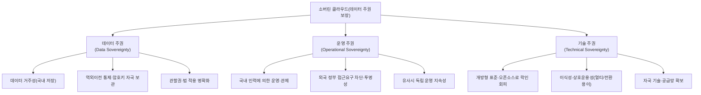
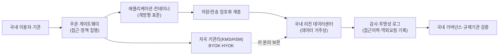

# 소버린 클라우드(Sovereign Cloud)

## 1. 개요

### 가. 정의

> **소버린 클라우드(Sovereign Cloud)**란 특정 국가·지역의 **법·규제·관할권(jurisdiction) 안에서 데이터의 저장·처리·운영·통제권이 완결**되도록 설계된 클라우드로, 데이터 주권(Data Sovereignty)을 기술·운영·법적 세 층위에서 보장하는 클라우드 구축·이용 모델이다.

소버린 클라우드는 단순히 "국내 데이터센터에 데이터를 두는 것" 그 이상을 의미한다. 물리적 위치(데이터 거주성, data residency)뿐 아니라, **누가 데이터에 접근할 수 있고, 어느 나라 법이 그 데이터에 미치며, 장애·분쟁 시 누가 최종 통제권을 갖는가**까지를 함께 다루는 개념이다. 즉 데이터가 국내에 있어도 외국 사업자 본사의 법률(예: 미국 CLOUD Act)에 따라 제출 요구를 받을 수 있다면 진정한 주권이 확보되었다고 보기 어렵다. 소버린 클라우드는 이 "관할권의 충돌" 문제를 정면으로 다룬다는 점에서 정보관리기술사형 주제이다.

따라서 소버린 클라우드는 저장 위치라는 단일 축이 아니라, **데이터 주권·운영 주권·기술 주권**이라는 세 축이 동시에 만족되어야 성립한다. 이는 특정 제품명이 아니라 규제 준수를 위한 아키텍처·거버넌스 설계 원칙에 가깝다.

### 나. 등장 배경과 필요성

첫째, **초국경 데이터 이동과 관할권 충돌**이다. 글로벌 하이퍼스케일러(AWS·Azure·GCP)의 확산으로 데이터가 물리적으로 어디에 있든 외국 법률의 역외적용을 받을 수 있게 되었다. 대표적으로 미국 CLOUD Act(2018)는 미국 기업이 보유·관리하는 데이터를 그 저장 위치가 해외라도 미국 정부에 제출하도록 요구할 수 있어, EU를 중심으로 데이터 주권 우려가 급격히 커졌다.

둘째, **EU의 규제 강화와 판례 변화**다. GDPR과 더불어 2020년 Schrems II 판결로 EU-미국 간 프라이버시 실드가 무효화되면서, 개인정보의 역외 이전이 매우 까다로워졌다. 이에 EU는 GAIA-X, EUCS(EU Cloud Certification Scheme) 등을 통해 유럽 자체의 신뢰 가능한 클라우드 생태계를 추진하게 되었다.

셋째, **공공·금융·국방 등 민감 영역의 클라우드 전환**이다. 정부·공공기관과 금융권이 클라우드로 이동하면서, 국가 핵심 데이터가 외국계 사업자에 종속(vendor lock-in)되는 위험과 유사시 서비스 통제권 상실 위험이 부각되었다. 우리나라도 CSAP(클라우드 보안인증), 망분리·국내 리전 요구 등으로 유사한 흐름을 보인다.

넷째, **지정학적 리스크와 공급망 안정성**이다. 국가 간 갈등·제재 상황에서 특정국 사업자의 서비스가 중단되거나 접근이 차단될 위험이 현실화되면서, "유사시에도 자국이 독립적으로 운영·통제할 수 있는 클라우드"에 대한 수요가 커졌다.

## 2. 데이터 주권의 3계층 구조

소버린 클라우드가 보장하려는 "주권"은 하나의 통제가 아니라 서로 다른 성격의 세 통제가 겹쳐진 구조로 이해해야 한다. 아래 개념도는 세 주권 축과 그 아래의 구체 통제 요소를 보여준다.

**데이터 주권(Data Sovereignty)**은 데이터가 생성된 국가의 법·규제를 따르며, 물리적 저장 위치가 국내에 있고 역외 이전이 통제되는 것을 의미한다. 핵심은 암호화와 **키 관리(BYOK/HYOK, Bring/Hold Your Own Key)**로, 데이터가 외국 리전이나 백업으로 복제되더라도 복호화 키를 자국 관할 안에 두면 사실상의 통제권을 유지할 수 있다. 데이터 거주성만으로는 부족하고 접근 통제와 암호키 주권이 결합되어야 하는 이유가 여기에 있다.

**운영 주권(Operational Sovereignty)**은 클라우드를 누가 운영·관제하고, 외부(특히 외국 정부·본사)가 데이터에 접근할 수 있는가에 관한 통제다. 국내 국적 인력에 의한 운영, 외국 정부의 데이터 제출 요구에 대한 거부·투명성 보고, 그리고 공급 중단 상황에서도 서비스를 자국이 독립적으로 이어갈 수 있는 지속성이 포함된다. 물리 위치가 국내라도 원격 관리자가 외국에서 루트 권한으로 접근한다면 운영 주권은 훼손된다.

**기술 주권(Technical Sovereignty)**은 특정 사업자에 대한 종속을 피하고, 개방형 표준·오픈소스·컨테이너 기반의 이식성을 확보해 언제든 다른 환경으로 이전할 수 있는 자율성을 뜻한다. Kubernetes·OpenStack 등 개방형 기술 채택은 유사시 사업자를 교체할 수 있는 선택지를 남겨 두어 협상력과 회복력을 동시에 높인다.

## 3. 참조 아키텍처와 핵심 통제 요소

소버린 클라우드는 일반 클라우드 위에 주권 보장을 위한 통제 계층을 덧대는 형태로 설계된다. 아래 아키텍처는 데이터 흐름과 각 지점의 주권 통제를 나타낸다.

첫째, **데이터 거주성과 국내 리전**이다. 원본과 백업, 로그, 메타데이터까지 국내 관할 데이터센터에 두고, DR(재해복구) 사이트 역시 국내에 구성한다. 이때 CDN 캐시나 텔레메트리 데이터가 무심코 해외로 나가지 않도록 데이터 흐름 전 구간을 점검해야 한다.

둘째, **암호화와 키 주권**이다. 저장·전송 구간 모두 암호화하되, 키를 사업자가 아닌 이용 기관이 보관(HYOK)하거나 최소한 자국 KMS/HSM에서 관리(BYOK)한다. 사업자가 데이터를 물리적으로 보유해도 키가 없으면 복호화가 불가능하므로, 외국 정부의 제출 요구가 있어도 실질적 노출을 막는 마지막 방어선이 된다.

셋째, **접근 통제와 특권 접근 관리**다. 제로 트러스트 원칙에 따라 운영자·관리자 접근을 최소권한으로 통제하고, 외국 소재 인력의 특권 접근을 차단·모니터링한다. 모든 관리 행위는 변조 불가능한 로그로 남긴다.

넷째, **투명성과 감사 가능성**이다. 누가 언제 어떤 데이터에 접근했는지, 외국 정부의 접근 요청이 있었는지를 기록·보고하여 규제기관이 검증할 수 있게 한다. 이는 운영 주권을 사후적으로 증명하는 수단이다.

다섯째, **개방형 기술 기반 이식성**이다. 컨테이너·IaC·개방형 API로 워크로드를 캡슐화하여, 특정 사업자 종속을 낮추고 유사시 전환 비용을 줄인다.

## 4. 구축 유형 비교

소버린 클라우드는 하나의 형태가 아니라 주권 수준과 비용·기능의 균형에 따라 여러 모델로 구현된다. 각 유형은 "얼마나 강하게 주권을 보장하는가"와 "글로벌 클라우드의 혁신·확장성을 얼마나 누리는가" 사이에서 상충한다.

| 구축 유형 | 개념 | 주권 수준 | 트레이드오프 |
|---|---|---|---|
| 국내 리전 활용 | 글로벌 사업자의 국내 리전에 데이터 저장 | 낮음~중 | 편의·기능은 높으나 본사 관할권 리스크 잔존 |
| 파트너 운영형 | 글로벌 기술 + 국내 신뢰 파트너가 운영·관제 | 중~높음 | 운영 주권 강화, 기술은 여전히 외국 의존 |
| 전용·격리형 | 물리·논리적으로 분리된 전용 소버린 존 구성 | 높음 | 비용·구축 부담 큼, 기능 업데이트 지연 가능 |
| 국산 독립형 | 자국 기술·오픈소스로 독립 구축·운영 | 매우 높음 | 완전 자율이나 규모·최신 기능 확보 어려움 |

국내 리전 활용은 도입이 쉽고 최신 기능을 그대로 누리지만, 사업자 본사가 외국 법의 적용을 받으면 CLOUD Act 같은 역외 요구에 노출될 수 있어 진정한 주권으로 보기 어렵다. 파트너 운영형은 글로벌 기술을 쓰되 국내 신뢰 파트너가 운영·관제를 맡아 운영 주권을 크게 끌어올리는 절충안으로, EU에서 흔히 채택된다. 전용·격리형은 소버린 전용 존을 물리적으로 분리해 주권 수준이 높지만 비용과 기능 업데이트 지연이라는 대가를 치른다. 국산 독립형은 완전한 자율성을 주지만 하이퍼스케일러 수준의 규모·최신 AI 인프라를 자력으로 따라잡기 어렵다는 현실적 한계가 있다. 따라서 실무에서는 데이터 민감도에 따라 워크로드를 분류하고 유형을 혼합하는 접근이 일반적이다.

## 5. 사례와 국내외 동향

유럽에서는 **GAIA-X**가 대표적이다. 독일·프랑스 주도로 시작된 이 이니셔티브는 특정 클라우드를 새로 만드는 것이 아니라, 여러 사업자가 상호운용·이식성·투명성이라는 공통 규칙(정책·기술 표준)을 지키도록 하는 **연합형(federated) 신뢰 프레임워크**를 지향한다. 또한 EU는 EUCS라는 클라우드 보안 인증 체계에 주권 요건 포함 여부를 두고 논쟁을 이어 왔는데, 이는 주권 강화와 시장 개방 사이의 긴장을 보여 준다. 프랑스는 "Cloud de Confiance(신뢰 클라우드)" 정책으로, 글로벌 기술을 라이선스해 자국 기업이 운영하는 파트너 운영형 모델(예: Bleu, S3ns)을 추진했다.

우리나라는 공공부문에 대해 **CSAP(클라우드 보안인증)**와 등급제(상·중·하)를 두어 민감 시스템일수록 국내 리전·물리적 망분리 등 강한 요건을 요구하며, 이는 데이터 주권 개념과 궤를 같이한다. 최근에는 글로벌 사업자들도 국내에 소버린 특화 서비스나 파트너 운영 모델을 제시하고 있어, "국내 저장"을 넘어 "운영·키 주권"까지 논의가 확장되는 추세다. 다만 세부 인증 요건과 정책은 지속적으로 개정되므로, 특정 등급 요건을 단정하기보다 최신 고시를 확인해 적용하는 것이 안전하다.

## 6. 고려사항 및 시사점

첫째, **주권과 혁신·비용의 트레이드오프를 전략적으로 설계**해야 한다. 모든 데이터를 최고 수준으로 격리하면 비용과 기능 지연이 커지므로, 데이터 민감도·규제 등급에 따라 워크로드를 분류(tiering)하고, 민감 데이터는 전용·독립형, 일반 데이터는 국내 리전형으로 배치하는 하이브리드 전략이 현실적이다.

둘째, **데이터 위치가 아닌 통제권 중심으로 접근**해야 한다. "국내 저장"만으로는 관할권 리스크가 남으므로, 암호키 주권(HYOK)과 접근 투명성을 결합해 사업자·외국 정부조차 실질적으로 데이터를 열람할 수 없는 구조를 목표로 삼아야 한다. 키 관리 주권이 소버린 클라우드의 핵심 변별점이다.

셋째, **락인 회피와 출구 전략(exit strategy)을 사전 설계**해야 한다. 개방형 표준·컨테이너·IaC로 이식성을 확보하고, 계약 단계에서 데이터 반환·전환 지원·서비스 종료 시 지속성 조항을 명시해 유사시 통제권을 잃지 않도록 한다.

넷째, **거버넌스·감사·법적 준거의 상시 점검**이 필요하다. GDPR·개인정보보호법·CSAP 등 규제와 판례(Schrems II 등)는 계속 변하므로, 데이터 계보·역외이전·접근이력을 추적하는 거버넌스 체계를 갖추고 정기적으로 준거성을 재검증해야 한다.

다섯째, **디지털 주권을 국가 경쟁력·회복력 관점에서 조망**해야 한다. 소버린 클라우드는 단순 규제 준수를 넘어, 지정학적 리스크 하에서도 핵심 서비스를 자국이 지속·통제할 수 있게 하는 국가 디지털 회복력의 기반이며, 국산 클라우드·AI 인프라 육성 정책과 연계해 장기적으로 추진되어야 한다.

## 참고자료
- GAIA-X European Association for Data and Cloud: https://gaia-x.eu/
- ENISA, European Cybersecurity Certification Scheme for Cloud Services (EUCS): https://www.enisa.europa.eu/
- 한국인터넷진흥원(KISA) 클라우드 보안인증제(CSAP): https://isms.kisa.or.kr/

---

> **한 줄 요약**: 소버린 클라우드는 데이터의 저장 위치를 넘어 **데이터·운영·기술 주권**을 함께 보장하는 클라우드 모델로, 국내 리전·암호키 주권(HYOK/BYOK)·접근 투명성·개방형 표준을 결합해 외국 관할권과 락인 리스크로부터 자국의 통제권과 디지털 회복력을 지키는 것을 목표로 한다.
