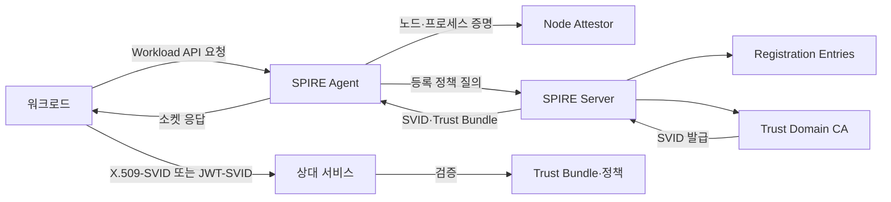
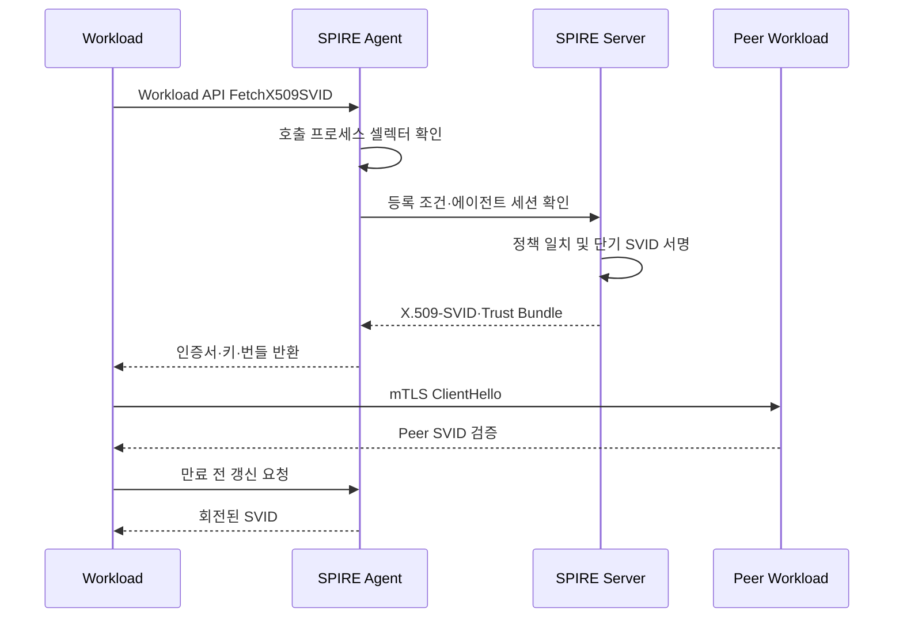

# SPIFFE/SPIRE 기반 워크로드 아이덴티티와 비밀 없는 서비스 인증

## 1. 개요

> **정의**: SPIFFE(Secure Production Identity Framework for Everyone)는 분산 환경의 소프트웨어 워크로드에 플랫폼과 무관한 신원을 부여하고, 그 신원을 검증 가능한 문서로 표현하며, 워크로드가 신원을 얻는 표준 API를 정의하는 개방형 표준이다.

전통적인 서비스 인증은 애플리케이션 설정 파일, 환경 변수, 비밀 저장소에 장기 API 키나 인증서를 넣는 방식에서 출발했다. 그러나 마이크로서비스와 컨테이너가 증가하면 서비스 수, 배포 빈도, 네트워크 경계가 함께 늘어나고, 어떤 프로세스가 어떤 자격으로 통신하는지 사람이 관리하기 어려워진다. 서버의 IP 주소나 네임스페이스만으로 허용 여부를 판단하면 재배치·오토스케일링·멀티클라우드 상황에서 신원의 의미가 흔들린다.

워크로드 아이덴티티는 사람 계정이 아니라 실행 중인 애플리케이션, 작업, 에이전트, 배치 프로세스의 신원이다. 같은 컨테이너 이미지가 개발·검증·운영에서 서로 다른 권한을 가져야 하므로 이미지 자체가 신원은 아니며, 실행 위치와 배포 맥락을 함께 검증해야 한다. SPIFFE는 이 신원을 논리적인 URI 형태로 표준화하고, SVID(SPIFFE Verifiable Identity Document)로 제시한다.

SPIRE(SPIFFE Runtime Environment)는 SPIFFE 표준의 대표적인 구현체다. SPIRE 서버는 신뢰 도메인의 정책과 등록 정보를 관리하고, SPIRE 에이전트는 노드에서 워크로드를 증명한 뒤 해당 워크로드에 SVID를 전달한다. 애플리케이션은 장기 비밀을 직접 보관하지 않고 Workload API를 통해 짧은 수명의 신원 자료를 얻는다.

이 주제의 핵심은 인증서를 발급하는 도구를 하나 더 도입하는 데 있지 않다. 신원 발급의 근거가 되는 워크로드 증명(attestation), 신원과 권한 정책의 분리, 자동 갱신과 폐기, 신뢰 도메인 간 연합을 운영 체계로 만드는 데 있다. 따라서 기술사 답안에서는 구성요소뿐 아니라 기존 PKI·서비스 메시·제로 트러스트와의 경계 및 도입 단계까지 설명해야 한다.

## 2. 등장 배경과 해결 문제

### 2.1 장기 자격증명의 구조적 한계

장기 키는 발급 시점에는 편리하지만 유출 시 피해 기간이 길다. 키를 저장한 이미지가 외부로 복사되거나 로그·덤프에 노출되면 애플리케이션이 중지되지 않는 한 공격자가 계속 사용할 수 있다. 키 교체 주기를 짧게 만들면 운영자가 배포와 장애를 감당하지 못하고, 교체를 늦추면 위험이 누적된다.

IP 허용목록은 위치를 신원으로 오인한다. 오토스케일링으로 주소가 바뀌거나 프록시·NAT를 통과하면 호출 주체와 주소의 대응이 불명확해진다. 네트워크가 이미 침해된 뒤에는 내부 주소를 가진 공격자가 정상 서비스처럼 보일 수도 있다.

서비스 계정 이름만으로 권한을 매핑하는 방식도 부족하다. 동일한 이름이 다른 클러스터에서 재사용되거나, 배포 파이프라인이 잘못된 대상에 토큰을 주입할 수 있기 때문이다. 신원은 이름뿐 아니라 신뢰 도메인, 실행 파일·컨테이너의 측정값, 네임스페이스, 서비스 계정, 노드의 증명 결과를 정책으로 결합해야 한다.

### 2.2 SPIFFE의 세 가지 표준 요소

SPIFFE는 첫째 신원 네임스페이스인 SPIFFE ID, 둘째 그 ID를 운반하는 SVID, 셋째 워크로드가 SVID를 얻고 검증하는 Workload API로 구성된다. 이 세 요소를 분리하면 애플리케이션은 클라우드별 메타데이터나 CA의 구현 세부사항에 덜 의존한다.

SPIFFE ID는 `spiffe://trust-domain/workload-identifier` 형식의 URI다. 예를 들어 `spiffe://prod.example.com/ns/payment/sa/ledger`는 운영 신뢰 도메인 안의 결제 네임스페이스·서비스 계정 조합을 표현할 수 있다. 실제 경로 설계는 조직의 책임 경계와 권한 경계를 반영해야 하며, 단순히 기존 DNS 이름을 복사하는 것으로 끝내서는 안 된다.

SVID는 SPIFFE ID를 암호학적으로 검증 가능한 문서에 넣은 것이다. X.509-SVID는 인증서와 개인키를 이용해 mTLS를 구성하는 데 적합하고, JWT-SVID는 토큰 교환이나 HTTP 기반 호출처럼 인증서 핸드셰이크가 적합하지 않은 경우에 사용할 수 있다. 신뢰 번들은 상대 신원을 검증하는 데 필요한 신뢰 앵커 묶음이다.

Workload API는 워크로드가 자신의 SVID와 신뢰 번들을 가져오는 통로다. 일반적인 구현에서는 노드 안의 로컬 소켓으로 노출되므로 네트워크에 장기 토큰을 전송하지 않는다. API를 호출하는 프로세스의 운영체제·컨테이너 속성은 에이전트가 별도 방식으로 확인하며, 애플리케이션은 발급자와 수명 관리의 책임에서 벗어난다.

## 3. 전체 아키텍처와 동작 원리

위 구조에서 SPIRE 서버는 중앙 신뢰점이지만 모든 애플리케이션 트래픽을 중계하지는 않는다. 발급과 정책 배포의 제어 평면과 실제 서비스 호출의 데이터 평면을 분리하기 때문에, 데이터 평면의 지연을 줄이면서도 신원 수명과 정책을 중앙에서 통제할 수 있다.

SPIRE 에이전트는 서버와 워크로드 사이의 로컬 중개자다. 에이전트가 워크로드마다 같은 SVID를 나누어 주는 것이 아니라, 요청 프로세스가 등록 조건과 일치하는지 확인하고 해당 신원에 맞는 문서를 전달한다. 따라서 에이전트의 소켓 권한과 노드 격리가 전체 보안 경계의 중요한 부분이 된다.

SPIRE 서버는 등록 엔트리, 노드 증명 결과, 워크로드 증명 결과를 조합한다. 등록 엔트리는 어떤 셀렉터 조합이 어떤 SPIFFE ID를 받을 수 있는지를 나타내는 정책 데이터다. 예를 들어 Kubernetes 네임스페이스와 서비스 계정의 조합, 클라우드 인스턴스의 태그, 컨테이너 이미지의 식별자를 조건으로 삼을 수 있다.

CA는 SVID를 서명하고 신뢰 번들을 배포한다. 운영 조직은 SPIFFE용 CA를 기존 기업 PKI와 완전히 분리할 수도 있고, 외부 CA·HSM·인증서 관리 체계와 연계할 수도 있다. 어느 모델이든 루트 키 보호, 중간 CA 교체, 신뢰 번들 갱신, 긴급 폐기 절차를 명시해야 한다.

### 3.1 노드 증명과 워크로드 증명

노드 증명은 에이전트가 어느 컴퓨터나 가상 노드에서 실행되고 있는지를 서버에 증명하는 단계다. 클라우드 인스턴스 문서, 머신 식별자, 조인 토큰, TPM 같은 수단이 사용될 수 있으며, 수단의 신뢰도는 위협 모델과 운영 환경에 따라 다르다.

워크로드 증명은 실제 프로세스가 어떤 실행 맥락에 있는지를 확인하는 단계다. Kubernetes에서는 네임스페이스·서비스 계정·파드 레이블을 사용할 수 있고, VM 환경에서는 프로세스 사용자·실행 경로·부모 프로세스·인스턴스 태그 등을 조합할 수 있다. 한 가지 셀렉터만 신뢰하면 오설정이나 라벨 위조의 영향이 커진다.

증명은 인증(authentication)과 인가(authorization)를 동시에 해결하지 않는다. 증명은 “이 실행 주체가 어느 등록 조건에 맞는가”를 확인해 ID를 발급하는 과정이다. 실제로 결제 서비스가 원장 서비스의 특정 API를 호출할 수 있는지는 mTLS의 피어 ID, 서비스 정책, 애플리케이션 권한 검사를 함께 적용해야 한다.

### 3.2 SVID 발급과 갱신 흐름

워크로드가 처음 API를 호출하면 에이전트는 호출자의 프로세스 특성을 읽고 등록 엔트리와 비교한다. 일치하는 엔트리가 없으면 SVID를 발급하지 않는다. 이 실패는 단순한 네트워크 오류와 다르게 취급하여, 등록 정책 누락·노드 증명 실패·신뢰 번들 불일치를 각각 관측해야 한다.

발급된 SVID는 장기 자격증명보다 짧은 수명을 갖도록 설계한다. 짧은 수명은 도난된 문서의 재사용 시간을 줄이지만, 갱신 지연·시계 오차·에이전트 장애에 민감해진다. 따라서 워크로드는 만료 직전이 아니라 충분한 여유를 두고 갱신하고, 일시적인 서버 장애에는 제한된 재시도와 마지막 유효 문서의 안전한 사용 정책을 적용해야 한다.

X.509-SVID의 개인키는 가능하면 에이전트가 생성하고 워크로드에 필요한 범위에서만 노출한다. 파일 시스템에 평문으로 오래 남기지 않고 메모리 또는 보호된 소켓을 활용하면 탈취 표면을 줄일 수 있다. 다만 프로세스 메모리와 노드 관리자 권한을 완전히 보호하는 것은 별도의 운영체제·런타임 보안 문제다.

JWT-SVID는 발행자, 대상, 만료 등 검증 가능한 클레임을 갖는다. 토큰의 audience를 호출 대상별로 제한하면 다른 서비스에 토큰을 재사용하는 위험을 줄일 수 있다. JWT는 전달이 쉬운 대신 전달 경로와 재전송 방지, 서명키·JWKS 갱신, 토큰 로그 마스킹을 별도로 설계해야 한다.

### 3.3 신뢰 도메인과 연합

신뢰 도메인은 SPIFFE ID의 첫 번째 경로 요소이며, 하나의 조직·환경·보안 경계 안에서 ID의 유일성과 발급 권한을 관리하는 단위다. 개발·스테이징·운영을 같은 도메인에 넣으면 편리하지만, 잘못된 등록이 운영 ID까지 침범할 수 있으므로 보통은 경계를 분리하는 편이 안전하다.

멀티클라우드나 인수합병 환경에서는 서로 다른 신뢰 도메인의 서비스가 통신해야 한다. 이때 양쪽이 상대 도메인의 trust bundle을 신뢰하도록 연합하고, 허용할 ID 경로와 목적을 명시한다. 단순히 모든 루트 CA를 상호 신뢰하면 연합이 사실상 단일 거대 권한으로 변하므로, 연합 범위를 최소화해야 한다.

연합은 암호학적 신뢰와 업무 권한을 분리해야 한다. A 도메인이 발급한 SVID를 B가 검증할 수 있다는 사실만으로 모든 B 자원에 접근할 수 있어서는 안 된다. 서비스별 allowlist, audience, 호출 목적, 데이터 분류, 계약된 API 범위를 추가로 확인해야 한다.

## 4. 주요 구성요소와 운영 책임

### 4.1 SPIRE Server

서버는 등록 엔트리와 신뢰 도메인을 관리하고 SVID 발급을 수행한다. 서버의 데이터 저장소에는 ID와 등록 정책의 관계가 들어 있으므로 접근통제와 백업 암호화가 필요하다. 서버가 침해되면 공격자가 임의 워크로드에 신원을 발급할 수 있으므로, 서버 호스트와 CA 키에 대한 보호 수준을 가장 높게 설정한다.

고가용성 구성에서는 서버 인스턴스 간 상태 저장소의 일관성과 리더 선출을 검토한다. 서버를 여러 개 두는 것만으로 가용성이 확보되지 않으며, 신뢰 번들·등록 정책·CA 키의 복구 순서가 실제 장애 절차에 포함되어야 한다. 복구 후 과거에 발급한 SVID를 계속 신뢰할지, 긴급히 신뢰 번들을 교체할지도 결정해야 한다.

### 4.2 SPIRE Agent

에이전트는 노드마다 배치되어 로컬 Workload API를 제공한다. Kubernetes에서는 데몬셋처럼 노드 단위로 배포하고, 소켓을 파드에 마운트할 때 임의 파드가 다른 파드의 신원을 요청하지 못하도록 파일 시스템 권한과 런타임 격리를 확인한다.

에이전트는 서버와의 통신에도 자신을 증명해야 한다. 에이전트가 탈취되면 해당 노드의 워크로드 신원이 오용될 수 있으므로, 에이전트 프로세스의 권한을 최소화하고 호스트 로그·파일·소켓 접근을 감시한다. 노드 재이미징과 에이전트 조인 토큰의 폐기도 표준 운영 절차로 만든다.

### 4.3 Workload API 소비자

애플리케이션은 SPIFFE SDK 또는 서비스 메시·프록시를 통해 SVID를 소비한다. 직접 SDK를 사용하면 애플리케이션이 피어 검증과 인증서 회전을 세밀하게 제어할 수 있지만, 언어별 구현 차이와 운영 복잡성이 커진다. 프록시를 이용하면 레거시 애플리케이션을 수정하지 않고 mTLS를 적용할 수 있으나, 프록시와 애플리케이션 사이의 신뢰 경계가 새로 생긴다.

소비자는 SVID의 주체 ID만 믿지 말고 상대 서비스가 제공하는 API와 데이터에 대한 인가를 확인해야 한다. 예컨대 `spiffe://prod.example.com/ns/billing/sa/ledger`라는 ID는 호출자의 출처를 설명하지만, 모든 원장 계정에 대한 업무 권한을 뜻하지는 않는다.

## 5. 인증 방식과 관련 기술 비교

비교의 기준은 “무엇이 인증서를 발급하는가”가 아니라 “신원이 어떤 근거로 연결되고, 어떻게 회전되며, 호출 시 어떤 정책으로 제한되는가”다. 동일한 mTLS라도 장기 인증서를 수동 배포하는 방식과 SPIFFE로 단기 자동 발급하는 방식의 운영 위험은 크게 다르다.

| 구분 | 장기 API 키 | 수동 PKI 인증서 | SPIFFE/SPIRE | 클라우드 Workload Identity |
|---|---|---|---|---|
| 신원 근거 | 저장된 비밀 | 발급·배포 절차 | 노드·워크로드 증명 | 클라우드 실행 맥락 |
| 수명 관리 | 교체 누락 위험 | 자동화 수준에 따라 다름 | 짧은 수명·자동 회전 | 토큰·역할 정책 중심 |
| 상호운용성 | API별 상이 | X.509 기반 | 표준 ID·SVID·API | 클라우드 종속 가능 |
| 서비스 간 mTLS | 별도 구현 | 가능 | 기본 적용에 적합 | 서비스별 연계 필요 |
| 대표 위험 | 키 유출·재사용 | 개인키 배포·폐기 | 에이전트·등록 오설정 | 권한 역할 과다 |

API 키는 애플리케이션이 직접 다루기 쉬운 대신, 키의 존재가 곧 관리해야 할 비밀의 수가 된다. 비밀 저장소를 사용해도 애플리케이션이 시작할 때 장기 비밀을 꺼내는 순간 노출 표면이 만들어진다. SPIFFE는 이를 완전히 없애지는 않지만, 실행 맥락이 확인될 때만 단기 자료를 얻도록 바꾼다.

기업 PKI는 장치·사용자·외부 시스템 인증서에 이미 투자된 경우가 많다. SPIFFE가 PKI를 대체한다기보다, 서비스 워크로드의 동적 수명과 자동 회전에 맞는 발급 계층을 제공한다고 보는 것이 합리적이다. 기업 루트의 보호 정책, 감사, 인증서 투명성 요구를 SPIFFE 운영과 연결해야 한다.

클라우드 제공자의 워크로드 아이덴티티는 해당 클라우드 자원과 관리형 서비스 접근에 강점이 있다. 반면 여러 클라우드와 온프레미스의 서비스 간 mTLS, 서비스 메시, 조직 간 도메인 연합이 필요하면 SPIFFE와 클라우드 토큰을 함께 사용하는 하이브리드 설계가 유리하다. 한쪽을 전면적으로 선택하기보다 데이터 평면과 관리 평면의 요구를 분리한다.

서비스 메시와 SPIFFE는 경쟁 관계가 아니다. 메시가 트래픽 암호화·재시도·관측·정책 집행을 담당하고 SPIFFE/SPIRE가 워크로드의 표준 신원을 제공하는 조합이 가능하다. 다만 메시가 사용하는 인증서 발급자와 애플리케이션이 직접 사용하는 Workload API의 신뢰 도메인이 어긋나지 않도록 책임 경계를 문서화해야 한다.

## 6. 구축 절차와 통제 항목

첫 단계는 자산과 통신 흐름을 목록화하는 것이다. 서비스 이름을 모으는 데 그치지 말고 호출자, 피호출자, 데이터 분류, 호출 방향, 허용 메서드, 배포 환경, 운영 책임자를 연결한다. 이 목록이 있어야 등록 엔트리와 인가 정책을 최소권한으로 작성할 수 있다.

둘째, 신뢰 도메인과 ID 네이밍 규칙을 정한다. 환경·조직·서비스·인스턴스의 어느 요소를 경로에 넣을지, 재배포 때 ID가 유지되는지, 권한 정책이 ID 경로에 과도하게 의존하지 않는지 검토한다. 이름을 자주 바꾸면 운영이 불안정하고, 지나치게 포괄적인 이름은 권한 집중을 초래한다.

셋째, 증명 수단을 선택하고 등록 엔트리를 최소 단위로 만든다. `namespace=payment` 하나만 조건으로 삼는 대신 서비스 계정, 이미지 출처, 노드 속성, 배포 환경을 조합할 수 있다. 다만 조건을 너무 많이 붙이면 정상 롤링 업데이트가 실패할 수 있으므로 변경 영향과 롤백을 함께 시험한다.

넷째, 비운영 환경에서 SVID 발급과 회전을 검증한다. 정상 발급뿐 아니라 등록되지 않은 파드, 위조 레이블, 에이전트 중단, 서버 지연, 신뢰 번들 불일치, 시계 오차를 시험한다. 테스트는 연결 성공률만 보지 않고 실패가 올바른 이유와 안전한 기본 거부로 관측되는지 확인한다.

다섯째, 한정된 서비스 쌍에 mTLS를 적용한다. 먼저 민감 데이터가 흐르는 호출이나 측면 이동 위험이 큰 경로를 선택하고, 인증서 수명·CPU 오버헤드·핸드셰이크 지연·회전 실패율을 측정한다. 성능 문제는 무조건 인증을 끄는 대신 연결 재사용, 세션 설정, 프록시 용량, 정책 캐시를 조정해 해결한다.

여섯째, 인가 정책을 피어 ID와 업무 속성으로 연결한다. 네트워크 레벨에서 mTLS가 성공한 뒤에도 API 게이트웨이나 서비스 코드에서 메서드·리소스·데이터 등급을 검사해야 한다. 정책 변경은 코드 리뷰와 승인, 테스트, 점진 배포, 감사 로그를 거치도록 한다.

일곱째, 운영 지표와 사고 대응을 만든다. SVID 발급·갱신 성공률, 만료 임박 워크로드, 증명 실패, 등록 불일치, trust bundle 변경, 에이전트 연결 상태를 대시보드화한다. ID 오용이 의심되면 관련 등록 엔트리와 신뢰 도메인을 격리하고, 새 번들 발급과 서비스 재시작의 순서를 정한다.

## 7. 적용 사례

### 7.1 전자상거래 마이크로서비스

주문 서비스가 결제 서비스와 재고 서비스를 호출하는 전자상거래 플랫폼을 가정한다. 주문 파드가 재사용 가능한 장기 결제 API 키를 가지고 있으면, 파드가 탈취되었을 때 주문 처리 범위를 넘어 결제 API 전체를 호출할 수 있다. SPIFFE ID를 `order`와 `payment` 서비스별로 분리하면 상대 서비스는 기대하는 피어 ID가 아닌 요청을 거부할 수 있다.

결제 서비스의 mTLS 허용은 인증의 첫 조건이다. 그 다음 결제 API는 주문 ID, 금액, 멱등 키, 고객 동의 같은 업무 규칙을 검사한다. 즉 SVID는 “어느 서비스에서 왔는가”를 증명하고, 애플리케이션 권한은 “무엇을 할 수 있는가”를 결정한다.

배포 시 주문 서비스가 새 이미지로 교체되어도 동일한 서비스 계정과 등록 조건을 유지하면 신원 회전이 연결 중단 없이 일어날 수 있다. 반대로 디버그 파드가 운영 서비스 계정을 재사용하면 같은 ID를 받는 문제가 발생하므로 서비스 계정 발급·RBAC·이미지 승인·SPIRE 등록을 하나의 변경 흐름으로 묶어야 한다.

### 7.2 멀티클라우드 데이터 플랫폼

클라우드 A의 수집 서비스가 클라우드 B의 분석 서비스로 데이터를 전달하는 경우, 양쪽의 사설망 연결만으로는 호출자 신원을 충분히 설명하지 못한다. 각 클라우드의 SPIFFE 신뢰 도메인을 분리하고 특정 데이터 파이프라인 ID만 연합하면, 네트워크가 열려 있어도 허용되지 않은 서비스는 mTLS 검증을 통과하지 못한다.

데이터 분류가 개인정보라면 신원 연합만으로 전송을 허용하지 않는다. 데이터셋 등급, 목적 제한, 보존 기간, 전송 지역, 처리 동의 상태를 데이터 정책에 포함하고, SVID와 감사 로그를 함께 저장한다. 이렇게 해야 기술적 인증과 개인정보 보호 책임을 연결할 수 있다.

### 7.3 레거시 시스템 점진 전환

레거시 애플리케이션을 한 번에 SPIFFE SDK로 수정하기 어렵다면 앞단 프록시나 서비스 메시가 Workload API에서 SVID를 받아 mTLS를 담당하도록 할 수 있다. 초기에는 레거시 내부 통신을 유지하고 외부 경계에서 피어 인증을 적용한 뒤, 중요 경로부터 애플리케이션 수준 인가를 추가한다.

프록시 방식은 빠른 적용에 유리하지만, 프록시가 애플리케이션을 대신해 모든 권한을 가져서는 안 된다. 프록시 설정 파일과 소켓 접근 권한을 관리하고, 애플리케이션이 전달받는 원래 피어 신원을 위조할 수 없도록 헤더·메타데이터의 신뢰 경계를 검증한다.

## 8. 심화: 제로 트러스트와 소프트웨어 공급망 연계

NIST의 제로 트러스트 관점에서는 네트워크 위치만으로 신뢰하지 않고 세션마다 자원 접근을 평가해야 한다. SPIFFE/SPIRE는 이 원칙 중 워크로드 신원을 지속적으로 확인하는 기반을 제공하지만, 사용자 인증·기기 상태·데이터 정책·세션 위험 평가를 대신하지 않는다. 따라서 사용자·기기·워크로드의 신원을 결합하는 정책 엔진이 필요하다.

마이크로세그멘테이션은 네트워크 경계를 줄이는 기술이고 SPIFFE는 경계 안팎에서 서비스 주체를 식별하는 기술이다. IP·포트 기반 규칙이 “어디서 왔는가”를 판단한다면, SVID 기반 규칙은 “어떤 검증된 워크로드인가”를 판단한다. 둘을 함께 사용하면 방화벽의 거친 차단과 애플리케이션 수준의 세밀한 허용을 조합할 수 있다.

소프트웨어 공급망에서는 이미지 서명과 런타임 신원을 연결할 수 있다. 승인된 이미지·빌드 파이프라인·배포 환경을 증명 조건에 포함하면, 동일한 서비스 계정 문자열을 가진 비승인 이미지가 운영 SVID를 받지 못하게 할 수 있다. 단, 이미지 다이제스트만으로 런타임 프로세스의 모든 행위를 보장할 수 없으므로 실행 후 관측과 행위 기반 탐지를 병행한다.

컨테이너 오케스트레이터의 라벨·서비스 계정은 편리하지만 관리 API가 침해되면 잘못된 값이 발급 근거가 될 수 있다. 고위험 자원은 노드 증명, 이미지 검증, 입장 정책, 런타임 격리를 다중 통제로 설계한다. 하나의 속성이 변조되어도 민감한 ID가 발급되지 않게 하는 것이 핵심이다.

최근의 워크로드 아이덴티티 연계는 OIDC와 토큰 교환으로도 확장된다. JWT-SVID를 외부 자원의 단기 토큰으로 교환할 때에는 issuer, audience, expiration, 서명키 조회 주소를 엄격히 검증하고, 외부 시스템이 X.509-SVID를 직접 지원하는지 확인해야 한다. 표준 명칭이 같아도 구현체의 허용 클레임과 신뢰 절차가 다를 수 있다.

CNCF는 SPIFFE와 SPIRE를 클라우드 네이티브 생태계의 프로젝트로 관리하고 있으며, SPIRE는 SPIFFE 표준을 구현해 노드·워크로드 증명과 SVID 발급을 수행한다. 따라서 도입 시 제품 기능 목록보다 표준 API의 호환성, 운영자 역량, 장애 대응, 버전 업그레이드 경로를 평가하는 것이 바람직하다.

## 9. 고려사항 및 시사점

### 9.1 신뢰 루트와 운영 분리

CA 루트 키와 SPIRE 서버의 관리 권한을 애플리케이션 운영자에게 모두 주지 않는다. 발급 정책 변경, CA 키 사용, 등록 엔트리 생성, 배포 승인에 역할을 나누고 고위험 변경은 이중 승인을 적용한다. 신뢰 루트가 훼손되었을 때 전체 서비스를 재발급할 수 있는 비상 절차도 정기적으로 훈련한다.

### 9.2 기본 거부와 예외 관리

등록되지 않은 워크로드는 SVID를 받지 못하고, 허용되지 않은 피어는 mTLS 이후에도 인가에서 거부되어야 한다. 장애 우회용 allow-all 규칙을 운영에 남겨두면 초기의 편리함이 영구적인 보안 구멍이 된다. 예외에는 만료일, 소유자, 영향 범위, 철회 조건을 붙인다.

### 9.3 가용성과 성능

단기 SVID는 보안성을 높이지만 발급·갱신 제어 평면 장애의 영향을 받는다. 에이전트 캐시, 서버 다중화, 신뢰 번들 사전 배포, 합리적인 재시도, 시계 동기화를 설계하되 만료된 자격을 무기한 허용하지 않는다. mTLS 오버헤드는 실제 트래픽 패턴으로 측정하며, 연결 재사용과 하드웨어 가속을 검토한다.

### 9.4 감사와 개인정보

SVID는 서비스 신원을 상세히 표현하므로 호출 로그와 결합하면 운영 행위 추적성이 높아진다. 반면 파드·작업·사용자 흐름을 과도하게 연결하면 개인정보나 내부 정보가 될 수 있다. 로그 보존 기간, 접근 권한, ID 마스킹, 목적 외 사용 제한을 보안 관측 설계에 포함한다.

### 9.5 조직과 책임

플랫폼 팀이 SPIRE를 설치하고 애플리케이션 팀은 아무 정책도 몰라도 된다는 모델은 실패하기 쉽다. 플랫폼 팀은 발급·증명·에이전트의 공통 기능을 제공하고, 애플리케이션 팀은 서비스 호출 계약과 업무 권한을 소유하며, 보안 팀은 표준·감사·사고 대응을 통제해야 한다.

### 9.6 단계적 도입

모든 서비스에 즉시 강제하기보다 자산 목록, 단일 신뢰 도메인 실험, 비핵심 서비스 mTLS, 민감 경로 강제, 멀티도메인 연합 순으로 확대한다. 단계마다 발급 성공률, 정책 거부율, 장애 복구 시간, 예외 수, 미등록 통신량을 측정하면 다음 단계의 근거를 확보할 수 있다.

### 9.7 기술사 관점의 연계

SPIFFE/SPIRE는 PKI, 제로 트러스트, 서비스 메시, 비밀 관리, 소프트웨어 공급망 보안, API 인가를 연결하는 기반 기술이다. 답안에서는 제품 이름을 나열하기보다 식별·증명·발급·전달·검증·인가·감사·폐기의 생명주기를 그려야 한다. 최종 목표는 인증서 자동화 자체가 아니라 동적 환경에서도 검증 가능한 신원으로 최소권한을 지속 집행하는 것이다.

## 참고자료

- SPIFFE, “SPIFFE Concepts”: https://spiffe.io/docs/latest/spiffe-about/spiffe-concepts/
- SPIFFE, “Secure Production Identity Framework for Everyone”: https://spiffe.io/docs/latest/spiffe-specs/spiffe/
- SPIFFE, “SPIFFE Workload API”: https://spiffe.io/docs/latest/spiffe-specs/spiffe_workload_api/
- SPIFFE, “SPIRE Concepts”: https://spiffe.io/docs/latest/spire-about/spire-concepts/
- SPIFFE, “Working with SVIDs”: https://spiffe.io/docs/latest/deploying/svids/
- Cloud Native Computing Foundation, “SPIFFE”: https://www.cncf.io/projects/spiffe/
- Cloud Native Computing Foundation, “SPIRE”: https://www.cncf.io/projects/spire/
- NIST, “Zero Trust Architecture, SP 800-207”: https://csrc.nist.gov/pubs/sp/800/207/final

---

> **한 줄 요약**: SPIFFE/SPIRE는 워크로드를 실행 맥락으로 증명해 짧은 수명의 SVID를 자동 발급하고, 이를 제로 트러스트·mTLS·최소권한 정책의 표준 신원 기반으로 만드는 체계다.
