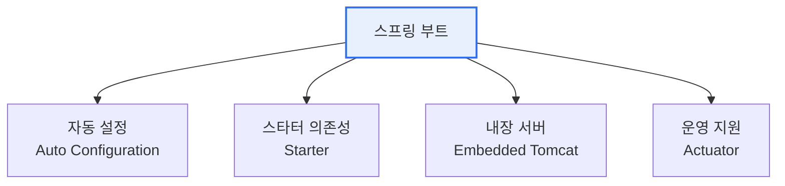

# 스프링 부트(Spring Boot)

## 1. 개요

### 가. 정의
> **스프링 부트(Spring Boot)** 는 자바 기반 스프링 프레임워크의 복잡한 설정을 자동화하여, **최소한의 설정만으로 독립 실행 가능한 애플리케이션을 빠르게 개발·배포**하도록 돕는 프레임워크다.

스프링 부트의 핵심 가치는 '**설정 지옥에서 개발자를 해방**'하는 데 있다. 기존 스프링은 강력하지만, 애플리케이션을 만들려면 수많은 XML·의존성·서버 설정을 일일이 해야 해서 진입장벽이 높고 시간이 오래 걸렸다. 스프링 부트는 "**설정보다 관례(Convention over Configuration)**"라는 철학으로 이를 해결한다. 흔히 쓰는 설정을 미리 합리적 기본값으로 자동 구성(Auto Configuration)해주고, 필요한 라이브러리를 묶음(Starter)으로 제공하며, 웹서버(톰캣)를 내장해 별도 설치 없이 실행 파일 하나로 서비스를 띄운다. 그 결과 개발자는 설정에 쏟던 시간을 실제 비즈니스 로직에 집중할 수 있고, 아이디어를 몇 분 만에 동작하는 서비스로 만든다. 이 생산성 덕분에 스프링 부트는 자바 웹·마이크로서비스 개발의 사실상 표준이 되었다.

### 나. 등장 배경
스프링의 복잡한 설정과 마이크로서비스·클라우드 시대의 빠른 개발·배포 요구가 맞물려, 설정을 자동화하고 독립 실행을 지원하는 스프링 부트가 등장했다.

## 2. 핵심 특징

| 특징 | 내용 |
|---|---|
| **자동 설정** | 관례 기반 합리적 기본값 자동 구성 |
| **스타터 의존성** | 기능별 라이브러리 묶음(spring-boot-starter-web 등) |
| **내장 서버** | 톰캣·제티 내장, 독립 실행(JAR) |
| **Actuator** | 상태·메트릭 등 운영 모니터링 |
| **최소 설정** | XML 대신 애너테이션·프로퍼티 |

## 3. 활용

스프링 부트는 REST API 서버, 마이크로서비스, 배치 처리 등에 널리 쓰이며, 스프링 클라우드와 결합해 MSA를 구현한다. 실행 파일(JAR) 하나로 배포되므로 컨테이너(Docker)·클라우드 환경에 적합하다.

## 4. 고려사항 및 시사점

1. **관례 기반의 편리함과 이해의 균형**이 필요하다. 자동 설정이 편리하지만 내부에서 무엇이 일어나는지 모르면 문제 해결이 어려우므로, 자동 구성 원리를 이해하고 필요시 커스터마이징해야 한다.
2. **마이크로서비스·클라우드 네이티브의 기반**이다. 독립 실행·내장 서버 특성이 컨테이너·MSA에 적합해, 스프링 클라우드와 함께 자바 클라우드 네이티브 개발의 핵심이 되었다.
3. **생산성과 표준화**를 제공한다. 반복적 설정을 제거하고 모범 관례를 강제해, 팀 전체의 개발 속도와 코드 일관성을 높인다.

---

> **한 줄 요약**: 스프링 부트는 *자동 설정·스타터·내장 서버로 최소 설정만으로 독립 실행 애플리케이션을 빠르게 개발* 하는 프레임워크로, "설정보다 관례" 철학으로 생산성을 높여 자바 웹·마이크로서비스 개발의 표준이 되었다.
