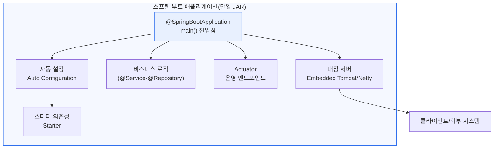
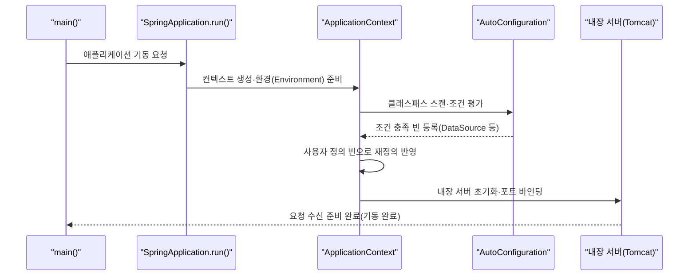

# 스프링 부트(Spring Boot)

## 1. 개요

### 가. 정의
> **스프링 부트(Spring Boot)** 는 자바 기반 스프링 프레임워크의 복잡한 설정을 자동화하여, **최소한의 설정만으로 독립 실행 가능한(stand-alone) 프로덕션급 애플리케이션을 빠르게 개발·배포**하도록 돕는 오피니언(Opinionated) 프레임워크다.

스프링 부트의 핵심 가치는 '**설정 지옥(configuration hell)에서 개발자를 해방**'하는 데 있다. 기존 스프링(Spring Framework)은 의존성 주입(DI)·관점 지향(AOP)·트랜잭션 관리 등 강력한 기능을 제공하지만, 정작 하나의 웹 애플리케이션을 띄우기까지 `web.xml`, `applicationContext.xml`, `dispatcher-servlet.xml` 같은 수많은 XML 설정과 라이브러리 버전 정합성 조율, 서블릿 컨테이너 설치·배포 작업을 개발자가 일일이 감당해야 했다. 이 진입장벽 때문에 "동작하는 첫 화면"을 보기까지 수 시간에서 하루가 걸리는 일이 흔했다.

스프링 부트는 이를 "**설정보다 관례(Convention over Configuration)**"와 "**합리적 기본값(sensible defaults)**"이라는 철학으로 해결한다. 대다수 프로젝트가 공통으로 필요로 하는 설정을 프레임워크가 미리 추론하여 자동 구성(Auto Configuration)해 주고, 기능 단위로 라이브러리를 묶은 스타터(Starter)를 제공하며, 서블릿 컨테이너(톰캣)를 애플리케이션 안에 내장(embed)해 별도 서버 설치 없이 실행 가능한 단일 산출물로 만든다. 그 결과 개발자는 설정에 쏟던 시간을 실제 비즈니스 로직에 집중할 수 있고, 아이디어를 수 분 만에 동작하는 서비스로 구현한다.

이 생산성 덕분에 스프링 부트는 자바 웹·마이크로서비스 개발의 사실상 표준(de facto standard)이 되었다. 국내 공공·금융권의 표준프레임워크(전자정부 표준프레임워크)도 스프링 기반이며, 최근 버전은 스프링 부트를 채택하고 있어 기술사 관점에서도 SW공학·아키텍처 설계의 핵심 도구로 다뤄야 한다.

### 나. 등장 배경 및 필요성
스프링 부트의 등장은 두 가지 흐름이 맞물린 결과다. 첫째, **스프링 자체의 설정 복잡도 누적**이다. 스프링은 버전을 거듭하며 애너테이션 기반 설정(`@Configuration`, `@Component`)으로 진화했지만, 여전히 어떤 빈(Bean)을 어떤 조건에서 등록할지, 어떤 라이브러리 버전을 함께 써야 충돌이 없는지를 개발자가 판단해야 했다. 프로젝트마다 반복되는 이 "보일러플레이트 설정"이 생산성의 병목이었다.

둘째, **마이크로서비스·클라우드 네이티브 시대의 요구**다. 2010년대 중반 이후 애플리케이션은 하나의 거대한 WAR로 WAS에 배포되는 방식에서, 작고 독립적으로 배포·확장되는 서비스 단위로 분화했다. 이 패러다임에서는 "서버에 미리 설치된 컨테이너에 애플리케이션을 얹는" 전통적 배포보다, "애플리케이션이 자신의 실행 환경을 스스로 포함하는" 방식이 훨씬 유리하다. 스프링 부트의 내장 서버·단일 JAR 실행 모델은 이 요구에 정확히 부합했고, 도커(Docker) 이미지화와 쿠버네티스 배포에도 자연스럽게 연결되었다.

## 2. 아키텍처와 핵심 구성요소

스프링 부트는 스프링 프레임워크 위에 얇지만 강력한 자동화 계층을 얹은 구조다. 전체 구조를 큰 그림으로 보면 다음과 같다.

```mermaid
flowchart TB
  subgraph APP["스프링 부트 애플리케이션(단일 JAR)"]
    MAIN["@SpringBootApplication<br/>main() 진입점"]
    AC["자동 설정<br/>Auto Configuration"]
    ST["스타터 의존성<br/>Starter"]
    BIZ["비즈니스 로직<br/>(@Service·@Repository)"]
    ACT["Actuator<br/>운영 엔드포인트"]
    WS["내장 서버<br/>Embedded Tomcat/Netty"]
  end
  MAIN --> AC
  AC --> ST
  MAIN --> BIZ
  MAIN --> ACT
  MAIN --> WS
  WS --> CLIENT["클라이언트/외부 시스템"]
  style APP fill:#f5f8ff,stroke:#2f6fed,stroke-width:2px
  style MAIN fill:#e8f0fe,stroke:#2f6fed
```

### 가. 자동 설정(Auto Configuration)
자동 설정은 스프링 부트의 심장이다. `@SpringBootApplication` 안에 포함된 `@EnableAutoConfiguration`이 동작하면, 부트는 **클래스패스에 어떤 라이브러리가 존재하는가**를 근거로 필요한 빈을 조건부로 등록한다. 예컨대 클래스패스에 `H2`와 `spring-jdbc`가 있으면 인메모리 데이터소스를 자동 구성하고, `spring-webmvc`가 있으면 `DispatcherServlet`을 등록한다.

이 조건부 등록의 기반은 `@ConditionalOnClass`, `@ConditionalOnMissingBean` 같은 조건 애너테이션이다. "특정 클래스가 있을 때만", "사용자가 직접 정의한 빈이 없을 때만" 기본 빈을 등록하는 방식이라, 개발자가 원하면 언제든 자신의 설정으로 덮어쓸 수 있다. 즉 자동 설정은 강제가 아니라 "합리적 기본값을 제공하되 재정의를 허용"하는 열린 구조다.

원리를 이해하는 것이 실무에서 중요한 이유는 문제 진단 때문이다. 자동 설정이 편리한 만큼 "왜 이 빈이 등록되었는지, 왜 내 설정이 무시되는지"가 불투명해질 수 있다. 이때 `--debug` 옵션으로 출력되는 자동 설정 리포트(Condition Evaluation Report)를 보면 어떤 조건이 매칭·비매칭되었는지 추적할 수 있어, "관례의 편리함"과 "내부 이해"의 균형을 맞추는 실무적 열쇠가 된다.

### 나. 스타터 의존성(Starter Dependencies)
스타터는 특정 기능을 구현하는 데 필요한 라이브러리 묶음을 하나의 의존성으로 캡슐화한 것이다. 예를 들어 `spring-boot-starter-web`을 추가하면 스프링 MVC, 내장 톰캣, 잭슨(JSON 직렬화), 밸리데이션 등이 서로 호환되는 버전으로 한 번에 딸려 온다. 개발자는 개별 라이브러리 버전을 조율하는 "의존성 지옥(dependency hell)"에서 벗어난다.

버전 정합성의 근거는 부모 POM인 `spring-boot-dependencies`의 BOM(Bill of Materials)이다. 스프링 부트 팀이 함께 검증한 라이브러리 버전 집합을 한곳에서 관리하므로, 스타터를 쓰면 개별 버전을 명시하지 않아도 검증된 조합이 적용된다. 이는 라이브러리 간 비호환으로 인한 런타임 오류(예: 잭슨 버전 충돌로 인한 역직렬화 실패)를 사전에 크게 줄여 준다.

주요 스타터를 정리하면 아래와 같으나, 표는 어디까지나 요약 보조일 뿐이고 실제 선택은 "어떤 통신·저장 기술을 쓰는가"라는 아키텍처 판단에서 나온다.

| 스타터 | 포함 기능 |
|---|---|
| `spring-boot-starter-web` | REST/MVC, 내장 톰캣, JSON |
| `spring-boot-starter-webflux` | 리액티브 웹, 내장 Netty |
| `spring-boot-starter-data-jpa` | JPA/Hibernate, 트랜잭션 |
| `spring-boot-starter-security` | 인증·인가(Spring Security) |
| `spring-boot-starter-actuator` | 상태·메트릭 등 운영 엔드포인트 |

### 다. 내장 서버(Embedded Server)와 단일 산출물
전통적 자바 웹 배포는 WAR 파일을 별도 설치된 WAS(예: 톰캣, 웹로직)에 올리는 방식이었다. 스프링 부트는 반대로 톰캣(또는 제티·언더토우, 리액티브 스택에서는 Netty)을 애플리케이션 의존성으로 내장한다. 그 결과 `java -jar app.jar` 한 줄로 서버가 뜨고, "실행 환경을 애플리케이션이 스스로 포함"하게 된다.

이 방식의 실무적 함의는 배포·운영의 단순화다. 서버마다 컨테이너 버전을 맞추고 튜닝하던 작업이 사라지고, "빌드된 산출물이 어디서든 동일하게 동작"하므로 개발-테스트-운영 환경 간 불일치(works on my machine 문제)가 줄어든다. 특히 도커 이미지에 JAR 하나만 담으면 되므로 컨테이너·쿠버네티스 기반 배포와 궁합이 좋다.

빌드 산출물은 실행 가능한 JAR(fat/uber JAR) 구조로, 애플리케이션 클래스와 모든 의존 라이브러리를 하나로 감싼다. 최근에는 계층형 JAR(Layered JAR)로 의존성·애플리케이션 코드를 분리해, 코드만 바뀌었을 때 도커 이미지 레이어 캐시를 재활용하여 이미지 빌드·배포 시간을 단축하는 기법이 널리 쓰인다.

### 라. Actuator와 운영 지원
Actuator는 실행 중인 애플리케이션의 상태를 외부로 노출하는 운영 지원 모듈이다. `/actuator/health`로 헬스체크, `/actuator/metrics`로 지표, `/actuator/info`로 메타정보를 제공하며, Micrometer를 통해 프로메테우스(Prometheus) 등 모니터링 시스템과 연동된다.

운영 관점에서 Actuator가 중요한 이유는 관측 가능성(Observability)의 최소 진입점을 프레임워크가 기본 제공한다는 점이다. 쿠버네티스의 Liveness/Readiness 프로브를 `/actuator/health/liveness`·`/readiness`에 연결하면, 컨테이너 오케스트레이터가 비정상 인스턴스를 자동 재기동·격리할 수 있다. 다만 상태 엔드포인트는 내부 정보를 노출하므로, 운영 환경에서는 노출 범위를 최소화하고 Spring Security로 접근을 통제해야 한다.

### 마. 부트스트랩 절차
자동 설정이 실제로 동작하는 흐름을 프로세스 관점에서 세부적으로 보면 다음과 같다.

```mermaid
sequenceDiagram
  participant M as "main()"
  participant R as "SpringApplication.run()"
  participant C as "ApplicationContext"
  participant A as "AutoConfiguration"
  participant S as "내장 서버(Tomcat)"
  M->>R: 애플리케이션 기동 요청
  R->>C: 컨텍스트 생성·환경(Environment) 준비
  C->>A: 클래스패스 스캔·조건 평가
  A-->>C: 조건 충족 빈 등록(DataSource 등)
  C->>C: 사용자 정의 빈으로 재정의 반영
  C->>S: 내장 서버 초기화·포트 바인딩
  S-->>M: 요청 수신 준비 완료(기동 완료)
```

## 3. 비교 — 스프링 vs 스프링 부트, 그리고 WAR vs 내장 서버

스프링 부트를 "새로운 프레임워크"로 오해하기 쉬우나, 정확히는 스프링 프레임워크를 더 쉽게 쓰게 해 주는 상위 계층이다. 둘의 차이는 기능의 유무가 아니라 **설정 책임의 소재**에서 비롯된다. 스프링은 유연성을 위해 설정 결정을 개발자에게 위임하는 반면, 스프링 부트는 대다수가 동의할 기본 결정을 프레임워크가 대신 내린다.

| 구분 | 스프링 프레임워크 | 스프링 부트 |
|---|---|---|
| 설정 | 개발자가 직접(XML/Java Config) | 자동 설정 + 재정의 |
| 의존성 | 개별 버전 관리 | 스타터·BOM으로 검증된 묶음 |
| 서버 | 외부 WAS 설치·배포(WAR) | 내장 서버·단일 JAR |
| 초기 구동 | 상대적으로 오래 걸림 | 수 분 내 실행 |

이 차이의 실무적 함의는 명확하다. 스프링만으로도 동일한 애플리케이션을 만들 수 있지만, 초기 설정과 유지보수 비용이 크다. 반대로 스프링 부트는 관례를 강제하는 대신 세밀한 제어를 일부 추상화 뒤로 숨긴다. 따라서 "특수한 레거시 통합이나 극단적 커스터마이징"이 필요한 경우가 아니라면, 오늘날 신규 자바 프로젝트는 스프링 부트를 기본 선택으로 삼는다.

실제 사례로, 한 스타트업이 REST API 백엔드를 스프링 부트로 구축하면 프로젝트 생성(start.spring.io)부터 첫 엔드포인트 응답까지 통상 10분 내외로 도달한다. 반면 순수 스프링으로 동일 작업을 하면 서블릿·디스패처·뷰 리졸버·데이터소스 설정만으로도 수백 줄의 XML/설정 코드가 필요하다. 이 초기 속도 차이가 MVP(최소기능제품) 검증 주기를 좌우한다.

## 4. 심화 — 클라우드 네이티브 동향과 최신 변화

스프링 부트는 클라우드 네이티브 요구에 맞춰 빠르게 진화하고 있다. 다만 세부 버전·릴리스 시점은 변동이 크므로, 기술사 답안에서는 확정적 수치보다 방향성을 중심으로 서술하는 것이 안전하다.

첫째, **자바 표준 네임스페이스 전환**이다. 스프링 부트 3.x 계열은 자바(EE)의 `javax.*` 네임스페이스를 `jakarta.*`로 전환한 Jakarta EE 9+ 기반으로 이동했고, 실행에 최신 LTS 자바(일반적으로 Java 17 이상)를 요구한다. 이는 레거시 마이그레이션 시 라이브러리 호환성 점검이 필요함을 의미한다.

둘째, **네이티브 이미지(GraalVM Native Image) 지원**이다. AOT(Ahead-Of-Time) 컴파일로 애플리케이션을 네이티브 바이너리로 만들어, 기동 시간을 수백 밀리초 수준으로 단축하고 메모리 사용을 크게 줄인다. 이는 서버리스(FaaS)나 대규모 스케일아웃 환경에서 콜드 스타트 지연과 자원 비용을 낮추는 데 유리하다. 다만 리플렉션·동적 프록시가 많은 코드는 힌트(hint) 설정이 필요해 전환 난도가 있다.

셋째, **가상 스레드(Virtual Thread)와 리액티브의 공존**이다. 최신 자바의 가상 스레드를 활용하면 기존 명령형(블로킹) 코드 스타일을 유지하면서도 높은 동시성을 얻을 수 있어, 반드시 리액티브(WebFlux)로 가지 않고도 처리량을 개선하는 선택지가 넓어졌다. 아키텍처 선택 시 "블로킹 vs 논블로킹"의 이분법이 완화되는 흐름이다.

넷째, **관측 가능성 표준 통합**이다. Micrometer·Micrometer Tracing을 통해 메트릭·트레이스를 OpenTelemetry 등 표준으로 내보내, 분산 추적과 통합 모니터링을 프레임워크 차원에서 지원하는 방향으로 강화되고 있다.

## 5. 고려사항 및 시사점(기술사 관점)

1. **자동 설정의 편의성과 내부 이해의 균형.** 자동 설정은 생산성을 극대화하지만, 원리를 모른 채 사용하면 장애 상황에서 원인 추적이 어렵다. 조건 평가 리포트·`spring-boot-starter-actuator`를 활용해 "무엇이 왜 구성되었는가"를 상시 관측 가능하게 만들고, 팀 차원의 학습을 병행해야 한다.

2. **마이크로서비스·클라우드 네이티브의 기반 기술로 포지셔닝.** 독립 실행·내장 서버 특성은 컨테이너·MSA·서버리스와 정합적이다. 스프링 클라우드(서비스 디스커버리·구성서버·게이트웨이)와 결합해 분산 시스템을 구성하되, 서비스 경계·데이터 일관성(사가 패턴 등) 같은 분산 설계 난제를 함께 고려해야 한다.

3. **표준화·거버넌스 도구로서의 가치.** 반복 설정 제거와 관례 강제는 팀 전체의 코드 일관성과 온보딩 속도를 높인다. 공공·금융권 표준프레임워크와의 연계, 사내 공통 스타터(사내 표준 라이브러리를 스타터로 캡슐화)를 통해 조직 차원의 아키텍처 거버넌스 수단으로 활용할 수 있다.

4. **보안·운영 리스크 관리.** 내장 서버·의존성 자동 포함은 편리하지만, 취약 라이브러리(예: 과거의 Log4Shell 유형 사례)가 fat JAR에 함께 포함될 수 있다. SBOM(소프트웨어 자재명세서) 관리, 의존성 취약점 스캔, Actuator 엔드포인트 접근통제를 DevSecOps 파이프라인에 내재화해야 한다.

5. **성능·비용 최적화 전략.** JVM 기반 기동 지연·메모리 사용은 대규모 스케일아웃·서버리스에서 비용으로 직결된다. 네이티브 이미지, 계층형 JAR, 가상 스레드 등 최신 기법을 워크로드 특성에 맞게 선택적으로 적용해 콜드 스타트와 자원 효율을 함께 관리해야 한다.

## 참고자료
- Spring Boot Reference Documentation — https://docs.spring.io/spring-boot/docs/current/reference/html/
- Spring Boot Project — https://spring.io/projects/spring-boot

---

> **한 줄 요약**: 스프링 부트는 *자동 설정·스타터·내장 서버로 최소 설정만으로 독립 실행 프로덕션급 애플리케이션을 빠르게 개발·배포* 하는 프레임워크로, "설정보다 관례" 철학으로 생산성을 높여 자바 웹·마이크로서비스 개발의 사실상 표준이 되었으며, 네이티브 이미지·가상 스레드·관측 가능성 강화로 클라우드 네이티브 시대에 계속 진화하고 있다.
