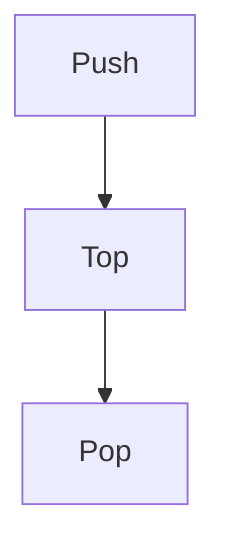

# 선형 자료구조: 스택·큐·리스트

## 1. 개요

### 가. 정의
> 데이터를 **일렬(선형)로 저장**하는 자료구조로, 입출력 원리에 따라 **스택(LIFO)·큐(FIFO)·리스트(순차 접근)** 로 구분된다.

### 나. 필요성
- 데이터 처리 순서·접근 패턴에 맞는 구조 선택으로 효율화

## 2. 스택(Stack)

| 항목 | 내용 |
|---|---|
| **원리** | **LIFO**(Last In First Out), 한쪽 끝(Top)에서만 입출력 |
| **연산** | push(삽입)·pop(삭제)·peek(top 조회) |
| **활용** | 함수 호출 스택, undo, 수식 계산, DFS |

## 3. 큐(Queue)

| 항목 | 내용 |
|---|---|
| **원리** | **FIFO**(First In First Out), 뒤(rear)에서 삽입·앞(front)에서 삭제 |
| **연산** | enqueue(삽입)·dequeue(삭제) |
| **변형** | 원형 큐, 덱(Deque), 우선순위 큐 |
| **활용** | 작업 스케줄링, 버퍼, BFS |

## 4. 리스트(List)

| 항목 | 내용 |
|---|---|
| **원리** | 순서 있는 원소 나열, **임의 위치 삽입·삭제·접근** |
| **구현** | 배열 리스트(인덱스 접근 O(1)), 연결 리스트(삽입·삭제 O(1)) |
| **연결 리스트** | 단일·이중·원형 |
| **활용** | 범용 순차 데이터 관리 |

## 5. 비교 및 시사점

| 구분 | 스택 | 큐 | 리스트 |
|---|---|---|---|
| **입출력** | LIFO | FIFO | 임의 |
| **접근** | Top만 | Front/Rear | 순차/인덱스 |

- 응용·요구(순서·접근)에 맞는 구조 선택, 배열 vs 연결의 **트레이드오프**(접근 vs 삽입/삭제)
- 트리·그래프 등 비선형 구조의 기반 요소

---

> **한 줄 요약**: 스택은 *LIFO(Top 입출력)*, 큐는 *FIFO(rear 삽입·front 삭제)*, 리스트는 *임의 위치 접근·삽입·삭제* 가 가능한 선형 자료구조로, 처리 순서·접근 패턴에 따라 선택한다.
