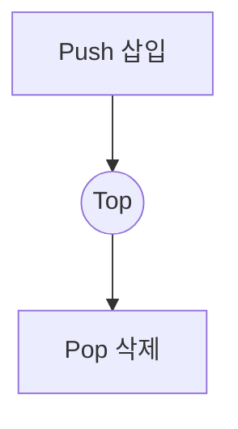

# 선형 자료구조: 스택 · 큐 · 리스트

## 1. 개요

### 가. 정의
> 데이터를 **일렬(선형·1차원)로 나열**해 저장하며, 원소가 앞뒤 원소와 1:1로만 인접하는 자료구조로, 입출력 규칙에 따라 **스택(LIFO)·큐(FIFO)·리스트(임의 접근)** 로 나뉜다.

선형 자료구조는 트리·그래프 같은 비선형 구조와 달리 원소 간 관계가 "이전-다음"의 단순 순서로만 정의된다. 언뜻 단순해 보이지만, **입출력을 어디서 허용하느냐**에 따라 전혀 다른 성질과 용도가 생긴다. 스택·큐는 접근 지점을 의도적으로 제한(양 끝 또는 한 끝)해 특정 처리 순서를 강제하고, 리스트는 제한 없이 임의 위치 접근을 허용한다.

### 나. 등장 배경 및 필요성
프로그램은 데이터를 "**어떤 순서로 넣고 꺼내는가**"에 따라 알고리즘의 정확성·효율이 갈린다. 예컨대 함수 호출은 마지막에 호출된 함수가 먼저 끝나야 하므로 LIFO가, 프린터 대기열은 먼저 요청한 작업이 먼저 처리돼야 하므로 FIFO가 자연스럽다. 즉 자료구조 선택은 문제의 **접근 패턴에 맞춰 연산 비용을 최소화**하기 위한 설계 결정이다. 잘못 고르면 O(1)로 끝날 연산이 O(n)이 된다.

## 2. 스택(Stack)

스택은 **한쪽 끝(Top)에서만** 삽입·삭제가 일어나는 **LIFO(Last In First Out)** 구조다. 접시를 쌓았다가 위에서부터 꺼내는 것과 같아, 가장 나중에 넣은 데이터가 가장 먼저 나온다. 이 성질은 "되돌리기"가 필요한 곳에서 강력하다. 대표적으로 **함수 호출 스택**은 호출→반환의 중첩 관계를 그대로 표현하고, 편집기의 **undo**, 수식의 괄호 검사·후위표기 계산, 그래프의 **DFS(깊이 우선 탐색)** 가 스택으로 구현된다. push·pop·peek 모두 Top만 건드리므로 O(1)이다.

| 항목 | 내용 |
|---|---|
| 원리 | **LIFO** — Top에서만 입출력 |
| 연산 | push(삽입)·pop(삭제)·peek(조회), 모두 O(1) |
| 활용 | 함수 호출 스택, undo, 수식 계산, DFS |

## 3. 큐(Queue)

큐는 **뒤(rear)에서 삽입하고 앞(front)에서 삭제**하는 **FIFO(First In First Out)** 구조로, 줄서기와 같다. 먼저 들어온 데이터가 먼저 처리되므로 **공정한 순서 보장**이 필요한 곳에 쓰인다. 운영체제의 작업 스케줄링, 데이터를 생산·소비 속도차를 흡수하는 **버퍼(buffer)**, 그래프의 **BFS(너비 우선 탐색)** 가 대표 사례다. 단순 배열로 큐를 구현하면 dequeue 후 front가 계속 뒤로 밀려 공간이 낭비되므로, 앞뒤를 연결해 재사용하는 **원형 큐(Circular Queue)** 를 쓴다. 양쪽 끝 모두 입출력이 가능한 **덱(Deque)**, 우선순위로 꺼내는 **우선순위 큐**는 큐의 변형이다.

| 항목 | 내용 |
|---|---|
| 원리 | **FIFO** — rear 삽입·front 삭제 |
| 연산 | enqueue(삽입)·dequeue(삭제) |
| 변형 | 원형 큐, 덱(Deque), 우선순위 큐 |
| 활용 | 작업 스케줄링, 버퍼, BFS |

## 4. 리스트(List)

리스트는 접근 위치에 제한을 두지 않아 **임의 위치의 삽입·삭제·조회**가 가능한 범용 선형 구조다. 구현 방식에 따라 성질이 크게 갈리는데, 이 차이가 실무 선택의 핵심이다. **배열 리스트**는 원소를 연속된 메모리에 두어 인덱스로 O(1) 즉시 접근이 가능하지만, 중간 삽입·삭제 시 뒤 원소를 모두 밀어야 해 O(n)이다. **연결 리스트**는 각 노드가 다음 노드 주소(포인터)를 가리켜, 포인터만 바꾸면 삽입·삭제가 O(1)이지만, 특정 원소를 찾으려면 앞에서부터 따라가야 해 접근이 O(n)이다. 즉 "**조회 위주면 배열, 삽입·삭제 위주면 연결 리스트**"가 원칙이다. 연결 리스트는 단일·이중(양방향)·원형으로 나뉜다.

| 구현 | 접근 | 삽입/삭제 | 특징 |
|---|---|---|---|
| 배열 리스트 | O(1) | O(n) | 연속 메모리, 캐시 효율 |
| 연결 리스트 | O(n) | O(1) | 포인터 연결, 동적 크기 |

## 5. 비교 및 시사점

세 구조의 차이는 결국 "**접근을 얼마나 제한하는가**"에서 비롯된다. 스택·큐는 접근 지점을 제한해 처리 순서(LIFO/FIFO)를 보장하는 대신 임의 접근을 포기했고, 리스트는 그 반대다.

| 구분 | 스택 | 큐 | 리스트 |
|---|---|---|---|
| 입출력 | LIFO | FIFO | 임의 |
| 접근 | Top만 | Front/Rear | 순차/인덱스 |
| 대표 용도 | DFS·undo | BFS·버퍼 | 범용 순차 관리 |

- **선택 기준**: 요구되는 처리 순서·접근 패턴에 맞춰 고르되, 리스트는 배열 vs 연결의 **트레이드오프(접근 O(1) vs 삽입/삭제 O(1))** 를 따진다.
- **확장 관점**: 스택·큐·리스트는 그 자체로도 쓰이지만, 트리·그래프·해시 등 **비선형·복합 자료구조를 구성하는 기본 블록**이다. 예컨대 트리 순회는 내부적으로 스택/큐를 사용한다.

---

> **한 줄 요약**: 스택은 *Top에서만 입출력하는 LIFO*, 큐는 *rear 삽입·front 삭제의 FIFO*, 리스트는 *임의 위치 접근·삽입·삭제* 가 가능한 선형 자료구조로, 접근 제한 정도와 배열·연결의 트레이드오프를 고려해 처리 순서·접근 패턴에 맞춰 선택한다.
