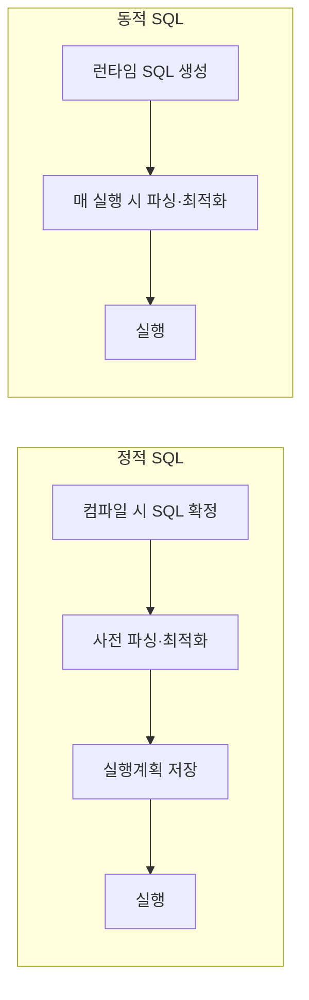

# 정적 SQL(Static SQL) vs 동적 SQL(Dynamic SQL)

## 1. 개요

### 가. 정의
> **정적 SQL**은 프로그램 작성(컴파일) 시점에 SQL 문장 구조가 확정되어 미리 파싱·최적화되는 방식이고, **동적 SQL**은 실행(런타임) 시점에 프로그램이 문자열로 SQL을 조립해 그때그때 실행하는 방식이다.

### 나. 구분하는 이유
둘을 나누는 근본 축은 **"SQL이 언제 확정되는가"** 이며, 이 시점 차이가 성능·유연성·보안이라는 세 가지 상반된 결과를 낳는다. SQL이 미리 확정되면 DB가 실행 계획을 한 번 만들어 재사용할 수 있어 빠르지만, 조회 조건이 상황에 따라 바뀌는 화면에는 대응하기 어렵다. 반대로 런타임에 문장을 만들면 어떤 조건 조합에도 대응할 수 있지만, 매번 파싱해야 해 느리고 외부 입력이 SQL 문장에 섞여 들어가 **SQL Injection** 위험이 생긴다. 따라서 어느 쪽을 쓸지는 이 트레이드오프를 상황에 맞게 저울질하는 문제다.

## 2. 처리 시점 비교

정적 SQL은 컴파일 단계에서 문장이 고정되므로 파싱·최적화·실행계획 수립을 **딱 한 번** 수행하고 그 계획을 저장해 두었다가 이후 실행에서 재사용한다. 반면 동적 SQL은 문장이 실행 직전에야 확정되기 때문에 원칙적으로 **매 실행마다 파싱·최적화 과정을 다시 거친다.** 이 "1회 사전 처리"와 "매회 재처리"의 차이가 곧 두 방식의 성능 격차의 근원이다.

## 3. 비교

| 구분 | 정적 SQL | 동적 SQL |
|---|---|---|
| SQL 확정 시점 | 컴파일(작성) 시 | 실행(런타임) 시 |
| 파싱/최적화 | 1회 사전 수행 | 매 실행 시 수행 |
| 성능 | 빠름(실행계획 재사용) | 상대적으로 느림 |
| 유연성 | 낮음(고정 구조) | 높음(조건 따라 변경) |
| 보안 | 안전(구조 고정·바인딩) | SQL Injection 위험 |
| 대표 활용 | 정형 반복 쿼리(배치·거래) | 가변 검색·관리 도구 |

성능 차이가 생기는 이유를 조금 더 파고들면, DB가 SQL을 실행하기 전 수행하는 **하드 파싱(구문 분석 + 최적 실행계획 탐색)** 이 상당한 비용을 차지하기 때문이다. 정적 SQL은 이 비용을 최초 1회만 치르지만, 매번 다른 문자열을 만드는 동적 SQL은 계획을 재사용하지 못해 반복적으로 하드 파싱을 유발한다. 유연성은 정반대다. 예컨대 검색 화면에서 사용자가 이름·기간·지역 중 입력한 조건만 WHERE 절에 붙여야 한다면, 조건 조합이 수십 가지여서 정적 SQL로는 모두 미리 작성하기 어렵고 동적 SQL로 그때그때 조립하는 편이 자연스럽다.

## 4. SQL Injection 대응 (동적 SQL)

동적 SQL의 가장 큰 위험은 SQL Injection이다. 예를 들어 로그인 쿼리를 `"SELECT * FROM users WHERE id='" + 입력 + "'"` 처럼 문자열 연결로 만들면, 공격자가 입력란에 `' OR '1'='1` 을 넣어 WHERE 조건을 항상 참으로 만들어 인증을 우회할 수 있다. 근본 원인은 **사용자 입력(데이터)이 SQL 문법(코드)의 일부로 해석**되는 데 있으므로, 방어의 핵심은 입력을 코드가 아닌 순수 데이터로 취급하게 하는 것이다.

| 대응 | 내용 | 원리 |
|---|---|---|
| **바인드 변수** | Prepared Statement·파라미터 바인딩 | 문장 구조를 먼저 고정하고 값만 나중에 주입 → 입력이 코드로 해석 불가 |
| **입력 검증** | 화이트리스트·타입·길이 검증 | 허용된 형태만 통과 |
| **최소 권한** | DB 계정 권한 최소화 | 침해 시 피해 범위 축소 |
| **에러 처리** | 상세 오류 메시지 노출 차단 | DB 구조 정보 유출 방지 |

가장 확실한 방어는 **바인드 변수(Prepared Statement)** 다. `WHERE id = ?` 처럼 자리표시자로 문장 구조를 먼저 컴파일한 뒤 값만 파라미터로 넘기면, 입력에 무엇이 들어와도 문법이 아닌 데이터로만 처리되어 Injection이 원천 차단된다. 게다가 바인드 변수는 값만 달라지고 문장 구조는 동일하므로 DB가 **실행계획을 캐시해 재사용**할 수 있어, 동적 SQL의 성능 약점까지 상당 부분 완화하는 일석이조의 효과가 있다.

## 5. 고려사항 및 시사점
- **동적 SQL은 반드시 바인드 변수와 함께**: 문자열 연결 방식을 지양하고 파라미터 바인딩을 강제하면 Injection 방어와 실행계획 캐시 재사용을 동시에 달성한다.
- **혼합 설계**: 성능이 중요한 정형 반복 쿼리(거래·배치)는 정적으로, 조건이 가변인 검색·리포트는 동적으로 나누어 적용하는 것이 현실적이다.
- **프레임워크 활용**: MyBatis·JPA 같은 ORM/영속성 프레임워크는 내부적으로 바인딩을 사용하므로, 이를 올바르게 쓰면 동적 쿼리의 유연성과 안전성을 함께 확보할 수 있다. 다만 프레임워크에서도 문자열 치환(예: `${}`) 방식은 Injection에 노출되므로 주의해야 한다.

---

> **한 줄 요약**: 정적 SQL은 *컴파일 시 확정·사전 최적화로 빠르고 안전*, 동적 SQL은 *런타임 조립으로 유연하나 매번 파싱해 느리고 Injection에 취약* 하며, 바인드 변수(Prepared Statement)를 쓰면 Injection을 원천 차단하고 실행계획 재사용으로 성능까지 보완할 수 있다.
