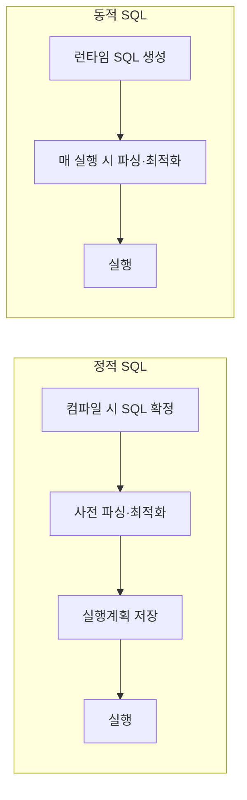

# 정적 SQL(Static SQL) vs 동적 SQL(Dynamic SQL)

## 1. 개요

### 가. 정의
> **정적 SQL**은 프로그램 작성(컴파일) 시점에 SQL 문장이 확정되어 미리 파싱·최적화되는 방식이고, **동적 SQL**은 실행(런타임) 시점에 문자열로 SQL을 생성·실행하는 방식이다.

### 나. 구분 이유
- **성능(사전 컴파일)** vs **유연성(런타임 생성)** 의 트레이드오프
- 실행계획 재사용·보안(SQL Injection) 관점의 선택 기준

## 2. 처리 시점 비교

## 3. 비교표

| 구분 | 정적 SQL | 동적 SQL |
|---|---|---|
| **SQL 확정 시점** | 컴파일(작성) 시 | 실행(런타임) 시 |
| **파싱/최적화** | 1회 사전 수행 | 매 실행 시 수행 |
| **성능** | 빠름(실행계획 재사용) | 상대적으로 느림 |
| **유연성** | 낮음(고정 구조) | 높음(조건 따라 변경) |
| **보안** | 안전(바인딩) | **SQL Injection 위험** |
| **활용** | 정형 반복 쿼리 | 가변 검색, 관리도구 |

## 4. SQL Injection 대응 (동적 SQL)

| 대응 | 내용 |
|---|---|
| **바인드 변수** | Prepared Statement/파라미터 바인딩(입력을 데이터로 처리) |
| **입력 검증** | 화이트리스트·타입 검증 |
| **최소 권한** | DB 계정 권한 최소화 |
| **에러 처리** | 상세 오류 노출 차단 |

## 5. 고려사항 및 시사점
- 동적 SQL은 반드시 **바인드 변수**로 Injection 방어 + 실행계획 캐시 재사용
- 성능 중요한 반복 쿼리는 정적, 가변 검색은 동적으로 **혼합 설계**
- ORM·MyBatis 등도 내부적으로 바인딩 활용 권장

---

> **한 줄 요약**: 정적 SQL은 *컴파일 시 확정·사전 최적화로 빠르고 안전*, 동적 SQL은 *런타임 생성으로 유연하나 성능·보안(Injection) 주의* 가 필요하며 바인드 변수로 방어한다.
