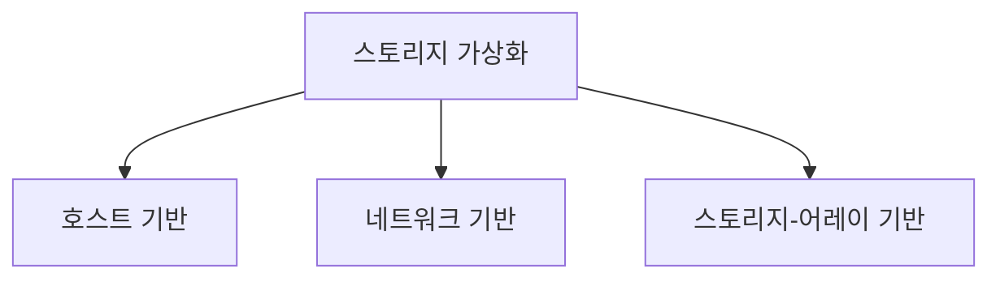

# 스토리지 가상화(Storage Virtualization)

## 1. 개요

### 가. 정의
> 물리적으로 분산된 이기종 스토리지 자원을 **논리적으로 통합(추상화)** 하여, 사용자·애플리케이션에게 물리 구성과 무관하게 **단일 저장 풀(Pool)** 처럼 제공하는 기술.

스토리지 가상화의 핵심은 **물리적 저장장치와 논리적 볼륨을 분리(decoupling)** 하는 것이다. 응용은 실제 데이터가 어느 디스크·어느 제조사 장비에 있는지 알 필요 없이 논리 볼륨만 바라본다. 이 분리 덕분에 물리 장비를 교체·이전·확장해도 논리 뷰는 그대로 유지되어, 데이터 이동이 응용에 투명해진다. 서버 가상화가 물리 서버와 VM을 분리하듯, 스토리지 가상화는 물리 디스크와 논리 볼륨을 분리하는 셈이다.

### 나. 등장 배경 및 필요성
기업이 성장하며 여러 제조사의 스토리지를 시기별로 도입하면, 장비마다 관리 도구가 달라 **관리 사일로(silo)** 가 생기고, 어떤 장비는 남아돌고 어떤 장비는 포화되는 **활용률 불균형**이 발생한다. 또 장비 교체 때마다 데이터를 옮기려면 서비스를 멈춰야 했다. 스토리지 가상화는 이기종 자원을 하나의 풀로 묶어 **통합 관리와 활용률 향상**을 이루고, 씬 프로비저닝으로 **비용을 최적화**하며, 무중단 마이그레이션으로 **운영 유연성**을 제공하기 위해 필요하다.

## 2. 구현 위치별 유형

가상화 계층을 **어디에 두느냐**에 따라 유형이 나뉘며, 이는 성능·이기종 통합성·벤더 종속성의 트레이드오프를 결정한다. 가상화 지점이 서버에 가까울수록 구현이 쉽고 저렴하지만 호스트에 부하를 주고, 스토리지에 가까울수록 고성능·안정적이지만 특정 벤더에 묶인다.

- **호스트 기반**: 서버 OS의 볼륨 매니저(LVM 등)나 소프트웨어가 가상화를 담당한다. 별도 장비 없이 **구현이 간단하고 저비용**이지만, 가상화 연산이 서버 CPU를 쓰므로 호스트에 부하를 주고 여러 서버에 걸친 확장·통합 관리에는 한계가 있다.
- **네트워크 기반**: SAN 스위치나 전용 어플라이언스가 서버와 스토리지 **사이(in-band/out-of-band)** 에서 가상화를 수행한다. 서버·스토리지에 독립적이어서 **이기종 통합과 중앙 관리에 가장 우수**하나, 별도 계층이 추가되어 구성이 복잡하고 그 자체가 병목·장애점이 될 수 있다.
- **스토리지-어레이 기반**: 스토리지 컨트롤러가 자체적으로, 또는 타사 스토리지를 뒤에 붙여 가상화한다. 하드웨어에 밀착돼 **고성능·안정적**이지만 해당 벤더 장비에 **종속**되는 단점이 있다.

| 유형 | 구현 위치 | 장점 | 단점 |
|---|---|---|---|
| **호스트 기반** | 서버 OS/LVM | 간단·저비용 | 호스트 부하·확장성 제한 |
| **네트워크 기반** | SAN 스위치·어플라이언스 | 이기종 통합·중앙관리 우수 | 구성 복잡·별도 장애점 |
| **스토리지 기반** | 스토리지 컨트롤러 | 고성능·안정 | 벤더 종속성 |

## 3. 데이터 접근 방식

가상화된 스토리지에 접근하는 방식은 데이터를 다루는 **단위**에 따라 블록과 파일로 나뉜다. 이 구분은 성능과 용도를 좌우한다.

- **블록 레벨(SAN)**: 데이터를 파일 시스템 개념 없이 **블록(block) 단위**로 다룬다. 서버 입장에서는 로컬 디스크처럼 보이며, 오버헤드가 적어 **고성능·저지연**이다. 트랜잭션이 빈번한 **데이터베이스**나 가상화 데이터스토어에 적합하다.
- **파일 레벨(NAS)**: 파일 시스템(NFS·SMB) 단위로 접근해 여러 클라이언트가 **파일을 공유·협업**하기 쉽다. 블록 방식보다 오버헤드는 크지만 공유 파일 서버·문서 저장에 적합하다.

| 구분 | 단위·프로토콜 | 적합 용도 |
|---|---|---|
| **블록 레벨** | 블록(SAN, iSCSI/FC) | DB·고성능 트랜잭션 |
| **파일 레벨** | 파일(NAS, NFS/SMB) | 파일 공유·협업 |

## 4. 주요 기술 및 효과

가상화가 제공하는 논리적 추상화 위에서 여러 스토리지 효율화 기술이 동작한다. 대표적으로 **씬 프로비저닝**은 실제 사용량만큼만 물리 공간을 동적 할당해 활용률을 크게 높인다 — 예컨대 사용자에게 1TB를 할당해도 실제 100GB만 쓰면 그만큼만 물리 소비하므로, 초기 과다 구매를 줄인다. **자동 계층화**는 접근 빈도를 분석해 자주 쓰는 데이터(hot)는 SSD로, 드문 데이터(cold)는 HDD로 자동 배치해 성능과 비용을 동시에 잡는다.

| 기술 | 원리 | 효과 |
|---|---|---|
| **씬 프로비저닝** | 사용량만큼 동적 할당 | 활용률↑·초기비용↓ |
| **자동 계층화(Tiering)** | 접근빈도별 SSD/HDD 배치 | 성능·비용 균형 |
| **무중단 마이그레이션** | 논리 뷰 유지 채 물리 이동 | 무중단 장비 교체 |
| **스냅샷·복제** | 특정 시점 사본·원격 복제 | 백업·재해복구(DR) |

## 5. 고려사항 및 시사점
- **SDS·클라우드의 기반**: 스토리지 가상화는 하드웨어에서 제어 기능을 분리한 **SDS(Software Defined Storage)** 와 클라우드 블록·오브젝트 스토리지의 토대가 된다.
- **HCI로의 진화**: **하이퍼컨버지드 인프라(HCI)** 에서는 컴퓨팅·네트워크·스토리지를 소프트웨어로 통합 가상화해, 표준 x86 서버들의 로컬 디스크를 하나의 분산 스토리지 풀로 묶는다.
- **트레이드오프**: 가상화 계층이 성능 오버헤드와 새로운 단일 장애점을 만들 수 있으므로, **성능·가용성·벤더 종속성**을 저울질해 유형을 선택해야 한다. 예컨대 최고 성능이 필요하면 어레이 기반, 이기종 통합이 급하면 네트워크 기반이 유리하다.
- **전망**: NVMe-oF·오브젝트 스토리지, 클라우드 연계 하이브리드 스토리지로 확장되며, 데이터 이동성과 자동화가 더욱 강조되고 있다.

---

> **한 줄 요약**: 스토리지 가상화는 이기종 저장자원을 *논리적 단일 풀로 추상화(물리-논리 분리)* 하며, **호스트·네트워크·어레이 기반** 유형과 **블록/파일 레벨** 접근, 씬 프로비저닝·자동 계층화·무중단 마이그레이션으로 활용률·유연성을 높여 SDS·HCI·클라우드의 기반이 된다.
