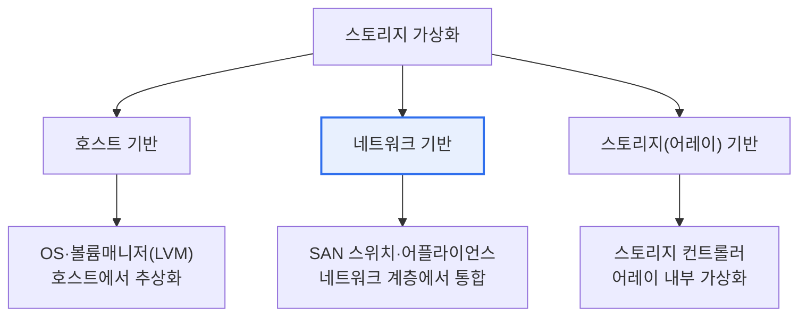

# 스토리지 가상화(Storage Virtualization)

## 1. 개요

### 가. 정의
> 물리적으로 분산된 여러 스토리지 자원을 **논리적으로 통합**하여, 사용자·애플리케이션에게 단일 저장 풀(Pool)처럼 추상화해 제공하는 기술.

### 나. 필요성
- 이기종 스토리지 **통합 관리·활용률 향상**
- 데이터 마이그레이션·확장의 **무중단 유연성** 확보
- 씬 프로비저닝을 통한 **비용 최적화**

## 2. 구현 위치별 유형

## 3. 유형별 특징

| 유형 | 구현 위치 | 특징 |
|---|---|---|
| **호스트 기반** | 서버 OS/볼륨매니저 | 구현 간단·저비용, 호스트 부하·확장성 제한 |
| **네트워크 기반** | SAN 스위치·어플라이언스 | 이기종 통합 우수, 중앙 관리, 구성 복잡 |
| **스토리지(어레이) 기반** | 스토리지 컨트롤러 | 고성능·안정, 벤더 종속성 |

## 4. 데이터 접근 방식

| 구분 | 설명 |
|---|---|
| **블록 레벨** | 블록 단위 가상화(SAN) — DB 등 고성능 요구 |
| **파일 레벨** | 파일 시스템 단위(NAS) — 파일 공유·협업 |

## 5. 주요 기술 및 효과
- **씬 프로비저닝**: 실제 사용량만큼 동적 할당 → 활용률↑
- **자동 계층화(Tiering)**: 접근빈도별 SSD/HDD 배치
- **무중단 마이그레이션**: 서비스 중단 없이 데이터 이동

## 6. 시사점
- SDS(Software Defined Storage)·클라우드 스토리지의 기반 기술
- 하이퍼컨버지드 인프라(HCI)에서 컴퓨팅·스토리지 통합 가상화로 진화

---

> **한 줄 요약**: 스토리지 가상화는 분산 저장자원을 *논리적 단일 풀로 추상화* 하며, **호스트·네트워크·어레이 기반** 유형과 **블록/파일 레벨** 접근으로 유연성과 활용률을 높인다.
