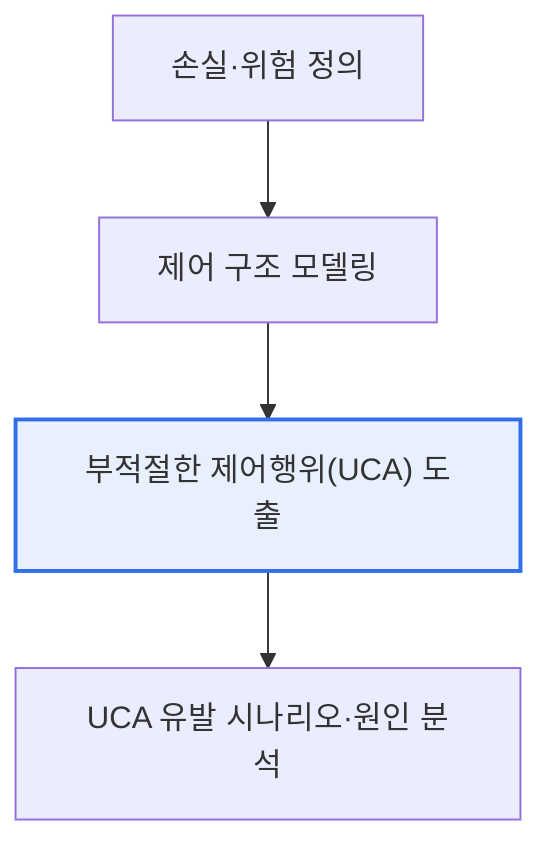

# STPA(System Theoretic Process Analysis) — FMEA·HAZOP과 비교

## 1. 개요

### 가. 배경
> 시스템이 복잡해지고 안전(Safety)이 중요해지면서 다양한 위험분석 기법이 쓰인다. 전통적 기법인 **FMEA·HAZOP** 이 부품 고장 중심인 데 반해, **STPA** 는 시스템 이론에 기반해 **부품 상호작용·제어 오류로 인한 위험** 까지 분석하는 현대적 기법이다.

STPA가 등장한 근본 이유는 '**현대 사고는 부품 고장이 아니라 상호작용·제어의 문제에서 더 많이 발생**'하기 때문이다. 전통적 FMEA·HAZOP은 "이 부품이 고장 나면 무슨 일이 생기는가"를 분석한다. 이는 각 부품이 정상이면 시스템이 안전하다는 가정에 기반한다. 그러나 자율주행·항공·의료처럼 소프트웨어가 여러 요소를 제어하는 복잡한 시스템에서는, 모든 부품이 정상이어도 **부품 간 잘못된 상호작용이나 부적절한 제어** 때문에 사고가 난다. 예를 들어 센서와 제어기가 각각 정상이어도, 제어기가 상황에 맞지 않는 명령을 내리면 사고가 발생한다. STPA는 사고를 '부품 고장'이 아니라 '**안전 제약을 위반하는 부적절한 제어**'로 보고, 시스템의 제어 구조에서 위험한 제어 행위(UCA)를 도출한다. 이 관점 전환이 복잡 시스템의 새로운 위험을 발굴한다.

### 나. FMEA·HAZOP의 특징 및 한계
| 기법 | 특징 | 한계 |
|---|---|---|
| **FMEA** | 부품 고장 유형·영향을 상향식 분석, RPN 우선순위 | 부품 개별 고장 중심, 상호작용·SW 오류 놓침 |
| **HAZOP** | 가이드워드로 설계 이탈 분석 | 공정 중심, 복잡한 제어·SW에 한계 |

두 기법 모두 부품 단위 고장에 집중해, 부품이 정상인데도 발생하는 상호작용·제어 오류를 다루지 못하는 한계가 있다.

## 2. STPA 개념과 분석 방법

STPA는 시스템을 제어 루프(제어기-작동기-피제어대상-센서)로 모델링하고, 안전을 위반하는 부적절한 제어 행위를 찾는다.

| 단계 | 내용 |
|---|---|
| **1. 손실·위험 정의** | 방지할 손실(사고)과 시스템 위험 식별 |
| **2. 제어 구조 모델링** | 제어기·작동기·센서 등 제어 루프 구성 |
| **3. UCA 도출** | 부적절한 제어행위(안 함/잘못 함/타이밍/지속) 식별 |
| **4. 시나리오 분석** | UCA를 유발하는 원인·시나리오 분석 |

UCA는 ①필요한 제어를 안 함, ②위험한 제어를 함, ③잘못된 타이밍·순서, ④너무 오래/짧게 지속의 네 유형으로 도출된다.

## 3. STPA와 전통 기법 비교

| 구분 | FMEA·HAZOP | STPA |
|---|---|---|
| **관점** | 부품 고장 | 시스템 제어·상호작용 |
| **기반** | 신뢰성 이론 | 시스템 이론(STAMP) |
| **강점** | 개별 고장 분석 | 상호작용·SW·제어 오류 |
| **적합** | 하드웨어 중심 | 복잡·SW 집약 시스템 |

## 4. 고려사항 및 시사점

1. **상호 보완적 활용**이 바람직하다. STPA가 전통 기법을 대체하는 것이 아니라, 부품 고장(FMEA)과 제어·상호작용 오류(STPA)를 함께 분석해 위험을 포괄적으로 발굴한다.
2. **소프트웨어 집약 시스템에 필수**다. 자율주행·항공·의료기기처럼 SW가 복잡하게 제어하는 안전필수 시스템에서, 부품 고장만으로 설명되지 않는 위험을 찾는 데 STPA가 강력하다.
3. **설계 초기 적용**이 효과적이다. STPA는 제어 구조를 모델링하므로 설계 단계에서 적용하면 안전 제약을 요구사항에 반영해 위험을 근본적으로 예방할 수 있다.

---

> **한 줄 요약**: STPA는 *사고를 부품 고장이 아닌 부적절한 제어(안전 제약 위반)로 보는* 시스템 이론 기반 위험분석으로, 제어 구조에서 UCA를 도출해 FMEA·HAZOP이 놓치는 상호작용·SW·제어 오류를 발굴하며 복잡·안전필수 시스템에 상호 보완적으로 활용된다.
