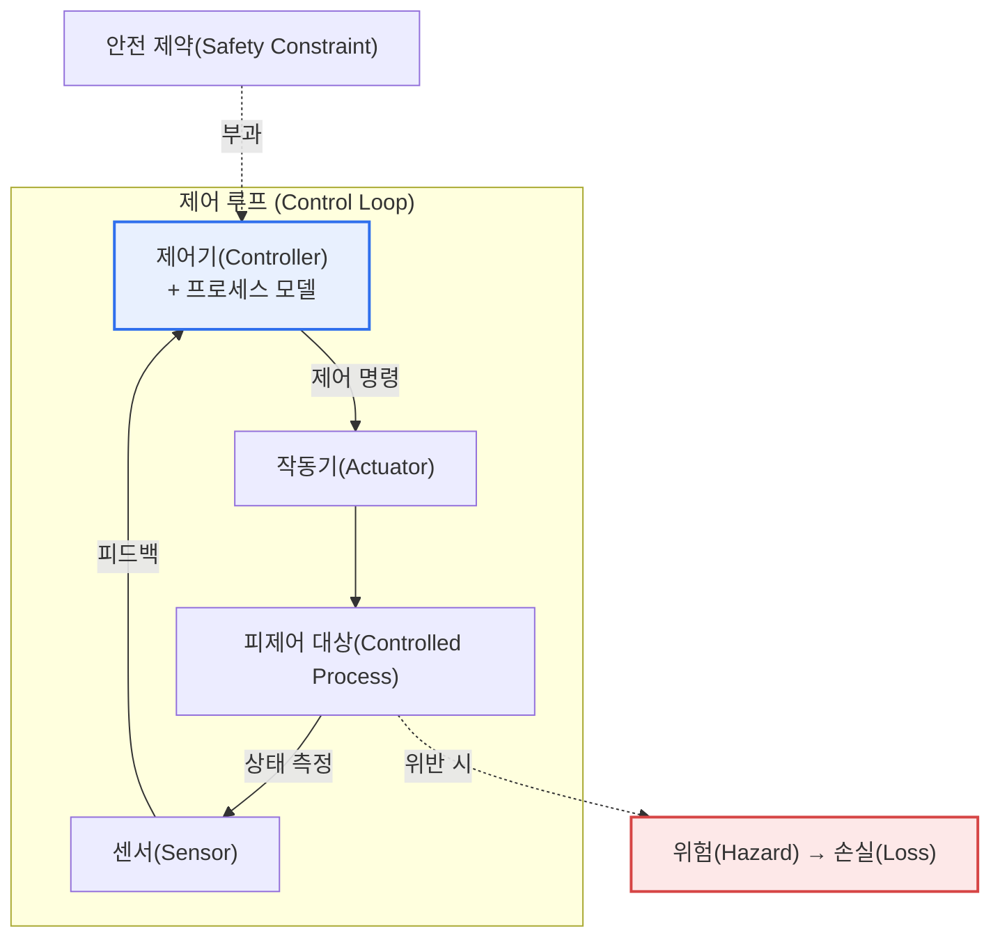
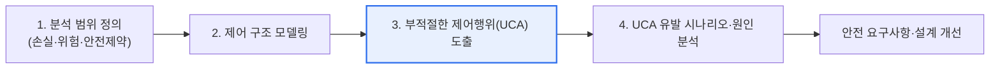

# STPA(System Theoretic Process Analysis) — FMEA·HAZOP과 비교

## 1. 개요

### 가. 개념과 배경
> **STPA**는 시스템 이론에 기반한 위험분석(Hazard Analysis) 기법으로, 사고를 '부품의 고장'이 아니라 '**안전 제약을 위반하는 부적절한 제어(Unsafe Control Action)**'로 보고, 시스템의 제어 구조에서 위험을 하향식(Top-down)으로 도출한다. MIT의 낸시 레브슨(Nancy Leveson)이 제안한 사고 인과 모델 **STAMP**(System-Theoretic Accident Model and Processes)에 뿌리를 둔다.

STPA가 등장한 근본 이유는 '**현대의 사고는 부품 고장보다 상호작용·제어의 문제에서 더 많이 발생**'하기 때문이다. 이 배경을 이해하려면 전통적 안전분석이 딛고 선 가정을 먼저 봐야 한다. FMEA·HAZOP 같은 고전 기법은 '이 부품이 고장 나면 무슨 일이 생기는가'를 묻는다. 그 밑에는 **각 부품이 정상이면 시스템도 안전하다**는 신뢰성 이론(Reliability Theory)의 가정이 깔려 있다. 이 가정은 부품 고장이 사고의 지배적 원인이던 기계 중심 시대에는 타당했다.

그러나 자율주행·항공·의료기기·원자력처럼 소프트웨어가 여러 요소를 통합 제어하는 복잡 시스템에서는 이 가정이 무너진다. 모든 부품이 규격대로 정상 동작하더라도, **부품 간 잘못된 상호작용이나 상황에 맞지 않는 제어 명령** 때문에 사고가 난다. 예컨대 센서와 제어기가 각각 개별 시험을 모두 통과했더라도, 제어기가 잘못된 상황 인식(Process Model 오류)으로 부적절한 명령을 내리면 사고가 발생한다. 소프트웨어는 물리적으로 '고장' 나지 않는다 — 설계된 대로 동작하지만 그 설계된 동작이 특정 맥락에서 위험할 뿐이다. 따라서 '고장률'로 소프트웨어 위험을 설명할 수 없다.

STPA는 이 지점에서 관점을 전환한다. 안전을 '부품이 고장 나지 않는 상태'가 아니라 '**시스템이 안전 제약(Safety Constraint)을 계속 만족하도록 제어되는 상태**'로 재정의하고, 사고를 그 제어가 실패한 결과로 본다. 즉 안전을 **제어 문제(Control Problem)**로 다룬다. 이 전환 덕분에 STPA는 부품 고장뿐 아니라 요구사항 불비, 제어기의 상황 인식 오류, 사람-자동화 간 상호작용 오류처럼 전통 기법이 놓치던 위험까지 발굴한다.

### 나. FMEA·HAZOP의 특징 및 한계
FMEA와 HAZOP은 오랜 검증을 거친 기법이지만 공통의 한계가 있다. **FMEA**(Failure Mode and Effects Analysis)는 부품 각각의 고장 유형(Failure Mode)을 나열하고 그 영향을 상향식(Bottom-up)으로 분석하며, 심각도·발생도·검출도를 곱한 RPN(Risk Priority Number)으로 우선순위를 매긴다. **HAZOP**(Hazard and Operability Study)은 'No', 'More', 'Less' 같은 가이드워드를 공정 변수에 대입해 설계 의도로부터의 이탈(Deviation)을 체계적으로 찾는다.

| 기법 | 접근 | 강점 | 한계 |
|---|---|---|---|
| **FMEA** | 부품 고장 유형·영향을 상향식 분석, RPN 우선순위 | 개별 부품 신뢰성 정량화에 강함 | 부품 개별 고장 중심, 부품 간 상호작용·SW 오류를 놓침 |
| **HAZOP** | 가이드워드로 공정 설계 이탈 분석 | 화학·공정 플랜트에 검증됨 | 공정 흐름 중심, 복잡한 제어·SW 로직에 한계 |

두 기법 모두 분석 단위가 '부품(또는 공정 변수)'이라는 데서 한계가 비롯된다. 부품을 하나씩 떼어 보므로, 부품이 모두 정상인데도 발생하는 상호작용·제어 오류는 구조적으로 시야에 들어오지 않는다. 이것이 STPA가 보완하려는 정확한 지점이다.

역사적으로 이 한계는 실제 대형 사고들에서 드러났다. 소프트웨어가 제어하는 시스템의 사고 상당수는 개별 부품의 물리적 고장이 아니라, 요구사항의 불완전성이나 운영자-자동화 간 오해, 상황에 맞지 않는 제어 명령에서 비롯되었다는 분석이 축적되어 왔다. FMEA·HAZOP의 틀로는 '모든 부품이 규격을 만족했는데 왜 사고가 났는가'라는 물음에 답하기 어렵고, 바로 이 공백이 시스템 이론에 기반한 새로운 분석 기법의 필요성을 낳았다.

## 2. STAMP 사고 모델과 STPA의 위치

STPA를 제대로 이해하려면 그 기반 이론인 STAMP를 먼저 봐야 한다. STAMP는 시스템을 계층적 제어 구조로 보고, 상위 계층이 하위 계층에 안전 제약을 부과하며 통제한다고 본다. 아래는 STAMP의 제어 루프와 STPA가 다루는 안전 제약의 관계를 나타낸 전체 구조도다.

```mermaid
flowchart TB
  subgraph CL["제어 루프 (Control Loop)"]
    CT["제어기(Controller)<br/>+ 프로세스 모델"]
    AC["작동기(Actuator)"]
    CP["피제어 대상(Controlled Process)"]
    SE["센서(Sensor)"]
    CT -->|제어 명령| AC --> CP
    CP -->|상태 측정| SE -->|피드백| CT
  end
  SC["안전 제약(Safety Constraint)"] -.부과.-> CT
  CP -.위반 시.-> HZ["위험(Hazard) → 손실(Loss)"]
  style CT fill:#e8f0fe,stroke:#2f6fed,stroke-width:2px
  style HZ fill:#fde8e8,stroke:#d64545,stroke-width:2px
```

STAMP의 핵심 개념은 세 가지다. 첫째, **제어 구조(Control Structure)** — 시스템은 제어기·작동기·피제어대상·센서로 이루어진 제어 루프의 계층으로 표현된다. 둘째, **프로세스 모델(Process Model)** — 제어기는 피제어 대상의 상태에 대한 내부 모델을 갖고 이에 근거해 명령을 내리는데, 이 모델이 실제와 어긋나면(예: 항공기가 착륙 상태라고 오판) 부적절한 명령이 나온다. 셋째, **안전 제약** — 사고를 막기 위해 시스템이 지켜야 할 조건이며, STPA는 이 제약이 언제 위반되는지를 추적한다. 소프트웨어 집약 시스템의 사고 상당수가 '프로세스 모델 오류'로 설명된다는 점이 STAMP의 통찰이며, 이는 부품 고장 모델로는 포착되지 않는다.

## 3. STPA의 4단계 분석 방법

STPA는 손실을 정의하는 데서 출발해 구체적 원인 시나리오로 좁혀가는 하향식 절차를 따른다. 아래는 그 프로세스 세부도다.

```mermaid
flowchart LR
  A["1. 분석 범위 정의<br/>(손실·위험·안전제약)"] --> B["2. 제어 구조 모델링"]
  B --> C["3. 부적절한 제어행위(UCA) 도출"]
  C --> D["4. UCA 유발 시나리오·원인 분석"]
  D --> E["안전 요구사항·설계 개선"]
  style C fill:#e8f0fe,stroke:#2f6fed,stroke-width:2px
```

**가. 1단계 — 분석 범위 정의.** 먼저 시스템이 절대 겪어서는 안 될 **손실(Loss)**(예: 인명 피해, 임무 실패, 자산 손상)을 정의하고, 그 손실로 이어지는 시스템 수준의 **위험(Hazard)**(예: '자율주행차가 선행 차량과 최소 안전거리를 유지하지 못함')을 식별한다. 이어 각 위험을 뒤집어 시스템이 지켜야 할 **안전 제약**을 도출한다. 이 단계가 중요한 이유는, 분석의 기준점을 '부품'이 아니라 '조직·이해관계자가 합의한 손실'에 두어, 이후 모든 분석이 실제로 방지해야 할 결과에 정렬되도록 하기 때문이다.

**나. 2단계 — 제어 구조 모델링.** 시스템을 제어기-작동기-피제어대상-센서의 제어 루프로 모델링한다. 여기에는 소프트웨어 제어기뿐 아니라 사람 운전자, 관제사, 상위 관리조직까지 제어자로 포함될 수 있다. 사람과 자동화를 하나의 제어 구조 안에 함께 놓는다는 점이 STPA의 강점으로, 사람-자동화 상호작용(Human-Automation Interaction) 오류를 자연스럽게 다룰 수 있다. 각 제어 관계에는 어떤 제어 명령이 오가고 어떤 피드백이 돌아오는지를 표기한다.

**다. 3단계 — 부적절한 제어행위(UCA) 도출.** 각 제어 명령에 대해, 그것이 어떤 맥락에서 안전 제약을 위반하는지를 네 유형으로 체계적으로 검토한다. 이 4유형이 STPA의 핵심 도구다.

| UCA 유형 | 의미 | 예시(자율주행 제동) |
|---|---|---|
| **① 제공 안 함** | 필요한 제어를 하지 않음 | 장애물이 있는데 제동 명령 없음 |
| **② 잘못 제공** | 위험한 제어를 함 | 고속 주행 중 급제동으로 후미 추돌 유발 |
| **③ 타이밍·순서 오류** | 너무 이르거나 늦게, 잘못된 순서로 제공 | 제동이 너무 늦어 정지거리 확보 실패 |
| **④ 지속 오류** | 너무 오래/짧게 적용 또는 중단 | 제동을 너무 일찍 해제해 재가속 |

**라. 4단계 — 시나리오·원인 분석.** 도출된 각 UCA에 대해 '왜 그런 제어가 나오는가'를 파고든다. 원인은 크게 두 갈래다 — 제어기 내부의 프로세스 모델 오류(잘못된 상황 인식, 알고리즘 결함, 요구사항 불비)와, 제어 경로의 문제(명령이 전달되지 않음, 피드백이 지연·손실됨, 센서 오류). 이렇게 도출된 시나리오는 곧바로 **안전 요구사항**과 **설계 개선안**으로 이어진다. 예를 들어 '센서 피드백 지연이 늦은 제동을 유발한다'는 시나리오는 '피드백 지연 상한을 T ms 이내로 보장하라'는 요구사항으로 구체화된다.

이 4단계가 전통 기법과 결정적으로 다른 점은 '분석의 종착지'다. FMEA가 부품별 고장 확률과 RPN이라는 정량 지표에서 멈추는 데 비해, STPA는 각 UCA를 유발하는 구체적 시나리오를 거쳐 곧장 검증 가능한 안전 요구사항으로 귀결된다. 즉 STPA의 산출물은 '어느 부품이 위험한가'가 아니라 '시스템이 어떤 제약을 어떤 조건에서 지켜야 하는가'이며, 이것이 설계·검증 단계로 자연스럽게 이어져 안전을 요구사항 수준에서 통제하게 한다. 실제 자율주행 사례에서 '정지 차량을 배경으로 오분류하는 인지 오류'가 제동 미제공(UCA ①)의 원인 시나리오로 도출되면, 이는 '특정 상황에서 인지 신뢰도가 임계값 미만이면 안전 정지하라'는 요구사항으로 반영된다.

## 4. 전통 기법과의 비교 및 실무 함의

세 기법의 차이는 결국 '분석 단위와 사고 모델'에서 갈린다. FMEA·HAZOP은 부품·공정을 단위로 신뢰성 이론에 서고, STPA는 제어 구조를 단위로 시스템 이론에 선다.

| 구분 | FMEA·HAZOP | STPA |
|---|---|---|
| **관점** | 부품 고장 | 시스템 제어·상호작용 |
| **이론 기반** | 신뢰성 이론 | 시스템 이론(STAMP) |
| **분석 방향** | 상향식(FMEA)/이탈(HAZOP) | 하향식(손실→위험→UCA) |
| **강점** | 개별 고장 정량화 | 상호작용·SW·제어·인적 오류 |
| **적합 대상** | 하드웨어 중심 시스템 | 복잡·SW 집약 안전필수 시스템 |

차이가 생기는 이유를 실무 함의까지 이어보면 이렇다. FMEA가 부품 신뢰성을 잘 정량화하는 이유는 고장률이라는 확률적 데이터가 부품 단위로 존재하기 때문이고, 바로 그 때문에 확률로 표현되지 않는 소프트웨어 로직 오류에는 약하다. 반대로 STPA가 SW·상호작용 오류에 강한 이유는 분석 대상을 '고장'이 아니라 '제어 행위의 적절성'으로 잡기 때문이며, 그 대가로 부품별 고장 확률 같은 정량 지표는 직접 산출하지 못한다. 따라서 실무에서는 둘을 대립시키지 않는다 — 안전필수 시스템 인증에서는 STPA로 제어·상호작용 위험을 발굴해 안전 요구사항을 세우고, FMEA로 하드웨어 부품 고장을 정량 평가하며, 이 둘을 상호 보완적으로 병행하는 것이 정착된 접근이다.

## 5. 심화: 표준·산업 적용 동향

**가. 자동차 — 자율주행과 SOTIF.** 기능안전 표준 ISO 26262가 '부품 고장으로 인한 위험(오작동)'을 다루는 데 비해, 자율주행의 새로운 문제는 '고장이 없어도 의도된 기능의 한계나 오인식으로 생기는 위험'이다. 이를 다루는 표준이 ISO 21448(SOTIF, Safety Of The Intended Functionality)이며, 여기서 STPA는 시나리오 기반 위험 발굴 기법으로 널리 활용된다. 센서·인지·판단·제어로 이어지는 제어 루프에서 상황 인식 오류가 부적절한 제어를 낳는 과정을 STPA가 잘 포착하기 때문이다.

**나. 항공·우주·방위.** 미 항공우주 분야에서는 대규모 시스템의 안전분석에 STPA·STAMP가 실무적으로 채택되어 왔으며, 관련 핸드북과 사례가 공개되어 있다. 복수의 자동화와 사람(조종사·관제)이 얽힌 제어 구조를 하나의 모델로 다룰 수 있어, 사람-자동화 상호작용에서 비롯된 사고의 분석·예방에 강점을 보인다. 특히 여러 조직·계층이 관여하는 복잡 시스템에서, 상위 관리·규제 계층까지 제어 구조에 포함해 분석할 수 있다는 점이 항공·방위처럼 조직적 요인이 사고에 크게 작용하는 도메인에서 유용하게 평가된다.

**다. 보안으로의 확장(STPA-Sec)과 예상 출제 방향.** 최근에는 안전(Safety)뿐 아니라 보안(Security) 위협을 같은 제어 구조 관점에서 분석하는 **STPA-Sec** 확장도 논의된다. 기술사 관점의 답안 전략으로는 ① '부품 고장 vs 제어·상호작용'이라는 사고 모델의 전환을 명확히 제시하고, ② STAMP–프로세스 모델–안전 제약의 개념 연결과 UCA 4유형을 구체 사례(자율주행 제동 등)로 설명하며, ③ FMEA·HAZOP과의 상호 보완, ISO 26262/21448 같은 표준 연계, 설계 초기 적용의 이점까지 확장하면 심화 깊이를 드러낼 수 있다.

## 6. 고려사항 및 시사점

기술사 관점에서 STPA는 개별 기법의 우열이 아니라, 시스템의 복잡도·안전 요구 수준·기존 인증 체계에 맞춰 위험분석 전략을 어떻게 구성할 것인가의 문제로 접근해야 한다. 아래는 그 전략 수립의 판단 기준이다.

1. **상호 보완적 활용이 원칙이다.** STPA는 FMEA·HAZOP을 대체하는 기법이 아니라, 부품 고장(FMEA)과 제어·상호작용 오류(STPA)를 함께 분석해 위험을 포괄적으로 발굴하는 보완재다. 안전필수 시스템 인증에서는 두 계열을 병행해 서로의 사각지대를 메우는 전략이 바람직하다.

2. **소프트웨어 집약·자율 시스템에 필수적이다.** 자율주행·항공·의료기기처럼 SW가 복잡하게 제어하고 사람과 상호작용하는 시스템에서는, 부품 고장만으로 설명되지 않는 위험(프로세스 모델 오류, 요구사항 불비, 인적-자동화 상호작용)이 지배적이므로 STPA의 제어 관점이 강력하다.

3. **설계 초기 적용이 비용 효율적이다.** STPA는 제어 구조를 모델링하므로 요구사항·아키텍처 설계 단계에서 적용하면, 발굴한 UCA와 시나리오를 곧바로 안전 요구사항으로 반영해 위험을 근본적으로 예방할 수 있다. 개발 후반에 발견되는 결함일수록 수정 비용이 급증한다는 점에서 조기 적용의 경제적 효과가 크다.

4. **표준·정량화와의 정합을 설계한다.** STPA는 위험을 '발굴'하는 데는 강하지만 부품별 고장 확률 같은 정량 지표는 직접 산출하지 않는다. 따라서 ISO 26262(기능안전)·ISO 21448(SOTIF) 등 표준 체계와 정합을 맞추고, 필요한 정량 근거는 FMEA·정량적 신뢰성 분석으로 보완하는 통합 안전 케이스(Safety Case)를 구성해야 한다.

5. **적용 역량과 도구 확보가 관건이다.** STPA는 관점 전환과 시스템 이론 이해를 요구하므로, 분석자의 훈련과 팀의 학습곡선, 제어 구조 모델링·UCA 관리를 지원하는 도구가 확산 성패를 좌우한다. 조직 차원의 방법론 내재화와 도구 지원을 함께 계획해야 실무 효과가 난다.

## 참고자료
- Nancy Leveson, *Engineering a Safer World* (STAMP/STPA) — https://mitpress.mit.edu/9780262533690/engineering-a-safer-world/
- MIT PSAS, STPA Handbook — http://psas.scripts.mit.edu/home/materials/
- ISO 21448 (SOTIF) 개요 — https://www.iso.org/standard/77490.html

---

> **한 줄 요약**: STPA는 *사고를 부품 고장이 아닌 부적절한 제어(안전 제약 위반)로 보는* 시스템 이론(STAMP) 기반 위험분석으로, 제어 구조에서 UCA 4유형을 하향식으로 도출해 FMEA·HAZOP이 놓치는 상호작용·SW·인적 오류를 발굴하며, 자율주행·항공 등 복잡·안전필수 시스템에서 전통 기법과 상호 보완적으로 활용된다.
