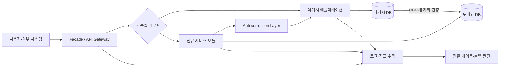
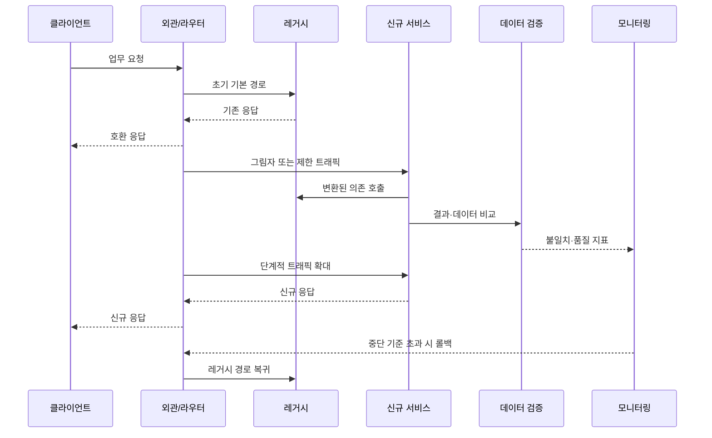

# 스트랭글러 피그(Strangler Fig) 패턴 기반 레거시 현대화

## 1. 개요

> **정의**: 스트랭글러 피그(Strangler Fig) 패턴은 기존 레거시 시스템을 한 번에 폐기하고 재작성하는 대신, 외부에 중개 계층을 두고 업무 기능을 작은 단위로 새 시스템으로 점진적으로 이전한 뒤, 이전이 끝난 레거시 부분을 단계적으로 제거하는 현대화 전략이다.

대규모 정보시스템은 업무 규칙, 데이터, 배치, 외부 연계, 운영 절차가 오랜 기간 누적되어 단순히 소스 코드를 새 언어로 번역한다고 현대화되지 않는다.
현재 동작하는 기능 중에는 문서화되지 않은 규칙과 예외가 섞여 있고, 여러 부서가 같은 데이터베이스와 인터페이스를 공유하며, 장애가 발생했을 때의 수동 조치까지 업무 프로세스의 일부가 되어 있다.
따라서 전면 재작성은 새 기술을 적용하기에는 매력적으로 보이지만, 숨은 요구사항을 놓치거나 장기간의 전환 기간 동안 기존 업무 개선을 멈추게 할 위험이 크다.

스트랭글러 피그라는 이름은 숙주 나무를 감싸며 자라는 교살 무화과의 성장 방식에서 유래한다.
소프트웨어에서는 기존 시스템을 즉시 죽이는 것이 아니라 새로운 기능을 기존 시스템의 가장자리에서 시작하고, 기능이 검증될 때마다 새로운 구현의 범위를 넓힌다.
사용자와 외부 시스템은 처음에는 동일한 인터페이스를 사용하지만, 라우팅 계층은 요청을 레거시 또는 신시스템으로 선택하여 보낸다.
최종적으로 모든 업무 기능과 데이터가 이전되고 레거시 의존성이 제거되면 중개 계층과 레거시 시스템을 함께 정리한다.

이 패턴의 본질은 “새 시스템을 만드는 기술”보다 “업무 중단 없이 변화의 단위를 작게 만드는 기술”에 있다.
각 단계는 독립적으로 배포되고 관찰되어야 하며, 잘못된 이전을 되돌릴 수 있는 경로를 포함해야 한다.
현대화의 진행률도 코드 줄 수가 아니라 이전된 업무 능력, 안정성, 사용자 가치, 레거시 의존성 감소로 측정하는 것이 바람직하다.

### 1.1 등장 배경과 필요성

첫째, 레거시 시스템은 교체 대상이면서 동시에 현업의 핵심 운영 기반이다.
대체 시스템이 완성될 때까지 기존 시스템을 멈출 수 없으므로, 요구사항을 모두 확정한 뒤 몇 년 후에 일괄 전환하는 방식은 현재의 업무 변화와 맞지 않는다.
점진적 방식은 기존 시스템이 계속 서비스를 제공하는 동안 우선순위가 높은 기능부터 개선할 수 있게 한다.

둘째, 레거시 시스템의 실제 동작을 완전히 파악하기 어렵다.
소스 코드와 설계서만으로는 운영 데이터의 특수값, 외부 기관의 비공식 연계, 현업 담당자의 보정 절차를 발견하기 어렵다.
작은 기능을 실제 업무 흐름에 투입하면 팀은 전환 과정에서 숨은 규칙을 학습하고, 이후의 이전 계획을 수정할 수 있다.

셋째, 투자와 성과를 단계적으로 확인할 필요가 있다.
전면 재작성은 많은 비용을 먼저 투입하고 마지막에야 성공 여부를 알게 되지만, 스트랭글러 피그는 매 단계에 작동하는 결과물을 내놓는다.
따라서 경영진은 위험, 비용, 사용자 가치의 변화를 주기적으로 판단하고 계속·중단·방향전환을 선택할 수 있다.

### 1.2 목표와 설계 원칙

스트랭글러 피그의 첫 번째 목표는 무중단 또는 저중단 전환이다.
기존 계약과 사용자 경험을 유지하면서 내부 구현을 바꾸어야 하므로, 외부 인터페이스와 내부 서비스 경계를 분리한다.

두 번째 목표는 기능 단위의 가역성이다.
새 기능의 장애가 전체 서비스로 확산되지 않도록 라우팅을 되돌릴 수 있어야 하며, 데이터 변경은 복구와 재처리 절차를 갖추어야 한다.

세 번째 목표는 경계의 명확화다.
업무 능력, 데이터 소유권, 트랜잭션 범위를 기준으로 이전 단위를 정하고, 새 시스템이 레거시의 자료구조와 용어를 그대로 끌고 오지 않도록 변환 경계를 둔다.

네 번째 목표는 레거시의 최종 제거다.
중개 계층을 영구적인 복잡성으로 남기면 시스템은 레거시와 신시스템이 결합된 새로운 모놀리스가 된다.
따라서 처음부터 완료 조건, 제거 시점, 담당자, 예산을 정의하고 임시 어댑터와 라우팅 규칙에 만료 조건을 부여한다.

## 2. 구조와 핵심 구성요소

스트랭글러 피그 패턴은 프록시 하나만 추가하는 구조가 아니다.
클라이언트와 시스템 사이의 라우팅 계층, 새 기능을 제공하는 서비스, 레거시와 신시스템 사이의 변환 계층, 데이터 동기화·검증 체계, 관측성과 전환 통제 기능이 함께 구성된다.

### 2.1 외관 또는 라우팅 계층(Facade)

외관은 기존 클라이언트가 보는 접점과 내부 구현의 위치를 분리한다.
초기에는 대부분의 요청을 레거시로 전달하고, 이전이 완료된 기능의 요청만 새 서비스로 보낸다.
이렇게 하면 클라이언트가 호출 주소를 바꾸지 않아도 내부의 기능 소유권을 이동할 수 있다.

라우팅 기준은 URL만으로 제한하지 않는다.
기능·버전·테넌트·지역·사용자 그룹·트래픽 비율·기능 플래그를 조합할 수 있으며, 고위험 변경은 내부 직원이나 일부 트래픽부터 시작한다.
다만 라우팅 규칙이 업무 규칙과 섞이면 외관이 새로운 거대 시스템이 되므로, 기술 라우팅과 업무 판정의 책임을 분리해야 한다.

외관은 단일 장애점과 병목이 되기 쉽다.
무상태로 수평 확장하고, 규칙 배포의 버전과 캐시 무효화 방식을 관리하며, 외관 자체의 장애 시 안전한 기본 경로를 정의한다.
모든 라우팅 결정에는 대상 버전, 규칙 버전, 사용자 영향 범위를 로그로 남겨 장애 시 어떤 요청이 어느 시스템으로 갔는지 재현한다.

### 2.2 신규 서비스와 기능 슬라이스

이전 단위는 기술 계층이 아니라 업무 능력으로 자르는 것이 좋다.
예를 들어 주문 시스템에서 화면·컨트롤러·서비스·테이블을 한 번에 옮기기보다 “배송지 변경”이나 “주문 상태 조회”처럼 사용자가 이해할 수 있는 흐름을 하나의 슬라이스로 정의한다.
기능 슬라이스는 입력 계약, 출력 계약, 데이터 소유권, 오류 처리, 운영 지표를 함께 가진다.

처음부터 모든 도메인을 마이크로서비스로 쪼갤 필요는 없다.
새 구현은 모듈형 모놀리스일 수도 있고, 기능별 독립 서비스일 수도 있다.
중요한 기준은 배포와 소유권의 경계가 명확하며, 다음 이전 단위를 방해하지 않는가이다.

### 2.3 반부패 계층(Anti-corruption Layer)

레거시와 신시스템은 같은 단어를 사용해도 의미와 데이터 형식이 다를 수 있다.
레거시는 `고객등급=3`으로 저장하지만 신시스템은 `SILVER`라는 명시적 열거형을 사용할 수 있고, 레거시의 주문 상태 하나가 새 시스템에서는 여러 상태로 분리될 수 있다.
반부패 계층은 이러한 차이를 변환하여 레거시의 자료구조·오류 코드·트랜잭션 관행이 신시스템의 모델을 오염시키지 않게 한다.

이 계층은 단순한 DTO 매핑을 넘어 계약 변환, 단위·시간대 변환, 오류 의미 변환, 재시도·타임아웃, 멱등성 처리를 포함한다.
변환 규칙은 테스트 가능한 코드와 버전이 있는 계약으로 관리하고, 신시스템 내부에서 레거시 용어가 직접 사용되는지 정적 검사로 점검한다.

### 2.4 데이터 저장소와 동기화

응용 기능을 옮겨도 데이터가 중앙 레거시 데이터베이스에 남아 있으면 시스템의 결합은 계속된다.
그러나 데이터베이스를 처음부터 분리하면 동기화와 일관성 문제가 급격히 커지므로, 단계별로 읽기·쓰기의 책임을 이동한다.

초기 단계에서는 신서비스가 레거시 테이블을 읽을 수 있지만, 새 코드가 레거시 스키마에 직접 의존하는 기간을 제한한다.
다음 단계에서는 도메인 데이터를 새 저장소로 복제하고, 원천 데이터와 복제 데이터의 건수·합계·해시·업무 불변조건을 검증한다.
검증이 끝나면 새 저장소를 시스템 오브 레코드로 지정하고, 레거시에는 필요한 호환 데이터만 제공한다.

| 구성요소 | 주된 책임 | 핵심 통제 |
|---|---|---|
| 외관·게이트웨이 | 요청을 레거시와 신시스템에 분배 | 규칙 버전, 장애 우회, 접근제어 |
| 신규 기능 슬라이스 | 이전된 업무 능력의 실행 | 계약 테스트, 기능 플래그, 독립 배포 |
| 반부패 계층 | 모델·계약·오류 의미 변환 | 매핑 버전, 변환 테스트, 멱등성 |
| 동기화 파이프라인 | 원천과 신규 저장소의 데이터 전달 | CDC, 재처리, 순서·중복 제어 |
| 관측성 계층 | 전환 결과와 운영 위험 측정 | 분산 추적, SLO, 기능별 비교 |
| 제거 계획 | 레거시 의존성의 종료 | 사용량 0 확인, 보존·폐기 승인 |

표의 항목은 독립적인 제품 목록이 아니라 하나의 전환 통제면을 이룬다.
예를 들어 라우팅이 새 서비스로 바뀌었는데 데이터 동기화 지연을 측정하지 않으면 사용자는 오래된 조회 결과를 받을 수 있다.
반대로 데이터가 먼저 분리되어도 외관의 전환 규칙이 준비되지 않으면 새 저장소의 결과를 실제 업무에 노출할 수 없다.
따라서 기능별로 라우팅, 변환, 데이터, 관측성의 준비 상태를 함께 평가해야 한다.

## 3. 점진적 전환 절차

### 3.1 목표와 현재 상태 진단

현대화에 앞서 “기술을 바꾸겠다”가 아니라 어떤 업무 결과를 개선할지 정의한다.
응답시간, 출시 주기, 장애 복구시간, 규제 대응, 운영비, 확장성 중 우선순위를 정하고 수치화 가능한 기준선을 확보한다.

레거시의 호출 관계와 데이터 흐름을 정적 분석만으로 추정하지 말고 실제 로그·트레이스·배치 이력·담당자 인터뷰로 보완한다.
기능별 사용량, 매출·규제 영향, 변경 난이도, 결합도, 데이터 민감도를 함께 평가하면 이전 후보의 우선순위를 정할 수 있다.

### 3.2 경계와 첫 번째 슬라이스 선정

첫 번째 이전 대상은 가장 복잡한 기능보다 학습 효과가 높고 실패 범위가 제한된 기능이 적합하다.
업무 가치가 분명하며 호출 경계를 관찰할 수 있고, 데이터 소유권을 설명할 수 있는 기능을 선택한다.
핵심 결제의 원자적 트랜잭션처럼 실패 비용이 큰 영역은 충분한 가드레일이 마련된 뒤 다룬다.

기능을 선정할 때 “화면 하나”라는 기준은 부족하다.
입력 검증, 권한, 데이터 변경, 비동기 이벤트, 알림, 감사로그, 배치 후속처리까지 하나의 업무 능력에 포함되는지를 확인해야 한다.
경계가 잘못되면 한 기능이 양쪽 시스템을 반복 호출하고, 결국 이전보다 더 복잡한 분산 트랜잭션이 생긴다.

### 3.3 외관과 계약의 도입

클라이언트와 레거시 사이에 외관을 설치하되, 초기에 모든 요청을 레거시로 전달하여 동작이 바뀌지 않는지 검증한다.
이 단계는 기능 이전이 아니라 관측성과 통제의 기반을 만드는 단계다.
요청·응답 스키마, 인증 주체, 지연시간, 오류율, 재시도 횟수를 기준선과 비교한다.

그 다음 새 서비스의 계약을 정의한다.
계약은 단순히 JSON 필드 목록만이 아니라 필드의 의미, 필수성, 단위, 정렬·페이징, 오류 코드, 멱등성, 개인정보 마스킹 규칙을 포함한다.
소비자 주도 계약 테스트와 호환성 검사를 통해 한쪽의 배포가 다른 쪽의 호출을 깨뜨리지 않게 한다.

### 3.4 기능 구현과 병행 검증

새 기능은 어댑터를 통해 필요한 레거시 데이터와 서비스를 사용하되, 레거시의 내부 호출을 그대로 복사하지 않는다.
구현이 끝나면 그림자 트래픽이나 읽기 비교를 이용해 새 결과를 사용자에게 노출하기 전에 레거시 결과와 비교한다.
비교는 문자열 완전 일치만으로 판단하면 안 되며, 업무적으로 동일한지와 허용 가능한 반올림·정렬 차이인지 구분한다.

쓰기 기능은 읽기보다 위험하다.
초기에는 새 서비스가 검증·계산만 수행하고 실제 쓰기는 레거시가 담당하도록 하거나, 이중 쓰기를 사용하되 중복과 순서 역전을 처리한다.
이중 쓰기는 성공 기준이 두 시스템 모두 기록되었다는 뜻이므로, 부분 실패에 대한 보상 작업과 운영 큐를 설계하지 않으면 정합성 부채가 누적된다.

### 3.5 트래픽 전환과 안정화

전환은 한 번의 스위치가 아니라 단계적 확대다.
내부 사용자, 테스트 테넌트, 소량 트래픽, 특정 지역, 전체 트래픽의 순서로 확장할 수 있으며 단계 사이에 관찰 시간을 둔다.
각 단계에는 허용 가능한 오류율·지연시간·업무 성공률·데이터 불일치율의 중단 기준을 둔다.

기능 플래그는 신속한 전환과 롤백을 돕지만, 만료되지 않는 플래그는 코드와 운영 경로를 복잡하게 만든다.
플래그 소유자, 만료일, 기본값, 긴급 해제 권한, 변경 감사로그를 관리하고, 전환 완료 후 반드시 제거한다.

### 3.6 레거시 제거와 사후 검증

새 시스템이 정상 동작한다고 바로 레거시 테이블과 코드를 삭제하지 않는다.
호출량이 일정 기간 0인지, 배치·외부 연계·관리자 도구가 남아 있지 않은지, 감사·보존 의무가 충족되는지 확인한다.
삭제 전에는 백업 복구와 롤백 가능성을 검증하고, 보존해야 하는 데이터와 폐기할 데이터를 법무·개인정보 담당자와 구분한다.

제거 후에도 사용자와 운영팀이 새 경로의 지표를 이해하는지 확인한다.
현대화의 완료는 코드 삭제의 순간이 아니라, 책임자·운영 절차·장애 대응·보안 통제가 새 시스템으로 이전된 상태를 의미한다.

## 4. 데이터 현대화와 일관성 설계

### 4.1 공유 데이터베이스의 위험

여러 서비스가 같은 테이블을 직접 읽고 쓰면 테이블 구조가 사실상의 공용 API가 된다.
새 시스템이 레거시 테이블을 수정하면 다른 배치와 보고서가 영향을 받고, 어느 서비스가 값을 변경했는지 추적하기 어렵다.
따라서 이전 과정에서는 테이블 접근을 점진적으로 서비스 API나 이벤트로 감싸고, 직접 접근 목록과 폐기 일정을 관리한다.

공유 데이터베이스를 즉시 분리하지 못하는 경우에도 읽기와 쓰기의 소유자를 정할 수 있다.
특정 도메인의 쓰기는 하나의 시스템만 담당하고 다른 시스템은 이벤트나 읽기 모델을 통해 접근하게 하면 충돌의 원인을 좁힐 수 있다.
이때 데이터의 최신성 목표와 일시적 불일치를 업무적으로 허용하는지를 명시해야 한다.

### 4.2 CDC와 이벤트 기반 동기화

변경 데이터 캡처(CDC)는 데이터베이스 로그나 변경 이벤트를 읽어 신규 저장소에 전달하는 방식이다.
응용 코드에 동기화 로직을 흩어 놓는 것보다 누락 감시와 재처리가 쉬울 수 있지만, 삭제·스키마 변경·트랜잭션 순서·민감정보의 전파를 함께 통제해야 한다.

이벤트 기반 동기화에서는 이벤트의 의미와 스키마를 버전 관리한다.
소비자는 중복 이벤트를 받아도 한 번만 적용할 수 있어야 하고, 순서가 중요한 업무는 키별 순서와 지연 이벤트 처리 정책을 갖추어야 한다.
실패한 이벤트를 무한 재시도하면 장애가 확대되므로, 격리 큐와 운영자 재처리 절차를 둔다.

### 4.3 이중 읽기·이중 쓰기

이중 읽기는 두 시스템의 결과를 비교하는 데 유용하지만, 사용자 요청 지연시간과 부하를 증가시킨다.
비교 요청은 비동기로 수행하거나 샘플링하고, 개인정보를 포함한 결과는 마스킹·해시화하여 비교 로그에 원문을 남기지 않는다.

이중 쓰기는 데이터 정합성 확인에 도움이 되지만 분산 트랜잭션은 아니다.
한쪽 쓰기 성공 뒤 다른 쪽이 실패하면 보상 이벤트, 재처리 큐, 운영자 확인, 원천 시스템 기준의 복구 시나리오가 필요하다.
가능하다면 원천을 하나로 유지하면서 이벤트로 파생 저장소를 갱신하는 구조가 책임 경계를 명확하게 한다.

| 데이터 단계 | 읽기 경로 | 쓰기 경로 | 롤백 난이도 | 적용 목적 |
|---|---|---|---|---|
| 초기 관찰 | 레거시 | 레거시 | 낮음 | 기준선·호출 관계 파악 |
| 그림자 검증 | 레거시+신규 비교 | 레거시 | 낮음~중간 | 결과·성능 검증 |
| 제한 전환 | 신규 우선, 실패 시 레거시 | 단일 원천 또는 통제된 이중 쓰기 | 중간 | 실제 트래픽 학습 |
| 도메인 소유권 이전 | 신규 | 신규 | 중간~높음 | 신시스템을 시스템 오브 레코드로 확정 |
| 레거시 제거 | 신규 | 신규 | 높음 | 종속성 종료와 비용 절감 |

각 단계에서 롤백을 “이전 라우팅으로 되돌리기”라고만 정의하면 부족하다.
이미 신규 저장소에 기록된 변경이 레거시로 되돌아가야 하는지, 사용자에게 성공으로 보인 요청을 다시 처리해도 안전한지, 이벤트가 중복 발행되지 않는지까지 결정해야 한다.
특히 원천 데이터의 소유권을 이전한 뒤에는 롤백보다 정방향 복구가 안전한 경우가 많으므로, 단계별로 가역성과 복구 목표를 구분한다.

## 5. 기존 전환 전략과의 비교

전면 재작성(Big Bang)은 새 시스템을 완성한 뒤 한 번에 바꾸는 방식이다.
구조가 단순하고 전환 기한이 짧으며 레거시의 외부 의존성이 적을 때는 관리가 쉬울 수 있다.
그러나 장기간 개발 중에는 사용자의 피드백을 실제 운영으로 확인하기 어렵고, 마지막 전환 시 숨은 차이와 데이터 문제를 한꺼번에 맞닥뜨린다.

병행 운영(Parallel Run)은 구 시스템과 신시스템을 일정 기간 함께 실행해 결과를 비교하는 방식이다.
위험한 계산이나 규제 보고처럼 동일 입력에 대한 결과 검증이 중요한 경우 유용하지만, 두 시스템에 입력을 공급하고 결과를 조정하는 비용이 크다.
스트랭글러 피그는 병행 운영을 일부 활용할 수 있으나, 전체 시스템을 완성한 뒤 병행하는 것이 아니라 기능별로 작은 범위에서 적용한다.

리프트 앤 시프트(Lift and Shift)는 기존 구조를 크게 바꾸지 않고 인프라만 옮기는 방식이다.
운영 중단과 인프라 노후 위험은 줄일 수 있지만 애플리케이션의 결합도와 배포 병목은 남을 수 있다.
반면 스트랭글러 피그는 인프라 이전과 애플리케이션·데이터 경계 재설계를 함께 추진할 수 있으나, 임시 구조와 운영 복잡성이 증가한다.

| 구분 | 전면 재작성 | 리프트 앤 시프트 | 스트랭글러 피그 |
|---|---|---|---|
| 전환 단위 | 전체 시스템 | 인프라·배포 단위 | 업무 기능·도메인 단위 |
| 초기 가치 | 늦게 발생 | 인프라 이전 직후 | 각 슬라이스 완료 시 발생 |
| 업무 중단 위험 | 높음 | 중간 | 상대적으로 낮음 |
| 임시 복잡성 | 개발기간 동안 큼 | 비교적 낮음 | 외관·동기화로 높음 |
| 숨은 요구사항 학습 | 후반에 집중 | 제한적 | 단계마다 학습 |
| 데이터 설계 변화 | 한 번에 추진 | 거의 없음 | 점진적으로 추진 |
| 성공 조건 | 전체 완성·일괄 검증 | 이전 후 안정화 | 경계·관측성·제거계획 |

이 비교에서 스트랭글러 피그가 항상 우월한 것은 아니다.
작고 독립적인 시스템을 빠르게 교체해야 하거나 법규상 원 시스템을 즉시 폐기해야 하는 경우에는 점진적 공존이 오히려 불리할 수 있다.
반대로 대규모 업무 시스템처럼 중단 비용이 높고 요구사항이 계속 변하는 환경에서는 초기의 임시 비용을 감수할 이유가 커진다.

## 6. 적용 사례: 주문·배송 플랫폼의 단계적 전환

다음은 특정 기업의 실적이 아니라 기술사 답안 작성을 위한 예시 시나리오다.
주문·배송 플랫폼이 오래된 모놀리식 애플리케이션과 하나의 관계형 데이터베이스를 사용하고 있으며, 신규 모바일 채널과 지역별 배송 규칙을 빠르게 지원해야 한다고 가정한다.

첫 단계에서 팀은 외관을 설치하고 주문 조회 트래픽을 관측한다.
주문 생성은 레거시에 남겨 두고, 조회 요청만 새 조회 서비스에 그림자 방식으로 전달하여 상태·금액·배송지 마스킹 결과를 비교한다.
이때 기능을 옮기기 전에 레거시의 실제 응답시간 분포와 오류 유형을 기준선으로 만든다.

두 번째 단계에서 주문 조회의 읽기 모델을 새 저장소에 만든다.
레거시 주문 테이블의 변경을 CDC로 전달하고, 주문별 마지막 이벤트 시각과 버전을 기록한다.
신규 조회 결과가 지연되거나 불일치하면 사용자에게 노출하지 않고 레거시 경로를 유지하며, 불일치 레코드를 운영 큐로 보낸다.

세 번째 단계에서 배송지 변경 기능을 이전한다.
주소 정규화·권한 검증·배송 가능 지역 판정은 새 서비스가 수행하고, 주문 상태 변경은 명시된 계약을 통해 레거시의 단일 쓰기 경로를 호출한다.
새 시스템이 레거시의 내부 테이블을 직접 수정하지 않게 하여 이후 주문 도메인의 쓰기 소유권을 이동할 수 있는 경계를 만든다.

네 번째 단계에서 신규 지역을 대상으로 주문 생성 트래픽을 단계적으로 전환한다.
중복 주문을 막기 위해 클라이언트 요청 키와 업무 키를 함께 멱등성 키로 사용하고, 라우터의 재시도로 동일 주문이 두 번 생성되지 않게 한다.
주문 생성 결과, 결제 승인, 재고 차감, 배송 이벤트의 상관관계 ID를 전 구간에 전달한다.

다섯 번째 단계에서 장애 주입과 복구 훈련을 수행한다.
CDC 지연, 신규 저장소 장애, 라우터 규칙 오류, 레거시 호출 타임아웃, 이벤트 중복을 시나리오로 만들어 실제 롤백 시간과 데이터 복구 시간을 측정한다.
측정 결과가 목표를 만족하면 지역과 트래픽 범위를 확대하고, 만족하지 못하면 기능 플래그를 되돌린 뒤 원인을 보강한다.

마지막으로 레거시 주문 조회 테이블과 관련 배치의 사용량이 0인지 확인하고, 감사·보존 데이터는 별도 보관한 뒤 도메인 테이블을 폐기한다.
레거시 애플리케이션에 남은 주문 관련 코드와 외관 규칙을 제거하여, “신규 서비스로 라우팅되지만 내부적으로는 레거시를 호출하는” 가짜 완료 상태를 피한다.

## 7. 위험요인과 통제 방안

### 7.1 임시 구조의 영구화

외관과 반부패 계층은 이전을 가능하게 하지만, 제거 일정이 없으면 영구적인 번역 비용과 장애 지점이 된다.
모든 임시 구성에는 소유자, 생성일, 의존 기능, 제거 조건, 만료일을 태그로 부여한다.
분기별 아키텍처 리뷰에서 실제 트래픽과 코드 참조를 확인하여 제거 작업을 일반 기능 개발과 동등한 우선순위로 관리한다.

### 7.2 데이터 불일치와 롤백 실패

신규 시스템이 성공 응답을 반환했지만 데이터 동기화가 실패하면 사용자는 재접속 후 다른 결과를 볼 수 있다.
데이터 소유자를 하나로 정하고, 이벤트의 순서·중복·지연을 처리하며, 정합성 지표와 재처리 결과를 감사한다.
도메인별로 어느 시점까지 라우팅을 되돌릴 수 있는지와 이후에는 어떤 정방향 보정을 할지를 문서화한다.

### 7.3 성능 병목과 장애 전파

외관에서 모든 요청을 검사·변환하면 지연시간이 누적되고, 레거시와 신시스템을 모두 호출하는 비교 요청은 부하를 배가한다.
경로별 타임아웃·서킷 브레이커·벌크헤드·비동기 비교를 적용하고, 전환 단계별 용량 시험으로 최대 동시 요청과 피크 부하를 확인한다.
관측성은 평균값이 아니라 백분위 지연시간과 업무 실패율을 중심으로 설계한다.

### 7.4 보안·개인정보 통제의 단절

새 서비스로 기능을 옮기면서 레거시의 인증·권한·마스킹·감사로그를 놓치면 기능은 동작해도 통제 수준이 낮아진다.
신규 서비스의 데이터 분류, 최소권한, 비밀 관리, 암호화, 접근 로그를 설계 단계에서 점검하고, 레거시와 신시스템의 권한 결정이 동일한 의미인지 테스트한다.
그림자 트래픽 로그에는 주민번호·결제정보와 같은 민감한 값을 원문으로 남기지 않는다.

### 7.5 조직과 책임의 불일치

기능 이전은 팀 간 소유권과 업무 프로세스를 바꾼다.
개발팀만 현대화를 수행하고 운영·보안·데이터·현업이 뒤늦게 참여하면 전환 완료 후 장애 대응과 변경 승인에서 병목이 생긴다.
제품 책임자, 도메인 책임자, 플랫폼팀, 데이터 관리자, 보안·감사 담당자의 의사결정 권한을 RACI로 정리하고 공통 성공 지표를 둔다.

## 8. 심화: 현대화 포트폴리오와 측정 체계

스트랭글러 피그를 프로젝트 하나의 일정표로만 관리하면 기능 이전 수가 많아지는 것에 집중하기 쉽다.
기술사 관점에서는 현대화 대상 포트폴리오를 가치·위험·결합도·규제·변경 빈도의 축으로 평가하고, 각 도메인의 목표 아키텍처와 전환 순서를 연결해야 한다.

기능의 우선순위는 단순한 난이도 순이 아니다.
고객 가치가 높고 변경이 잦은 기능은 신시스템의 학습 효과가 크지만, 결합도가 지나치게 높으면 첫 후보로 부적합할 수 있다.
반대로 독립성이 높지만 가치가 낮은 기능은 위험을 줄이는 연습 대상으로 활용할 수 있으므로, 포트폴리오 전체에서 학습과 가치의 균형을 잡는다.

운영 지표는 네 계층으로 구성한다.
첫째는 기술 지표인 가용성, 오류율, 지연시간, 처리량이다.
둘째는 데이터 지표인 동기화 지연, 불일치 건수, 중복 이벤트, 재처리 성공률이다.
셋째는 업무 지표인 주문 성공률, 정산 정확성, 업무 처리시간, 사용자 이탈이다.
넷째는 전환 지표인 레거시 호출 비율, 신규 기능 비율, 임시 어댑터 수, 제거된 테이블·배치 수다.

이 지표들은 하나의 대시보드에 모으되 동일한 의미의 분모를 사용해야 한다.
예를 들어 신규 시스템의 오류율만 낮다고 성공으로 판단할 수 없으며, 라우터가 신규로 보낸 요청 중 레거시 재시도로 전환된 비율과 최종 업무 성공률을 함께 봐야 한다.
전환 단계의 중단 기준은 사전에 합의하고, 기준 초과 시 자동 또는 승인 기반 롤백을 실행한다.

아키텍처 의사결정 기록(ADR)에는 왜 이 기능을 먼저 선택했는지, 어떤 데이터 소유권과 일관성 모델을 채택했는지, 언제 외관을 제거할지 남긴다.
이 기록은 팀이 바뀌거나 운영 장애가 발생했을 때 전환의 의도와 트레이드오프를 재확인하게 한다.
또한 새 서비스가 다시 레거시와 같은 결합도를 만들지 않도록 공통 원칙과 금지 규칙을 코드 검사와 설계 리뷰에 반영한다.

## 9. 고려사항 및 시사점

### 9.1 업무 경계 우선의 설계

기술 계층이나 팀 조직을 기준으로 자르면 데이터 소유권과 트랜잭션이 계속 얽힌다.
업무 능력과 변경 이유를 기준으로 경계를 정하고, 경계마다 책임자와 성공 지표를 지정해야 한다.

### 9.2 가역성과 정방향 복구의 구분

모든 변경을 원상복구할 수 있다고 가정하면 데이터 이전 후의 현실을 과소평가하게 된다.
라우팅 롤백, 코드 롤백, 데이터 롤백, 업무 보상처리는 서로 다른 수단이므로 단계별로 가능한 범위를 시험하고, 불가능한 경우 정방향 보정 절차를 준비한다.

### 9.3 관측성 없는 점진 전환의 금지

새 시스템이 잘 동작한다는 개발자의 판단만으로 트래픽을 늘리면 사용자의 실제 오류와 데이터 지연을 놓칠 수 있다.
분산 추적, 구조화 로그, 기능별 SLO, 데이터 정합성 검증, 업무 KPI를 전환 전부터 준비해야 한다.

### 9.4 임시 구성의 수명주기 관리

외관·어댑터·이중 쓰기·동기화 파이프라인은 기술 부채가 될 수 있으므로 일반 자산처럼 등록하고 만료일과 제거 조건을 관리한다.
현대화 완료 검토에 레거시 코드 삭제와 라우팅 규칙 제거를 포함하여 “새 시스템이 추가되었다”와 “레거시가 대체되었다”를 구분한다.

### 9.5 보안과 개인정보의 동등성 확보

기능이 새 시스템으로 이동할 때 인증, 권한, 암호화, 마스킹, 감사의 통제 수준이 낮아지지 않아야 한다.
양쪽 시스템의 정책을 비교하고, 테스트 데이터와 그림자 로그의 민감정보 노출을 차단하며, 데이터 보존·폐기 의무를 전환 계획에 반영한다.

### 9.6 조직·운영 모델의 동시 변화

새 아키텍처만 도입하고 팀의 배포 권한, 장애 대응, 제품 의사결정 구조를 그대로 두면 레거시의 원인이 반복될 수 있다.
도메인 중심의 소유권, 자동화된 배포와 테스트, 운영 피드백 루프를 함께 설계하여 현대화가 일회성 프로젝트가 아니라 지속 가능한 작업 방식이 되게 한다.

### 9.7 적용 부적합 상황 판단

요청을 가로챌 접점이 없거나, 레거시와 신시스템의 공존을 허용할 시간이 없거나, 시스템이 작고 독립적이면 전면 교체가 더 합리적일 수 있다.
패턴을 유행하는 아키텍처로 선택하지 말고 전환 기간, 데이터 위험, 중단 비용, 최종 제거 가능성을 비교해 결정한다.

## 참고자료

- Martin Fowler, “Strangler Fig”: https://martinfowler.com/bliki/StranglerFigApplication.html
- Microsoft Azure Architecture Center, “Strangler Fig pattern”: https://learn.microsoft.com/en-us/azure/architecture/patterns/strangler-fig
- AWS Prescriptive Guidance, “Strangler Fig pattern”: https://docs.aws.amazon.com/prescriptive-guidance/latest/modernization-strangler-fig-pattern/introduction.html

---

> **한 줄 요약**: 스트랭글러 피그 패턴은 외관·기능 슬라이스·데이터 검증·가역적 전환으로 레거시를 업무 중단 없이 점진적으로 대체하고, 마지막에는 임시 구조까지 제거하는 현대화 전략이다.
