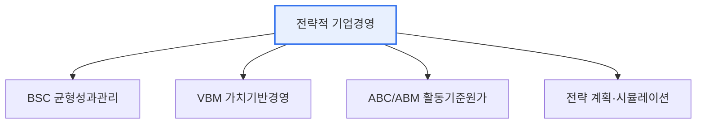

# 전략적 기업경영(SEM, Strategic Enterprise Management)

## 1. 개요

### 가. 정의
> 기업의 **전략 수립부터 실행·성과 측정·피드백까지의 전 과정을 정보시스템으로 통합 지원**하여, 전략 목표 달성을 체계적으로 관리하는 경영 기법이자 시스템. 전략을 실행 가능한 지표와 활동으로 연결한다.

SEM이 등장한 근본 배경은 '**좋은 전략이 실행에서 번번이 실패한다**'는 오랜 문제였다. 경영진이 훌륭한 전략을 세워도, 그것이 현장의 구체적 활동과 성과 측정으로 연결되지 않으면 액자 속 구호에 그친다. 실제로 많은 연구가 전략 실패의 대부분이 전략 자체의 결함이 아니라 실행의 실패임을 보여준다. SEM은 이 '전략과 실행 사이의 간극'을 메우는 도구다. 추상적 전략을 BSC 같은 성과관리 체계로 구체적 지표와 활동으로 번역하고, 정보시스템으로 그 진척을 실시간 모니터링하여, 전략이 현장에서 실제로 작동하는지를 관리한다.

### 나. 필요성
경영 환경이 복잡하고 빠르게 변할수록, 직관이 아니라 데이터에 근거해 전략의 실행을 추적하고 즉시 조정하는 역량이 경쟁력을 좌우한다. SEM은 이 데이터 기반 전략 실행·환류의 인프라를 제공한다.

## 2. 구성요소

SEM은 여러 경영 기법을 정보시스템으로 통합한다. **BSC(균형성과표)** 는 재무·고객·내부프로세스·학습성장의 네 관점에서 전략을 균형 있게 측정해, 단기 재무성과에만 매몰되지 않도록 한다. **VBM(가치기반경영)** 은 기업가치(EVA 등)를 중심으로 의사결정을 정렬한다. **ABC/ABM(활동기준원가)** 은 활동 단위로 원가를 분석해 어디서 가치가 창출·소모되는지를 밝힌다. **전략 계획·시뮬레이션** 은 시나리오 기반으로 계획을 수립·검증한다.

| 구성요소 | 내용 |
|---|---|
| **BSC** | 재무·고객·프로세스·학습성장 4관점 성과 관리 |
| **VBM** | 기업가치(EVA) 중심 의사결정 |
| **ABC/ABM** | 활동 단위 원가 분석·관리 |
| **전략 시뮬레이션** | 시나리오·예측 기반 계획 |

## 3. 구축 방안 및 절차

SEM 구축의 핵심은 추상적 전략을 측정 가능한 지표로 단계적으로 내려가며 번역하는 것이다. 먼저 비전·전략 목표를 정의하고, 그 목표 달성에 결정적인 **핵심성공요인(CSF)** 을 도출한 뒤, 이를 정량 지표인 **KPI** 로 만들어 BSC 4관점에 배치한다. 그다음 ERP·DW 등 데이터 원천과 연계해 대시보드·리포팅 시스템을 구축하고, 성과를 모니터링하며 결과를 전략 조정에 환류한다.

| 절차 | 내용 |
|---|---|
| **전략 수립** | 비전·미션·전략 목표 정의 |
| **CSF·KPI 도출** | 핵심성공요인과 성과지표 설계 |
| **BSC 구성** | 4관점 목표·지표·이니셔티브 연계 |
| **시스템 구축** | 데이터 연계, 대시보드·리포팅 |
| **모니터링·환류** | 성과 측정, 전략 조정 |

## 4. 고려사항 및 시사점

1. **전략과 실행의 정렬(Alignment)이 SEM의 핵심 가치**다. 조직 상위 전략이 하위 부서·개인의 KPI까지 일관되게 연결(Cascading)되어야 전략이 실제로 실행된다.
2. **ERP·데이터웨어하우스·BI와의 연계**가 실시간 성과관리를 가능하게 한다. 데이터가 자동으로 지표에 반영되지 않으면 SEM은 수작업 보고서에 머문다.
3. **데이터·AI 기반 예측 경영과 ESG로 확장**되고 있다. 과거 성과 측정을 넘어 미래를 예측하고, 재무 지표에 ESG 비재무 지표를 통합해 지속가능경영을 관리하는 방향으로 진화한다.

---

> **한 줄 요약**: SEM은 *전략 수립→BSC·VBM·ABC로 구체화→시스템 구축→모니터링·환류* 를 통해 전략과 실행을 정렬하고 성과를 통합 관리하는 경영 기법으로, CSF·KPI 설계와 ERP·BI 연계로 데이터 기반 전략 실행을 실현한다.
