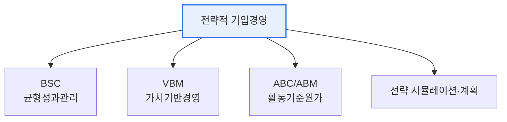

# 전략적 기업경영(SEM, Strategic Enterprise Management)

## 1. 개요

### 가. 정의
> 기업의 **전략 수립부터 실행·성과 측정·피드백까지를 정보시스템으로 통합 지원**하여, 전략 목표 달성을 체계적으로 관리하는 경영 기법·시스템. 전략을 실행 가능한 지표와 활동으로 연결한다.

SEM이 등장한 배경은 '**좋은 전략이 실행에서 실패하는**' 문제였다. 훌륭한 전략을 세워도 현장 활동·성과 측정과 연결되지 않으면 구호에 그친다. SEM은 전략을 BSC 같은 성과관리 체계로 구체화하고, 정보시스템으로 실시간 모니터링해 '전략-실행-성과'의 간극을 메운다.

## 2. 구성요소 (나)

| 구성요소 | 내용 |
|---|---|
| **BSC(균형성과표)** | 재무·고객·프로세스·학습성장 4관점 성과 관리 |
| **VBM(가치기반경영)** | 기업가치(EVA) 중심 의사결정 |
| **ABC/ABM(활동기준원가)** | 활동 단위 원가 분석·관리 |
| **전략 계획·시뮬레이션** | 시나리오·예측 기반 계획 수립 |

## 3. 구축 방안 및 절차 (다)

| 절차 | 내용 |
|---|---|
| **전략 수립** | 비전·미션·전략 목표 정의 |
| **CSF·KPI 도출** | 핵심성공요인과 성과지표 설계 |
| **BSC 구성** | 4관점 목표·지표·이니셔티브 연계 |
| **시스템 구축** | 데이터 연계, 대시보드·리포팅 |
| **모니터링·환류** | 성과 측정, 전략 조정 |

## 4. 시사점
- 전략과 실행의 **정렬(Alignment)** 이 SEM의 핵심 가치
- ERP·데이터웨어하우스·BI와 연계해 실시간 성과관리
- 최근 데이터·AI 기반 예측 경영, ESG 지표 통합으로 확장

---

> **한 줄 요약**: SEM은 *전략 수립→BSC·VBM·ABC로 구체화→시스템 구축→모니터링·환류* 를 통해 전략과 실행을 정렬하고 성과를 통합 관리하는 전략적 경영 기법이다.
