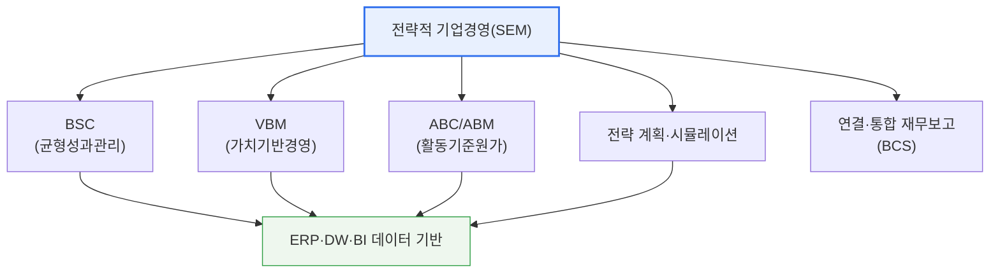

# 전략적 기업경영(SEM, Strategic Enterprise Management)

## 1. 개요

### 가. 정의
> SEM은 기업의 **전략 수립부터 실행·성과 측정·피드백까지의 전 과정을 정보시스템으로 통합 지원**하여, 전략 목표의 달성을 체계적으로 관리하는 경영 기법이자 그 기법을 구현한 시스템이다. 추상적인 전략을 실행 가능한 지표(KPI)와 구체적 활동으로 번역하고, 그 진척을 데이터로 추적·환류하는 것이 본질이다.

SEM이 등장한 근본 배경은 '**좋은 전략이 실행 단계에서 번번이 실패한다**'는 오랜 경영 문제였다. 경영진이 아무리 훌륭한 전략을 세워도, 그것이 현장의 구체적 활동과 성과 측정으로 연결되지 않으면 회의실 벽에 걸린 액자 속 구호에 그친다. 실제로 다수의 경영 연구는 전략 실패의 상당 부분이 전략 자체의 결함이 아니라 '실행(execution)의 실패'에서 비롯된다고 지적한다. 캐플런과 노턴이 관찰한 바에 따르면, 많은 조직에서 구성원 대다수가 자기 회사의 전략을 제대로 이해하지 못하고, 예산·성과보상 체계가 전략과 따로 놀며, 경영진조차 전략 실행 상황을 검토하는 데 충분한 시간을 쓰지 못한다.

SEM은 바로 이 '**전략과 실행 사이의 간극(strategy-execution gap)**'을 메우기 위해 고안되었다. 1990년대 후반 ERP 도입이 확산되면서 기업 내부에 방대한 운영 데이터가 축적되었고, 이 데이터를 전략 관점에서 재해석해 경영진의 의사결정으로 연결하려는 요구가 커졌다. SAP가 'SEM'이라는 제품군을 내놓으며 용어가 대중화되었지만, 개념적으로는 BSC·VBM·ABC 같은 전략 관리 기법을 정보시스템으로 통합한 것이 핵심이다. 즉 SEM은 특정 제품이 아니라 "전략을 데이터로 관리한다"는 경영 패러다임에 가깝다.

### 나. 등장 배경과 필요성
경영 환경이 복잡하고 빠르게 변할수록, 경영자의 직관과 연말 결산 보고서에 의존하는 사후적 관리로는 대응이 늦다. 시장·경쟁·규제가 실시간으로 변하는 환경에서는 전략의 실행 상황을 상시 추적하고, 목표와 실적의 차이가 감지되는 즉시 원인을 분석해 전략을 조정하는 역량이 경쟁력을 좌우한다. SEM은 이러한 **데이터 기반 전략 실행·환류(feedback)의 인프라**를 제공한다.

특히 재무제표 같은 후행 지표(lagging indicator)만으로는 기업의 미래 성과를 예측하거나 견인할 수 없다는 인식이 SEM의 필요성을 뒷받침한다. 이번 분기 매출은 지난 여러 분기의 고객 만족, 프로세스 품질, 직원 역량 투자의 '결과'일 뿐이다. SEM은 이런 선행 지표(leading indicator)까지 균형 있게 측정해, 재무 성과가 나빠지기 전에 그 원인이 되는 활동을 관리하도록 돕는다. 이 점이 단순한 재무 관리 시스템이나 BI 도구와 SEM을 구분 짓는 지점이다.

## 2. 구성요소

SEM은 여러 전략 경영 기법을 정보시스템으로 통합한 것으로, 각 기법이 전략 관리의 서로 다른 측면을 담당한다. 아래 개념도는 SEM을 구성하는 핵심 기법들과 그 관계를 보여준다.

```mermaid
flowchart TB
  SEM["전략적 기업경영(SEM)"] --> B["BSC<br/>(균형성과관리)"]
  SEM --> V["VBM<br/>(가치기반경영)"]
  SEM --> A["ABC/ABM<br/>(활동기준원가)"]
  SEM --> P["전략 계획·시뮬레이션"]
  SEM --> C["연결·통합 재무보고<br/>(BCS)"]
  B --> DATA["ERP·DW·BI 데이터 기반"]
  V --> DATA
  A --> DATA
  P --> DATA
  style SEM fill:#e8f0fe,stroke:#2f6fed,stroke-width:2px
  style DATA fill:#eef7ee,stroke:#2f9e44
```

**BSC(Balanced Scorecard, 균형성과표)** 는 SEM의 중심축이다. 재무·고객·내부프로세스·학습성장의 네 관점에서 전략을 균형 있게 측정해, 단기 재무성과에만 매몰되는 것을 막는다. 예컨대 재무 관점의 '매출 성장'이라는 목표는 고객 관점의 '고객 만족도', 프로세스 관점의 '납기 준수율', 학습성장 관점의 '직원 숙련도'라는 선행 요인들과 인과적으로 연결된다. BSC는 이 네 관점의 목표를 **전략 지도(Strategy Map)** 로 시각화해, 하위 활동이 어떻게 최종 재무 성과로 이어지는지를 한눈에 보여준다.

**VBM(Value-Based Management, 가치기반경영)** 은 기업가치의 극대화를 모든 의사결정의 기준으로 삼는 기법이다. 대표 지표인 **EVA(경제적 부가가치)** 는 세후영업이익에서 투입 자본에 대한 자본비용을 차감해 산출하는데, 이는 회계상 이익이 나더라도 자본비용을 넘어서지 못하면 실질적으로 가치를 파괴한 것이라는 관점을 반영한다. 예를 들어 어떤 사업부가 세후영업이익 100억 원을 냈더라도, 투입 자본 1,000억 원에 자본비용률(WACC) 12%를 적용한 자본비용 120억 원을 차감하면 EVA는 −20억 원이 된다. 즉 회계상으로는 흑자지만 자본을 대는 주주 관점에서는 20억 원의 가치를 파괴한 것이다. VBM은 이렇게 사업부·프로젝트별로 진짜 가치를 창출하는 곳과 자본을 소모하는 곳을 구분해 자원 배분을 최적화한다.

**ABC/ABM(Activity-Based Costing/Management, 활동기준원가)** 은 원가를 제품이나 부서가 아니라 '활동' 단위로 추적한다. 전통적 원가계산은 간접비를 매출이나 인원수 같은 단일 기준으로 배부해 실제 원가를 왜곡하지만, ABC는 각 활동이 소비하는 자원을 인과적으로 배부해 어떤 제품·고객·채널이 실제로 돈을 벌고 어디서 원가가 새는지를 밝힌다.

예를 들어 매출은 크지만 잦은 소량 주문·반품·특별 배송을 요구하는 고객은, 전통적 원가계산에서는 우량 고객으로 보이지만 ABC로 활동 원가를 배부하면 오히려 적자 고객일 수 있다. ABM(활동기준관리)은 이런 분석 결과를 토대로 비부가가치 활동을 제거·개선하고, 수익성 낮은 제품·고객 포트폴리오를 재조정한다. 이렇게 ABC/ABM은 VBM의 가치 판단과 BSC의 프로세스 관점에 정확한 원가 정보를 공급하는 기반이 된다.

**전략 계획·시뮬레이션(BPS, Business Planning & Simulation)** 은 시나리오 기반으로 계획을 수립·검증한다. 'What-if' 분석으로 환율·원자재가·수요 변동 등 가정을 바꿔가며 전략의 재무적 결과를 예측하고, 롤링 예측(rolling forecast)으로 계획을 상시 갱신한다. 전통적 연간 예산이 한 번 확정되면 환경이 바뀌어도 경직적으로 유지되는 것과 달리, BPS는 예측을 주기적으로 갱신해 계획과 실행의 괴리를 줄인다. 이 네 기법은 서로 독립적이지 않고 하나의 데이터 기반 위에서 맞물려 작동한다는 점이 SEM의 통합적 성격을 보여준다.

| 구성요소 | 관장 영역 | 대표 지표·산출물 |
|---|---|---|
| **BSC** | 4관점 균형 성과 측정, 전략 가시화 | KPI, 전략 지도 |
| **VBM** | 기업가치 중심 의사결정 | EVA, ROIC, MVA |
| **ABC/ABM** | 활동 단위 원가 분석·개선 | 활동원가, 원가동인 |
| **전략 시뮬레이션(BPS)** | 시나리오 계획·예측 | What-if, 롤링 예측 |

## 3. 구축 방안 및 절차

SEM 구축의 핵심은 추상적 비전을 측정 가능한 지표로 단계적으로 내려가며(cascading) 번역하고, 그 지표를 실제 데이터와 연결해 자동으로 추적·환류하는 순환 고리를 만드는 것이다. 아래는 그 절차를 나타낸 개념도다.

```mermaid
flowchart LR
  A["1.전략 수립<br/>(비전·미션)"] --> B["2.CSF 도출<br/>(핵심성공요인)"]
  B --> C["3.KPI·BSC 설계<br/>(4관점 지표)"]
  C --> D["4.시스템 구축<br/>(ERP·DW·대시보드)"]
  D --> E["5.모니터링·측정"]
  E --> F["6.분석·피드백"]
  F -. "전략 조정(환류)" .-> A
  style C fill:#e8f0fe,stroke:#2f6fed,stroke-width:2px
  style F fill:#eef7ee,stroke:#2f9e44
```

먼저 **전략 수립** 단계에서 비전·미션과 중장기 전략 목표를 정의한다. 이때 전략은 선언적 구호가 아니라 "누구에게, 어떤 가치를, 어떻게 제공해 어떤 재무 성과를 낼 것인가"라는 구체적 논리(전략 지도)로 표현되어야 이후 단계에서 지표화가 가능하다.

다음으로 각 전략 목표의 달성에 결정적인 **핵심성공요인(CSF, Critical Success Factor)** 을 도출한다. 예를 들어 '고객 충성도 강화'가 목표라면 '신속한 A/S 대응', '개인화 서비스' 같은 것이 CSF가 된다. 이어 CSF를 정량적으로 측정할 **KPI(핵심성과지표)** 로 변환해 BSC 4관점에 배치한다. 이 과정에서 KPI가 너무 많으면 초점이 흐려지고, 통제 불가능한 지표를 담당자에게 부과하면 저항을 부르므로, 소수의 핵심 지표에 집중하고 책임 소재를 명확히 하는 설계가 중요하다.

**시스템 구축** 단계에서는 ERP·데이터웨어하우스(DW) 등 데이터 원천과 연계해 KPI가 자동으로 산출되는 대시보드·리포팅 체계를 만든다. 이 자동화가 SEM의 성패를 가른다. 만약 지표 값을 담당자가 매달 수작업 스프레드시트로 집계해야 한다면, SEM은 곧 형식적 보고 절차로 전락하고 데이터의 신뢰성과 적시성이 무너진다. 마지막으로 성과를 **모니터링·측정**하고 목표와의 차이를 **분석**해, 그 결과를 다음 전략 수립에 **환류**하는 순환을 확립한다.

여기서 환류(feedback)의 성격을 구분하는 것이 중요하다. 목표와 실적의 차이를 보고 활동을 조정하는 것은 정해진 전략 안에서의 **단일 고리 학습(single-loop learning)** 이다. 그러나 성과가 나쁜 원인이 실행이 아니라 전략의 전제 자체가 틀렸기 때문일 수도 있다. 예컨대 '고객 만족을 높이면 매출이 오른다'는 가정이 데이터로 뒷받침되지 않는다면, 활동을 더 열심히 하는 것이 아니라 전략 지도의 인과 가설 자체를 수정해야 한다. 이처럼 전략의 전제를 되묻는 **이중 고리 학습(double-loop learning)** 을 지원하는 것이 SEM을 단순한 성과 측정 도구와 구분 짓는 지점이다. 잘 설계된 SEM은 정기 전략 검토 회의에서 KPI 데이터를 근거로 "우리의 전략 가설이 여전히 유효한가"를 검증하고, 필요하면 전략 자체를 갱신하는 조직 학습의 장을 제공한다.

| 절차 | 핵심 내용 | 산출물 |
|---|---|---|
| **1. 전략 수립** | 비전·미션·전략 목표 정의 | 전략 지도 |
| **2. CSF 도출** | 목표별 핵심성공요인 식별 | CSF 목록 |
| **3. KPI·BSC 설계** | 4관점 지표·목표치·이니셔티브 | 스코어카드 |
| **4. 시스템 구축** | ERP·DW 연계, 대시보드 | SEM 시스템 |
| **5~6. 모니터링·환류** | 성과 측정·분석, 전략 조정 | 성과 리포트 |

## 4. 유사 개념 비교 및 적용 사례

SEM은 종종 ERP·BI·EPM(Enterprise Performance Management)과 혼동된다. **ERP**가 주문·생산·회계 같은 '운영 거래를 처리'하는 시스템이라면, SEM은 그 운영 데이터를 '전략 관점에서 해석·관리'하는 상위 계층이다. **BI**는 데이터를 조회·시각화하는 분석 도구로 SEM의 구현 수단이 되지만, BI 자체에는 BSC·전략 지도 같은 전략 관리 방법론이 내장되어 있지 않다. 오늘날 상용 시장에서는 SEM과 사실상 같은 개념을 **EPM/CPM(Corporate Performance Management)** 이라 부르며, 계획·예산(FP&A), 연결 결산, 성과 관리를 아우르는 통합 플랫폼으로 진화했다.

두 접근의 차이가 실무에 주는 함의는 명확하다. ERP·BI만 갖춘 조직은 데이터는 많지만 "그래서 전략이 잘 실행되고 있는가"라는 질문에 답하기 어렵다. SEM은 데이터를 전략 목표에 연결하는 방법론을 더함으로써 이 질문에 답할 수 있게 한다.

| 구분 | 주요 목적 | 시간 관점 | 내장 방법론 |
|---|---|---|---|
| **ERP** | 운영 거래 처리(주문·생산·회계) | 현재(실시간 처리) | 업무 프로세스 |
| **BI** | 데이터 조회·시각화·분석 | 과거·현재 | 없음(도구) |
| **SEM/EPM** | 전략 실행·성과 관리·계획 | 과거~미래(예측·환류) | BSC·VBM·ABC·계획 |

이 표에서 보듯 세 시스템은 대체재가 아니라 계층적 보완재다. ERP가 신뢰할 수 있는 운영 데이터를 만들고, BI가 그것을 가공·시각화하며, SEM/EPM이 전략 방법론을 얹어 의사결정으로 연결한다. 따라서 SEM 도입은 ERP·BI 기반이 성숙한 조직에서 그 위에 얹을 때 가장 효과적이다.

구체적 사례로, 캐플런과 노턴이 소개한 미국의 한 정유회사(모빌 북미 정제·판매 부문)는 BSC 도입 후 수년간 업계 최하위에서 최상위 수익성으로 도약한 것으로 잘 알려져 있다. 핵심은 '연료 그 자체'가 아니라 '편의점·빠른 결제 같은 부가 서비스'를 원하는 고객 세그먼트를 재무-고객-프로세스-학습 관점의 인과 사슬로 연결해 전 조직의 활동을 재정렬한 데 있었다. 재무 관점의 '자본수익률(ROCE) 향상'이라는 최상위 목표가, 고객 관점의 '목표 고객 만족'과 '딜러 관계 강화'로, 다시 프로세스 관점의 '안전·품질'과 '신제품 개발'로, 최종적으로 학습성장 관점의 '직원 역량과 전략 인식'으로 하향 전개된 것이 그 인과 사슬의 골격이었다.

국내에서도 다수의 대기업과 공공기관이 BSC 기반 성과관리를 도입해, 전략 목표를 사업부·개인의 KPI까지 연계(cascading)하고 성과급 체계와 연동한 사례가 축적되어 있다. 특히 공공기관은 기획재정부의 경영평가 체계와 맞물려 BSC형 성과지표를 광범위하게 활용해 왔다. 다만 KPI를 성과급에만 기계적으로 연동하면 지표 조작·단기주의를 유발할 수 있어, 학습·개선 목적과 균형을 맞추는 설계가 성공 요인으로 지적된다. 성공한 조직과 실패한 조직을 가르는 결정적 차이는 시스템의 정교함이 아니라, 경영진이 SEM 데이터를 정기 전략 대화에 실제로 사용했는지 여부라는 점이 여러 사례에서 공통적으로 관찰된다.

## 5. 심화 — 최신 동향과 진화 방향

첫째, SEM은 과거 성과의 '측정'을 넘어 미래의 '예측'으로 무게중심을 옮기고 있다. 데이터·AI 기술의 발전으로 단순 KPI 대시보드를 넘어, 수요·매출·리스크를 예측하고 최적 시나리오를 제안하는 **예측적·처방적 분석(predictive/prescriptive analytics)** 이 SEM에 통합되고 있다. 롤링 예측과 결합한 이런 접근은 연 1회 예산 편성의 경직성을 극복하고, 환경 변화에 상시 대응하는 '연속 계획(continuous planning)'을 가능하게 한다.

둘째, **ESG·지속가능경영 지표의 통합**이 두드러진다. 전통적 SEM이 재무 중심이었다면, 이제는 탄소배출·다양성·지배구조 같은 비재무 지표를 BSC에 편입해 기업가치와 함께 관리하는 방향으로 확장되고 있다. EU의 CSRD, 국내외 공시 의무 강화로 ESG 데이터의 측정·보고가 규제 요구사항이 되면서, SEM/EPM 플랫폼이 ESG 성과관리의 인프라 역할을 맡는 추세다.

셋째, **클라우드 EPM으로의 전환**이 가속화되고 있다. 온프레미스 중심이던 SEM은 SaaS형 EPM(예: 클라우드 기반 계획·연결결산 솔루션)으로 이동하며, 도입 기간 단축과 실시간 협업 계획을 지원한다. 기술사 관점에서는 이런 도구 선택보다, 조직의 전략 관리 성숙도와 데이터 거버넌스 수준에 맞는 단계적 도입이 성공의 관건임을 강조할 필요가 있다.

넷째, **부서 칸막이를 넘어서는 통합(xP&A)** 이 강조된다. 과거에는 재무 계획, 영업 계획, 인력 계획, 공급망 계획이 서로 다른 부서에서 별도 도구로 수립되어 가정이 어긋나는 문제가 잦았다. 최근의 확장 계획(Extended Planning & Analysis)은 이들을 하나의 데이터 모델에서 연결해, 영업 계획의 변화가 곧바로 인력·재무·공급망 계획에 반영되도록 한다. 이는 SEM이 지향해 온 '전사적 정렬'을 계획 수립 단계에서부터 구현하려는 시도로, 예측적 분석·ESG 통합과 맞물려 SEM/EPM의 다음 진화 방향을 보여준다.

## 6. 고려사항 및 시사점

1. **전략과 실행의 정렬(Alignment)이 SEM의 핵심 가치다.** 상위 조직 전략이 하위 부서·개인의 KPI까지 일관되게 연결(Cascading)되어야 전략이 현장에서 실제로 실행된다. 정렬이 깨지면 각 부서가 국지적 지표만 최적화하는 '부분 최적화의 함정'에 빠지므로, 전략 지도를 통해 지표 간 인과관계를 명확히 하는 것이 중요하다.

2. **데이터 연계와 거버넌스가 실시간 성과관리의 전제다.** ERP·DW·BI와의 자동 연계가 없으면 SEM은 수작업 보고서로 전락한다. 나아가 지표 정의의 일관성, 데이터 품질·소유권을 관리하는 데이터 거버넌스가 뒷받침되어야 지표에 대한 조직의 신뢰가 확보된다.

3. **소수의 올바른 지표에 집중하고 지표의 역기능을 경계해야 한다.** 지나치게 많은 KPI는 초점을 흐리고, 측정하기 쉬운 것만 측정하거나 성과급에 기계적으로 연동하면 지표 조작·단기주의를 유발한다. 통제 가능성과 전략적 중요도를 기준으로 지표를 선별하고, 정성적 판단과 균형을 맞추는 설계가 필요하다.

4. **도입은 기술이 아니라 변화관리(Change Management)의 문제다.** SEM은 시스템 구축보다 경영진의 지속적 관여, 전략 커뮤니케이션, 성과 대화 문화의 정착이 성패를 좌우한다. 최고경영진이 정기 전략 검토 회의에서 SEM 데이터를 실제로 활용하지 않으면 시스템은 곧 방치된다.

5. **AI·ESG 통합과 클라우드 전환을 전략적으로 준비한다.** 예측·처방 분석과 ESG 비재무 지표를 SEM에 단계적으로 통합하고, 조직의 성숙도에 맞춰 클라우드 EPM 전환을 검토하되, 도구 도입 자체가 목적이 되지 않도록 전략 관리 역량의 내재화를 우선한다.

## 참고자료
- R. Kaplan & D. Norton, "The Balanced Scorecard": https://hbr.org/1992/01/the-balanced-scorecard-measures-that-drive-performance-2
- R. Kaplan & D. Norton, "The Strategy-Focused Organization" 개념 소개(HBR): https://hbr.org/2000/09/having-trouble-with-your-strategy-then-map-it

---

> **한 줄 요약**: SEM은 *전략 수립→CSF·KPI·BSC로 구체화→ERP·DW 연계 시스템 구축→모니터링·환류* 의 순환을 통해 전략과 실행을 정렬하고 성과를 통합 관리하는 경영 기법으로, BSC·VBM·ABC/ABM을 축으로 하며 데이터 거버넌스·변화관리와 함께 AI 예측·ESG 통합·클라우드 EPM으로 진화하고 있다.
