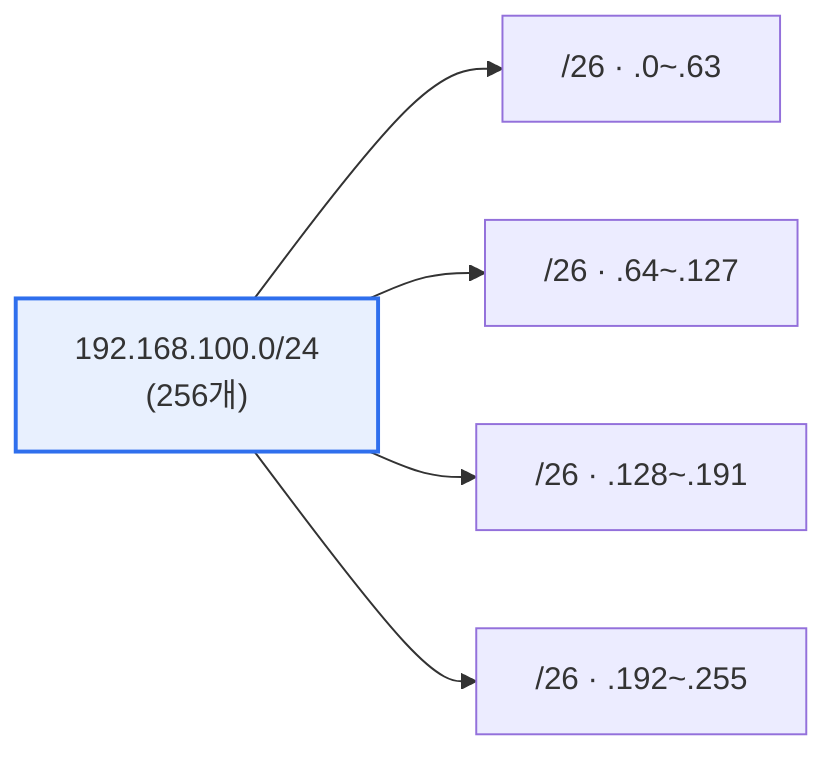

# 네트워크 서브네팅과 수퍼네팅

## 1. 개요

### 가. 정의
> **서브네팅(Subnetting)** 은 하나의 큰 네트워크를 **여러 개의 작은 서브넷으로 분할**하는 것이고, **수퍼네팅(Supernetting)** 은 여러 개의 작은 네트워크를 **하나의 큰 네트워크로 통합**하는 것이다. 둘 다 IP 주소를 효율적으로 관리한다.

서브네팅이 필요한 이유는 'IP 주소 낭비 방지와 브로드캐스트 도메인 축소'다. 하나의 대역을 그대로 쓰면 주소가 낭비되고 브로드캐스트가 과다해진다. 서브네팅은 호스트 비트 일부를 네트워크 비트로 빌려(borrow) 대역을 나눈다. 수퍼네팅(CIDR)은 반대로 라우팅 테이블을 요약(Route Aggregation)해 효율을 높인다.

## 2. 수퍼네팅 vs 서브네팅 (1)

| 구분 | 서브네팅 | 수퍼네팅 |
|---|---|---|
| **방향** | 큰 망 → 작은 망(분할) | 작은 망 → 큰 망(통합) |
| **비트** | 호스트 비트를 네트워크로 차용 | 네트워크 비트를 호스트로 |
| **마스크** | 길어짐(prefix↑) | 짧아짐(prefix↓) |
| **목적** | 주소 효율·도메인 축소 | 라우팅 테이블 요약(CIDR) |

## 3. 서브네팅 실습: 192.168.100.0/24 → 4개 균등 분할 (2)

**절차**
1. 4개 서브넷 필요 → 4 = 2² 이므로 호스트 비트에서 **2비트를 차용**
2. 프리픽스: /24 + 2 = **/26**
3. 서브넷 마스크: /26 = `255.255.255.192` (마지막 옥텟 11000000 = 192)
4. 서브넷 크기(블록): 2^(32−26) = **64개 주소**씩

| 서브넷 | 네트워크 주소 | 범위 | 브로드캐스트 |
|---|---|---|---|
| 1 | 192.168.100.0/26 | .1 ~ .62 | .63 |
| 2 | 192.168.100.64/26 | .65 ~ .126 | .127 |
| 3 | 192.168.100.128/26 | .129 ~ .190 | .191 |
| 4 | 192.168.100.192/26 | .193 ~ .254 | .255 |

**서브넷 마스크 = 255.255.255.192**, **할당 가능 IP = 64 − 2(네트워크·브로드캐스트) = 62개**

## 4. 시사점
- VLSM(가변 길이 서브넷)으로 서브넷별 크기 차등 할당해 낭비 최소화
- CIDR(수퍼네팅)로 라우팅 확장성 확보, IPv6에서도 프리픽스 개념 계승

---

> **한 줄 요약**: 서브네팅은 호스트 비트를 차용해 망을 분할하고 수퍼네팅은 반대로 통합하며, 192.168.100.0/24를 4개로 나누면 *마스크 255.255.255.192(/26), 서브넷당 할당 가능 IP 62개* 가 된다.
