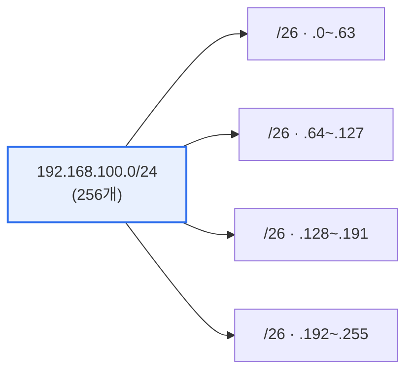

# 네트워크 서브네팅과 수퍼네팅

## 1. 개요

### 가. 정의
> **서브네팅(Subnetting)** 은 하나의 큰 네트워크를 **여러 개의 작은 서브넷으로 분할**하는 것이고, **수퍼네팅(Supernetting)** 은 여러 개의 작은 네트워크를 **하나의 큰 네트워크로 통합**하는 것이다. 둘 다 IP 주소를 효율적으로 관리하기 위한 기법이다.

서브네팅이 필요한 근본 이유는 'IP 주소 낭비를 막고 브로드캐스트 도메인을 적정 크기로 유지'하기 위함이다. 예를 들어 200대 규모의 부서 3개에 각각 254개 주소를 쓸 수 있는 대역을 통째로 주면 주소가 낭비되고, 하나의 큰 네트워크로 두면 브로드캐스트 트래픽이 과다해져 성능과 보안이 나빠진다. 서브네팅은 호스트에 쓰이던 비트 일부를 네트워크 비트로 빌려(borrow) 대역을 필요한 크기로 잘라 이 문제를 해결한다. 반대로 수퍼네팅(CIDR)은 인접한 여러 네트워크를 하나로 묶어 라우팅 테이블 항목을 줄이는(경로 요약) 기법으로, 라우터의 부담을 덜고 인터넷 확장성을 높인다.

## 2. 수퍼네팅 vs 서브네팅

| 구분 | 서브네팅 | 수퍼네팅 |
|---|---|---|
| **방향** | 큰 망 → 작은 망(분할) | 작은 망 → 큰 망(통합) |
| **비트 조작** | 호스트 비트를 네트워크로 차용 | 네트워크 비트를 호스트로 |
| **마스크** | 길어짐(prefix↑) | 짧아짐(prefix↓) |
| **목적** | 주소 효율·도메인 축소 | 라우팅 테이블 요약(CIDR) |

서브네팅은 네트워크 부분을 늘려(마스크가 길어져) 작은 망으로 쪼개고, 수퍼네팅은 네트워크 부분을 줄여(마스크가 짧아져) 큰 망으로 묶는다. 방향이 정반대다.

## 3. 서브네팅 실습: 192.168.100.0/24 → 4개 균등 분할

**분할 절차**를 단계별로 보면 다음과 같다.
1. 4개의 서브넷이 필요하다. 4 = 2² 이므로 **호스트 비트에서 2비트를 차용**해 네트워크 비트로 쓴다.
2. 프리픽스는 /24 + 2 = **/26** 이 된다.
3. 서브넷 마스크는 /26, 즉 앞 26비트가 1이다. 마지막 옥텟이 `11000000` = **192** 이므로 마스크는 **255.255.255.192**.
4. 각 서브넷의 크기(블록)는 2^(32−26) = **64개 주소** 씩이다.

| 서브넷 | 네트워크 주소 | 사용 가능 범위 | 브로드캐스트 |
|---|---|---|---|
| 1 | 192.168.100.0/26 | .1 ~ .62 | .63 |
| 2 | 192.168.100.64/26 | .65 ~ .126 | .127 |
| 3 | 192.168.100.128/26 | .129 ~ .190 | .191 |
| 4 | 192.168.100.192/26 | .193 ~ .254 | .255 |

각 서브넷의 64개 주소 중 첫 주소(네트워크 주소)와 마지막 주소(브로드캐스트 주소)는 호스트에 쓸 수 없으므로, **할당 가능한 IP는 64 − 2 = 62개** 다.

> **결과**: 서브넷 마스크 = **255.255.255.192(/26)**, 서브넷당 **할당 가능 IP = 62개**

## 4. 고려사항 및 시사점

1. **VLSM(가변 길이 서브넷 마스크)으로 낭비를 최소화**한다. 부서마다 필요한 호스트 수가 다르면 균등 분할 대신 크기를 차등 할당해 주소를 알뜰하게 쓴다.
2. **CIDR(수퍼네팅)로 라우팅 확장성을 확보**한다. 경로 요약으로 인터넷 백본 라우터의 테이블 크기를 줄여, IPv4 시대의 라우팅 폭증을 완화했다.
3. **IPv6에서도 프리픽스 개념이 계승**된다. 주소 고갈 문제는 IPv6로 근본 해결되지만, 프리픽스 길이로 네트워크를 구획하는 서브네팅 개념은 그대로 이어진다.

---

> **한 줄 요약**: 서브네팅은 호스트 비트를 차용해 망을 분할하고 수퍼네팅은 반대로 통합(CIDR)하며, 192.168.100.0/24를 4개로 균등 분할하면 2비트를 빌려 *마스크 255.255.255.192(/26), 서브넷당 할당 가능 IP 62개* 가 된다.
