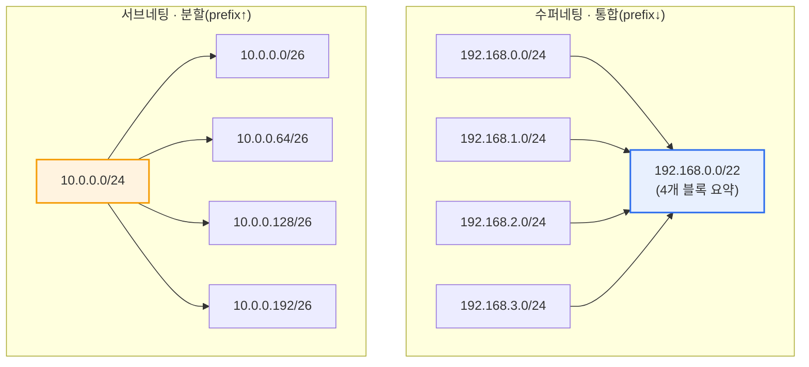
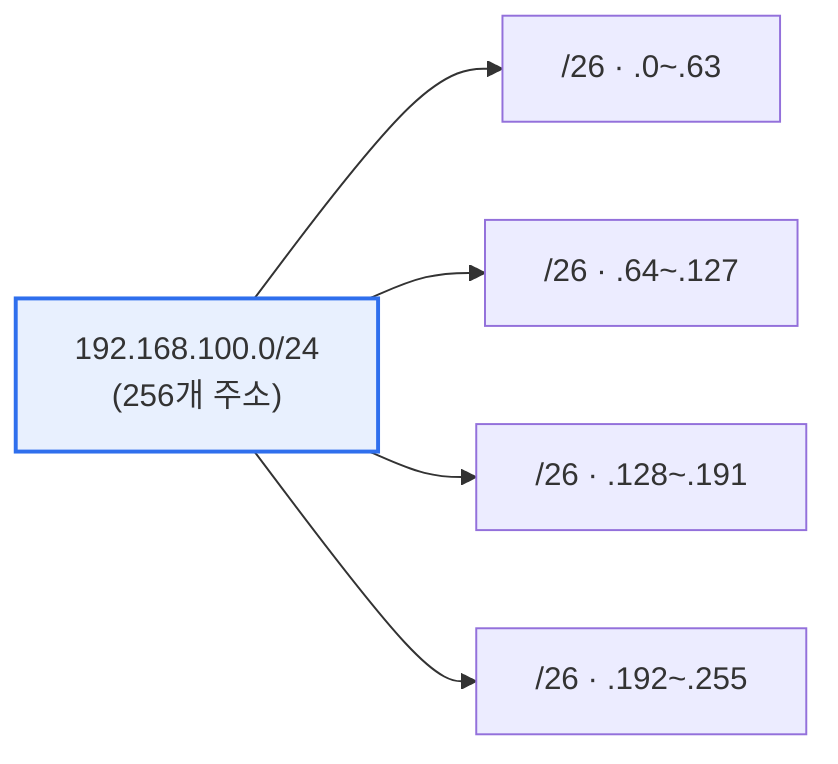

# 네트워크 서브네팅과 수퍼네팅

## 1. 개요

### 가. 정의
> **서브네팅(Subnetting)** 은 하나의 큰 네트워크를 **여러 개의 작은 서브넷으로 분할**하는 기법이고, **수퍼네팅(Supernetting)** 은 여러 개의 작은 네트워크를 **하나의 큰 네트워크로 통합(경로 요약)** 하는 기법이다. 둘 다 유한한 IPv4 주소 자원을 효율적으로 배분·관리하고 라우팅 부담을 줄이기 위한 상보적(相補的) 기술이다.

IP 주소는 본래 클래스(A/B/C) 단위로만 배분되었다. 클래스 기반 할당은 주소 경계가 8비트 단위로 고정되어 있어, 실제 필요 규모와 배분 단위 사이의 간극이 매우 컸다. 예컨대 300대의 호스트가 필요한 조직은 254개만 담기는 C 클래스(/24) 하나로는 부족해 6만 5천여 개가 담기는 B 클래스(/16)를 통째로 받아야 했고, 그 결과 6만 개가 넘는 주소가 사장(死藏)되었다. 반대로 10대 규모의 소규모 망에 C 클래스를 주면 244개가 낭비된다. 1990년대 초 이러한 낭비가 누적되면서 IPv4 주소 고갈이 현실적 위협으로 다가왔고, 동시에 인터넷 백본 라우터의 경로 테이블이 폭증(routing table explosion)해 라우터 메모리와 경로 계산 부담이 한계에 이르렀다.

서브네팅이 필요한 근본 이유는 이처럼 '**IP 주소 낭비를 막고 브로드캐스트 도메인을 적정 크기로 유지**'하는 데 있다. 하나의 큰 평면(flat) 네트워크에 수백~수천 대의 호스트를 그대로 두면, ARP·DHCP·라우팅 광고 같은 브로드캐스트 트래픽이 모든 노드에 전파되어 대역폭과 CPU를 잠식하고, 하나의 장애·보안 사고가 전체로 번지는 구조가 된다. 서브네팅은 호스트에 쓰이던 비트 일부를 네트워크 비트로 빌려(borrow) 대역을 필요한 크기로 잘라, 브로드캐스트 도메인을 격리하고 부서·용도·보안 등급별로 망을 구획한다. 이는 성능·보안·관리 편의를 동시에 개선하는 설계 행위다.

반대로 수퍼네팅은 인접한 여러 네트워크 블록을 하나의 짧은 프리픽스로 묶어 라우팅 테이블 항목을 줄이는(경로 요약, route aggregation) 기법으로, 이를 일반화한 것이 **CIDR(Classless Inter-Domain Routing, RFC 1518/1519, 현행 RFC 4632)** 이다. CIDR은 클래스 경계를 폐기하고 프리픽스 길이를 임의로 지정할 수 있게 하여, 주소를 필요한 만큼만 배분하고 상위 사업자가 하위 고객의 경로를 하나로 요약해 광고하도록 했다. 서브네팅과 수퍼네팅은 결국 '가변 길이 프리픽스'라는 하나의 원리를 각각 분할과 통합의 방향으로 적용한 것으로, IPv4의 수명을 20년 이상 연장한 핵심 기술이다.

### 나. 특징
서브네팅·수퍼네팅의 공통 특징은 첫째, **비트 단위의 유연성**이다. 클래스 경계(8비트)를 벗어나 1비트 단위로 네트워크·호스트 경계를 정할 수 있어, 필요 규모에 정밀하게 맞출 수 있다. 둘째, **계층성**이다. 상위 블록을 하위로 나누고 다시 그 하위를 또 나누는 재귀적 분할이 가능해, 조직 구조나 지리적 위계를 주소 체계에 그대로 반영할 수 있다. 셋째, **양방향성**이다. 같은 원리를 분할(서브네팅)과 통합(수퍼네팅) 양방향으로 적용하므로, 조직 내부에서는 잘게 나누고 백본에서는 크게 묶는 계층적 주소 설계가 자연스럽게 구현된다.

### 다. 필요성
정리하면 서브네팅·수퍼네팅은 (1) **주소 효율**(필요 규모에 맞춘 배분으로 낭비 최소화), (2) **성능·보안**(브로드캐스트 도메인 축소와 망 격리), (3) **라우팅 확장성**(경로 요약으로 백본 테이블 억제)이라는 세 가지 요구를 동시에 충족한다. 이 세 요구는 조직 내부(서브네팅)와 인터넷 백본(수퍼네팅)이라는 서로 다른 계층에서 발생하지만, 모두 '비트 단위로 프리픽스를 조정한다'는 동일한 메커니즘으로 해결된다.

## 2. 서브네팅과 수퍼네팅의 원리 비교

```mermaid
flowchart TB
  subgraph SUP["수퍼네팅 · 통합(prefix↓)"]
    C1["192.168.0.0/24"] --> AG["192.168.0.0/22<br/>(4개 블록 요약)"]
    C2["192.168.1.0/24"] --> AG
    C3["192.168.2.0/24"] --> AG
    C4["192.168.3.0/24"] --> AG
  end
  subgraph SUB["서브네팅 · 분할(prefix↑)"]
    B0["10.0.0.0/24"] --> B1["10.0.0.0/26"]
    B0 --> B2["10.0.0.64/26"]
    B0 --> B3["10.0.0.128/26"]
    B0 --> B4["10.0.0.192/26"]
  end
  style AG fill:#e8f0fe,stroke:#2f6fed,stroke-width:2px
  style B0 fill:#fff3e0,stroke:#f59e0b,stroke-width:2px
```

서브네팅의 본질은 **네트워크 부분을 늘리는 것**이다. 호스트 비트에서 몇 개를 네트워크 쪽으로 옮기면 프리픽스가 길어지고(마스크가 길어지고), 그만큼 표현 가능한 서브넷 개수는 늘지만 서브넷당 호스트 수는 줄어든다. 반대로 수퍼네팅은 **네트워크 부분을 줄이는 것**으로, 여러 연속 블록의 공통 상위 비트만 남기고 프리픽스를 짧게 만들어 하나의 경로로 표현한다. 두 기법은 프리픽스를 늘리느냐 줄이느냐만 다를 뿐, 모두 '경계를 8비트 클래스에서 임의 비트로 해방했다'는 CIDR 사상 위에 서 있다.

| 구분 | 서브네팅 | 수퍼네팅 |
|---|---|---|
| **방향** | 큰 망 → 작은 망(분할) | 작은 망 → 큰 망(통합) |
| **비트 조작** | 호스트 비트를 네트워크로 차용 | 네트워크 비트를 호스트로 반환 |
| **마스크(프리픽스)** | 길어짐(prefix↑) | 짧아짐(prefix↓) |
| **주 목적** | 주소 효율·브로드캐스트 도메인 축소·망 격리 | 라우팅 테이블 요약(CIDR)·경로 광고 축소 |
| **적용 위치** | 조직 내부 망 설계 | 사업자·백본 라우팅 |
| **대표 사례** | VLSM 부서 분할 | ISP의 고객 대역 집약(aggregation) |

서브네팅과 수퍼네팅이 정반대 방향인 이유는 프리픽스 경계가 이동하는 방향이 반대이기 때문이다. 서브네팅은 마스크의 1비트가 오른쪽으로 확장(호스트 잠식)되고, 수퍼네팅은 왼쪽으로 후퇴(네트워크 반환)한다. 실무에서는 조직이 상위 사업자로부터 CIDR 블록(예: /20)을 받아 이를 내부에서 서브네팅(/24, /26 등)으로 잘게 나누고, 사업자는 다시 여러 고객 블록을 수퍼네팅해 백본에 광고하는 식으로 두 기법이 계층적으로 맞물린다.

## 3. 서브네팅 실습: 192.168.100.0/24 → 4개 균등 분할

```mermaid
flowchart LR
  N["192.168.100.0/24<br/>(256개 주소)"] --> S1["/26 · .0~.63"]
  N --> S2["/26 · .64~.127"]
  N --> S3["/26 · .128~.191"]
  N --> S4["/26 · .192~.255"]
  style N fill:#e8f0fe,stroke:#2f6fed,stroke-width:2px
```

서브네팅 계산은 '몇 개로 나눌 것인가'와 '각 조각에 몇 대가 필요한가' 중 하나를 출발점으로 삼는다. 여기서는 4개 균등 분할을 예로 든다. 핵심 원리는 **필요한 서브넷 수를 2의 거듭제곱으로 올려 그 지수만큼 호스트 비트를 차용**한다는 것이다. 4개가 필요하면 4 = 2² 이므로 2비트를 차용하고, 5~8개가 필요하면 2³ = 8 이므로 3비트를 차용한다. 비트를 차용할수록 프리픽스가 길어지고 서브넷 크기는 절반씩 줄어든다.

**분할 절차**를 단계별로 보면 다음과 같다.
1. 4개의 서브넷이 필요하다. 4 = 2² 이므로 **호스트 비트에서 2비트를 차용**해 네트워크 비트로 쓴다.
2. 프리픽스는 /24 + 2 = **/26** 이 된다.
3. 서브넷 마스크는 /26, 즉 앞 26비트가 1이다. 마지막 옥텟이 `11000000` = **192** 이므로 마스크는 **255.255.255.192**.
4. 각 서브넷의 크기(블록)는 2^(32−26) = **64개 주소** 씩이다. 이때 64를 '블록 크기(block size)'라 하며, 서브넷 경계는 0, 64, 128, 192처럼 블록 크기의 배수로 떨어진다.

| 서브넷 | 네트워크 주소 | 사용 가능 범위 | 브로드캐스트 |
|---|---|---|---|
| 1 | 192.168.100.0/26 | .1 ~ .62 | .63 |
| 2 | 192.168.100.64/26 | .65 ~ .126 | .127 |
| 3 | 192.168.100.128/26 | .129 ~ .190 | .191 |
| 4 | 192.168.100.192/26 | .193 ~ .254 | .255 |

각 서브넷의 64개 주소 중 첫 주소(네트워크 주소)와 마지막 주소(브로드캐스트 주소)는 호스트에 쓸 수 없으므로, **할당 가능한 IP는 64 − 2 = 62개** 다. 네트워크 주소는 '이 서브넷 자체'를 가리키는 식별자이고 브로드캐스트 주소는 서브넷 내 전체 전송용이라 개별 호스트에 배정할 수 없다는 점이, 서브넷마다 2개씩 주소가 '세금'처럼 빠지는 이유다. 서브넷을 잘게 쪼갤수록 이 2개의 오버헤드가 반복 발생하므로, 지나치게 세분화하면 오히려 주소 효율이 떨어지는 트레이드오프가 생긴다.

> **결과**: 서브넷 마스크 = **255.255.255.192(/26)**, 서브넷당 **할당 가능 IP = 62개**

### 가. 역방향 계산: 필요 호스트 수 기준
실무에서는 '몇 개로 나눌까'보다 '한 서브넷에 몇 대가 필요한가'에서 출발하는 경우가 더 많다. 이때는 **필요 호스트 비트**를 먼저 구한다. 원리는 '2^(호스트 비트) − 2 ≥ 필요 호스트 수'를 만족하는 최소 호스트 비트 h를 찾는 것이다. 예를 들어 한 서브넷에 100대가 필요하다면, 2^6 − 2 = 62로는 부족하고 2^7 − 2 = 126이라야 담기므로 h = 7, 프리픽스는 32 − 7 = **/25** 가 된다. 반대로 30대가 필요하면 2^5 − 2 = 30이 딱 맞아 h = 5, /27 이다.

이처럼 서브넷 개수 기준(네트워크 비트 차용)과 호스트 수 기준(호스트 비트 확보)은 동전의 양면이다. 32비트를 네트워크 부분과 호스트 부분이 나눠 갖는 구조이므로, 한쪽을 정하면 다른 쪽이 자동으로 결정된다. 시험이나 설계에서 어느 기준으로 물어보든, '2의 거듭제곱과 프리픽스 길이'라는 하나의 관계식으로 환원해 계산하면 실수를 줄일 수 있다. 블록 크기(2^h)를 파악하면 네트워크 경계·브로드캐스트·사용 범위가 일사천리로 도출된다.

## 4. VLSM으로 낭비 최소화하기 (사례)

균등 분할은 계산이 쉽지만, 실제 조직의 부서 규모는 제각각이라 균등하게 자르면 오히려 낭비가 생긴다. 이를 해결하는 것이 **VLSM(Variable Length Subnet Mask, 가변 길이 서브넷 마스크)** 이다. VLSM은 하나의 블록을 서로 다른 프리픽스로 잘라, 큰 부서에는 큰 조각을, 작은 부서에는 작은 조각을 배정한다. 규칙은 '**호스트 수요가 큰 것부터 배치**'하는 것으로, 큰 조각을 먼저 떼어내야 주소 경계가 어긋나지 않는다.

예를 들어 192.168.100.0/24 하나로 (A) 60대, (B) 28대, (C) 12대, (D) 라우터 간 연결(2대) 망을 만든다고 하자. 60대는 62개가 담기는 **/26(64개)**, 28대는 30개가 담기는 **/27(32개)**, 12대는 14개가 담기는 **/28(16개)**, 점대점 링크는 2개가 담기는 **/30(4개)** 으로 배정한다. 각 요구에 '2의 거듭제곱 − 2 ≥ 필요 호스트 수'를 만족하는 최소 블록을 골라, A=.0/26(.0~.63), B=.64/27(.64~.95), C=.96/28(.96~.111), D=.112/30(.112~.115) 순으로 연속 배치하면, /24 한 개 안에서 서로 겹치지 않고 남는 대역(.116~.255)까지 추후 확장용으로 보존한다. 균등 분할이었다면 각 부서에 62개를 똑같이 주어 소규모 망에서 수십 개씩 낭비되었을 것이다. 이처럼 VLSM은 '필요한 만큼만' 배분해 주소 효율을 극대화하며, 오늘날 기업 네트워크 설계의 기본 원칙이다.

VLSM이 성립하려면 라우팅 프로토콜이 서브넷 마스크 정보를 함께 전달해야 한다. 초기 RIPv1처럼 클래스풀(classful) 프로토콜은 마스크를 광고하지 않아 서로 다른 프리픽스를 구분하지 못했고, 이 때문에 VLSM·CIDR을 지원하려면 RIPv2·OSPF·EIGRP·BGP처럼 프리픽스 길이를 함께 광고하는 클래스리스(classless) 프로토콜이 필요하다. 오늘날 사실상 모든 현대 라우팅 프로토콜이 클래스리스이므로 VLSM은 표준 설계 관행으로 자리 잡았다.

점대점 링크에 /30(호스트 2개)을 쓰는 것도 대표적 실무 관례다. 라우터와 라우터를 잇는 WAN 링크는 양 끝 2개의 주소만 필요하므로 /30이 딱 맞으며, IPv6나 최신 설계에서는 아예 낭비가 없는 **/31(RFC 3021, 브로드캐스트 없이 2개 주소를 모두 호스트로 사용)** 을 점대점에 쓰기도 한다. 이런 세밀한 조정이 누적되어 대규모 사업자망에서는 수천 개 링크의 주소 절감으로 이어진다.

## 5. 심화: CIDR·경로 요약과 IPv6로의 계승

수퍼네팅의 실무적 정수는 **경로 요약(route summarization)** 이다. ISP가 203.0.0.0/24부터 203.0.3.0/24까지 4개의 연속 블록을 고객에게 배분했다면, 백본에는 이를 4개로 광고하지 않고 공통 상위 22비트만 남긴 **203.0.0.0/22** 하나로 요약해 광고한다. 이렇게 하면 전 세계 라우터가 유지해야 할 경로 항목이 4분의 1로 줄고, 하위 블록에 장애가 생겨도 요약 경로는 흔들리지 않아 라우팅 안정성(경로 플래핑 억제)이 높아진다. CIDR 도입 이후에도 BGP 글로벌 라우팅 테이블은 계속 증가해 2020년대에 90만 경로를 넘어섰는데, 만약 클래스 기반 그대로였다면 이미 오래전에 라우터 하드웨어가 감당하지 못했을 것이다. 즉 CIDR·수퍼네팅은 '인터넷이 지금 규모로 성장할 수 있게 한' 기반 기술이라 평가된다.

경로 요약이 가능하려면 하위 블록들이 **연속적이고 정렬(aligned)** 되어 있어야 한다는 점이 실무의 핵심 제약이다. 예컨대 203.0.0.0/24와 203.0.3.0/24만 있고 중간의 .1, .2가 다른 조직에 배분되었다면, 이들을 하나의 /22로 요약하면 남의 대역까지 끌어안게 되어 요약이 성립하지 않는다. 그래서 주소를 처음 배분할 때부터 '나중에 요약될 것'을 염두에 두고 2의 거듭제곱 경계에 맞춰 연속 배분하는 정책(주소 계획, addressing plan)이 라우팅 효율을 좌우한다. 이것이 IP 주소 관리(IPAM)가 단순 기록이 아니라 설계 활동인 이유다.

주소 고갈 자체는 **IPv6(128비트 주소 공간)** 로 근본 해결되지만, 서브네팅·프리픽스 개념은 IPv6에서도 그대로 계승·강화된다. IPv6는 일반적으로 인터페이스 ID에 64비트를 고정 할당하고, 사이트에는 /48을, 개별 서브넷에는 /64를 배정하는 식으로 프리픽스 계층을 표준화했다. 클래스는 사라졌지만 '프리픽스 길이로 네트워크를 구획한다'는 사상은 오히려 더 깊이 뿌리내린 것이다. 최근에는 클라우드 환경에서 VPC(Virtual Private Cloud) 설계 시 CIDR 블록을 지정하고 이를 서브넷으로 나누는 작업이 네트워크 엔지니어의 일상 업무가 되었으며, 온프레미스와 클라우드를 잇는 하이브리드 망에서는 주소 대역이 겹치지 않도록 하는 IP 주소 계획(IPAM, IP Address Management)이 필수 역량으로 떠올랐다.

## 6. 고려사항 및 시사점

1. **VLSM으로 낭비를 최소화하되 과분할을 경계한다.** 부서별 수요에 맞춰 차등 배분하면 주소 효율이 극대화되지만, 너무 잘게 쪼개면 서브넷마다 네트워크·브로드캐스트 주소 2개가 반복 소모되고 라우팅·관리 복잡도가 커진다. 미래 확장 여유(성장률)를 함께 고려한 적정 분할이 관건이다.
2. **CIDR·경로 요약으로 라우팅 확장성을 확보한다.** 주소 배분을 지리적·조직적으로 연속되게 설계해야 요약이 가능하므로, 초기 IP 주소 계획 단계에서 '요약 친화적' 배분 정책을 세우는 것이 백본 라우팅 부담을 좌우한다. 불연속 배분은 요약을 불가능하게 만들어 경로 폭증을 유발한다.
3. **IPv6 전환 로드맵과 연계한다.** 서브네팅 지식은 IPv4에 국한되지 않고 IPv6 프리픽스 설계로 이어진다. 듀얼스택·전환 기술을 병행하는 과도기에는 IPv4 서브네팅과 IPv6 프리픽스 계획을 통합적으로 관리하는 IPAM 도구·거버넌스가 요구된다.
4. **보안·세그멘테이션 관점의 설계가 중요하다.** 서브네팅은 단순 주소 절약을 넘어, 브로드캐스트 도메인 격리와 방화벽·ACL 경계 설정의 기반이다. 제로 트러스트·마이크로세그멘테이션 흐름 속에서 서브넷은 보안 정책 적용의 최소 단위로 활용되므로, 용도·신뢰 등급별 망 분리를 염두에 둔 설계가 필요하다.
5. **자동화·IaC와의 결합을 지향한다.** 클라우드·대규모 데이터센터에서는 서브넷·CIDR 배분을 수작업이 아니라 Terraform 등 코드형 인프라(IaC)와 IPAM으로 자동 관리해, 대역 충돌과 낭비를 사전에 방지하고 변경 이력을 추적하는 것이 현대적 운영 표준이다.

## 참고자료
- RFC 4632, Classless Inter-domain Routing (CIDR): The Internet Address Assignment and Aggregation Plan — https://datatracker.ietf.org/doc/html/rfc4632
- RFC 1878, Variable Length Subnet Table For IPv4 — https://datatracker.ietf.org/doc/html/rfc1878
- RFC 3021, Using 31-Bit Prefixes on IPv4 Point-to-Point Links — https://datatracker.ietf.org/doc/html/rfc3021

---

> **한 줄 요약**: 서브네팅은 호스트 비트를 차용해(prefix↑) 망을 분할하고 수퍼네팅(CIDR)은 반대로 네트워크 비트를 줄여(prefix↓) 통합·요약하며, 192.168.100.0/24를 4개로 균등 분할하면 2비트를 빌려 *마스크 255.255.255.192(/26), 서브넷당 할당 가능 IP 62개* 가 되고, VLSM·CIDR·IPv6 프리픽스로 주소 효율과 라우팅 확장성을 함께 달성한다.
