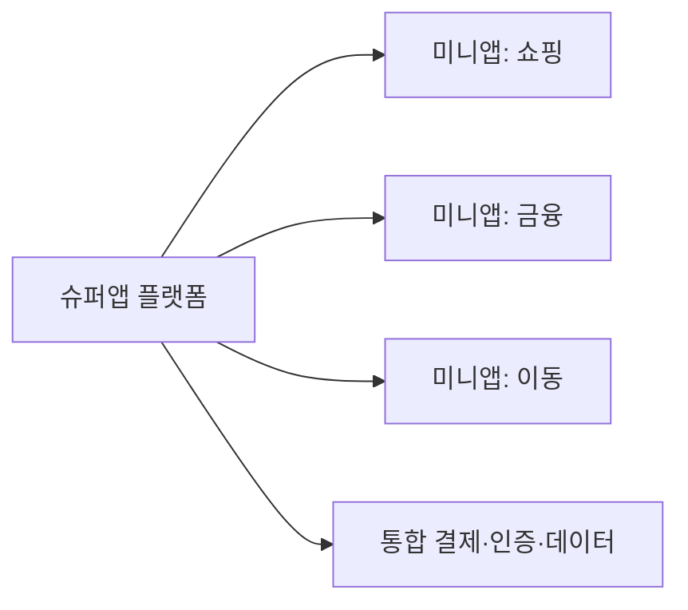

# 슈퍼앱(Super App)

## 1. 개요

### 가. 정의
> 하나의 앱에서 **결제·쇼핑·금융·메시징·이동 등 다양한 서비스**를 통합 제공하는 플랫폼 앱. **미니앱** 생태계를 품는다.

### 나. 주요 요소
- **플랫폼(호스트 앱)**, **미니앱(입점 서비스)**, **간편결제·인증**, **데이터·개인화**

## 2. 슈퍼앱 vs 멀티앱

| 구분 | 슈퍼앱 | 멀티앱 |
|---|---|---|
| **구조** | 단일 앱 + 미니앱 | 기능별 개별 앱 다수 |
| **경험** | 끊김 없는 통합 UX | 앱 전환 필요 |
| **계정·결제** | 통합(SSO·통합결제) | 분산 |
| **예** | WeChat·Grab·토스 | 개별 서비스 앱 |

## 3. 미니앱(Mini App)
- 슈퍼앱 위에서 **설치 없이 구동**되는 경량 서비스(웹/전용 런타임)
- 입점사는 **트래픽·결제·인증 인프라 재사용**, 사용자는 즉시 이용

## 4. 사례·전망·이슈
- **사례**: WeChat, Grab, 토스·카카오
- **전망**: 커머스·금융 융합 확대
- **이슈**: **독과점·락인**, 개인정보 집중, 보안·심사 품질

---

> **한 줄 요약**: 슈퍼앱은 *단일 앱에 미니앱 생태계로 다양한 서비스를 통합* 한 플랫폼으로, 통합 계정·결제로 끊김 없는 경험을 주지만 독과점·개인정보 집중 이슈가 있다.
