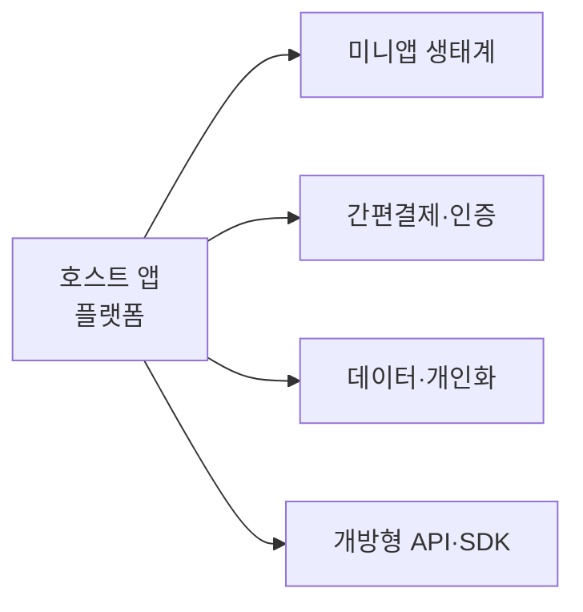

# 슈퍼앱(Super App)

## 1. 개요

### 가. 정의
> 하나의 앱 안에서 **메시징·결제·금융·쇼핑·이동·예약 등 다양한 서비스를 통합** 제공하고, 외부 서비스가 **미니앱(Mini App)** 으로 입점하는 **플랫폼형 애플리케이션**.

### 나. 등장 배경
- 앱 피로도(앱 난립)·**락인(Lock-in)** 전략, 슈퍼앱 하나로 일상 대부분 처리
- 결제·인증·데이터 인프라를 공유해 **생태계 확장**

## 2. 슈퍼앱의 주요 요소

| 요소 | 설명 |
|---|---|
| **호스트(플랫폼) 앱** | 미니앱 실행 런타임·공통 UI 제공 |
| **미니앱** | 입점 서비스(설치 없이 구동) |
| **간편결제·인증** | 통합 결제(월렛)·SSO 신원확인 |
| **데이터·개인화** | 통합 데이터로 추천·마케팅 |
| **개방형 API/SDK** | 서드파티 입점·연동 지원 |

## 3. 슈퍼앱 vs 멀티앱

| 구분 | 슈퍼앱 | 멀티앱 |
|---|---|---|
| **구조** | 단일 앱 + 미니앱 | 기능별 개별 앱 다수 |
| **사용자 경험** | 끊김 없는 통합 UX | 앱 전환·재로그인 |
| **계정·결제** | 통합(SSO·통합월렛) | 분산 |
| **데이터** | 통합 프로파일 | 분산 |
| **전략** | 락인·생태계 | 서비스별 전문화 |
| **예** | WeChat, Grab, 토스, 카카오 | 개별 서비스 앱 |

## 4. 미니앱(Mini App)
- 슈퍼앱 위에서 **설치 없이 즉시 구동**되는 경량 서비스(웹/전용 런타임)
- **장점**: 입점사는 트래픽·결제·인증 재사용, 사용자는 즉시 이용·저용량
- 구현: 표준 웹(HTML/JS) 또는 플랫폼 전용 프레임워크(예: WeChat Mini Program)

## 5. 사례·전망·이슈사항

| 구분 | 내용 |
|---|---|
| **사례** | WeChat(중국 국민앱), Grab·Gojek(동남아), 토스·카카오·네이버(국내) |
| **전망** | 커머스·핀테크·모빌리티 융합, AI 에이전트 결합으로 개인화 심화 |
| **이슈** | **독과점·플랫폼 규제**, 개인정보 집중·프라이버시, 미니앱 **보안 심사·품질**, 단일 장애점(SPOF) |

## 6. 시사점
- 슈퍼앱은 **데이터·결제·인증 통합**으로 강력한 생태계를 만들지만, **독과점·개인정보·보안** 리스크 관리와 규제 대응이 성공의 관건

---

> **한 줄 요약**: 슈퍼앱은 *호스트 앱 + 미니앱 생태계 + 통합 결제·인증·데이터* 로 다양한 서비스를 하나의 앱에서 제공하는 플랫폼으로, 멀티앱 대비 끊김 없는 통합 경험을 주지만 독과점·개인정보 집중·미니앱 보안 이슈가 과제다.
