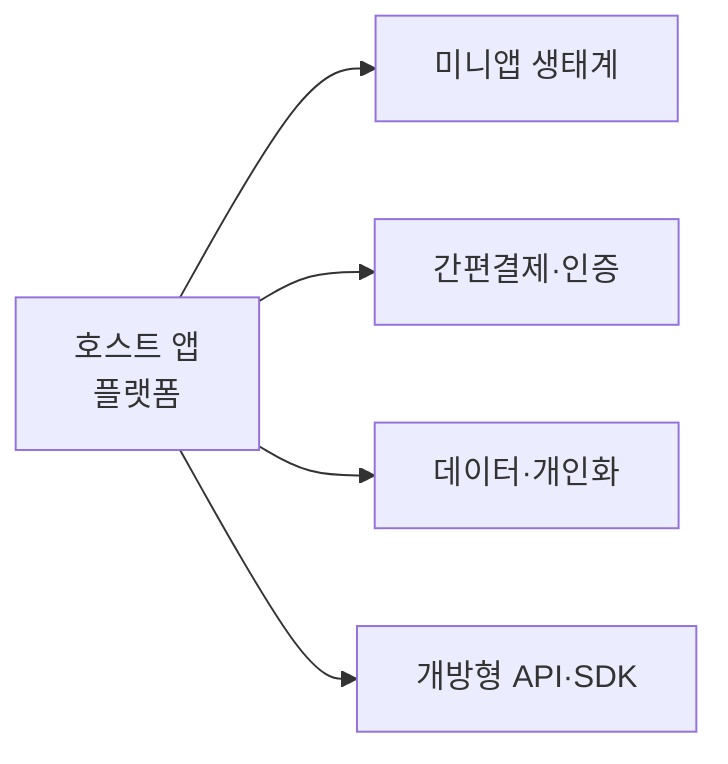

# 슈퍼앱(Super App)

## 1. 개요

### 가. 정의
> 하나의 앱 안에서 **메시징·결제·금융·쇼핑·이동·예약 등 다양한 서비스를 통합** 제공하고, 외부 서비스가 **미니앱(Mini App)** 형태로 입점해 하나의 생태계를 이루는 **플랫폼형 애플리케이션**.

슈퍼앱의 핵심은 개별 기능의 합이 아니라 **결제·인증·데이터라는 공통 인프라를 여러 서비스가 공유**하는 구조에 있다. 사용자는 한 번 로그인하고 한 번 결제수단을 등록하면 앱을 벗어나지 않고 일상 대부분을 처리하고, 입점 서비스는 이미 확보된 트래픽과 결제·인증 인프라를 재사용한다. 즉 슈퍼앱은 스스로 모든 서비스를 만드는 것이 아니라 **플랫폼(운영체제)처럼 작동**하며 그 위에 서드파티 생태계를 얹는다.

### 나. 등장 배경 및 필요성
스마트폰 초기에는 서비스마다 앱을 따로 설치했지만, 앱이 난립하면서 설치·로그인·결제를 반복하는 **앱 피로도**가 커졌다. 사업자 입장에서는 신규 앱의 사용자 획득 비용이 치솟는 것이 문제였다. 슈퍼앱은 이미 수억 명이 매일 쓰는 앱 안에 서비스를 입점시켜 **획득 비용을 낮추고**, 사용자를 생태계에 묶어두는 **락인(Lock-in)** 을 실현한다. 중국처럼 신용카드·웹 인프라를 건너뛰고 모바일로 직행한 시장에서 위챗·알리페이가 폭발적으로 성장한 것이 대표적 배경이다.

## 2. 슈퍼앱의 주요 구성요소

슈퍼앱을 지탱하는 요소들은 서로 맞물려 하나의 플랫폼을 이룬다. 중심에는 미니앱을 실행하는 런타임과 공통 UI를 제공하는 **호스트 앱**이 있는데, 이것이 사실상 앱 위의 운영체제 역할을 한다. 그 위에서 **간편결제·통합 인증(SSO)** 이 모든 서비스의 마찰을 없애는 접착제 역할을 하여, 어떤 미니앱을 쓰든 재로그인·재결제 없이 매끄럽게 연결된다. 여러 서비스에서 모인 데이터는 **통합 프로파일**로 결합되어 개인화 추천·마케팅의 원천이 되며, **개방형 API/SDK** 는 외부 서비스가 손쉽게 입점하도록 진입장벽을 낮춰 생태계를 키운다. 이 네 요소 중 결제·인증 인프라가 특히 중요한데, 이것이 튼튼해야 서드파티가 안심하고 입점하기 때문이다.

| 요소 | 설명 | 역할 |
|---|---|---|
| **호스트(플랫폼) 앱** | 미니앱 실행 런타임·공통 UI 제공 | 앱 위의 운영체제 |
| **미니앱** | 설치 없이 구동되는 입점 서비스 | 생태계의 콘텐츠 |
| **간편결제·인증** | 통합 월렛·SSO 신원확인 | 마찰 제거(접착제) |
| **데이터·개인화** | 통합 프로파일 기반 추천·마케팅 | 참여 유인·수익화 |
| **개방형 API/SDK** | 서드파티 입점·연동 지원 | 생태계 확장 |

## 3. 슈퍼앱 vs 멀티앱(비교)

슈퍼앱과 멀티앱의 차이는 단순한 앱 개수가 아니라 **통합이냐 전문화냐**라는 전략의 차이에서 비롯된다. 멀티앱 전략은 서비스별로 앱을 분리해 각 앱이 자기 영역에 집중(전문화)하고 독립적으로 발전하도록 하지만, 사용자는 앱을 오가며 매번 로그인·결제를 반복해야 하고 데이터가 분산된다. 반면 슈퍼앱은 하나의 계정·월렛·프로파일로 통합해 **끊김 없는 경험**과 강력한 락인을 만들지만, 그 대가로 아키텍처가 복잡해지고 한 앱에 서비스가 집중되어 **단일 장애점(SPOF)** 과 규제 리스크가 커진다. 즉 통합이 주는 편의·데이터 시너지와, 분산이 주는 독립성·회복력이 맞바꿈되는 관계다.

| 구분 | 슈퍼앱 | 멀티앱 | 차이의 이유 |
|---|---|---|---|
| **구조** | 단일 앱 + 미니앱 | 기능별 개별 앱 다수 | 통합 vs 전문화 전략 |
| **사용자 경험** | 끊김 없는 통합 UX | 앱 전환·재로그인 | 공통 인증·결제 공유 여부 |
| **계정·결제** | 통합(SSO·통합월렛) | 서비스별 분산 | 인프라 공유 구조 |
| **데이터** | 통합 프로파일 | 분산 | 개인화·수익화 원천 |
| **리스크** | 락인 강하나 SPOF·규제 집중 | 회복력↑, 시너지↓ | 집중 vs 분산의 트레이드오프 |
| **예** | WeChat, Grab, 토스, 카카오 | 서비스별 개별 앱 | |

## 4. 미니앱(Mini App)

미니앱은 슈퍼앱 위에서 **설치 없이 즉시 실행되는 경량 서비스**로, 슈퍼앱 생태계의 실제 콘텐츠를 채운다. 사용자는 앱스토어에서 내려받고 로그인하는 과정 없이 필요할 때 바로 쓰고, 저장공간도 거의 차지하지 않는다. 입점사 입장에서는 슈퍼앱의 트래픽·결제·인증을 그대로 재사용할 수 있어 초기 진입 비용이 크게 줄어든다. 구현은 표준 웹(HTML/JS)을 쓰거나 위챗 미니프로그램처럼 플랫폼 전용 프레임워크를 쓰는데, 전용 프레임워크는 성능·보안 통제에는 유리하지만 그만큼 해당 플랫폼에 종속된다는 트레이드오프가 있다.

## 5. 사례·전망·이슈

| 구분 | 내용 |
|---|---|
| **사례** | WeChat(중국 국민앱), Grab·Gojek(동남아 모빌리티+금융), 토스·카카오·네이버(국내) |
| **전망** | 커머스·핀테크·모빌리티 융합, AI 에이전트 결합으로 대화형 개인화 심화 |
| **이슈** | **독과점·플랫폼 규제**, 개인정보 집중·프라이버시, 미니앱 **보안 심사·품질**, 단일 장애점(SPOF) |

사례를 보면 슈퍼앱은 각 시장의 미충족 인프라를 파고들며 성장했다. 위챗은 신용카드가 약했던 중국에서 결제를, 그랩·고젝은 대중교통이 부족했던 동남아에서 모빌리티를 발판으로 삼아 금융·커머스로 확장했다. 국내에서는 토스가 송금, 카카오가 메신저를 기반으로 각각 금융·생활 서비스를 붙여 왔다. 전망으로는 AI 에이전트가 슈퍼앱의 통합 데이터·미니앱을 도구로 삼아 사용자를 대신해 작업을 수행하는 방향으로 진화할 것으로 보인다. 다만 서비스·데이터가 한곳에 집중될수록 독과점 규제와 개인정보 리스크가 커지므로 이 관리가 성패를 가른다.

## 6. 고려사항 및 시사점(기술사 관점)
- **데이터·결제 통합의 양면성**: 통합은 강력한 생태계와 개인화를 낳지만, 동시에 개인정보 집중과 독과점이라는 규제 표적을 만든다. 데이터 최소수집·목적 제한으로 균형을 잡아야 한다.
- **미니앱 거버넌스**: 서드파티 미니앱이 늘수록 악성·저품질 서비스가 섞일 위험이 커지므로, 심사·샌드박스 격리·권한 통제 같은 플랫폼 차원의 보안 거버넌스가 필수다.
- **회복력 설계**: 서비스 집중은 SPOF를 낳으므로 이중화·장애 격리로 한 미니앱 장애가 전체로 번지지 않게 설계해야 한다.
- **규제 대응이 곧 경쟁력**: 플랫폼 독과점·자사우대 규제가 강화되는 흐름에서, 개방성과 공정성을 선제적으로 확보하는 것이 지속가능성의 관건이다.

---

> **한 줄 요약**: 슈퍼앱은 *호스트 앱 + 미니앱 생태계 + 통합 결제·인증·데이터* 로 여러 서비스를 하나의 플랫폼에 담아 끊김 없는 경험과 락인을 만들지만, 그 통합의 대가로 **독과점·개인정보 집중·미니앱 보안·SPOF** 관리가 성패를 가른다.
