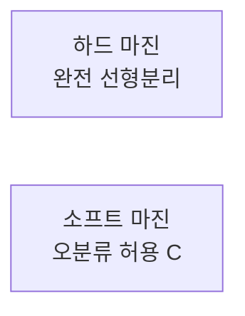

# 선형 SVM의 마진 분류 방법 (하드/소프트 마진)

## 1. 개요

### 가. SVM 정의
> **서포트 벡터 머신(SVM)** 은 두 클래스를 구분하는 **결정 경계(초평면)와 데이터 간 마진(Margin)을 최대화**하는 지도학습 분류 모델.

### 나. 핵심 개념

| 개념 | 설명 |
|---|---|
| **초평면(Hyperplane)** | 클래스를 나누는 결정 경계 |
| **마진(Margin)** | 초평면과 가장 가까운 데이터 간 거리 |
| **서포트 벡터** | 마진 경계에 위치해 초평면을 결정하는 데이터 |

## 2. 마진 분류 2가지

### 가. 하드 마진(Hard Margin)
> 모든 데이터를 **오분류 없이 완전히 분리**하는 최대 마진 초평면.

| 항목 | 내용 |
|---|---|
| **조건** | 선형 분리 가능(noise 없음) |
| **목표** | 마진 최대화(제약: 모든 점이 마진 밖) |
| **한계** | 이상치·노이즈에 매우 민감, 비분리 시 해 없음 |

### 나. 소프트 마진(Soft Margin)
> **일부 오분류(슬랙 변수 ξ)를 허용**하고 페널티(C)로 통제하며 마진을 최대화.

| 항목 | 내용 |
|---|---|
| **조건** | 노이즈·중첩 데이터에 적용 |
| **목표** | 마진 최대화 + 오분류 페널티 최소화 |
| **파라미터 C** | 큼→오분류 억제(과적합↑), 작음→마진↑·일반화 |

## 3. 비교

| 구분 | 하드 마진 | 소프트 마진 |
|---|---|---|
| **오분류** | 불허 | 허용(ξ) |
| **노이즈 내성** | 약함 | 강함 |
| **적용** | 완전 분리 가능 | 실제 데이터(일반적) |

## 4. 고려사항 및 시사점
- 실무는 **소프트 마진**이 일반적, **C**로 편향-분산 조절
- 비선형은 **커널 트릭**(RBF 등)으로 고차원 매핑
- 고차원·소표본에 강함, 대용량엔 학습 비용 고려

---

> **한 줄 요약**: 선형 SVM은 마진을 최대화하며, *하드 마진(오분류 불허·노이즈 민감)* 과 *소프트 마진(슬랙 ξ로 오분류 허용, C로 통제)* 두 방식으로 분류하고 실무에서는 소프트 마진을 주로 쓴다.
