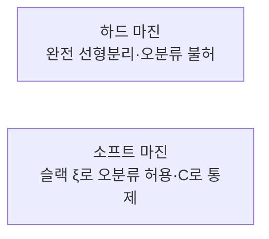

# 선형 SVM의 마진 분류 방법 (하드/소프트 마진)

## 1. 개요

### 가. 정의
> **서포트 벡터 머신(SVM)** 은 두 클래스를 나누는 무수히 많은 결정 경계(초평면) 중에서, **경계와 가장 가까운 데이터(서포트 벡터) 사이의 간격인 마진(Margin)을 최대화**하는 초평면을 선택하는 지도학습 분류 모델이다.

퍼셉트론처럼 "일단 나누기만 하는" 경계는 무한히 많지만, 그중 어떤 것이 새 데이터에 대해 가장 잘 일반화될지가 문제다. SVM의 통찰은 "**경계가 양쪽 클래스로부터 최대한 멀리 떨어져 있을수록(=마진이 넓을수록) 약간의 데이터 변동에도 오분류하지 않아 안정적**"이라는 것이다. 즉 마진 최대화는 곧 일반화 오차의 상한을 줄이려는 원리적 근거(구조적 위험 최소화, SRM)를 갖는다.

### 나. 등장 배경 및 필요성
현실 데이터에는 측정 잡음과 클래스 간 중첩이 흔하고, 특히 특성 수가 표본 수보다 많은 **고차원·소표본** 상황(유전자·텍스트 분류 등)에서는 과적합 위험이 크다. 마진을 명시적 목적함수로 삼는 SVM은 결정 경계를 서포트 벡터라는 소수의 경계 데이터만으로 결정하므로, 이런 환경에서 견고한 분류 성능을 낸다. 다만 완벽히 분리되는 이상적 상황과 잡음이 섞인 현실 상황을 같은 방식으로 다룰 수 없기에, 마진 분류는 **하드 마진**과 **소프트 마진** 두 갈래로 나뉜다.

### 다. 핵심 개념
| 개념 | 설명 | 왜 중요한가 |
|---|---|---|
| **초평면(Hyperplane)** | $w^\top x + b = 0$ 로 정의되는 결정 경계 | 분류의 기준면 |
| **마진(Margin)** | 초평면과 가장 가까운 데이터 간 거리($2/\lVert w\rVert$) | 넓을수록 일반화↑ |
| **서포트 벡터** | 마진 경계에 놓여 초평면을 결정하는 소수 데이터 | 이 점들만 해에 영향 |

마진 폭은 $2/\lVert w\rVert$ 이므로, 마진을 최대화하는 것은 곧 $\lVert w\rVert$(또는 $\tfrac12\lVert w\rVert^2$)를 **최소화**하는 볼록 이차계획(QP) 문제가 된다. 서포트 벡터가 아닌 데이터는 아무리 많아도 해를 바꾸지 않는데, 이것이 SVM이 이상치 몇 개에는 둔감하면서도 경계 근처 데이터에는 민감한 이유다.

## 2. 마진 분류 2가지

두 방식의 차이는 "**제약을 얼마나 엄격히 지키느냐**"에서 나온다. 하드 마진은 모든 점이 마진 밖에 있어야 한다는 제약을 절대 어기지 않으며, 소프트 마진은 이 제약을 어기는 것을 허용하되 대가(페널티)를 물린다.

### 가. 하드 마진(Hard Margin)
> 단 하나의 오분류도, 마진 침범도 없이 **모든 데이터를 완전히 선형 분리**하는 최대 마진 초평면.

하드 마진은 모든 점 $i$ 에 대해 $y_i(w^\top x_i + b) \ge 1$ 이라는 강한 제약 아래 $\tfrac12\lVert w\rVert^2$ 을 최소화한다. 문제는 이 제약이 **데이터가 실제로 선형 분리 가능할 때만** 만족되며, 잡음이나 이상치가 하나라도 반대편에 끼면 **해가 아예 존재하지 않는다**는 점이다. 설령 분리되더라도 경계에 붙은 이상치 하나가 마진 전체를 크게 왜곡시킬 수 있어 실전 데이터에는 거의 쓰이지 않는다.

| 항목 | 내용 |
|---|---|
| **조건** | 선형 분리 가능(잡음·중첩 없음) |
| **목표** | $\min \tfrac12\lVert w\rVert^2$ s.t. 모든 점이 마진 밖 |
| **한계** | 이상치·잡음에 매우 민감, 비분리 시 해 없음 |

### 나. 소프트 마진(Soft Margin)
> **슬랙 변수 $\xi_i \ge 0$** 로 각 데이터가 마진을 침범·오분류하는 정도를 허용하고, 그 총합에 **페널티 $C$** 를 부과해 통제하며 마진을 최대화.

소프트 마진은 목적함수를 $\min \tfrac12\lVert w\rVert^2 + C\sum_i \xi_i$ 로 바꾸고 제약을 $y_i(w^\top x_i+b) \ge 1-\xi_i$ 로 완화한다. 즉 "**넓은 마진**"과 "**적은 오분류**"라는 상충하는 두 목표를 $C$ 로 저울질한다. 이 덕분에 잡음이 섞이거나 완전히 분리되지 않는 데이터에도 항상 해가 존재하고, 이상치에 대한 강건성이 생긴다.

| 항목 | 내용 |
|---|---|
| **조건** | 잡음·중첩 데이터에도 적용(현실 데이터) |
| **목표** | 마진 최대화 + 오분류 페널티($C\sum\xi_i$) 최소화 |
| **파라미터 $C$** | 큼 → 오분류 강하게 억제(마진↓·과적합↑), 작음 → 마진↑·일반화↑(과소적합 위험) |

$C$ 는 편향-분산 저울의 핸들이다. $C$ 가 매우 크면 하드 마진에 가까워져 이상치까지 맞추려다 분산이 커지고, $C$ 가 작으면 일부 오분류를 눈감아 마진이 넓어지며 편향이 커진다. 예컨대 두 클래스가 약간 겹치는 데이터에서 $C$ 를 100처럼 크게 두면 겹친 점 몇 개를 억지로 분리하려 경계가 구불구불해지고, $C=1$ 정도면 그 점들을 슬랙으로 흡수해 매끈한 경계를 얻는다.

## 3. 비교

| 구분 | 하드 마진 | 소프트 마진 |
|---|---|---|
| **오분류** | 불허($\xi=0$) | 허용($\xi \ge 0$) |
| **잡음 내성** | 약함(이상치에 해 붕괴) | 강함(슬랙으로 흡수) |
| **해 존재성** | 선형 분리 시에만 | 항상 존재 |
| **적용** | 이론적·완전 분리 데이터 | 실제 데이터(일반적) |

차이가 생기는 근본 이유는 제약 위반 허용 여부다. 하드 마진은 제약을 절대 못 어기므로 데이터 한 점의 위치에 해 전체가 좌우되고, 소프트 마진은 위반을 비용으로 환산해 흡수하므로 소수 이상치의 영향을 $C$ 로 눌러 담을 수 있다.

## 4. 고려사항 및 시사점
- **실무 기본은 소프트 마진**: 잡음 없는 데이터는 거의 없으므로 소프트 마진을 쓰고, $C$ 를 교차검증으로 튜닝해 편향-분산을 맞춘다.
- **비선형 문제는 커널 트릭**: 선형 분리가 불가능한 경우 RBF·다항식 커널로 데이터를 고차원으로 매핑하면, 원공간에서 비선형인 경계를 고차원에서 선형 초평면으로 다룰 수 있다. 이때도 마진 개념은 그대로 유지된다.
- **강점과 한계의 트레이드오프**: 고차원·소표본에서 강건하고 해가 유일(볼록 최적)하지만, 표본 수가 수십만을 넘으면 QP 학습 비용($O(n^2)\sim O(n^3)$)이 커져 SGD·트리 기반 모델이 더 실용적일 수 있다.
- **연계**: 확률출력이 필요하면 Platt scaling, 다중분류는 One-vs-Rest/One-vs-One로 확장한다.

---

> **한 줄 요약**: 선형 SVM은 서포트 벡터까지의 *마진($2/\lVert w\rVert$)을 최대화*하며, *하드 마진(오분류 불허·이상치에 해 붕괴)* 과 *소프트 마진(슬랙 $\xi$로 오분류 허용, $C$로 편향-분산 통제)* 으로 나뉘고, 잡음이 흔한 실무에서는 소프트 마진을 기본으로 커널 트릭과 함께 쓴다.
