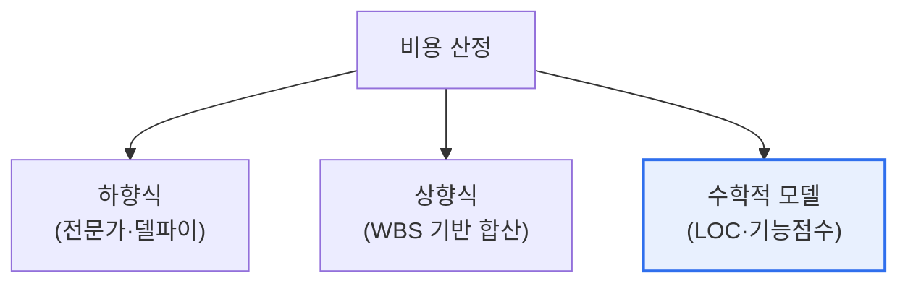

# 소프트웨어 비용 산정 방법

## 1. 개요

### 가. 정의
> **소프트웨어 비용 산정**은 개발에 필요한 **공수(Man-Month)·기간·비용을 개발 착수 전에 예측**하는 활동으로, 프로젝트 계획·예산·일정 수립의 근거가 된다.

비용 산정이 어렵고도 중요한 이유는 '**보이지 않는 것의 값을 미리 맞혀야 한다**'는 데 있다. 소프트웨어는 물리적 실체가 없고 완성되기 전에는 규모·복잡도를 정확히 알기 어렵다. 그런데 예산과 일정은 착수 전에 정해야 한다. 산정이 지나치게 낙관적이면 예산·납기를 초과해 프로젝트가 위기에 빠지고, 지나치게 보수적이면 수주 경쟁에서 밀린다. 그래서 여러 산정 방법이 발전했다. 크게 사람의 경험에 의존하는 **하향식**(전문가 판단·델파이), 구성요소를 쌓아 올리는 **상향식**, 그리고 과거 데이터로 만든 **수학적 모델**(LOC 기반 COCOMO, 기능 기반 기능점수)로 나뉜다. 어느 방법도 완벽하지 않으므로, 여러 방법을 병행해 교차 검증하는 것이 현명하다. 결국 비용 산정은 정확성과 객관성, 산정 시점의 트레이드오프를 이해하고 상황에 맞게 조합하는 문제다.

### 나. 필요성
부정확한 산정은 예산 초과·납기 지연·품질 저하·분쟁의 근본 원인이므로, 객관적이고 검증 가능한 산정 방법이 요구된다.

## 2. 산정 방법 분류

| 방법 | 원리 | 장점 | 단점 |
|---|---|---|---|
| **전문가 판단** | 경험자 직관 | 빠름·간편 | 주관적·근거 취약 |
| **델파이** | 전문가 다수 의견 수렴 | 편향 완화 | 시간·비용 |
| **LOC 기반** | 예상 코드 라인 수 | 직관적 | 초기 예측 어려움·언어 종속 |
| **COCOMO** | LOC·비용동인으로 공수 산정 | 정량·검증됨 | LOC 예측 의존 |
| **기능점수(FP)** | 기능 규모 측정 | 언어 독립·초기 적용 | 측정 전문성 필요 |

## 3. 주요 모델 상세 — COCOMO와 기능점수

**COCOMO**(Constructive Cost Model)는 예상 LOC와 프로젝트 특성(비용동인)을 바탕으로 공수를 계산하는 대표적 수학적 모델이다. 조직형·반분리형·내장형 등 프로젝트 유형별로 계수가 달라, 규모가 클수록 비선형적으로 공수가 증가함을 반영한다. 다만 LOC를 초기에 정확히 예측해야 하는 한계가 있다.

**기능점수(FP)** 는 코드가 아니라 사용자 관점의 기능(입력·출력·조회·파일·인터페이스) 수와 복잡도로 규모를 측정한다. 언어·기술에 독립적이고 요구사항 단계에서 적용할 수 있어, 공공 SW 대가 산정의 표준으로 널리 쓰인다. [[sw-sizing-methods]]

## 4. 고려사항 및 시사점

1. **여러 방법의 병행이 정확도를 높인다.** 단일 방법은 편향·오차가 있으므로, 하향식과 상향식, 모델 기반을 함께 써 교차 검증하고 산정 근거를 문서화하는 것이 바람직하다.
2. **국내 공공은 기능점수 기반이 표준**이다. SW사업 대가 산정 가이드가 기능점수 방식을 채택해, 객관적·표준화된 비용 산정과 발주 투명성을 확보한다. [[sw-operation-cost]]
3. **애자일·AI 기반 산정으로 진화**한다. 애자일에서는 스토리 포인트·속도(velocity) 기반 추정을 쓰고, 최근에는 과거 프로젝트 데이터·머신러닝으로 산정 정확도를 높이는 연구가 진행된다.

---

> **한 줄 요약**: SW 비용 산정은 *착수 전 공수·기간·비용을 예측* 하는 활동으로, 하향식(델파이)·상향식·수학적 모델(COCOMO·기능점수)이 정확성·객관성·시점에서 트레이드오프를 가지며, 여러 방법 병행과 기능점수 표준이 핵심이다.
