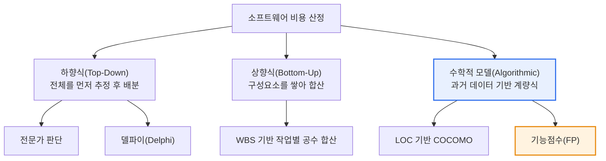

# 소프트웨어 비용 산정 방법

## 1. 개요

### 가. 정의
> **소프트웨어 비용 산정(Software Cost Estimation)** 은 개발에 필요한 **공수(Man-Month)·기간·비용을 개발 착수 전에 예측**하는 활동으로, 프로젝트 계획·예산·일정 수립과 발주·계약의 정량적 근거가 된다.

비용 산정이 어렵고도 중요한 이유는 '**보이지 않는 것의 값을 미리 맞혀야 한다**'는 본질적 모순에 있다. 소프트웨어는 물리적 실체가 없고, 완성되기 전에는 규모·복잡도를 정확히 알기 어렵다. 그런데 예산과 일정은 착수 전에 확정해야 하고, 한 번 정해진 예산은 프로젝트 전 기간을 옭아맨다. 산정이 지나치게 낙관적이면 예산·납기를 초과해 프로젝트가 위기에 빠지고 야근·품질저하·분쟁으로 이어지며, 지나치게 보수적이면 수주 경쟁에서 밀린다. 이 딜레마 때문에 산정은 단순한 계산이 아니라, **불확실성 속에서 위험을 관리하는 의사결정 행위**로 이해해야 한다.

이러한 어려움을 완화하기 위해 여러 산정 방법이 발전했다. 크게 사람의 경험과 직관에 의존하는 **하향식(Top-Down)** — 전문가 판단·델파이, 구성요소를 잘게 나눠 쌓아 올리는 **상향식(Bottom-Up)** — WBS 기반 합산, 그리고 과거 프로젝트 데이터로 만든 회귀식·계수를 쓰는 **수학적 모델(Algorithmic)** — LOC 기반 COCOMO와 기능 기반 기능점수(FP)로 나뉜다. 세 방식은 각각 **정확성·객관성·산정 가능 시점**에서 서로 다른 트레이드오프를 가진다. 하향식은 착수 극초기에도 빠르게 답을 주지만 주관적이고, 상향식은 정밀하지만 설계가 어느 정도 확정돼야 하며 누락 위험이 있고, 모델 기반은 정량적·검증 가능하지만 입력값(LOC·기능 규모) 예측 정확도에 결과가 좌우된다. 어느 방법도 완벽하지 않으므로, **여러 방법을 병행해 교차 검증(triangulation)** 하고 그 편차를 위험 신호로 해석하는 것이 현명하다.

### 나. 등장 배경과 필요성
1960~70년대 대형 소프트웨어 프로젝트가 잇달아 예산·납기를 초과하며 '소프트웨어 위기(software crisis)'가 대두되자, 주먹구구식 견적을 대체할 **객관적·반복가능한 산정 기법**의 필요성이 커졌다. 부정확한 산정은 예산 초과·납기 지연·품질 저하·이해관계자 분쟁의 근본 원인이며, 특히 공공 정보화 사업에서는 예산의 적정성과 발주의 투명성이 감사·감리의 핵심 쟁점이 된다. 그 결과 국내에서는 기능점수 기반의 표준 대가 산정 체계가, 국제적으로는 COCOMO·기능점수(IFPUG/ISO) 등 계량 모델이 자리 잡았다.

### 다. 좋은 산정이 갖춰야 할 성질
좋은 비용 산정은 첫째 **객관성**(누가 해도 유사한 결과), 둘째 **추적성**(산정 근거·가정을 문서화), 셋째 **적시성**(필요한 의사결정 시점에 답을 제공), 넷째 **점진적 정련**(단계가 진행될수록 오차를 좁혀가는 '추정의 원뿔(cone of uncertainty)' 반영)을 갖춰야 한다. 착수 초기 ±100%에 이르는 불확실성이 설계·구현이 진행되며 좁혀지는 것을 전제로, 산정은 한 번이 아니라 **반복적으로 재산정**되어야 한다.

## 2. 비용 산정 방법의 분류 — 전체 구조

비용 산정 기법은 정보의 방향과 근거에 따라 하향식·상향식·수학적 모델로 나뉘며, 실무에서는 이들을 상호 보완적으로 조합한다.

```mermaid
flowchart TB
  C["소프트웨어 비용 산정"] --> TD["하향식(Top-Down)<br/>전체를 먼저 추정 후 배분"]
  C --> BU["상향식(Bottom-Up)<br/>구성요소를 쌓아 합산"]
  C --> AL["수학적 모델(Algorithmic)<br/>과거 데이터 기반 계량식"]
  TD --> TD1["전문가 판단"]
  TD --> TD2["델파이(Delphi)"]
  BU --> BU1["WBS 기반 작업별 공수 합산"]
  AL --> AL1["LOC 기반 COCOMO"]
  AL --> AL2["기능점수(FP)"]
  style AL fill:#e8f0fe,stroke:#2f6fed,stroke-width:2px
  style AL2 fill:#fff3e0,stroke:#e8890c,stroke-width:2px
```

**하향식** 은 프로젝트 전체 규모를 경험적으로 먼저 추정한 뒤 하위 작업에 배분하는 방식이다. 착수 극초기, 요구사항이 흐릿할 때도 빠르게 개략 견적을 낼 수 있어 사업 타당성 검토나 제안 단계에서 유용하다. 그러나 개인의 경험에 좌우되어 편향이 크고, 세부 작업의 누락을 잡아내지 못한다는 한계가 있다. 이 편향을 줄이기 위해 여러 전문가의 익명 의견을 여러 라운드에 걸쳐 수렴하는 **델파이 기법**이 쓰인다.

**상향식** 은 반대로 작업분류체계(WBS)로 프로젝트를 잘게 분해한 뒤, 각 작업의 공수를 산정해 합산한다. 세부 근거가 명확하고 정밀도가 높지만, 설계가 어느 정도 확정돼야 적용할 수 있고 통합·관리 같은 '보이지 않는' 오버헤드를 빠뜨리기 쉽다. 그래서 상향식 합계에 통합·리스크 예비비를 일정 비율 더하는 보정이 관행이다.

**수학적 모델** 은 과거 프로젝트에서 도출한 회귀식·계수로 규모(LOC 또는 FP)를 공수·비용으로 환산한다. 객관적이고 근거를 검증할 수 있어 대규모·공공 사업의 표준으로 자리 잡았으나, 입력값 예측이 틀리면 결과 전체가 틀어지는 '쓰레기 입력-쓰레기 출력' 위험을 안는다.

| 방법 | 원리 | 장점 | 단점 | 적용 시점 |
|---|---|---|---|---|
| **전문가 판단** | 경험자 직관 | 빠름·간편·저비용 | 주관적·근거 취약 | 극초기 |
| **델파이** | 전문가 다수 익명 의견 수렴 | 개인 편향 완화 | 시간·비용 소요 | 초기 |
| **상향식(WBS)** | 작업별 공수 합산 | 정밀·근거 명확 | 설계 확정 필요·누락 위험 | 설계 이후 |
| **LOC/COCOMO** | 예상 코드량·비용동인으로 공수 산정 | 정량·검증됨 | LOC 예측 의존·언어 종속 | 설계 단계 |
| **기능점수(FP)** | 사용자 기능 규모 측정 | 언어 독립·초기 적용 | 측정 전문성 필요 | 요구사항 단계 |

## 3. 주요 계량 모델 상세 — COCOMO

**COCOMO(Constructive Cost Model)** 는 Barry Boehm이 1981년 제안한 대표적 LOC 기반 수학적 모델로, 예상 코드 규모(KLOC)와 프로젝트 특성을 바탕으로 공수를 계산한다. 기본 착상은 "**공수는 규모의 비선형 함수**"라는 것으로, 규모가 커질수록 의사소통·통합 비용 때문에 공수가 규모보다 빠르게(지수 1보다 크게) 증가한다는 경험칙을 수식화한다. 기본형은 대략 `노력 = a × (KLOC)^b` 형태이며, 계수 a·b는 프로젝트 유형에 따라 달라진다.

COCOMO는 프로젝트를 **조직형(Organic)** — 소규모·친숙한 도메인, **반분리형(Semi-detached)** — 중간 규모·혼합 경험, **내장형(Embedded)** — 대규모·엄격한 제약(실시간·하드웨어 결합)의 세 모드로 구분한다. 같은 규모라도 내장형은 조직형보다 지수 b가 커서 공수가 훨씬 많이 든다. 이는 '규모의 불경제(diseconomy of scale)'가 프로젝트 성격에 따라 다르게 작용함을 반영한 것으로, 단순 인월 곱셈으로는 잡을 수 없는 통찰이다.

정밀형인 **중간(Intermediate)·상세(Detailed) COCOMO** 는 여기에 제품 신뢰도·데이터베이스 규모·팀 역량·개발 도구 성숙도 등 **비용동인(cost driver)** 을 곱해 보정한다. 예컨대 요구 신뢰도가 매우 높은 항공·의료 소프트웨어는 검증 부담 때문에 공수 배수가 커진다. 후속 모델인 **COCOMO II(2000)** 는 재사용·객체지향·상용부품(COTS)·나선형 개발 같은 현대적 개발 방식을 반영해 초기 프로토타입 단계(응용점수)부터 후기 단계(FP·LOC)까지 단계별로 다른 입력을 허용한다. COCOMO의 근본 한계는 여전히 **LOC를 착수 초기에 정확히 예측하기 어렵다**는 점, 그리고 언어·개발 방식에 종속적이라는 점이다.

## 4. 국내 표준 — 기능점수(FP)와 SW사업 대가산정

**기능점수(Function Point, FP)** 는 코드가 아니라 **사용자 관점의 기능**으로 규모를 측정한다. 사용자에게 제공되는 기능을 다섯 유형 — 외부입력(EI)·외부출력(EO)·외부조회(EQ)·내부논리파일(ILF)·외부연계파일(EIF) — 으로 식별하고, 각 기능의 복잡도에 따라 가중치를 부여해 합산한다. FP의 결정적 장점은 **개발 언어·기술·플랫폼에 독립적**이라는 것이다. 같은 기능을 자바로 만들든 파이썬으로 만들든 사용자에게 제공되는 기능의 양은 같으므로, LOC 기반 방식이 겪는 언어 종속·초기 예측 곤란 문제를 상당 부분 피한다. 또한 요구사항이 정리되는 이른 단계부터 적용할 수 있어 발주·계약의 근거로 적합하다.

이 때문에 국내 공공 정보화 사업은 **기능점수 방식을 표준 대가 산정 방식으로 채택**한다. 한국소프트웨어산업협회(KOSA)가 매년 개정·공표하는 **『SW사업 대가산정 가이드』** 는 개발비를 "**기능점수 × 기능점수당 단가**"로 산정하도록 규정한다. 실제 수치를 보면, FP당 단가는 2020년 553,114원에서 **2024년 5월 개정판에서 9.5% 인상된 605,784원**으로 조정됐는데, 이는 코로나19 이후 물가 상승과 SW기술자 인건비 상승을 반영한 결과다. 또한 2024년 개정판은 AI 도입 사업의 라이선스 비용, 알고리즘 조정, 데이터 수집·전처리·학습·검증 등을 **투입공수 방식의 전문작업비**로 별도 산정하도록 하여, 생성형 AI 시대의 새로운 사업 형태를 대가 체계에 반영하기 시작했다.

```mermaid
flowchart LR
  R["요구사항·기능 식별"] --> FP["기능점수 측정<br/>EI·EO·EQ·ILF·EIF"]
  FP --> UFP["미조정 기능점수(UFP)"]
  UFP --> ADJ["보정계수 적용"]
  ADJ --> AFP["조정 기능점수"]
  AFP --> COST["개발비 = FP × 단가<br/>(2024년 605,784원)"]
  COST --> ADD["직접경비·이윤 등 가산"]
  style FP fill:#e8f0fe,stroke:#2f6fed,stroke-width:2px
  style COST fill:#fff3e0,stroke:#e8890c,stroke-width:2px
```

이러한 표준화의 실무적 함의는 크다. 발주기관과 사업자가 동일한 규칙으로 규모를 측정하므로 **예산의 객관성과 발주의 투명성**이 확보되고, 감리·감사 시 대가 산정 근거를 검증할 수 있다. 반면 FP 측정에는 전문 인력이 필요하고, 비기능 요구사항(성능·보안)이나 기술적 난이도를 규모에 온전히 반영하기 어렵다는 한계도 있어, 투입공수 방식과 병행하는 보완이 이뤄진다. [[sw-sizing-methods]] [[sw-operation-cost]]

## 5. 비교와 실무 적용 — 방법 선택의 논리

세 방법의 차이는 결국 '**언제, 무엇을 근거로 답을 낼 수 있는가**'에서 비롯된다. 제안·타당성 검토 단계처럼 정보가 거의 없을 때는 정밀한 상향식이 불가능하므로 전문가 판단·델파이로 개략 견적을 내고, 요구사항이 정리되면 기능점수로 규모를 확정하며, 설계가 구체화되면 WBS 기반 상향식으로 정밀 검증한다. 실제 대형 프로젝트에서는 이 셋을 **단계별로 갈아타며 재산정**하는 것이 정석이다.

구체적 예로, 한 공공기관 차세대 시스템(가정)에서 요구사항 단계에 FP로 3,000FP가 산정됐다면 단가를 곱해 약 18억 원 규모의 개발비 초안이 나온다. 이후 설계가 끝나 WBS로 상향식 재산정을 했을 때 22억 원이 나온다면, 그 4억 원의 차이(약 22%)는 요구사항 누락·비기능 요구의 과소평가를 알리는 **위험 신호**로 읽어야 한다. 이처럼 방법 간 편차 자체가 리스크 관리의 정보가 된다. 또 다른 예로, 실시간 제어가 핵심인 내장형 소프트웨어는 COCOMO 내장형 계수를 적용해 조직형 대비 큰 공수를 인정해야 하며, 이를 무시하면 저가 수주 후 적자 프로젝트가 되기 쉽다.

## 6. 심화 — 애자일·AI 시대의 산정 진화

전통적 산정이 '착수 전 한 번에 전체를 맞히는' 예측형이라면, **애자일**은 이를 근본적으로 뒤집는다. 애자일에서는 전체를 미리 정밀 산정하지 않고, 상대적 크기를 나타내는 **스토리 포인트(story point)** 로 백로그를 추정한 뒤, 스프린트마다 실제 처리량인 **속도(velocity)** 를 측정해 남은 일정을 지속적으로 재예측한다. 즉 '한 번의 큰 예측'을 '여러 번의 짧은 실측 기반 보정'으로 대체하는 것으로, 불확실성이 큰 프로젝트에서 추정의 원뿔을 빠르게 좁히는 장점이 있다. 다만 조직 간 비교나 고정가 계약에는 부적합해, 공공 발주의 기능점수 체계와는 상호 보완적으로 쓰인다.

최근에는 **데이터·AI 기반 산정**이 부상하고 있다. 과거 완료 프로젝트의 규모·공수·결함 데이터로 머신러닝 회귀 모델을 학습해 유사 프로젝트의 공수를 예측하거나, 요구사항 명세서를 자연어처리로 분석해 기능점수 측정을 자동화하려는 시도가 진행된다. 생성형 AI를 활용한 개발 생산성 향상(코드 자동생성)은 기존 LOC·공수 기반 산정의 전제 자체를 흔들고 있어, 앞서 본 2024년 대가 가이드의 AI 전문작업비 신설처럼 산정 체계도 재정의가 필요한 국면이다. 이는 유사 주제인 소프트웨어 규모 산정([[sw-sizing-methods]])·운영단계 대가([[sw-operation-cost]])와 함께 최근 기출의 단골 소재이므로, 답안에서는 "전통 모델의 한계 → 애자일·AI 보완"의 흐름으로 연결해 서술하는 것이 유효하다.

## 7. 고려사항 및 시사점

1. **여러 방법의 병행과 교차 검증이 정확도를 높인다.** 단일 방법은 고유의 편향·오차를 가지므로, 하향식·상향식·모델 기반을 함께 적용해 결과를 대조하고, 방법 간 큰 편차는 무시하지 말고 요구사항 누락·리스크의 조기 신호로 해석해야 한다. 산정 시 사용한 가정·근거는 반드시 문서화해 추적성을 확보한다.
2. **산정은 1회 이벤트가 아니라 반복 프로세스다.** 추정의 원뿔에 따라 착수 초기의 큰 불확실성은 단계가 진행될수록 좁혀지므로, 마일스톤마다 재산정하고 예비비(contingency)를 규모·리스크에 비례해 확보하는 위험 기반 관리가 필요하다.
3. **국내 공공은 기능점수 기반이 표준이며, 제도 변화를 추적해야 한다.** SW사업 대가산정 가이드는 매년 단가·항목이 개정되므로(예: 2024년 FP 단가 605,784원, AI 전문작업비 신설) 최신 가이드를 근거로 삼아야 대가의 적정성과 발주 투명성을 지킬 수 있다.
4. **비기능 요구·기술 난이도의 반영을 잊지 말아야 한다.** FP·LOC는 기능 규모 중심이라 성능·보안·가용성 등 비기능 요구나 신기술 도입 난이도를 온전히 담지 못하므로, 투입공수 방식·비용동인 보정으로 보완하고 트레이드오프를 명시적으로 관리해야 한다.
5. **전망: AI가 산정의 대상이자 도구가 된다.** 생성형 AI가 개발 생산성을 바꾸면서 기존 규모-공수 관계의 전제가 흔들리는 한편, AI 기반 자동 산정·유사사례 추정이 정확도를 끌어올리고 있다. 기술사 관점에서는 전통 모델의 원리를 기반으로 하되, 애자일·데이터·AI로 확장·연계하는 진화적 시각이 요구된다.

## 참고자료
- 한국소프트웨어산업협회(KOSA), 「2024 소프트웨어사업 대가산정 가이드」(2024.05.13): https://www.sw.or.kr
- "소프트웨어 기능점수(FP) 단가 60만5784원, 9.5% 상향 조정"(바이라인네트워크, 2024.05): https://byline.network/2024/05/13-363/
- "KOSA, SW사업대가 산정 개정판 공표…AI 사업 대가 체계도 반영"(디지털투데이): https://www.digitaltoday.co.kr/news/articleView.html?idxno=517431
- COCOMO(Constructive Cost Model) 개요: https://en.wikipedia.org/wiki/COCOMO
- Function point 개요: https://en.wikipedia.org/wiki/Function_point

---

> **한 줄 요약**: SW 비용 산정은 *착수 전 공수·기간·비용을 예측* 하는 위험관리형 의사결정으로, 하향식(전문가·델파이)·상향식(WBS)·수학적 모델(COCOMO·기능점수)이 정확성·객관성·시점에서 트레이드오프를 가지며, 국내 공공은 기능점수(2024년 FP 605,784원) 표준을 쓰고, 여러 방법의 병행·교차 검증과 애자일·AI 기반 산정으로의 진화가 핵심이다.
