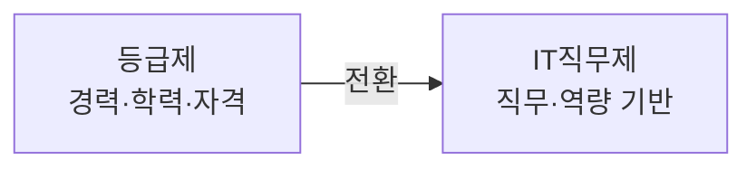

# 소프트웨어 기술자 구분 (등급제 → IT직무제)

## 1. 개요

### 가. 배경
> 과거 **기술자 등급제**(경력·학력·자격으로 등급 산정)가 폐지되고 **IT역량분류체계(SFIA 유사) 기반 IT직무제**로 전환되었으나, 현장에서는 여전히 등급제가 관행적으로 활용된다.

### 나. 필요성
- 역량 중심 평가로 **전문성·처우 개선**, 발주·대가 산정 합리화

## 2. 등급제와 IT직무제의 개념·특징

| 구분 | 기술자 등급제 | IT직무제 |
|---|---|---|
| **기준** | 경력·학력·자격 → 등급(초·중·고·특급) | **직무·역량 수준** 분류 |
| **관점** | 투입 인력의 등급(연공) | 수행 직무·전문성 |
| **대가 산정** | 등급별 노임단가 | 직무·역량 기반 |
| **장점** | 단순·객관 | 전문성 반영·경력개발 |
| **단점** | 연공서열·역량 미반영 | 현장 정착 미흡 |

## 3. 현행 IT직무제의 문제점

| 문제점 | 내용 |
|---|---|
| **현장 미정착** | 발주·계약서에 여전히 등급 요구 |
| **대가 기준 혼선** | 직무제 노임단가·기준 부재/모호 |
| **역량 평가 곤란** | 객관적 역량 측정 체계 미비 |
| **인식 부족** | 발주자·기업의 이해·수용 저조 |

## 4. 개선 방향

| 방향 | 내용 |
|---|---|
| **제도 정비** | 직무제 기반 대가·노임 기준 명확화 |
| **역량 인증** | 표준 역량체계·인증(경력관리시스템) |
| **인식 제고** | 발주 가이드·교육, 공공 선도 적용 |
| **단계적 전환** | 등급-직무 매핑, 병행 운영 후 이행 |

## 5. 고려사항 및 시사점
- 제도와 현장의 **간극 해소**가 핵심 — 대가 기준·발주 관행 개선
- 역량 중심 문화로 SW 기술자 처우·전문성 제고
- 소프트웨어 진흥법·대가 산정 가이드와 연계

---

> **한 줄 요약**: SW 기술자 구분은 *경력 기반 등급제* 에서 *직무·역량 기반 IT직무제* 로 전환됐으나 현장 미정착·대가 기준 혼선이 문제로, 직무제 대가 기준 명확화·역량 인증·인식 제고가 개선 방향이다.
