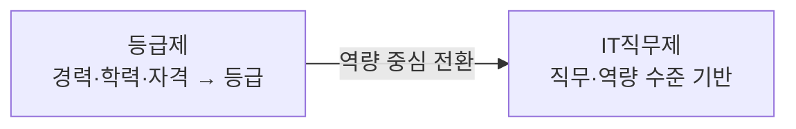

# 소프트웨어 기술자 구분 (등급제 → IT직무제)

## 1. 개요

### 가. 정의 및 배경
> **기술자 등급제**는 경력·학력·자격을 점수화해 초·중·고·특급으로 나누던 인력 분류 체계이고, **IT직무제**는 수행하는 **직무와 실제 역량 수준**을 기준으로 인력을 분류하는 역량 중심 체계다.

과거 SW 산업은 기술자 등급제에 기반해 인건비(노임단가)를 산정했다. 등급이 곧 단가였기에 계산은 단순했지만, "몇 년 일했는가"가 "무엇을 얼마나 잘하는가"를 대신하는 **연공서열형 평가**라는 근본 문제가 있었다. 같은 경력이라도 실력 차이가 큰 SW 직종의 특성이 전혀 반영되지 못한 것이다. 이에 정부는 2012년 SW기술자 신고제(등급제) 관련 규정을 폐지하고, 직무와 역량 중심의 IT직무제로의 전환을 추진했다.

### 나. 필요성
IT직무제의 필요성은 **전문성에 대한 정당한 보상**에서 나온다. 역량이 뛰어난 개발자가 경력만 앞선 인력보다 낮게 평가받으면 우수 인재는 산업을 떠나고, 발주 대가도 실제 가치와 어긋난다. 직무·역량 기반 분류는 이런 왜곡을 바로잡아 처우를 개선하고, 발주자가 필요한 역량을 명확히 요구하며 대가를 합리적으로 산정하도록 돕는다. 나아가 개인에게는 **경력개발 경로(Career Path)** 를 제시해 산업 전체의 전문성을 높이는 기반이 된다.

## 2. 등급제와 IT직무제의 개념·특징

등급제는 **투입 인력의 이력(input)** 을 본다. 경력·학력·자격증이라는 객관적 자료로 등급을 매기므로 계산이 쉽고 논란이 적지만, 실제 산출물의 질과 무관하게 등급이 고정된다. 반면 IT직무제는 **수행 직무와 그 직무에서 요구되는 역량 수준(competency)** 을 본다. 예컨대 SFIA(Skills Framework for the Information Age) 같은 국제 역량체계처럼 직무별로 요구 역량과 숙련 단계를 정의하고, 그 도달 수준으로 인력을 평가한다. 관점이 "얼마나 오래"에서 "얼마나 잘, 어떤 일을"로 이동한 것이 본질적 차이다.

| 구분 | 기술자 등급제 | IT직무제 |
|---|---|---|
| **기준** | 경력·학력·자격 → 등급(초·중·고·특급) | **직무·역량 수준** 분류 |
| **관점** | 투입 인력의 등급(연공) | 수행 직무·전문성 |
| **대가 산정** | 등급별 노임단가 | 직무·역량 기반 단가 |
| **장점** | 단순·객관적 산정 | 전문성 반영·경력개발 유도 |
| **단점** | 연공서열·역량 미반영 | 현장 정착 미흡·기준 부재 |

## 3. 현행 IT직무제의 문제점

제도는 바뀌었지만 현장은 여전히 등급제 관행에 머물러 있다는 것이 핵심 문제다. 가장 큰 원인은 **대가 산정 기준의 공백**이다. 등급제는 등급별 노임단가라는 명확한 숫자가 있었지만, 직무제는 이를 대체할 표준 단가·기준이 충분히 정비되지 않아 발주자가 계약서에 여전히 "중급 이상" 같은 등급을 요구한다. 또 역량을 객관적으로 측정할 인증 체계가 미비해 "이 사람이 해당 직무 역량을 갖췄다"를 증명하기 어렵고, 발주자·기업의 이해와 수용도도 낮다.

| 문제점 | 내용 |
|---|---|
| **현장 미정착** | 발주·계약서에 여전히 등급 요구 |
| **대가 기준 혼선** | 직무제 기반 노임단가·산정 기준 부재/모호 |
| **역량 평가 곤란** | 객관적 역량 측정·검증 체계 미비 |
| **인식 부족** | 발주자·기업의 이해·수용 저조 |

## 4. 개선 방향

문제의 뿌리가 "제도와 현장의 간극"이므로, 개선도 **간극을 메우는 실질 대책**이어야 한다. 우선 직무제 기반 대가·노임 기준을 명확히 세워 발주자가 등급 대신 직무로 요구할 수 있게 하고, 표준 역량체계와 인증(경력관리시스템 연계)을 마련해 역량을 증명 가능하게 만든다. 발주 가이드·교육으로 인식을 높이되, 공공 발주가 먼저 직무제를 적용해 시장을 선도하는 것이 효과적이다. 다만 급격한 전환은 혼란을 부르므로, 등급-직무를 매핑해 **병행 운영한 뒤 단계적으로 이행**하는 연착륙 전략이 현실적이다.

| 개선 방향 | 내용 |
|---|---|
| **제도 정비** | 직무제 기반 대가·노임 기준 명확화 |
| **역량 인증** | 표준 역량체계·인증(경력관리시스템 연계) |
| **인식 제고** | 발주 가이드·교육, 공공부문 선도 적용 |
| **단계적 전환** | 등급-직무 매핑 → 병행 운영 → 이행 |

## 5. 고려사항 및 시사점
- **제도와 현장의 간극 해소가 핵심**: 아무리 좋은 분류체계도 대가 산정·발주 관행이 뒷받침되지 않으면 사문화된다. 대가 기준 명확화가 최우선 과제다.
- **역량 중심 문화로의 전환**: 연공이 아닌 실력으로 평가받는 문화가 정착되면 SW 기술자의 처우와 산업 경쟁력이 함께 올라간다.
- **법·제도 연계**: 소프트웨어 진흥법과 SW사업 대가산정 가이드, 공공 SW 발주 제도와 정합적으로 연계해야 실효성이 확보된다.
- **국제 정합성**: SFIA 등 국제 역량체계와 호환되는 기준을 두면 글로벌 인력 이동·평가에도 대응할 수 있다.

---

> **한 줄 요약**: SW 기술자 구분은 *경력 기반 등급제* 에서 *직무·역량 기반 IT직무제* 로 전환됐으나 현장 미정착·대가 기준 혼선이 문제로, 직무제 대가 기준 명확화·역량 인증·인식 제고·단계적 전환이 핵심 개선 방향이다.
