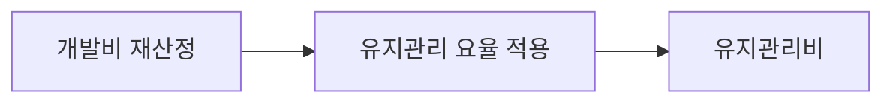
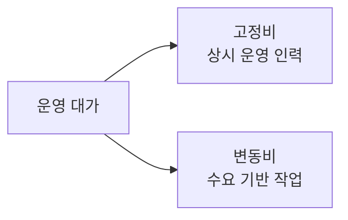

# 소프트웨어 운영단계 대가산정 (SW사업 대가 산정 가이드 2023)

## 1. 개요

### 가. 정의
> 「소프트웨어사업 대가 산정 가이드(2023 개정)」에 따라 **SW 운영단계(유지관리·운영)의 대가를 객관적 기준으로 산정**하여 발주·계약의 합리적 근거를 제공하는 방식.

SW의 총소유비용은 개발보다 운영·유지관리 기간에 더 많이 발생한다. 그러나 그동안 운영 대가는 "관행적으로 개발비의 몇 %"처럼 근거가 약하게 책정되는 경우가 많았고, 이는 저가 수주와 품질 저하, 혹은 반대로 과다 계상의 원인이 되었다. 대가 산정 가이드는 이런 임의성을 줄이고 **기능 규모(기능점수)·투입공수·SLA 같은 측정 가능한 지표에 근거**해 대가를 산출하도록 표준화한 것이다.

### 나. 유지관리와 운영의 구분
가이드는 운영단계를 성격이 다른 두 활동으로 나눈다. **유지관리**는 인도된 응용SW의 하자를 고치고 소규모 기능을 개선·보수하는 활동으로, 그 부담이 대체로 **SW의 규모(기능점수)에 비례**한다. 반면 **SW운영**은 시스템이 안정적으로 돌아가도록 상시 관제·장애대응·형상관리를 수행하는 활동으로, 그 부담은 규모보다 **투입 인력과 서비스 수준(SLA)** 에 좌우된다. 성격이 다르므로 산정식도 달라야 한다는 것이 이 구분의 이유다.

## 2. 응용SW 요율제 유지관리비

유지관리비는 **재산정한 개발비에 유지관리 요율(%)을 곱하는** 방식으로 구한다. 여기서 "개발비 재산정"이 핵심인데, 이는 이미 운영 중인 SW의 기능 규모를 현재 기준(기능점수·단가)으로 다시 계산한 값이다. 유지관리 부담이 SW 규모에 비례한다는 전제 위에서, 규모를 개발비로 환산하고 거기에 요율을 곱하는 것이다. 요율은 통상 10~15% 수준을 기준으로 하되, 서비스 수준·난이도·장애 대응 시간 등 보정계수를 반영해 조정한다. 예를 들어 재산정 개발비가 10억 원이고 요율이 12%라면 연간 유지관리비는 약 1.2억 원으로 산출된다. 이 방식은 규모라는 객관 지표에 기대므로 **간편하고 다툼이 적다**는 장점이 있다.

| 항목 | 내용 |
|---|---|
| 산정식 | 유지관리비 = 개발비(재산정) × 유지관리 요율(%) |
| 요율 | 서비스 수준·난이도 보정계수 반영(통상 10~15% 수준) |
| 전제 | 유지관리 부담이 SW 규모(기능점수)에 비례 |
| 특징 | 규모 기반, 간편·객관, 분쟁 여지 적음 |

## 3. SW운영 투입공수 산정방식

운영비는 규모가 아니라 **실제로 몇 명이 얼마나 투입되는가**로 산정하는 것이 합리적이다. 상시 관제·장애대응 같은 활동은 SW가 크든 작든 정해진 인력이 근무해야 하기 때문이다. 그래서 산정식은 `운영비 = 투입공수(M/M) × 노임단가 + 경비·이윤` 형태를 취한다. 투입공수는 운영 대상 규모, 업무량, SLA(가용성·응답시간 목표)를 근거로 산정한다. 예컨대 24시간 관제가 필요한 시스템은 교대 근무를 고려한 인력이 산정되어, 동일 규모라도 SLA가 높을수록 공수가 늘어난다. 이처럼 투입공수 방식은 **운영의 인력 집약적 성격을 그대로 반영**한다.

| 항목 | 내용 |
|---|---|
| 산정식 | 운영비 = 투입공수(M/M) × 노임단가 + 경비·이윤 |
| 투입공수 산정 | 운영 업무량·SLA·대상 규모 기반 |
| 전제 | 운영 부담이 규모보다 투입 인력에 비례 |
| 특징 | 실 투입 기반, 상시 운영 성격에 적합 |

## 4. 고정비/변동비 산정방식

운영 업무는 성격상 "항상 필요한 부분"과 "요청이 있을 때만 발생하는 부분"이 섞여 있다. 이를 한 방식으로 뭉뚱그리면 실제 소요와 대가가 어긋난다. 그래서 상시 관제·기본 유지 같은 **고정비**(월정액 성격)와, 기능개선·장애대응처럼 요청·작업량에 따라 오르내리는 **변동비**를 분리해 산정한다. 이렇게 나누면 예측 가능한 기본 비용은 안정적으로 보장하고, 변동 요소는 실제 발생분만큼 정산할 수 있어 **발주자·수행사 모두에게 공정**하다. 실무에서는 대개 고정비를 뼈대로 두고 변동비를 얹는 혼합 방식을 쓴다.

| 구분 | 내용 | 성격 |
|---|---|---|
| 고정비 | 상시 운영 인력·기본 유지 비용 | 월정액, 예측 가능 |
| 변동비 | 개선·장애 등 요청·작업량 연동 비용 | 실적 정산 |
| 적용 | 서비스 특성에 따라 고정+변동 혼합 | 공정성·유연성 |

## 5. 고려사항 및 시사점
- **성격에 맞는 방식 선택**: 규모 비례가 뚜렷한 유지관리는 요율제, 인력 집약적 운영은 투입공수, 수요 변동이 큰 업무는 고정+변동 혼합이 적합하다. 하나의 만능식을 강요하면 저가·과다 왜곡이 생긴다.
- **SLA·업무량 기반 계량화**: 대가 근거를 SLA·업무량 같은 측정지표로 명시해야 저가 수주와 품질 저하의 악순환을 끊을 수 있다.
- **공공SW 대가 현실화**: 가이드의 취지는 대가를 현실화해 인력 처우와 SW 품질을 함께 끌어올리는 데 있으며, 이는 산업 생태계 지속성과 직결된다.
- **한계와 협의**: 요율·보정계수에는 여전히 협의 여지가 있어, 발주 시 SLA·산출물·투입 계획을 계약서에 구체화해 해석 분쟁을 줄여야 한다.

---

> **한 줄 요약**: SW 운영단계 대가는 규모에 비례하는 *유지관리를 요율제(개발비×요율)* 로, 인력에 비례하는 *운영을 투입공수(M/M×단가)* 로 산정하고, 상시 비용은 고정비·작업량 연동 비용은 변동비로 나눠 **성격에 맞게 계량화**하는 것이 핵심이다.
