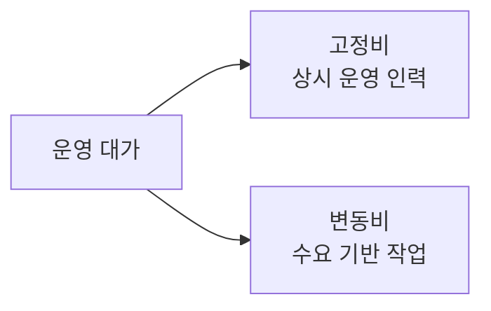

# 소프트웨어 운영단계 대가산정 (SW사업 대가 산정 가이드 2023)

## 1. 개요

### 가. 정의
> 「소프트웨어사업 대가 산정 가이드(2023 개정)」에 따라 **SW 운영단계(유지관리·운영)의 대가를 객관적으로 산정**하는 방식. 발주·계약의 합리적 근거 제공.

### 나. 구분
- **유지관리**(응용SW 하자·기능개선)와 **SW운영**(시스템 안정 운영)으로 구분 산정

## 2. 응용SW 요율제 유지관리비

| 항목 | 내용 |
|---|---|
| **산정식** | 유지관리비 = **개발비(재산정) × 유지관리 요율(%)** |
| **요율** | 서비스 수준·난이도 등 보정계수 반영(통상 10~15% 수준) |
| **특징** | 개발 규모(기능점수) 기반, 간편·객관 |

## 3. SW운영 투입공수 산정방식

| 항목 | 내용 |
|---|---|
| **산정식** | 운영비 = **투입공수(M/M) × 노임단가 + 경비·이윤** |
| **투입공수** | 운영 업무량·서비스 수준(SLA)·대상 규모 기반 산정 |
| **특징** | 실제 투입 인력 기반, 운영 성격에 적합 |

## 4. 고정비/변동비 산정방식

| 구분 | 내용 |
|---|---|
| **고정비** | 상시 필요한 운영 인력·기본 유지 비용(월정액 성격) |
| **변동비** | 요청·작업량에 따라 변동하는 비용(개선·장애 대응 등) |
| **적용** | 서비스 특성에 따라 고정+변동 혼합 산정 |

## 5. 고려사항 및 시사점
- **SLA·업무량 기반 객관 산정**으로 저가·과다 방지
- 유지관리(요율제)와 운영(투입공수) 성격에 맞는 방식 선택
- 공공SW 사업 대가 현실화·품질 확보와 연계

---

> **한 줄 요약**: SW 운영단계 대가는 *응용SW 요율제(개발비×요율) 유지관리비* 와 *투입공수(M/M×단가) 운영비* 로 산정하며, 상시 비용은 고정비·작업량 기반은 변동비로 나눠 산정한다.
