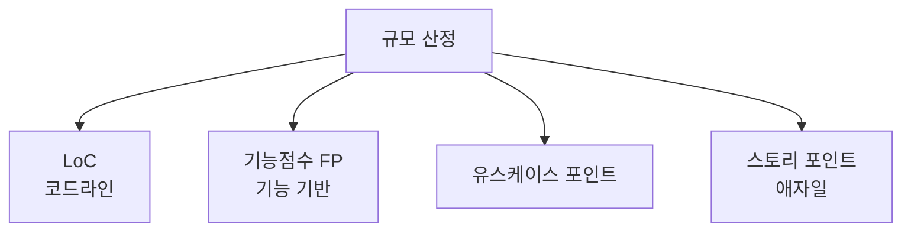

# 소프트웨어 규모 산정 방식과 공공SW 개선방안

## 1. 개요

### 가. 정의
> 소프트웨어 개발에 필요한 **규모(크기)를 정량적으로 추정**하는 방식. 개발비·공수·일정 산정의 기초.

### 나. 필요성
- 객관적 대가·일정 산정, 저가수주·과업 분쟁 방지

## 2. 규모 산정 방식 종류·특징

| 방식 | 특징 | 장단점 |
|---|---|---|
| **LoC(코드라인)** | 소스 라인 수 기반 | 단순하나 언어·스타일 의존, 초기 추정 곤란 |
| **기능점수(FP)** | 사용자 기능(입력·출력·조회·파일·인터페이스) 기반 | **언어 독립·표준(ISO)**, 공공 표준, 측정 노력 |
| **유스케이스 포인트** | 유스케이스 복잡도 기반 | 객체지향 적합 |
| **스토리 포인트** | 상대적 규모(애자일) | 팀 종속·상대 추정 |

- 공공은 **기능점수(FP)** 기반 대가 산정이 표준

## 3. 기능점수(FP) 산정

| 단계 | 내용 |
|---|---|
| **기능 식별** | 데이터기능(ILF·EIF)·트랜잭션기능(EI·EO·EQ) |
| **복잡도 가중** | 기능별 복잡도 반영 |
| **보정** | 간이법(평균 복잡도) vs 정통법 |

## 4. 공공SW 규모 산정 현실적 개선 방안

| 문제 | 개선 방안 |
|---|---|
| **요구 불명확 시 산정 부정확** | 단계별 재산정(분석 후 확정), 상세화 |
| **과업 변경 미반영** | 과업변경 심의·대가 재산정 |
| **저가 수주** | 적정 대가·원가 기반 하한, SW영향평가 |
| **FP 측정 부담** | 자동화 도구, 표준·교육 |

## 5. 고려사항 및 시사점
- **기능점수 기반 객관 산정 + 과업변경 관리**가 핵심
- SW사업 대가 산정 가이드·진흥법과 연계
- 애자일·클라우드 사업에 맞는 산정 방식 보완 필요

---

> **한 줄 요약**: SW 규모 산정은 *LoC·기능점수(FP)·유스케이스·스토리 포인트* 방식이 있고 공공은 언어 독립적인 FP가 표준이며, 요구 상세화·과업변경 반영·적정 대가 확보가 공공SW 산정의 개선 방향이다.
