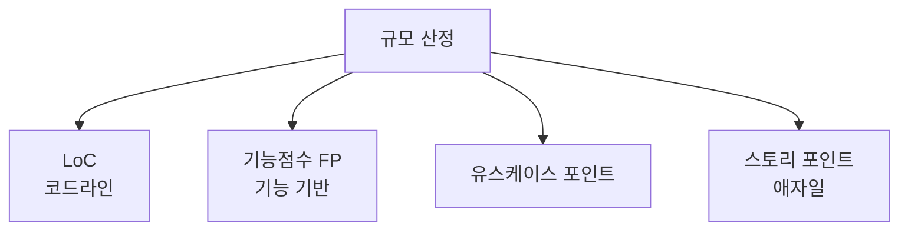

# 소프트웨어 규모 산정 방식과 공공SW 개선방안

## 1. 개요

### 가. 정의
> 소프트웨어 개발에 필요한 **규모(크기)를 정량적으로 추정**하는 방식으로, 개발비·투입공수(M/M)·일정 산정의 출발점이 된다.

규모 산정은 "얼마나 큰 소프트웨어를 만드는가"를 숫자로 환산하는 작업이다. 규모가 정해져야 생산성(단위 규모당 공수)을 곱해 공수·비용·일정을 도출할 수 있으므로, 규모 산정은 모든 SW 견적의 **최상위 기준점**이다. 산정 방식은 무엇을 크기의 단위로 삼느냐에 따라 갈리며, 각 방식은 측정 시점·정확도·객관성에서 뚜렷한 트레이드오프를 가진다.

### 나. 등장 배경 및 필요성
과거 SW 대가는 인력 수·기간 같은 투입(input) 중심으로 산정되어 근거가 취약했고, 이는 발주자·수행사 간 **과업 분쟁**과 **저가 수주** 후 품질 저하로 이어졌다. 소프트웨어는 물리적 실체가 없어 "얼마짜리인지"를 객관적으로 합의하기 어렵기 때문에, 산출물(output) 기반의 표준화된 규모 척도가 필요해졌다. 특히 공공 부문은 예산 집행의 투명성과 공정성이 요구되므로, 언어·기술에 독립적이고 표준화된 산정 방식을 대가 기준으로 채택하게 되었다.

## 2. 규모 산정 방식 종류·특징

네 방식은 크게 **"코드 기반(LoC)"과 "기능 기반(FP·UCP·SP)"** 으로 나뉜다. LoC는 완성된 소스의 라인 수를 세므로 직관적이지만, 같은 기능도 언어·개발자 스타일에 따라 라인 수가 크게 달라지고 개발이 끝나야 정확히 셀 수 있어 **초기 견적에 부적합**하다. 반대로 기능점수(FP)는 "사용자에게 제공되는 기능"을 단위로 삼기 때문에 구현 언어와 무관하게 요구분석 단계에서 산정할 수 있고 국제표준(ISO/IEC 20926 등)으로 정립되어 있어 **객관성·재현성**이 높다. 유스케이스 포인트는 UML 유스케이스의 복잡도를 활용해 객체지향 프로젝트에 적합하고, 스토리 포인트는 애자일 팀이 상대적 크기로 추정하는 방식이라 팀 내부에서는 유용하나 팀 간 비교에는 쓰기 어렵다.

| 방식 | 크기 단위 | 장점 | 단점 |
|---|---|---|---|
| **LoC(코드라인)** | 소스 라인 수 | 단순·직관적 | 언어·스타일 의존, 초기 추정 곤란 |
| **기능점수(FP)** | 사용자 기능 | 언어 독립, 국제표준, 초기 산정 가능 | 측정에 전문성·노력 필요 |
| **유스케이스 포인트** | 유스케이스 복잡도 | 객체지향·UML 프로젝트 적합 | 유스케이스 작성 품질 의존 |
| **스토리 포인트** | 상대적 규모 | 애자일 반복 추정에 유용 | 팀 종속, 팀 간 비교 곤란 |

이러한 특성 때문에 **공공 SW사업은 기능점수(FP)** 를 대가 산정의 표준으로 채택하고 있다.

## 3. 기능점수(FP) 산정

FP는 소프트웨어가 사용자에게 제공하는 기능을 **데이터 기능**과 **트랜잭션 기능**으로 나누어 계량한다. 데이터 기능은 시스템이 유지·참조하는 논리 데이터 집합이고, 트랜잭션 기능은 사용자가 수행하는 처리 단위다. 각 기능의 복잡도(단순/보통/복잡)에 따라 가중치를 부여해 합산한다.

| 단계 | 내용 |
|---|---|
| **기능 식별** | 데이터기능(내부논리파일 ILF·외부연계파일 EIF)·트랜잭션기능(외부입력 EI·외부출력 EO·외부조회 EQ) |
| **복잡도 가중** | 기능별 복잡도(단순·보통·복잡)에 가중치 부여 |
| **보정·집계** | 간이법(평균 복잡도 적용) 또는 정통법(개별 복잡도 산정)으로 총 FP 산출 |

실무에서는 요구가 확정되기 전 초기 단계에는 평균 복잡도를 적용하는 **간이법**으로 빠르게 추정하고, 설계가 상세해진 뒤 개별 복잡도를 반영하는 **정통법**으로 정밀화하는 식으로 단계적으로 정확도를 높인다. 예컨대 100 FP 규모로 산정된 사업에 SW사업 대가기준의 단가를 곱해 개발비를 도출한다.

## 4. 공공SW 규모 산정 현실적 개선 방안

공공 SW사업의 산정 문제는 대부분 "사업 초기 요구가 불명확한데 그 시점에 대가를 고정"하는 구조적 모순에서 비롯된다. 아래 개선 방안은 이 모순을 완화하는 방향이다.

| 문제 | 원인 | 개선 방안 |
|---|---|---|
| **요구 불명확 시 산정 부정확** | 착수 시점 요구 미확정 | 분석 완료 후 **단계별 재산정**(요구 상세화 뒤 확정) |
| **과업 변경 미반영** | 계약 후 요구 증가 | 과업변경 심의위원회, 변경분 대가 재산정 |
| **저가 수주** | 최저가 경쟁 | 적정 대가·원가 기반 하한 설정, SW영향평가 |
| **FP 측정 부담** | 측정 전문성·시간 소요 | 자동화 도구, 표준·교육, 전문 인력 양성 |

핵심은 규모를 한 번에 못 박지 않고 **분석 후 재산정(단계적 확정)** 과 **과업변경 관리**를 제도화하는 것이다. 요구가 늘면 그만큼 대가를 재산정할 수 있어야 저가 수주와 무리한 과업 추가(velvet)를 막을 수 있다.

## 5. 고려사항 및 시사점
기술사 관점에서 SW 규모 산정은 단순 견적 기법이 아니라 **발주자와 수행사 간 신뢰를 담보하는 제도적 장치**로 보아야 한다. 첫째, 기능점수 기반의 객관적 산정과 과업변경 관리를 결합해야 산정의 정확성과 공정성이 함께 확보된다. 둘째, SW사업 대가 산정 가이드·SW진흥법과 연계해 적정 대가를 보장함으로써 산업 생태계의 건전성을 지킨다. 셋째, 애자일·클라우드(SaaS 구독)·유지보수 사업처럼 전통적 FP로 담기 어려운 사업 유형이 늘고 있어, 스토리 포인트·서비스 규모 등을 반영한 **산정 방식의 다변화·보완**이 향후 과제다.

---

> **한 줄 요약**: SW 규모 산정은 *LoC·기능점수(FP)·유스케이스·스토리 포인트* 방식으로 나뉘고 공공은 언어 독립적·표준화된 FP가 기준이며, 요구 상세화 후 단계적 재산정·과업변경 반영·적정 대가 확보가 공공SW 산정의 핵심 개선 방향이다.
