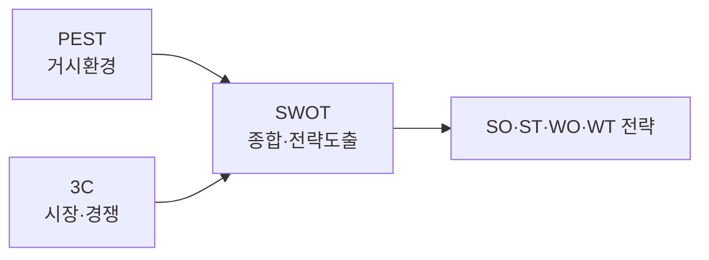

# 경영환경 분석: SWOT · 3C · PEST

## 1. 개요
> 사업·정보화 전략 수립을 위해 **내·외부 경영환경을 체계적으로 진단**하는 대표 프레임워크. 관점(거시·시장·종합)과 적용 조건이 다르며, **연계 활용**할 때 효과적이다.

## 2. 세 기법 개요 비교

| 기법 | 관점 | 구성요소 |
|---|---|---|
| **PEST** | 거시 외부환경 | 정치(Political)·경제(Economical)·사회(Social)·기술(Technological) |
| **3C** | 시장·경쟁 구도 | 고객(Customer)·경쟁사(Competitor)·자사(Company) |
| **SWOT** | 내부+외부 종합 | 강점·약점(내부), 기회·위협(외부) |

## 3. PEST 분석
- **특성**: 통제 불가한 **거시 환경 변화**를 조망, 장기·전략적 방향 설정
- **적용 조건**: 신시장 진입, 중장기 계획, 규제·기술 변화가 큰 산업
- **방법**: 4개 요인별 변화 도출 → 사업 영향(기회/위협) 평가 → 시나리오화

| 요인 | 예시 |
|---|---|
| **P** | 규제·정책, 세제, 정치 안정성 |
| **E** | 경기·금리·환율, 소득수준 |
| **S** | 인구·라이프스타일·가치관 |
| **T** | 신기술·특허·디지털 전환 |

## 4. 3C 분석
- **특성**: **시장 진입·경쟁 전략** 수립에 적합, 성공요인(KSF) 도출
- **적용 조건**: 특정 시장·제품의 경쟁 포지셔닝 결정 시
- **방법**: 고객 니즈·세분화 → 경쟁사 강·약점 → 자사 역량 비교 → **차별화 전략** 도출

## 5. SWOT 분석
- **특성**: 앞선 분석 결과를 **종합**해 전략을 도출하는 매트릭스
- **적용 조건**: 내·외부 요인이 정리된 뒤 최종 전략 수립 단계
- **방법(교차 전략 도출)**:

| 구분 | 기회(O) | 위협(T) |
|---|---|---|
| **강점(S)** | **SO**: 강점으로 기회 활용(공격) | **ST**: 강점으로 위협 회피 |
| **약점(W)** | **WO**: 약점 보완해 기회 활용 | **WT**: 약점·위협 최소화(방어) |

## 6. 연계 활용 및 시사점
- **PEST(거시) → 3C(시장) → SWOT(종합)** 순으로 분석하면 외부·시장 정보가 SWOT의 O/T·S/W 도출 근거가 됨
- 정보화 전략(ISP)·사업 타당성 분석의 환경분석 단계에 표준적으로 활용
- 정성 분석의 **주관성** 한계 → 정량 데이터·전문가 검토로 보완

---

> **한 줄 요약**: PEST(거시환경)·3C(고객·경쟁사·자사)로 외부·시장을 분석하고 SWOT로 내·외부를 종합해 SO·ST·WO·WT 전략을 도출하며, PEST→3C→SWOT의 연계 활용이 효과적이다.
