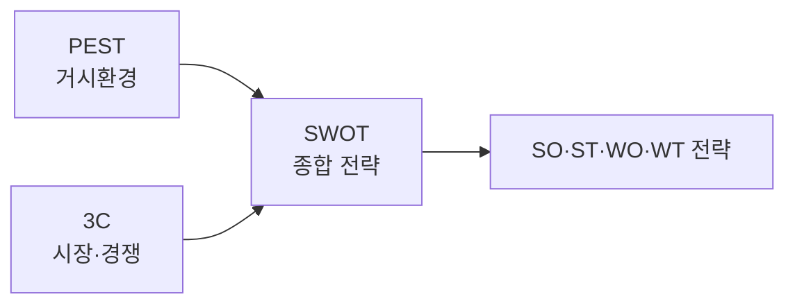

# 경영환경 분석: SWOT · 3C · PEST

## 1. 개요
> 사업·정보화 전략 수립을 위해 **내·외부 환경을 분석**하는 대표 프레임워크로, 관점과 적용 조건이 다르다.

## 2. 세 기법 비교

| 기법 | 관점 | 구성요소 |
|---|---|---|
| **SWOT** | 내부+외부 종합 | 강점·약점(내부), 기회·위협(외부) |
| **3C** | 시장 경쟁 구도 | 고객(Customer)·경쟁사(Competitor)·자사(Company) |
| **PEST** | 거시 환경 | 정치·경제·사회·기술 |

## 3. 기법별 특성·적용 조건·방법

| 기법 | 특성·적용 조건 | 분석 방법 |
|---|---|---|
| **PEST** | **거시환경** 변화 파악에 적합, 장기·외부 요인 분석 | 정치·경제·사회·기술 요인 도출·영향 평가 |
| **3C** | **시장 진입·경쟁 전략** 수립에 적합 | 고객 니즈·경쟁사 강약·자사 역량 분석 |
| **SWOT** | 종합 진단·전략 도출에 적합, 앞선 분석 결과 종합 | 내·외부 요인 매트릭스화 후 **SO·WO·ST·WT 전략** 도출 |

## 4. 시사점
- **PEST·3C로 외부·시장을 분석 → SWOT로 종합**해 전략 도출하는 연계 활용이 효과적

---

> **한 줄 요약**: PEST(거시환경)·3C(고객·경쟁사·자사)로 외부·시장을 분석하고 SWOT로 내·외부를 종합해 SO·ST·WO·WT 전략을 도출한다.
