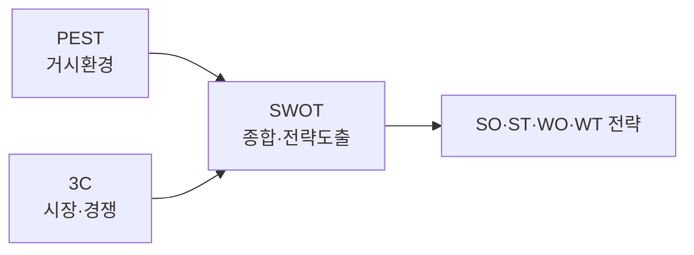

# 경영환경 분석: SWOT · 3C · PEST

## 1. 개요

### 가. 정의
> 사업·정보화 전략 수립에 앞서 조직을 둘러싼 **내·외부 경영환경을 체계적으로 진단**하기 위한 대표 분석 프레임워크로, 각각 거시환경·시장경쟁·종합의 서로 다른 관점을 담당한다.

세 기법은 경쟁 관계가 아니라 **분석의 계층(scope)** 이 다르다. PEST는 통제 불가능한 거시 환경을, 3C는 그 안의 특정 시장·경쟁 구도를, SWOT는 앞선 분석을 내부 역량과 결합해 전략으로 종합한다. 따라서 하나만 쓰기보다 **PEST→3C→SWOT의 순서로 연계**할 때 분석의 논리적 근거가 탄탄해진다.

### 나. 등장 배경 및 필요성
전략은 "우리가 무엇을 잘하는가(내부)"만으로는 세울 수 없고, 시장·규제·기술 같은 **외부 변화 속에서 우리의 위치**를 읽어야 한다. 직관과 경험에만 의존한 전략은 환경 변화를 놓쳐 실패하기 쉽기 때문에, 외부·시장·내부를 빠짐없이 짚는 구조화된 체크리스트가 필요해졌다. 이 프레임워크들은 분석의 누락을 막고 이해관계자 간 **공통의 논의 언어**를 제공한다는 점에서 정보화 전략계획(ISP)·사업 타당성 분석의 표준 도구로 쓰인다.

## 2. 세 기법 개요 비교

PEST가 산업 전체에 영향을 주는 넓은 환경을 조망한다면, 3C는 그 산업 안에서 우리가 경쟁하는 구체적 시장을 들여다보고, SWOT는 이 외부 정보(기회·위협)에 내부 진단(강점·약점)을 더해 실행 가능한 전략으로 응축한다. 즉 앞의 두 기법이 SWOT의 입력을 만들어주는 구조다.

| 기법 | 관점 | 구성요소 | 산출물 |
|---|---|---|---|
| **PEST** | 거시 외부환경 | 정치·경제·사회·기술 | 기회/위협의 원천 |
| **3C** | 시장·경쟁 구도 | 고객·경쟁사·자사 | 핵심성공요인(KSF)·차별화 |
| **SWOT** | 내부+외부 종합 | 강점·약점(내부)·기회·위협(외부) | SO·ST·WO·WT 전략 |

## 3. PEST 분석

PEST는 조직이 통제할 수 없는 **거시 환경 변화**를 정치(Political)·경제(Economical)·사회(Social)·기술(Technological)의 네 축으로 조망해, 장기·전략적 방향을 설정하는 데 쓰인다. 규제·기술 변화가 큰 산업이나 신시장 진입, 중장기 계획을 세울 때 특히 유효하다. 방법은 4개 요인별 변화를 도출한 뒤 각 변화가 사업에 기회인지 위협인지 평가하고, 여러 조합을 시나리오로 구성한다. 예컨대 전기차 기업이라면 탄소규제 강화(P)는 기회, 배터리 원자재 가격 급등(E)은 위협으로 읽어 대응 시나리오를 나눈다.

| 요인 | 예시 |
|---|---|
| **P(정치)** | 규제·정책, 세제, 정치 안정성 |
| **E(경제)** | 경기·금리·환율, 소득수준 |
| **S(사회)** | 인구·라이프스타일·가치관 |
| **T(기술)** | 신기술·특허·디지털 전환 |

## 4. 3C 분석

3C는 **시장 진입·경쟁 전략** 수립에 초점을 맞춰, 고객(Customer)·경쟁사(Competitor)·자사(Company)의 세 축을 교차 분석해 **핵심성공요인(KSF)** 과 차별화 전략을 도출한다. 먼저 고객의 니즈와 세분화를 파악하고, 경쟁사의 강·약점을 분석한 뒤, 이 둘에 비추어 자사의 역량을 비교한다. 차별화란 결국 "고객이 원하는데 경쟁사는 못 주고 우리는 줄 수 있는" 지점을 찾는 일이다. 예를 들어 배달 플랫폼이 3C를 적용하면, 빠른 배달을 원하는 고객(C)과 수수료 경쟁 중인 경쟁사(C)를 놓고 자사(C)의 물류 역량으로 "초단시간 배달"이라는 차별점을 세울 수 있다.

## 5. SWOT 분석

SWOT는 PEST·3C 등에서 정리된 외부 요인(기회 O·위협 T)과 내부 요인(강점 S·약점 W)을 하나의 매트릭스로 **종합해 전략을 도출**하는 단계다. 따라서 SWOT는 분석의 시작이 아니라 앞선 분석이 끝난 뒤 수행해야 실효가 있다. 핵심은 단순히 4칸을 채우는 것이 아니라, 내부·외부 요인을 **교차(cross)** 시켜 구체적 전략을 뽑아내는 데 있다.

| 구분 | 기회(O) | 위협(T) |
|---|---|---|
| **강점(S)** | **SO**: 강점으로 기회 활용(공격·확대) | **ST**: 강점으로 위협 회피 |
| **약점(W)** | **WO**: 약점 보완해 기회 활용 | **WT**: 약점·위협 최소화(방어·철수) |

예컨대 강력한 브랜드(S)와 신흥시장 성장(O)이 만나면 공격적 진출(SO), 기술 인력 부족(W)과 급변하는 기술(T)이 만나면 아웃소싱·제휴로 리스크를 줄이는 방어 전략(WT)이 도출된다.

## 6. 고려사항 및 시사점
기술사 관점에서 이 프레임워크들의 가치는 개별 사용이 아니라 **연계 활용**에 있다. PEST(거시)→3C(시장)→SWOT(종합) 순으로 진행하면 외부·시장 분석 결과가 그대로 SWOT의 O/T·S/W를 도출하는 **근거**가 되어 전략의 논리적 일관성이 확보된다. 이 흐름은 ISP·사업 타당성 분석의 환경분석 단계에 표준으로 쓰인다. 다만 세 기법 모두 분석자의 주관이 개입되는 **정성 분석**이므로, 시장 데이터·전문가 검토·정량 지표로 보완해 편향을 줄여야 한다. 또한 환경은 계속 변하므로 한 번의 분석으로 끝내지 말고 주기적으로 갱신하는 것이 바람직하다.

---

> **한 줄 요약**: PEST(거시환경)·3C(고객·경쟁사·자사)로 외부·시장을 진단하고 SWOT로 내·외부를 종합해 SO·ST·WO·WT 전략을 도출하며, PEST→3C→SWOT의 연계 활용과 정량 데이터 보완이 효과적 환경분석의 핵심이다.
