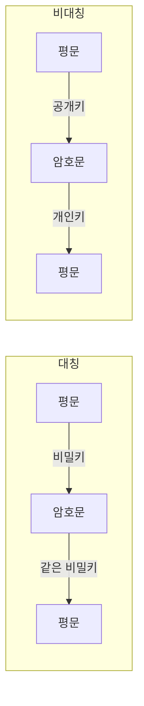

# 대칭 암호화와 비대칭 암호화

## 1. 개요

### 가. 정의
- **대칭 암호화**: 암·복호에 **동일한 키(비밀키)** 를 사용
- **비대칭 암호화**: **공개키·개인키 쌍**을 사용(한 키로 암호화, 다른 키로 복호화)

### 나. 필요성
- 대칭의 **키 분배 문제**를 비대칭이 해결, 비대칭의 **느린 성능**을 대칭이 보완 → 하이브리드

## 2. 방식 비교

| 구분 | 대칭 암호화 | 비대칭 암호화 |
|---|---|---|
| **키** | 동일 비밀키 | 공개키/개인키 쌍 |
| **속도** | 빠름 | 느림(수백~수천 배) |
| **키 분배** | 어려움(사전 공유) | 용이(공개키 배포) |
| **키 개수** | n(n-1)/2 | 2n |
| **알고리즘** | AES, DES, SEED, ARIA | RSA, ECC, ElGamal |
| **용도** | 대용량 데이터 암호화 | 키 교환·전자서명 |

## 3. 제공 보안 서비스

| 서비스 | 실현 |
|---|---|
| **기밀성** | 대칭(빠름) + 비대칭(키 전달) |
| **인증·부인방지** | 개인키 전자서명 |
| **무결성** | 해시 + 서명 |

## 4. 하이브리드(전자봉투)
- 데이터는 **세션키(대칭)** 로 암호화, 세션키는 **수신자 공개키(비대칭)** 로 암호화 → TLS·S/MIME 기본 구조

## 5. 고려사항 및 시사점
- **키 관리(HSM·수명주기)**, 안전한 키 길이(AES-256, RSA-2048↑)
- ECC로 짧은 키·고효율, **양자내성암호(PQC)** 전환 대비
- 성능·보안 요구에 따라 대칭·비대칭 조합 설계

---

> **한 줄 요약**: 대칭 암호화는 *동일 비밀키로 빠르나 키 분배가 어렵고*, 비대칭 암호화는 *공개/개인키로 키 분배·전자서명에 유리하나 느려*, 실무에서는 전자봉투처럼 하이브리드로 결합한다.
