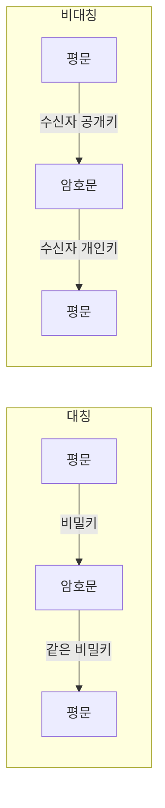

# 대칭 암호화와 비대칭 암호화

## 1. 개요

### 가. 정의
> **대칭 암호화(Symmetric)** 는 암호화와 복호화에 **동일한 비밀키**를 사용하는 방식이고, **비대칭 암호화(Asymmetric, 공개키 암호)** 는 수학적으로 짝을 이루는 **공개키·개인키 쌍**을 사용해 한 키로 암호화하면 나머지 키로만 복호화되는 방식이다.

두 방식의 근본적 차이는 "키를 공유하느냐, 나누느냐"에 있다. 대칭 암호는 송·수신자가 **같은 비밀을 미리 공유**해야 하므로 빠르지만 그 비밀을 안전하게 전달하는 문제가 남는다. 비대칭 암호는 키를 **공개용과 비밀용으로 분리**해, 공개키는 누구에게나 배포하고 개인키는 소유자만 보관한다. 이 비대칭성 덕분에 사전 공유 없이도 안전한 통신과 신원 증명이 가능해진다.

### 나. 등장 배경 및 필요성
초기 암호는 모두 대칭 방식이었고, 참여자가 늘어날수록 **키 분배(Key Distribution)** 가 난제가 되었다. n명이 서로 통신하려면 n(n-1)/2개의 비밀키가 필요하고, 이 키들을 어떻게 안전하게 나눠 갖느냐는 그 자체로 또 다른 보안 채널을 요구했다. 1976년 Diffie-Hellman이 공개키 개념을 제시하면서 이 순환 문제를 깼고, 이후 RSA가 실용적 알고리즘으로 구현되었다. 그러나 공개키 연산은 대칭에 비해 수백~수천 배 느려 대용량 데이터에는 부적합하다. 그래서 실무는 **비대칭으로 키를 교환하고 대칭으로 본문을 암호화**하는 하이브리드 구조로 두 방식의 장점만 취한다.

## 2. 동작 방식 비교

대칭 방식은 하나의 비밀키가 암·복호 양쪽에서 그대로 쓰이므로 연산이 단순하고 빠르다. AES 같은 블록 암호는 하드웨어 가속(AES-NI)까지 지원되어 초당 수 GB를 처리한다. 반면 비대칭은 큰 정수의 거듭제곱·소인수분해 난이도(RSA)나 타원곡선 이산대수(ECC) 같은 **수학적 난제**에 안전성을 기대므로 연산 비용이 크다. 그 대신 공개키를 공개해도 개인키를 역산할 수 없어, 키를 사전 공유할 필요가 사라진다.

| 구분 | 대칭 암호화 | 비대칭 암호화 |
|---|---|---|
| **키** | 동일 비밀키 | 공개키/개인키 쌍 |
| **속도** | 빠름 | 느림(수백~수천 배) |
| **키 분배** | 어려움(사전 공유 필요) | 용이(공개키 배포) |
| **키 개수** | n(n-1)/2 | 2n |
| **알고리즘** | AES, SEED, ARIA, DES | RSA, ECC, ElGamal |
| **용도** | 대용량 데이터 암호화 | 키 교환·전자서명 |

키 개수 차이가 핵심 트레이드오프를 잘 보여준다. 100명이 통신할 때 대칭은 약 4,950개의 키를 관리해야 하지만, 비대칭은 각자 한 쌍씩 200개면 된다. 즉 **참여자가 많고 사전 관계가 없는 개방형 환경일수록 비대칭이 유리**하다.

## 3. 제공 보안 서비스

암호 방식의 선택은 어떤 보안 서비스가 필요한지에 따라 달라진다. **기밀성**은 대칭·비대칭 모두 제공하지만, 성능 때문에 실제로는 본문을 대칭으로 암호화하고 그 세션키만 비대칭으로 보호한다. **인증과 부인방지**는 비대칭 고유의 강점이다. 송신자가 자신의 **개인키로 서명**하면 누구나 그의 공개키로 검증할 수 있는데, 개인키는 본인만 가지므로 "그가 서명했음"을 부인할 수 없다. **무결성**은 원문의 해시값을 서명해, 전송 중 변조되면 해시가 달라져 검증에 실패하는 원리로 보장한다.

| 서비스 | 실현 방식 |
|---|---|
| **기밀성** | 대칭(본문) + 비대칭(세션키 보호) |
| **인증·부인방지** | 개인키 전자서명 → 공개키 검증 |
| **무결성** | 해시(SHA-256) + 서명 |

## 4. 하이브리드 방식(전자봉투)

두 방식의 한계를 서로 메우는 대표적 설계가 **전자봉투(Digital Envelope)** 다. 송신자는 임의의 **세션키(대칭)** 를 생성해 대용량 본문을 빠르게 암호화하고, 그 세션키만 **수신자의 공개키(비대칭)** 로 암호화해 함께 보낸다. 수신자는 자신의 개인키로 세션키를 복원한 뒤 본문을 복호화한다. 이렇게 하면 느린 비대칭 연산은 작은 세션키에만, 빠른 대칭 연산은 큰 본문에 쓰여 성능과 키 분배를 동시에 해결한다. TLS 핸드셰이크, S/MIME 이메일 암호화가 모두 이 구조를 따른다. 예를 들어 HTTPS 접속 시 브라우저는 서버 인증서의 공개키로 대칭 세션키를 안전하게 합의한 뒤, 실제 웹 트래픽은 AES로 암호화해 주고받는다.

## 5. 고려사항 및 시사점
- **키 관리가 곧 보안 수준**: 알고리즘이 강해도 키가 유출되면 무의미하다. **HSM(하드웨어 보안모듈)** 으로 키를 보호하고 생성·배포·폐기·갱신의 수명주기를 통제해야 한다.
- **안전한 키 길이 유지**: 컴퓨팅 성능 향상에 대비해 AES-256, RSA-2048 이상, 또는 짧은 키로 동등 강도를 내는 **ECC(예: 256bit ≈ RSA 3072bit)** 를 채택한다.
- **양자내성암호(PQC) 전환 대비**: 양자컴퓨터의 Shor 알고리즘은 RSA·ECC를 무력화할 수 있어, NIST 표준(CRYSTALS 계열) 기반 **PQC 전환 로드맵**을 선제적으로 준비해야 한다.
- **요구사항 기반 설계**: 성능·규제·상호운용성을 종합해 대칭·비대칭·하이브리드를 조합하고, 국내 시스템은 SEED·ARIA 등 국산 알고리즘 사용 요건도 함께 고려한다.

---

> **한 줄 요약**: 대칭 암호화는 *동일 비밀키로 빠르나 키 분배가 어렵고*, 비대칭 암호화는 *공개/개인키로 키 분배·전자서명에 유리하나 느려*, 실무에서는 전자봉투처럼 비대칭으로 세션키를 보호하고 대칭으로 본문을 암호화하는 하이브리드로 결합한다.
