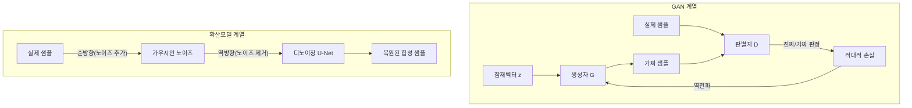

# 합성데이터(Synthetic Data)

## 1. 개요

> **정의**: 합성데이터(Synthetic Data)란 실제 세계에서 직접 수집한 원본 데이터가 아니라, 원본의 **통계적 분포·상관관계·구조적 특성**을 학습하거나 규칙·시뮬레이션으로 모사하여 **인공적으로 생성한 데이터**를 말한다. 개별 실존 개체를 지칭하지 않으면서도 분석·학습 목적으로는 원본과 유사한 유용성(utility)을 갖도록 설계된다.

합성데이터가 부상한 배경은 **데이터 활용과 개인정보 보호 사이의 근본적 긴장**에 있다. AI·데이터 산업은 학습 데이터의 양과 질이 곧 모델 성능을 좌우하지만, 정작 고품질 데이터는 개인정보보호법·GDPR 등 규제, 영업비밀, 수집 비용 때문에 자유롭게 쓰기 어렵다. 비식별 조치(가명·익명처리)는 재식별 위험과 정보 손실 사이에서 균형을 잡기 어렵고, 데이터를 지울수록 유용성이 급감하는 딜레마가 있다. 합성데이터는 "원본을 변형하는" 접근이 아니라 "원본과 통계적으로 닮은 새 데이터를 만드는" 접근으로 이 딜레마를 우회한다.

여기에 더해 **양질의 실데이터 고갈** 문제도 합성데이터를 밀어 올린다. 인터넷에서 수집 가능한 고품질 텍스트·이미지는 유한하며, 대규모 모델이 이를 빠르게 소진하고 있다는 우려가 커지고 있다. 웹 크롤링 데이터는 저작권·라이선스 분쟁 위험도 안고 있어, 생성 조건을 통제해 원하는 품질·주제로 만들 수 있는 합성데이터의 전략적 가치가 상대적으로 높아진다.

또 다른 배경은 **데이터 불균형·희소성 문제**다. 사기 거래, 제조 불량, 희귀 질환처럼 실제로는 극히 드물게 발생하는 사건(이벤트)은 학습 데이터가 부족해 모델이 제대로 학습하지 못한다. 자율주행에서 어린이가 도로에 갑자기 뛰어드는 극단적 상황(코너 케이스)을 실제로 수집하는 것은 불가능에 가깝다. 합성데이터는 이러한 **희소 시나리오를 의도적으로 대량 생성**하여 데이터 증강(augmentation)과 엣지 케이스 보강에 쓰인다. Gartner는 2030년경이면 AI 모델 학습에 사용되는 데이터의 상당 부분이 합성데이터로 대체될 것으로 전망한 바 있으며, 실제로 대규모 언어모델(LLM) 학습에서도 합성 코퍼스 활용이 빠르게 늘고 있다.

합성데이터의 주요 특징은 ① 원본과의 **통계적 유사성**을 유지하면서 개별 레코드는 실존 인물과 1:1로 대응하지 않는다는 점, ② 필요한 만큼 **무한 확장·생성**이 가능하다는 점, ③ 라벨을 생성 시점에 함께 부여할 수 있어 **주석(annotation) 비용을 절감**한다는 점, ④ 생성 조건을 조절해 **분포를 통제(controllable generation)**할 수 있다는 점이다.

이러한 특징은 합성데이터를 단순한 "가짜 데이터"가 아니라 **데이터 자산화·유통을 위한 전략적 수단**으로 만든다. 원본 데이터를 직접 이동·공유하지 않고도 그 가치를 외부와 나눌 수 있으므로, 데이터 3법·마이데이터 등 데이터 경제 정책이 지향하는 안전한 데이터 활용과 결이 같다. 다만 뒤에서 다루듯 "합성이므로 무조건 개인정보가 아니다"라는 인식은 위험하며, 생성 품질과 재식별 위험에 따라 그 법적·기술적 지위가 달라진다는 점을 전제로 이해해야 한다.

## 2. 합성데이터의 전체 구조와 생성 유형

합성데이터 생성 파이프라인은 원본 데이터의 분포를 학습·정의하는 단계, 그 분포로부터 샘플링해 데이터를 생성하는 단계, 생성물의 유용성·프라이버시·충실도를 평가하는 단계로 구성된다. 아래 개념도는 전체 흐름을 나타낸다.

생성 파이프라인을 절차로 풀어 보면 다음과 같다. 첫째, **요구사항 정의** 단계에서 무엇을(어떤 컬럼·라벨·시나리오), 왜(테스트·학습·공유), 어느 수준의 프라이버시·충실도로 만들지 목표를 확정한다. 둘째, **원본 분석·전처리**에서 결측·이상치·컬럼 유형(범주형/연속형/시계열)을 파악하고 민감 필드를 식별한다. 셋째, **생성 방식·모델 선정**에서 데이터 유형과 목표에 맞는 기법을 고르고 (필요 시 차분 프라이버시를) 결합한다. 넷째, **생성·후처리**에서 제약조건(예: 나이는 0~120, 합계 일치 같은 무결성 규칙)을 강제한다. 다섯째, **평가·검증**에서 충실도·유용성·프라이버시를 측정해 목표 미달이면 앞 단계로 되돌아간다. 여섯째, **배포·모니터링**에서 데이터셋 버전·계보를 기록하고 재식별 위험을 지속 관찰한다. 이 절차는 일회성이 아니라 평가 결과에 따라 반복되는 순환 구조라는 점이 중요하다.

합성데이터는 생성 방식에 따라 크게 세 갈래로 나뉜다. 첫째는 **규칙·통계 기반 생성**으로, 도메인 전문가가 정의한 규칙, 확률분포(정규·포아송 등), 또는 원본의 주변 분포와 상관행렬을 이용해 데이터를 만든다. 구현이 단순하고 설명 가능하지만 변수 간 복잡한 비선형 관계를 담기 어렵다. 둘째는 **시뮬레이션·에이전트 기반 생성**으로, 물리 엔진이나 게임 엔진, 디지털 트윈으로 가상 환경을 구성해 센서·영상 데이터를 만든다. 자율주행·로보틱스에서 특히 유용하다. 셋째는 **딥러닝 생성모델 기반**으로, GAN·VAE·확산모델(Diffusion)·트랜스포머(LLM)가 원본의 결합분포(joint distribution)를 학습해 고차원·비정형 데이터까지 사실적으로 생성한다.

아래 표는 세 갈래의 특성을 비교한다. 다만 표는 정리 보조 수단일 뿐이며, 각 방식이 언제 왜 유리한지는 이어지는 문단에서 설명한다.

| 방식 | 대표 기법 | 강점 | 약점 | 적합 데이터 |
|------|-----------|------|------|-------------|
| 규칙·통계 | 분포 샘플링, 코퓰라 | 설명가능·저비용 | 복잡 관계 표현 한계 | 정형(테이블) |
| 시뮬레이션 | 물리엔진, 디지털트윈 | 라벨 자동·엣지케이스 | 현실괴리(도메인 갭) | 영상·센서 |
| 딥러닝 생성 | GAN, VAE, Diffusion, LLM | 고충실도·비정형 | 학습난이도·모드붕괴 | 이미지·텍스트·시계열 |

규칙·통계 기반은 개인정보가 거의 개입하지 않는 초기 테스트 데이터나 소프트웨어 개발용 더미 데이터에 적합하다. 예를 들어 금융 시스템의 성능 부하 테스트를 위해 1억 건의 가상 거래 레코드를 만들 때, 실제 고객 분포를 대략만 따르면 충분하므로 통계 기반이 경제적이다. 반면 사기 탐지 모델을 학습시키려면 정상·이상 거래의 미묘한 상관까지 재현해야 하므로 딥러닝 생성이 필요하다.

시뮬레이션 기반이 유리한 이유는 **라벨을 생성 시점에 정확히 알 수 있기 때문**이다. 가상 환경에서 렌더링한 보행자·차량은 위치·거리·속도·가림(occlusion) 정보를 픽셀 단위로 이미 알고 있으므로, 사람이 수작업으로 바운딩 박스를 그리는 주석 비용이 사실상 0에 수렴한다. 실제 도로 영상 100만 장을 사람이 라벨링하려면 막대한 비용과 시간이 들지만, 시뮬레이션은 동일 규모를 자동으로 생성한다. 이처럼 생성 방식의 선택은 "데이터 유형(정형/비정형)"과 "요구되는 충실도·라벨 정확도·비용" 세 축의 함수이며, 실무에서는 한 방식만 고집하기보다 여러 방식을 조합한다.

## 3. 딥러닝 생성모델 기반 합성 아키텍처

딥러닝 기반 합성데이터의 핵심은 원본 데이터의 확률분포를 근사하는 생성모델이다. 아래 아키텍처 세부도는 대표적인 GAN 계열과 확산모델 계열의 생성 원리를 대비하여 보여준다.

세 계열은 생성 원리가 근본적으로 다르며, 이 차이가 곧 강점과 약점을 만든다. GAN은 판별자와의 경쟁을 통해 날카로운(sharp) 샘플을 얻지만 학습이 불안정하고, VAE는 확률적 잠재공간으로 안정적이지만 흐릿하며, 확산모델은 다단계 디노이징으로 최고 품질을 내지만 생성 속도가 느리다. 어느 것도 만능이 아니므로, 요구 품질과 생성 비용·속도의 균형을 보고 선택해야 한다.

**GAN(Generative Adversarial Network)**은 생성자(Generator)와 판별자(Discriminator)가 서로 경쟁하며 학습한다. 생성자는 잠재벡터로부터 가짜 데이터를 만들고, 판별자는 그것이 진짜인지 가짜인지 구별하려 한다. 두 신경망이 적대적으로 균형점(내시 균형)에 수렴하면서 생성자는 점점 원본과 구별하기 어려운 데이터를 만들게 된다. 정형 테이블 데이터에는 CTGAN(Conditional Tabular GAN)이 범주형·연속형 혼합 컬럼과 불균형 분포를 처리하도록 특화되어 널리 쓰인다. 다만 GAN은 학습이 불안정하고, 특정 패턴만 반복 생성하는 **모드 붕괴(mode collapse)** 위험이 있어 하이퍼파라미터 튜닝이 까다롭다.

CTGAN을 예로 들면, 매출·나이 같은 연속형 컬럼은 다봉(multi-modal) 분포를 이루는 경우가 많아 단순 정규화로는 표현이 왜곡된다. CTGAN은 컬럼별로 여러 정규분포의 혼합으로 값을 표현(mode-specific normalization)하고, 희소한 범주가 학습에서 누락되지 않도록 조건부 샘플링(conditional vector)을 도입해 불균형을 완화한다. 이러한 도메인 특화 설계가 있어야 실제 테이블 데이터의 유용성이 확보되며, 범용 GAN을 그대로 쓰면 성능이 크게 떨어진다는 점이 실무적 교훈이다.

**VAE(Variational Autoencoder)**는 데이터를 저차원 잠재공간으로 인코딩한 뒤, 그 잠재분포에서 샘플링해 다시 복원(디코딩)하는 방식이다. 학습이 GAN보다 안정적이고 잠재공간이 연속적이어서 보간(interpolation)이 자연스럽지만, 생성물이 다소 흐릿(blurry)한 경향이 있다. 그럼에도 안정성과 잠재공간의 해석 가능성 덕분에, 이상 탐지의 기준 분포 학습이나 조건부 생성의 기반으로 여전히 폭넓게 활용된다.

**확산모델(Diffusion Model)**은 원본에 노이즈를 점진적으로 더해 완전한 잡음으로 만든 뒤(순방향 과정), 이를 역으로 하나씩 제거하며 데이터를 복원(역방향 과정)하도록 학습한다. 현재 이미지 합성에서 최고 수준의 충실도와 다양성을 보이며, Stable Diffusion 등 텍스트-이미지 생성의 근간이 되었다. 최근에는 표 형식 데이터에도 확산모델을 적용(TabDDPM 등)하는 연구가 활발하다.

**LLM 기반 합성**은 트랜스포머 언어모델이 문장·코드·대화를 생성하는 능력을 활용한다. 특히 LLM 자체를 더 작은 모델로 정제(distillation)하기 위해, 강력한 교사 모델이 만든 고품질 지시·응답 쌍을 합성 학습 데이터로 쓰는 방식이 표준으로 자리잡고 있다. 다만 원본 모델의 편향이 그대로 전이되거나, 합성 데이터로만 반복 학습할 경우 분포가 붕괴하는 **모델 붕괴(model collapse)** 현상이 보고되어 실제·합성 데이터의 혼합 비율 관리가 중요해졌다.

어떤 생성모델을 선택할지는 데이터 특성과 제약에 달려 있다. 정형 테이블은 CTGAN·TabDDPM처럼 컬럼 이질성과 불균형을 다루도록 특화된 기법이, 이미지는 확산모델이, 시계열은 시간 의존성을 보존하는 순환·트랜스포머 계열이, 텍스트는 LLM이 각각 유리하다. 또한 프라이버시 보증이 필수인 규제 산업에서는 성능이 다소 낮아도 차분 프라이버시가 결합된 변형(DP-CTGAN 등)을 우선 고려한다. 즉 "가장 사실적인 모델"이 아니라 "목적·제약에 부합하는 모델"을 고르는 것이 핵심이며, 이 판단이 곧 기술사가 제시해야 할 설계 결정이다.

## 4. 품질 평가: 충실도·유용성·프라이버시의 삼각 균형

합성데이터의 가치는 세 가지 축으로 평가되며, 이 세 축은 종종 상충한다. 충실도는 다시 단변량(각 컬럼의 분포)과 다변량(컬럼 간 상관·조건부 관계)으로 나눠 본다. 단변량만 맞고 다변량 구조가 깨지면, 개별 컬럼은 그럴듯하지만 컬럼 조합이 비현실적인 데이터가 만들어져 모델을 오도한다. **충실도(Fidelity)**는 합성데이터가 원본의 통계적 특성을 얼마나 잘 재현하는가로, 컬럼별 분포 비교(KS 통계량), 상관구조 유사도, 판별 모델이 원본·합성을 구분하지 못하는 정도(distinguishability) 등으로 측정한다. **유용성(Utility)**은 합성데이터로 학습한 모델이 실제 업무에서 얼마나 잘 작동하는가로, 대표적으로 TSTR(Train on Synthetic, Test on Real) 방식—합성데이터로 학습하고 실제 데이터로 검증했을 때의 성능—을 쓴다. TSTR 성능이 실데이터로 학습했을 때(TRTR)에 근접할수록 그 합성데이터는 실무에서 대체재로 쓸 만하다고 판단한다. **프라이버시(Privacy)**는 합성데이터로부터 원본의 개별 정보가 유출될 위험으로, 멤버십 추론 공격(특정 레코드가 학습에 쓰였는지 추론)이나 근접성 공격(합성 레코드가 원본 레코드와 지나치게 가까운지)으로 평가한다.

여기서 핵심은 **세 축이 트레이드오프 관계**라는 점이다. 충실도를 극단적으로 높이면 원본을 거의 그대로 복제하게 되어 프라이버시가 무너진다. 반대로 프라이버시를 위해 노이즈를 많이 주면 유용성이 떨어진다. 따라서 실무에서는 **차분 프라이버시(Differential Privacy)**를 생성모델 학습에 결합(예: DP-SGD)하여 "어떤 한 개인의 데이터가 있든 없든 생성 결과가 통계적으로 거의 구분되지 않는다"는 수학적 보증을 부여하고, 프라이버시 예산(ε)으로 균형점을 정량 조절한다. ε이 작을수록 프라이버시가 강하지만 유용성은 낮아진다.

특히 주의할 함정은 **평균적 유용성 지표가 소수 집단의 붕괴를 가린다**는 점이다. 전체 정확도(accuracy)나 분포 유사도는 양호해 보여도, 데이터에서 비중이 작은 하위 집단은 합성 과정에서 과소 표현되어 해당 집단에 대한 모델 성능이 급락할 수 있다. 따라서 유용성 평가는 전체 지표뿐 아니라 하위 집단별로 분해해 확인해야 한다. 또한 하나의 요약 점수로 합성데이터를 "합격/불합격" 판정하기보다, 세 축을 동시에 보여 주는 대시보드로 관리하며 사업 목적에 맞는 임계값을 각 축에 설정하는 것이 실무 원칙이다.

프라이버시 평가에서 자주 쓰는 DCR(Distance to Closest Record)은 각 합성 레코드가 가장 가까운 원본 레코드와 얼마나 떨어져 있는지를 측정한다. 이 거리가 0에 가까우면 원본을 사실상 복제한 것이므로 위험 신호다. 다만 거리를 무작정 키우면 유용성이 훼손되므로, 홀드아웃(원본에서 학습에 쓰지 않은 표본)과의 거리 분포와 비교해 "학습 원본에만 유독 가까운지"를 상대적으로 판단하는 것이 정교한 접근이다.

아래 표는 세 평가 축과 대표 지표를 정리한다. 각 지표를 단독으로 보지 말고 세 축을 함께 대시보드로 관리하는 것이 실무 원칙이다.

| 평가 축 | 질문 | 대표 지표·방법 |
|---------|------|----------------|
| 충실도 | 원본과 통계적으로 닮았나 | 분포 KS검정, 상관 유사도, 판별 불가능성 |
| 유용성 | 실제 과업에서 쓸모 있나 | TSTR, 다운스트림 모델 성능 |
| 프라이버시 | 원본이 새어나가나 | 멤버십추론 공격 성공률, DCR(최근접거리) |

## 5. 산업 적용 사례와 비교

합성데이터는 이미 여러 산업에서 실증되고 있다. 각 사례에서 합성데이터를 택하는 이유는 조금씩 다르다. 금융은 **프라이버시·공유 제약**을, 헬스케어는 **접근 제한과 희소성**을, 자율주행·제조는 **엣지 케이스 확보와 라벨링 비용**을 각각 1차 동기로 삼는다. 이 차이가 생성 방식(정형 딥러닝 vs 시뮬레이션)과 검증 초점(프라이버시 vs 도메인 정합성)을 갈라놓는다.

**금융** 분야에서는 개인정보가 결합된 거래 데이터를 외부 핀테크·연구기관과 공유하기 어렵기 때문에, 원본과 통계적으로 동등한 합성 거래 데이터를 만들어 사기 탐지 모델 공동 개발이나 규제 샌드박스 테스트에 활용한다. 예컨대 신용카드 사기는 전체 거래의 약 0.1~0.2%에 불과해 극심한 불균형을 보이는데, 합성으로 이상 거래를 증강하면 소수 클래스 재현율(recall)을 유의미하게 끌어올릴 수 있다.

**헬스케어**에서는 환자 전자의무기록(EMR)이 가장 민감한 데이터에 속해 연구 접근이 제한적이다. 합성 EMR을 생성하면 실제 환자를 노출하지 않고도 알고리즘 개발·검증이 가능하다. 다만 희귀 질환처럼 소수 사례는 합성 과정에서 특정 실존 환자와 지나치게 유사해질 수 있어, 근접성 검사와 임상적 타당성 검증을 병행해야 한다. 특히 의료 데이터는 검사 수치 간 생리학적 제약(예: 특정 수치 조합은 임상적으로 불가능)이 존재하므로, 통계적 유사성만 맞춰서는 안 되고 도메인 규칙 기반의 사후 검증이 반드시 필요하다.

**자율주행·제조**에서는 시뮬레이션 기반 합성이 주력이다. 게임 엔진으로 다양한 날씨·조도·보행자 행동을 조합한 주행 영상과 라벨을 자동 생성하여, 실제 도로 수집으로는 확보하기 어려운 위험 상황을 대량 학습시킨다. 여기서 관건은 가상과 현실의 통계적 차이인 **도메인 갭(domain gap)**을 도메인 적응(domain adaptation) 기법으로 줄이는 것이다. 제조 분야에서도 불량률이 수백 ppm 수준으로 극히 낮은 결함 이미지를 합성으로 증강해 비전 검사 모델의 결함 검출 성능을 높이는 사례가 늘고 있으며, 디지털 트윈과 결합하면 설비 고장 시나리오까지 가상으로 생성할 수 있다.

**텍스트·LLM** 영역의 사례도 빠르게 늘고 있다. 콜센터 상담 로그처럼 개인정보와 민감 발화가 뒤섞인 데이터는 그대로 학습에 쓰기 어렵기 때문에, 발화 의도·감정·시나리오를 보존한 합성 대화를 생성해 상담 봇·요약 모델을 학습시킨다. 또한 특정 도메인(법률·의료)에서 부족한 지시-응답 데이터를 상위 모델로 합성해 소형 모델을 정제하면, 실데이터 수집 없이도 도메인 특화 성능을 확보할 수 있다. 다만 이 경우 사실 오류(hallucination)가 학습 데이터에 섞여 들어가지 않도록 검증 필터를 반드시 두어야 한다.

합성데이터를 기존 비식별 조치와 비교하면 차이가 분명해진다. 가명·익명처리는 원본 레코드를 유지한 채 식별자를 변형하므로 **원본과 1:1 대응이 남아** 재식별 위험이 상존하고, 삭제·범주화가 진행될수록 정보가 손실된다. 반면 합성데이터는 새 레코드를 생성하므로 원본과의 1:1 대응 자체가 없어 재식별의 출발점이 사라진다. 그러나 이는 "합성이면 무조건 안전"을 뜻하지 않는다. 과적합된 생성모델은 원본을 사실상 암기·복제할 수 있으므로, 합성데이터 역시 프라이버시 위험 평가가 필수라는 점이 실무적 함의다. 즉 비식별은 "덜어내는" 접근, 합성은 "다시 만드는" 접근이며 각각의 잔여 위험 관리 방식이 다르다.

## 6. 심화: 최신 동향과 표준·규제 변화

합성데이터를 둘러싼 제도·기술 환경은 빠르게 정비되고 있다. 규제 측면에서 **EU AI Act**는 편향 완화·데이터 거버넌스 맥락에서 합성데이터를 명시적으로 언급하며 허용 근거를 마련했고, 미국 등에서도 프라이버시 보존 기술의 하나로 주목받는다. 국내에서도 개인정보보호위원회·관계기관을 중심으로 가명정보·합성데이터 활용 가이드 논의가 이어지고 있어, 합성데이터의 법적 지위(개인정보 여부 판단 기준)가 향후 핵심 쟁점이 될 전망이다. 현시점에서는 "합성데이터가 자동으로 비개인정보가 되는 것은 아니며, 재식별 위험 평가 결과에 따라 판단한다"는 신중한 접근이 일반적이므로 단정적 표현은 지양해야 한다.

이와 함께 **합성데이터의 출처 표시·추적** 논의도 부상하고 있다. 생성형 AI 콘텐츠에 대한 워터마킹·출처 표기(provenance) 요구가 강해지면서, 학습·유통되는 합성데이터가 실데이터로 오인되지 않도록 메타데이터에 합성 여부와 생성 계보를 남기는 것이 신뢰성 확보의 조건이 되고 있다. 이는 데이터 계보(lineage)·데이터 카탈로그 관리와 자연스럽게 맞물린다.

기술 동향으로는 첫째, **차분 프라이버시 결합 생성**(DP-GAN, PATE-GAN 등)이 프라이버시를 수학적으로 보증하는 표준 접근으로 자리잡고 있다. 둘째, **확산모델의 정형데이터 확장**으로 GAN을 대체하려는 흐름이 강해지고 있다. 셋째, LLM 학습에서 **합성 데이터의 비중 급증**과 함께 앞서 언급한 모델 붕괴를 막기 위한 실제 데이터 앵커링·큐레이션이 중요 연구 주제가 되었다. 넷째, 합성데이터의 품질·프라이버시를 일관되게 평가하기 위한 **오픈소스 평가 프레임워크**(예: SDMetrics 계열)와 벤치마크가 확산되며, "생성"보다 "검증"이 실무의 병목으로 이동하고 있다. 예상 출제 방향으로는 ① 합성데이터와 비식별 조치의 비교, ② 충실도-유용성-프라이버시 트레이드오프와 차분 프라이버시 결합, ③ 특정 산업(금융·의료·자율주행) 적용 시나리오 설계가 유력하다.

## 7. 고려사항 및 시사점

- **잔여 프라이버시 위험의 상시 검증**: 합성이라는 사실만으로 안전하다고 단정해서는 안 된다. 생성모델의 과적합·암기 여부를 멤버십 추론·근접성 지표로 정기 점검하고, 차분 프라이버시 예산(ε)을 명시적으로 관리하는 거버넌스 체계를 갖춰야 한다. 프라이버시 검증을 통과하지 못한 합성데이터는 배포·공유하지 않는 품질 게이트가 필요하다.

- **편향의 전이와 증폭 방지**: 합성데이터는 원본의 편향(성별·인종·지역 편중)을 그대로 학습하며, 소수 집단을 과소 생성하면 편향이 오히려 증폭될 수 있다. 따라서 생성 조건을 통제해 소수 집단 표현을 보강하고, 다운스트림 모델의 공정성 지표를 함께 모니터링하는 전략이 요구된다.

- **유용성-프라이버시 균형의 사업 목표 정렬**: 어느 축을 우선할지는 사업·규제 맥락에 따라 다르다. 대외 공유·공개 데이터셋이면 프라이버시를, 내부 모델 성능 개선이면 유용성을 우선하는 식으로 목표를 먼저 정의하고 ε과 충실도 목표치를 역산하는 접근이 실효적이다.

- **품질 평가·검증 체계의 내재화(연계 기술)**: 합성데이터의 병목은 생성이 아니라 신뢰할 수 있는 검증이다. MLOps·데이터 옵저버빌리티·모델 레지스트리와 연계해 합성 데이터셋의 버전·계보·평가 결과를 추적하고, 재현 가능한 파이프라인으로 관리해야 한다.

- **도메인 갭·현실 정합성 관리**: 시뮬레이션 기반 합성은 가상-현실 분포 차이가 성능을 좌우한다. 도메인 적응·실데이터 소량 혼합(hybrid)으로 갭을 줄이고, 실환경 배포 전 반드시 실제 데이터로 검증(TSTR)하는 절차를 표준화해야 한다.

- **무결성·비즈니스 규칙 강제**: 합성데이터는 통계적으로 그럴듯해도 도메인 제약(참조 무결성, 합계 일치, 물리·생리학적 한계)을 위반할 수 있다. 생성 후처리 단계에서 규칙 검증기를 두어 위반 레코드를 걸러내야 다운스트림에서 신뢰할 수 있으며, 이는 데이터 품질관리·데이터 계약(data contract)과 연계해 운영하는 것이 바람직하다.

- **거버넌스·책임소재 명확화**: 합성데이터의 생성 근거(원본 출처·동의 범위), 사용 목적, 배포 대상을 문서화하고, 재식별 위험 평가 결과에 따라 개인정보 여부를 판단하는 내부 기준과 승인 절차를 갖춰야 한다. "합성이면 규제 밖"이라는 안일한 전제는 향후 법적 리스크로 되돌아올 수 있다.

- **전망**: 데이터 규제 강화와 고품질 데이터 고갈이 겹치면서 합성데이터는 선택이 아닌 필수 인프라로 이동할 것으로 보인다. 다만 "합성이면 규제 무관"이라는 오해와 모델 붕괴 리스크가 남아 있어, 실데이터와 합성데이터를 전략적으로 배합하고 지속적으로 검증하는 하이브리드 데이터 전략이 기술사 관점의 핵심 과제가 될 것이다.

## 참고자료

- Gartner, "Maverick Research: Forget About Your Real Data — Synthetic Data Is the Future of AI" — https://www.gartner.com/en/documents/4002912
- NIST, Differential Privacy 관련 자료 — https://www.nist.gov/blogs/cybersecurity-insights/differential-privacy-future-work-and-open-challenges
- EU AI Act 공식 포털 — https://artificial-intelligence-act.eu/
- SDV(Synthetic Data Vault) / SDMetrics 프로젝트 — https://docs.sdv.dev/

---

> **한 줄 요약**: 합성데이터는 원본의 통계적 특성을 모사해 인공 생성한 데이터로, 프라이버시 보호·데이터 증강·희소 시나리오 보강을 가능케 하되 충실도·유용성·프라이버시의 트레이드오프를 차분 프라이버시와 지속 검증으로 관리해야 하는 하이브리드 데이터 전략의 핵심이다.
