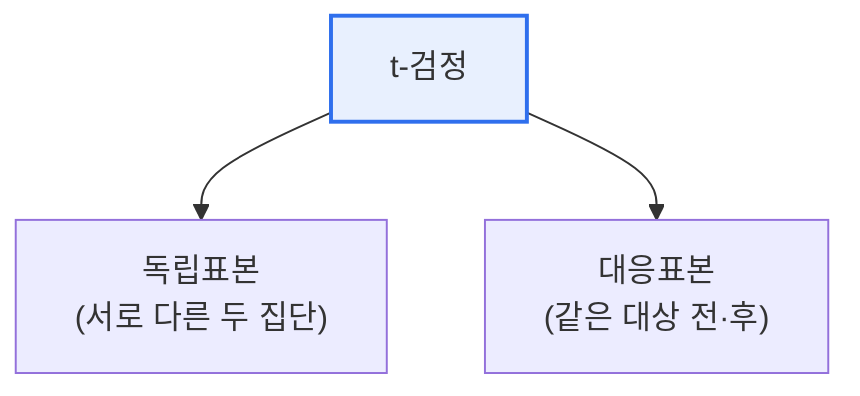

# 독립표본 t-검정과 대응표본 t-검정 비교

## 1. 개요

### 가. 정의
> 두 집단의 평균 차이가 통계적으로 유의한지 검정하는 방법으로, **독립표본 t-검정**은 서로 다른 두 집단을, **대응표본 t-검정**은 같은 대상의 사전·사후처럼 짝지어진 두 값을 비교한다.

핵심 구별점은 '**두 표본이 서로 독립인가, 짝지어져 있는가**'다. A반과 B반 학생의 성적을 비교하면 독립표본이고, 같은 학생들의 교육 전후 성적을 비교하면 대응표본이다. 짝지어진 경우 개인차를 상쇄할 수 있어 검정력이 높아진다.

## 2. 비교

| 구분 | 독립표본 t-검정 | 대응표본 t-검정 |
|---|---|---|
| **표본** | 서로 독립인 두 집단 | 짝지어진(같은 대상) 두 값 |
| **비교** | 두 집단 평균 차이 | 차이값(d)의 평균 |
| **예시** | 남/여 급여, A/B 그룹 | 다이어트 전/후 체중, 교육 전/후 |
| **가정** | 정규성, 등분산성(독립) | 차이값의 정규성 |
| **검정통계량** | 두 평균차 / 합동표준오차 | 차이 평균 / 차이 표준오차 |

## 3. 공통 전제 및 절차
- 가설 설정(H₀: 평균차=0) → 정규성 확인 → t 통계량·자유도 계산 → p값과 유의수준(α) 비교
- 정규성 위배 시 비모수 검정(Mann-Whitney U / Wilcoxon)으로 대체

## 4. 시사점
- 실험 설계 단계에서 **표본 구조(독립/대응)** 를 먼저 정해야 올바른 검정 선택
- 대응표본은 개인차 통제로 **검정력↑**, 표본 확보가 용이하면 우선 고려
- 세 집단 이상 비교는 ANOVA로 확장

---

> **한 줄 요약**: 독립표본 t-검정은 *서로 다른 두 집단의 평균차* 를, 대응표본 t-검정은 *같은 대상의 짝지어진 차이값* 을 검정하며, 표본이 독립인지 대응인지에 따라 선택한다.
