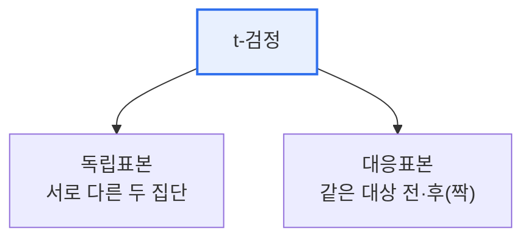

# 독립표본 t-검정과 대응표본 t-검정 비교

## 1. 개요

### 가. 정의
> 두 집단의 평균 차이가 통계적으로 유의한지 검정하는 방법으로, **독립표본 t-검정**은 서로 다른 두 집단의 평균을, **대응표본 t-검정**은 같은 대상에서 사전·사후처럼 짝지어진 두 값의 차이를 비교한다.

두 검정을 가르는 결정적 기준은 '**두 표본이 서로 독립인가, 짝지어져(대응) 있는가**'이다. A반 학생들과 B반 학생들의 성적을 비교한다면 두 집단은 서로 무관한 다른 사람들이므로 **독립표본**이다. 반면 같은 학생들에게 교육을 실시하고 교육 전과 후의 성적을 비교한다면, 각 데이터가 '같은 사람'으로 짝지어지므로 **대응표본**이다. 이 구조 차이가 왜 중요한가 하면, 대응표본에서는 개인마다 다른 기본 실력(개인차)을 **차이값으로 상쇄**할 수 있기 때문이다. 개인차라는 잡음을 제거하면 처치(교육)의 순수 효과가 더 선명하게 드러나 **검정력이 높아진다**.

### 나. 필요성
평균을 단순 비교해 "올랐다"고 말하는 것은 우연일 수 있다. t-검정은 관측된 차이가 표본 추출의 우연 때문인지, 아니면 통계적으로 유의미한 실제 차이인지를 확률(p값)로 판단해준다. 표본 구조에 맞는 검정을 써야 이 판단이 타당해진다.

## 2. 구분

## 3. 비교

두 검정은 무엇을 검정통계량으로 삼는지가 다르다. 독립표본은 두 집단 평균의 차이를 두 집단의 합동 표준오차로 나눠 계산하며, 두 집단의 분산이 같은지(등분산성)를 전제로 한다. 대응표본은 각 짝의 차이값(d)을 먼저 구한 뒤, 그 차이값들의 평균이 0인지를 검정하므로 사실상 '차이값 하나의 집단'에 대한 검정이 된다.

| 구분 | 독립표본 t-검정 | 대응표본 t-검정 |
|---|---|---|
| **표본 구조** | 서로 독립인 두 집단 | 짝지어진(같은 대상) 두 값 |
| **검정 대상** | 두 집단 평균의 차이 | 차이값(d)의 평균 |
| **예시** | 남/여 급여, A/B 그룹 성과 | 다이어트 전/후 체중, 교육 전/후 |
| **핵심 가정** | 정규성 + 등분산성 | 차이값의 정규성 |
| **검정력** | 개인차 잡음 포함 | 개인차 상쇄로 상대적 높음 |

예컨대 신약 효과를 볼 때, 서로 다른 환자군에 약과 위약을 주면 독립표본이고, 같은 환자에게 투약 전후를 측정하면 대응표본이다. 후자가 개인의 체질 차이를 제거해 더 민감하게 효과를 잡아낸다.

## 4. 공통 절차와 대안

두 검정 모두 ①가설 설정(귀무가설 H₀: 평균차=0) → ②정규성 등 가정 확인 → ③t 통계량·자유도 계산 → ④p값을 유의수준(α, 보통 0.05)과 비교하는 절차를 따른다. 만약 정규성 가정이 무너지면 모수 검정 대신 비모수 검정(독립표본은 Mann-Whitney U, 대응표본은 Wilcoxon 부호순위)으로 대체한다.

## 5. 고려사항 및 시사점

1. **실험 설계 단계에서 표본 구조를 먼저 정해야** 올바른 검정을 선택할 수 있다. 잘못된 검정은 잘못된 결론을 낳는다.
2. **가능하면 대응표본 설계가 유리**하다. 같은 대상을 반복 측정하면 개인차를 통제해 적은 표본으로도 검정력을 확보할 수 있다. 다만 학습 효과·순서 효과 같은 편향에 주의해야 한다.
3. **세 집단 이상 비교는 ANOVA로 확장**한다. t-검정을 여러 번 반복하면 1종 오류가 누적되므로, 다집단 비교에는 분산분석을 사용한다.

---

> **한 줄 요약**: 독립표본 t-검정은 *서로 다른 두 집단의 평균차* 를, 대응표본 t-검정은 *같은 대상의 짝지어진 차이값* 을 검정하며, 대응표본은 개인차를 상쇄해 검정력이 높으므로 실험 설계 단계에서 표본 구조에 맞는 검정을 선택해야 한다.
