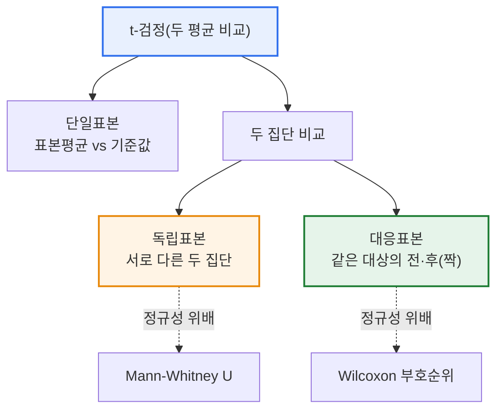
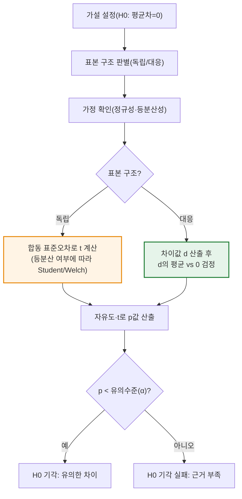

# 독립표본 t-검정과 대응표본 t-검정 비교

## 1. 개요

### 가. 정의

> **t-검정(t-test)**은 두 집단의 평균 차이가 표본 추출의 우연 때문인지 통계적으로 유의한 실제 차이인지를 t-분포를 이용해 판단하는 모수 검정이다. 이 중 **독립표본 t-검정(Independent samples t-test)**은 서로 무관한 두 집단의 평균을 비교하고, **대응표본 t-검정(Paired samples t-test)**은 같은 대상에서 사전·사후처럼 짝지어진 두 값의 차이를 비교한다.

두 검정을 가르는 결정적 기준은 '**두 표본이 서로 독립인가, 아니면 짝지어져(대응) 있는가**'이다. 예를 들어 A반 학생들과 B반 학생들의 성적을 비교한다면, 두 집단은 서로 다른 사람들로 구성되어 상호 무관하므로 **독립표본**이다. 반면 같은 학생들에게 특정 교육을 실시하고 교육 전(前)과 후(後)의 성적을 비교한다면, 각 데이터가 '같은 사람'이라는 축으로 짝지어지므로 **대응표본**이다. 표면적으로는 둘 다 '두 개의 평균을 비교'하는 것처럼 보이지만, 데이터의 생성 구조가 근본적으로 다르다.

이 구조 차이가 왜 중요한가 하면, 대응표본에서는 개인마다 다른 기본 실력·체질 같은 **개인차(개체 간 변동)를 차이값(d)으로 상쇄**할 수 있기 때문이다. 독립표본에서는 '원래 잘하는 사람과 못하는 사람이 섞여 있다'는 개인차가 그대로 잡음(오차)으로 남아 처치의 효과를 흐린다. 그러나 대응표본에서는 같은 사람의 전후 차이만 보므로, 그 사람이 원래 몇 점이었는지는 소거되고 오직 '변화량'만 남는다. 개인차라는 잡음을 제거하면 처치(예: 교육)의 순수 효과가 더 선명하게 드러나고, 결과적으로 **검정력(Power, 실제 효과가 있을 때 이를 유의하다고 잡아낼 확률)이 높아진다**. 뒤에서 이 차이가 통계량의 수식에서 어떻게 나타나는지 구체적으로 살펴본다.

### 나. 필요성과 등장 배경

두 집단의 평균을 단순 비교하여 "평균이 3점 올랐으니 교육이 효과가 있었다"고 결론짓는 것은 위험하다. 표본이란 모집단에서 일부를 뽑은 것이므로, 뽑을 때마다 평균은 우연히 달라진다. 즉 관측된 3점 차이가 실제 효과 때문일 수도 있지만, 단지 '이번 표본이 우연히 그렇게 나온 것'일 수도 있다. t-검정은 이 둘을 구분하기 위해, 관측된 차이를 그 차이의 표준오차로 나누어 **차이가 우연의 범위를 벗어나는 정도를 t 통계량으로 수치화**하고, 이를 확률(p값)로 환산해 판단한다.

이때 표본이 독립인지 대응인지에 따라 '차이의 표준오차'를 계산하는 방식이 달라지므로, **표본 구조에 맞는 검정을 선택해야만 p값의 해석이 타당해진다**. 잘못된 검정을 쓰면 검정력을 낭비하거나(대응 데이터에 독립표본 검정 적용), 성립하지 않는 가정을 전제하여 잘못된 결론을 내리게 된다. t-검정 자체는 소표본에서도 정규분포 대신 t-분포를 사용해 평균을 검정하려는 목적에서 고안된 고전적 방법으로, 표본 수가 적어 모분산을 알기 어려운 실무 상황(품질관리·임상·사회조사)에서 널리 쓰인다.

## 2. 두 검정의 구분 구조

t-검정은 비교 대상의 수와 표본 구조에 따라 여러 갈래로 나뉜다. 아래 구조도는 t-검정 전체 지형에서 독립표본과 대응표본이 어디에 위치하는지, 그리고 가정이 무너졌을 때 어떤 비모수 대안으로 이어지는지를 한눈에 보여준다.

```mermaid
flowchart TB
  T["t-검정(두 평균 비교)"] --> ONE["단일표본<br/>표본평균 vs 기준값"]
  T --> TWO["두 집단 비교"]
  TWO --> I["독립표본<br/>서로 다른 두 집단"]
  TWO --> P["대응표본<br/>같은 대상의 전·후(짝)"]
  I -. 정규성 위배 .-> MW["Mann-Whitney U"]
  P -. 정규성 위배 .-> WX["Wilcoxon 부호순위"]
  style T fill:#e8f0fe,stroke:#2f6fed,stroke-width:2px
  style I fill:#fff4e5,stroke:#e8890c,stroke-width:2px
  style P fill:#e6f4ea,stroke:#1e7d34,stroke-width:2px
```

이 그림에서 확인할 수 있듯, 독립표본과 대응표본은 모두 '두 집단 비교' 아래에 놓이지만 표본 구조가 갈리는 지점에서 분기한다. 또한 각 검정은 정규성 가정이 성립하지 않을 때 대응하는 비모수 검정(순위 기반)으로 대체되는데, 이 대체 경로가 서로 짝을 이룬다는 점(독립↔Mann-Whitney U, 대응↔Wilcoxon 부호순위)도 함께 기억해 둘 필요가 있다. 세 집단 이상을 비교하려면 t-검정의 틀을 벗어나 분산분석(ANOVA)으로 확장되며, 이는 뒤의 고려사항에서 다룬다.

## 3. 검정통계량 계산과 의사결정 절차

두 검정이 실제로 어떻게 다른지는 검정통계량 t를 계산하는 방식에서 가장 분명히 드러난다. 아래 절차도는 데이터가 들어와 결론(귀무가설 기각 여부)에 이르는 흐름을, 독립·대응 경로가 갈라지는 지점을 포함해 나타낸 것이다. 앞의 구조도가 '어떤 검정들이 있는가'를 보였다면, 이 절차도는 '하나의 분석을 어떤 순서로 수행하는가'를 보인다.

```mermaid
flowchart TB
  A["가설 설정(H0: 평균차=0)"] --> B["표본 구조 판별(독립/대응)"]
  B --> C["가정 확인(정규성·등분산성)"]
  C --> D{"표본 구조?"}
  D -->|독립| E["합동 표준오차로 t 계산<br/>(등분산 여부에 따라 Student/Welch)"]
  D -->|대응| F["차이값 d 산출 후<br/>d의 평균 vs 0 검정"]
  E --> G["자유도·t로 p값 산출"]
  F --> G
  G --> H{"p < 유의수준(α)?"}
  H -->|예| I["H0 기각: 유의한 차이"]
  H -->|아니오| J["H0 기각 실패: 근거 부족"]
  style E fill:#fff4e5,stroke:#e8890c,stroke-width:2px
  style F fill:#e6f4ea,stroke:#1e7d34,stroke-width:2px
```

**가) 독립표본 t-검정의 통계량.** 독립표본은 두 집단 평균의 차이(x̄₁ − x̄₂)를 두 집단의 변동을 합친 표준오차로 나누어 t를 구한다. 여기서 표준오차는 각 집단의 표본분산과 표본 크기로부터 계산되며, 두 집단의 분산이 같다고 가정할 수 있으면 합동분산(pooled variance)을 쓰는 Student t-검정을, 분산이 다르면 Welch t-검정을 사용한다. 즉 독립표본에서는 두 집단의 '개인차'가 모두 분모(오차)에 반영되므로, 개인차가 클수록 t가 작아져 유의성을 잡아내기 어려워진다. 실무에서는 등분산 가정이 자주 위태롭기 때문에, 기본값으로 Welch 검정을 권장하는 견해가 많다.

**나) 대응표본 t-검정의 통계량.** 대응표본은 접근이 근본적으로 다르다. 먼저 각 짝의 차이값 dᵢ = (사후 − 사전)을 구한 뒤, 이 차이값들의 평균 d̄가 0인지를 검정한다. 그 결과 검정은 사실상 '차이값이라는 하나의 표본'에 대한 단일표본 t-검정으로 환원된다. 이 과정에서 각 개인의 절대 수준(원래 실력)은 빼기 연산으로 소거되고 오직 변화량만 남으므로, 개인차라는 큰 잡음원이 분모에서 제거된다. 바로 이 때문에 같은 크기의 효과라도 대응표본이 더 작은 표준오차, 더 큰 t 값, 더 높은 검정력을 갖게 되는 것이다. 다만 이때 필요한 가정은 '두 집단의 정규성·등분산성'이 아니라 '차이값 d의 정규성' 하나로 바뀐다.

**다) 공통 의사결정 절차.** 두 검정 모두 ①가설 설정(귀무가설 H₀: 평균차 = 0, 대립가설 H₁: 평균차 ≠ 0) → ②표본 구조·가정 확인 → ③t 통계량과 자유도 계산 → ④t로부터 p값을 구해 유의수준(α, 보통 0.05)과 비교하는 절차를 공유한다. p값이 α보다 작으면 '이 정도 차이가 우연히 나타날 확률이 매우 낮다'고 보아 귀무가설을 기각하고 유의한 차이가 있다고 판단하며, 그렇지 않으면 '차이가 있다는 근거가 부족하다'고 결론짓는다. 여기서 유의하지 않다는 것이 '차이가 없음을 증명한 것'은 아니라는 점에 유의해야 한다.

**라) 효과크기와 신뢰구간의 병행.** 실무 답안에서 강조할 점은, p값만으로 결론을 내려서는 안 된다는 것이다. 표본이 매우 크면 사소한 차이도 유의하게 나오고, 표본이 작으면 실제 효과가 있어도 유의하지 않게 나올 수 있다. 따라서 차이의 '크기'를 나타내는 효과크기(예: Cohen's d)와 평균차의 신뢰구간(95% CI)을 함께 제시하여, '통계적 유의성'과 '실질적 중요성'을 구분해 해석하는 것이 바람직하다.

## 4. 비교와 적용 사례

두 검정의 차이를 정리하면 아래 표와 같다. 다만 표는 요약일 뿐이며, 앞서 설명했듯 그 차이는 '개인차를 오차로 남기느냐, 차이값으로 소거하느냐'라는 데이터 구조에서 비롯된다는 점이 핵심이다.

| 구분 | 독립표본 t-검정 | 대응표본 t-검정 |
|---|---|---|
| **표본 구조** | 서로 독립인 두 집단 | 짝지어진(같은 대상) 두 값 |
| **검정 대상** | 두 집단 평균의 차이 | 차이값(d)의 평균이 0인지 |
| **개인차 처리** | 오차에 그대로 포함 | 차이값으로 상쇄(소거) |
| **핵심 가정** | 정규성 + 등분산성(또는 Welch) | 차이값 d의 정규성 |
| **검정력** | 상대적으로 낮음 | 개인차 상쇄로 상대적 높음 |
| **비모수 대안** | Mann-Whitney U | Wilcoxon 부호순위 |
| **대표 예시** | 남/여 급여, A/B 그룹 성과 | 다이어트 전/후 체중, 교육 전/후 |

**사례 1 — 신약 임상.** 서로 다른 환자군에 각각 신약과 위약을 투여하고 혈압 강하 정도를 비교하면 독립표본이다. 반면 같은 환자에게 투약 전과 후의 혈압을 측정해 비교하면 대응표본이다. 후자는 환자마다 다른 기저 혈압·체질 차이를 제거하므로, 예컨대 30명이라는 적은 표본으로도 약효를 더 민감하게 검출할 수 있다. 다만 대응 설계에서는 '시간이 지나면 저절로 낮아지는 효과'가 약효와 섞일 수 있어, 대조군을 별도로 두는 설계 보완이 필요하다.

**사례 2 — A/B 테스트.** 웹사이트에서 서로 다른 방문자 집단에게 기존 화면(A)과 새 화면(B)을 보여주고 구매전환율을 비교하는 것은 독립표본 구조다. 방문자를 짝지을 수 없기 때문이다. 이처럼 대상을 반복 측정할 수 없는 상황에서는 독립표본 검정이 자연스러운 선택이며, 이 경우 표본 크기를 충분히 확보해 개인차 잡음을 상쇄하는 것이 검정력 확보의 관건이 된다.

**사례 3 — 교육 효과 측정.** 같은 수강생 40명에게 사전 시험을 보게 하고, 교육 후 사후 시험을 다시 보게 하여 점수 변화를 검정하면 대응표본이다. 원래 점수가 높던 학생과 낮던 학생의 차이는 소거되고 '각자의 향상폭'만 평가되므로, 교육의 순수 효과가 선명하게 드러난다. 단, 사전 시험을 본 경험 자체가 사후 점수를 올리는 '학습 효과(연습 효과)'가 개입할 수 있어, 이를 통제하지 않으면 교육 효과를 과대평가할 위험이 있다.

이 세 번째 사례를 숫자로 보면 두 검정의 차이가 더 분명해진다. 40명의 평균이 사전 70점에서 사후 75점으로 5점 올랐다고 하자. 만약 학생마다 향상폭이 대체로 5점 안팎(예: +3~+7)으로 고르다면, 차이값 d의 표준편차가 작아 대응표본 검정의 t 값은 크게 나오고 쉽게 유의해진다. 그러나 같은 데이터를 사전·사후를 서로 다른 두 집단인 것처럼 독립표본으로 보면, 학생 개개인의 실력 편차(예: 40~95점)가 그대로 분모의 오차로 들어가 표준오차가 커지고 t 값이 작아져, 실제로는 존재하는 5점의 효과를 유의하지 않다고 판정할 수 있다. 동일한 데이터·동일한 평균차인데도 표본 구조를 어떻게 보느냐에 따라 결론이 뒤바뀔 수 있다는 점이, 표본 구조에 맞는 검정 선택이 왜 중요한지를 단적으로 보여준다.

## 5. 심화 — 가정 위배 대응과 확장

실무에서 t-검정을 제대로 쓰려면 가정 점검과 대안 선택, 그리고 다집단·다요인으로의 확장을 함께 이해해야 한다.

**가) 가정 위배와 비모수 대안.** t-검정은 정규성(및 독립표본의 경우 등분산성)을 전제하는 모수 검정이다. 표본이 작고 데이터가 정규성에서 크게 벗어나면(예: 심한 치우침·이상치), 정규성 가정이 무너져 p값이 왜곡된다. 이때는 순위에 기반한 비모수 검정으로 대체한다. 독립표본은 Mann-Whitney U 검정으로, 대응표본은 Wilcoxon 부호순위 검정으로 바꾼다. 정규성은 표본 수가 클 경우 중심극한정리 덕분에 다소 완화되지만, 소표본에서는 Shapiro-Wilk 검정이나 Q-Q plot으로 사전 점검하는 것이 안전하다. 등분산성은 Levene 검정 등으로 확인하되, 위배 시 굳이 Student가 아니라 Welch 검정을 쓰면 되므로 실무에서는 Welch를 기본으로 두는 흐름이 있다.

**나) 다중비교 문제와 ANOVA로의 확장.** 세 집단 이상을 비교할 때 t-검정을 집단 쌍마다 여러 번 반복하면, 비교 횟수가 늘수록 최소 한 번은 우연히 유의하게 나올 확률(1종 오류)이 누적되어 부풀려진다. 예컨대 유의수준 0.05로 여러 쌍을 검정하면 전체 1종 오류율은 0.05를 훌쩍 넘는다. 그래서 세 집단 이상은 분산분석(ANOVA)으로 한 번에 검정하고, 유의한 경우에 한해 사후검정(Tukey HSD 등)이나 다중비교 보정(Bonferroni 등)을 적용한다. 대응 구조가 반복되는 경우에는 반복측정 ANOVA로 확장된다. 즉 t-검정은 두 집단 비교라는 특수한 경우이고, 그 상위 일반형이 ANOVA·회귀분석이라는 연속선상에 있음을 이해하는 것이 중요하다.

**다) 데이터 분석·머신러닝 맥락에서의 위치.** 오늘날 A/B 테스트, 모델 성능 비교(두 모델의 교차검증 성능 차이 검정에는 대응표본 t-검정이 자주 쓰인다), 실험 설계 등에서 t-검정은 여전히 기본 도구다. 다만 대량·다변량 데이터 환경에서는 단일 t-검정보다 회귀·혼합효과모형·부트스트랩 같은 방법이 함께 사용되며, t-검정은 그 출발점이자 결과 해석의 직관을 제공하는 역할을 한다.

**라) 흔한 오류와 실무 유의점.** 첫째, 단측·양측 검정을 혼동하는 오류다. 방향에 대한 사전 근거 없이 단측 검정을 쓰면 유의성을 인위적으로 부풀리게 되므로, 특별한 이유가 없으면 양측 검정을 기본으로 한다. 둘째, 대응 구조를 놓치는 오류다. 같은 대상에서 나온 전후 데이터를 두 개의 독립 열로 보고 독립표본 검정을 적용하면, 개인차 상쇄라는 대응 설계의 이점을 잃고 검정력이 떨어진다. 셋째, 이상치(Outlier) 방치다. t-검정은 평균과 분산에 기반하므로 소수의 극단값이 결과를 크게 흔들 수 있어, 사전에 분포를 시각화하고 이상치의 원인을 확인해야 한다. 이러한 점검은 검정 결과의 재현성과 신뢰성을 확보하는 데 직접적으로 기여한다.

## 6. 예상 출제 방향과 답안 구성 전략

기술사 시험에서 t-검정 주제는 단답형으로는 '두 검정의 차이와 선택 기준', 논술형으로는 '실험/데이터 분석 시나리오를 제시하고 적절한 검정을 선택·정당화하라'는 형태로 출제될 수 있다. 답안을 구성할 때는 ①두 검정의 정의와 표본 구조 차이를 먼저 제시하고, ②그 차이가 검정통계량(개인차의 오차 포함 vs 차이값 소거)에서 어떻게 나타나는지 원리로 설명한 뒤, ③가정·비모수 대안·효과크기까지 언급하여 깊이를 확보하고, ④세 집단 이상은 ANOVA로 확장된다는 연계로 마무리하는 흐름이 효과적이다. 표만 나열하기보다 '왜 대응표본이 검정력이 높은가'를 문장으로 설명하는 것이 변별력을 만든다.

또한 최근 데이터 기반 의사결정·품질관리·AI 모델 검증이 강조되면서, 통계 검정을 '분석 도구'가 아니라 '의사결정 근거의 타당성 확보 수단'으로 바라보는 관점이 요구된다. 따라서 답안에서는 검정 절차의 기계적 나열에 그치지 말고, 표본 설계의 적절성·가정 점검·결과의 실무적 해석(효과크기·불확실성)까지 연결하여 '통계적 엄밀성이 왜 신뢰할 수 있는 결론으로 이어지는가'를 서술하면 기술사 수준의 완결성을 갖춘 답안이 된다.

## 7. 고려사항 및 시사점

1. **실험 설계 단계에서 표본 구조를 먼저 확정해야 한다.** 검정은 데이터가 만들어진 구조를 따라가는 것이므로, 데이터를 다 모은 뒤 검정을 고르는 것이 아니라 설계 시점에 독립/대응 여부를 정해야 한다. 구조를 잘못 판단해 대응 데이터에 독립표본 검정을 적용하면 개인차 상쇄 이점을 스스로 버리게 되고, 반대의 오적용은 성립하지 않는 짝 관계를 가정하는 오류가 된다.

2. **가능하면 대응(반복측정) 설계가 검정력 면에서 유리하다.** 같은 대상을 반복 측정하면 개인차를 통제해 더 적은 표본으로도 높은 검정력을 얻을 수 있어 비용·윤리 측면에서 이점이 크다. 다만 학습 효과·순서 효과·시간 경과에 따른 자연 변화 같은 편향이 개입할 수 있으므로, 순서 무작위화·대조군 설정 등으로 이를 통제해야 결과가 타당해진다.

3. **가정 점검과 비모수 대안을 항상 염두에 둔다.** 정규성·등분산성 가정을 형식적으로만 넘기면 p값이 신뢰를 잃는다. 소표본·비정규 데이터에서는 Mann-Whitney U·Wilcoxon 부호순위 등 비모수 검정으로 대체하고, 등분산이 의심되면 Welch 검정을 사용하는 등, 데이터 특성에 맞춘 방법 선택이 결론의 타당성을 좌우한다.

4. **p값 단독 해석을 피하고 효과크기·신뢰구간과 함께 본다.** 표본 크기에 따라 유의성이 과대·과소평가될 수 있으므로, 통계적 유의성(p값)과 실질적 중요성(효과크기·신뢰구간)을 구분해 보고해야 한다. 기술사·실무 관점에서는 '유의하다/아니다'의 이분법을 넘어, 차이의 크기와 불확실성을 함께 제시하고 의사결정으로 연결하는 태도가 요구된다.

5. **다집단·다요인으로의 확장 경로를 이해한다.** 세 집단 이상 비교에서 t-검정 반복은 1종 오류 누적을 초래하므로 ANOVA로 확장하고, 반복측정·다요인 구조에서는 반복측정 ANOVA·회귀·혼합모형으로 일반화한다. t-검정을 고립된 기법이 아니라 통계적 가설검정 체계의 기본 단위로 위치시키는 시각이 필요하다.

---

> **한 줄 요약**: 독립표본 t-검정은 *서로 다른 두 집단의 평균차* 를, 대응표본 t-검정은 *같은 대상의 짝지어진 차이값(d)의 평균이 0인지* 를 검정하며, 대응표본은 개인차를 차이값으로 상쇄해 검정력이 높으므로 실험 설계 단계에서 표본 구조를 확정하고 가정·효과크기까지 함께 고려해 검정을 선택해야 한다.
