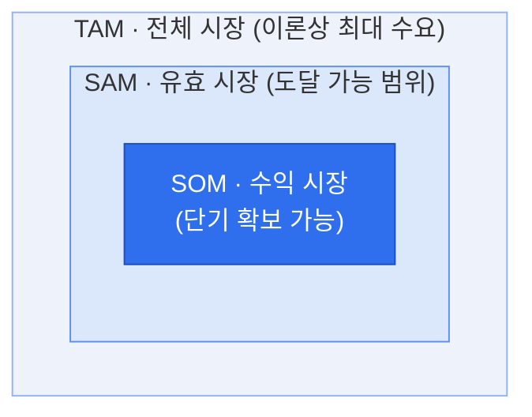

# TAM-SAM-SOM — 시장 규모 추정 프레임워크

## 1. 개요

### 가. 정의
> 신규 사업·제품의 **시장 규모를 세 개의 동심원 계층**(TAM → SAM → SOM)으로 단계적으로 좁혀 추정하는 프레임워크. 전체 잠재 시장에서 자사가 실제로 확보 가능한 시장까지를 정량적으로 산정하여 사업 타당성·목표를 제시한다.

### 나. 등장 배경 및 필요성
- 사업계획·투자 검토(IR) 시 **시장 매력도와 현실적 목표**를 동시에 설명할 필요
- "전체 시장이 크다"만으로는 실행 가능성 입증이 어려움 → **점진적 축소**로 신뢰성 확보
- 자원 배분·진입 전략·매출 목표 설정의 정량적 근거 제공

## 2. 계층 구조 (동심원 도식)



> 포함 관계: **TAM ⊇ SAM ⊇ SOM**

### 시장 규모 비중 (예시)

```chart
{
  "type": "doughnut",
  "data": {
    "labels": ["SOM · 수익 시장", "SAM · 유효 시장(SOM 제외)", "TAM · 전체(SAM 제외)"],
    "datasets": [{
      "data": [5, 25, 70],
      "backgroundColor": ["#2f6fed", "#7aa5f3", "#d7e3fb"],
      "borderColor": "#ffffff",
      "borderWidth": 2
    }]
  },
  "options": {
    "plugins": {
      "legend": { "position": "bottom" },
      "title": { "display": true, "text": "TAM 대비 SAM · SOM 비중 (단위: %)" }
    }
  }
}
```

## 3. 계층별 정의

| 계층 | 명칭 | 정의 | 예시(관점) |
|---|---|---|---|
| **TAM** | Total Addressable Market<br>(전체 시장) | 제품·서비스가 **이론적으로 도달 가능한 전체 수요**. 경쟁·제약 무시한 최대 시장 | "국내 전체 클라우드 시장 규모" |
| **SAM** | Serviceable Addressable Market<br>(유효 시장) | TAM 중 자사 **비즈니스 모델·지역·세그먼트·채널로 실제 서비스 가능한** 부분 | "국내 중소기업向 SaaS 시장" |
| **SOM** | Serviceable Obtainable Market<br>(수익/획득 시장) | SAM 중 **단기간(1~3년) 내 실제 확보 가능한** 점유 규모. 경쟁·역량·마케팅 반영 | "3년 내 목표 점유율 5% 매출" |

## 4. 시장 규모 산정 방법

| 방법 | 설명 | 특징 |
|---|---|---|
| **Top-down** | 산업 통계·리서치 자료(전체 시장)에서 세그먼트 비율로 하향 축소 | 빠르나 **과대추정** 위험, 근거 자료 의존 |
| **Bottom-up** | 고객 수 × 단가(ARPU) × 구매빈도 등 **단위 데이터 누적** 산정 | 현실적·설득력 높음, 데이터 확보 부담 |
| **Value theory** | 고객이 느끼는 **가치·지불의사(WTP)** 기반 추정 | 신시장·혁신제품에 적합, 주관성 존재 |

> 실무에서는 **Top-down으로 TAM**을 잡고, **Bottom-up으로 SAM·SOM**을 교차 검증하는 방식이 신뢰도가 높다.

## 5. 활용 시 고려사항 (기술사 관점)

1. **일관된 기준** 유지 — 금액(매출)·수량 등 측정 단위와 기간을 계층 간 통일
2. **SOM의 현실성**이 핵심 — 경쟁 강도·자사 역량·GTM(Go-to-Market) 전략을 반영해 과대 산정 경계
3. **근거 자료 명시** — 출처·가정(assumption)을 문서화하여 검증 가능성 확보
4. 정적 수치가 아닌 **시장 성장률(CAGR)** 을 함께 제시해 동적 관점 보완
5. 사업 단계별 활용: 초기 IR은 TAM 매력도, 실행 단계는 SOM 달성 가능성에 초점
6. 유사 기법(Bottom-up 수요예측, 비즈니스 모델 캔버스의 고객 세그먼트)과 연계해 정합성 강화

---

> **한 줄 요약**: 시장 규모를 *전체(TAM) → 유효(SAM) → 획득 가능(SOM)* 으로 좁혀가며 추정하는 프레임워크로, **매력적인 시장 + 현실적 목표**를 동시에 정량 제시하는 도구다.
