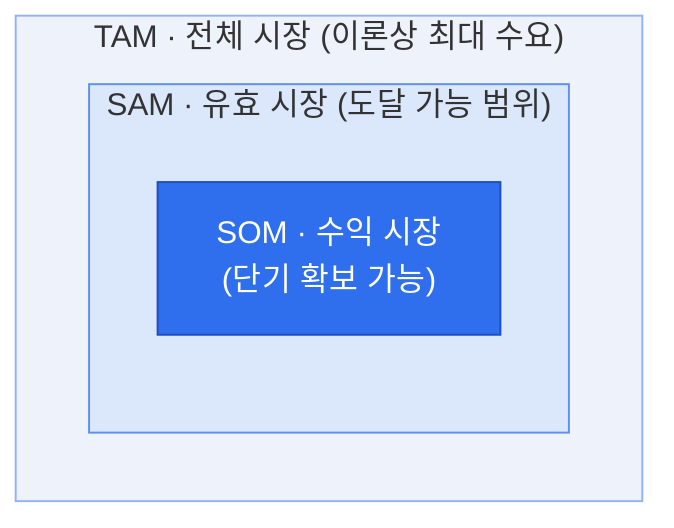

# TAM-SAM-SOM — 시장 규모 추정 프레임워크

## 1. 개요

### 가. 정의
> 신규 사업·제품의 **시장 규모를 세 개의 동심원 계층**(TAM → SAM → SOM)으로 단계적으로 좁혀 추정하는 프레임워크로, 이론상 전체 수요에서 자사가 실제로 확보 가능한 시장까지를 정량화하여 사업 타당성과 목표를 함께 제시한다.

TAM-SAM-SOM의 핵심 발상은 "시장이 크다"는 매력과 "우리가 실제로 얼마나 먹을 수 있다"는 현실성을 **하나의 논리적 흐름으로 연결**하는 데 있다. 전체 시장만 크게 제시하면 실현 가능성이 없어 보이고, 목표만 작게 제시하면 성장성이 없어 보인다. 세 계층으로 좁혀가는 구조는 이 둘 사이의 논리적 다리를 놓아, 어떤 가정과 제약으로 전체 시장이 확보 가능한 목표로 줄어드는지를 단계별로 설명한다.

### 나. 등장 배경 및 필요성
투자 검토(IR)나 사업계획에서 창업가는 두 가지를 동시에 입증해야 한다. 하나는 이 시장이 **투자할 만큼 큰가**이고, 다른 하나는 그중 우리가 **현실적으로 얼마를 가져올 수 있는가**이다. "전체 시장이 조 단위"라는 말만으로는 실행 가능성을 증명할 수 없기 때문에, 단계적 축소를 통해 근거 있는 목표로 좁혀가는 방식이 필요하다. 이 프레임워크는 자원 배분·진입 전략·매출 목표 설정의 정량적 근거를 제공하며, 특히 투자자가 창업가의 시장 이해도와 가정의 합리성을 검증하는 도구로 널리 쓰인다.

## 2. 계층 구조 (동심원 도식)



> 포함 관계: **TAM ⊇ SAM ⊇ SOM**

세 계층이 동심원(포함 관계)으로 그려지는 것은 우연이 아니다. 각 단계는 바깥 시장에 **현실적 제약을 하나씩 적용**해 안쪽으로 좁혀지기 때문이다. TAM에 비즈니스 모델·지역·채널 제약을 걸면 SAM이 되고, 여기에 경쟁·자사 역량·기간 제약을 걸면 SOM이 된다. 즉 안쪽으로 갈수록 '가능성'에서 '현실'로 이동하며, 이 좁혀지는 과정 자체가 사업의 전략적 선택을 드러낸다.

### 시장 규모 비중 (예시)

```chart
{
  "type": "doughnut",
  "data": {
    "labels": ["SOM · 수익 시장", "SAM · 유효 시장(SOM 제외)", "TAM · 전체(SAM 제외)"],
    "datasets": [{
      "data": [5, 25, 70],
      "backgroundColor": ["#2f6fed", "#7aa5f3", "#d7e3fb"],
      "borderColor": "#ffffff",
      "borderWidth": 2
    }]
  },
  "options": {
    "plugins": {
      "legend": { "position": "bottom" },
      "title": { "display": true, "text": "TAM 대비 SAM · SOM 비중 (단위: %)" }
    }
  }
}
```

## 3. 계층별 정의

각 계층은 던지는 질문이 다르다. **TAM**은 "이 문제를 가진 모든 사람이 우리 제품군을 산다면?"이라는 이론적 최대치를, **SAM**은 "우리 사업 모델·지역·세그먼트로 실제 서비스할 수 있는 범위는?"이라는 도달 가능성을, **SOM**은 "경쟁과 우리 역량을 감안해 1~3년 내 실제 잡을 수 있는 몫은?"이라는 획득 가능성을 묻는다. 예컨대 중소기업용 SaaS를 만든다면, 국내 전체 클라우드 시장이 TAM, 그중 중소기업 대상 SaaS가 SAM, 3년 내 목표 점유율 5%에 해당하는 매출이 SOM이 된다.

| 계층 | 명칭 | 정의 | 예시(관점) |
|---|---|---|---|
| **TAM** | Total Addressable Market<br>(전체 시장) | 제품·서비스가 **이론적으로 도달 가능한 전체 수요**. 경쟁·제약 무시한 최대 시장 | "국내 전체 클라우드 시장 규모" |
| **SAM** | Serviceable Addressable Market<br>(유효 시장) | TAM 중 자사 **비즈니스 모델·지역·세그먼트·채널로 실제 서비스 가능한** 부분 | "국내 중소기업向 SaaS 시장" |
| **SOM** | Serviceable Obtainable Market<br>(수익/획득 시장) | SAM 중 **단기간(1~3년) 내 실제 확보 가능한** 점유 규모. 경쟁·역량·마케팅 반영 | "3년 내 목표 점유율 5% 매출" |

## 4. 시장 규모 산정 방법

산정 방법의 선택은 **가진 데이터와 시장의 성숙도**에 달려 있다. **Top-down**은 리서치 기관의 산업 통계에서 세그먼트 비율을 곱해 내려오는 방식이라 빠르지만, 남의 가정을 그대로 물려받아 **과대추정**되기 쉽다. **Bottom-up**은 고객 수 × 단가(ARPU) × 구매빈도처럼 밑바닥 단위를 쌓아 올리는 방식이라 데이터 확보가 번거롭지만 훨씬 설득력이 높다. **Value theory**는 아직 시장이 없는 혁신 제품에서 고객이 느끼는 가치·지불의사(WTP)로 추정하는데, 주관성이 크다. 그래서 실무에서는 Top-down으로 TAM의 상한을 잡고 Bottom-up으로 SAM·SOM을 쌓아 두 결과를 **교차 검증**하는 것이 신뢰도가 가장 높다. 두 방식의 결과가 크게 어긋나면 가정 어딘가에 오류가 있다는 신호이기 때문이다.

| 방법 | 설명 | 특징 |
|---|---|---|
| **Top-down** | 산업 통계·리서치(전체 시장)에서 세그먼트 비율로 하향 축소 | 빠르나 **과대추정** 위험, 근거 자료 의존 |
| **Bottom-up** | 고객 수 × 단가(ARPU) × 구매빈도 등 **단위 데이터 누적** 산정 | 현실적·설득력 높음, 데이터 확보 부담 |
| **Value theory** | 고객이 느끼는 **가치·지불의사(WTP)** 기반 추정 | 신시장·혁신제품에 적합, 주관성 존재 |

> 실무에서는 **Top-down으로 TAM**을 잡고, **Bottom-up으로 SAM·SOM**을 교차 검증하는 방식이 신뢰도가 높다.

## 5. 고려사항 및 시사점 (기술사 관점)

이 프레임워크를 실무에 쓸 때 가장 흔한 실패는 **계층 간 기준이 뒤섞이는 것**과 **SOM을 낙관적으로 부풀리는 것**이다. 매출액과 사용자 수를 계층마다 다르게 쓰면 동심원 논리가 깨지므로 측정 단위와 기간을 통일해야 하고, SOM은 경쟁 강도·자사 역량·GTM(Go-to-Market) 전략을 냉정히 반영해야 신뢰를 얻는다. 또한 시장은 정적이지 않으므로 성장률(CAGR)을 함께 제시해 동적 관점을 보완하고, 모든 가정과 출처를 문서화해 검증 가능성을 확보해야 한다.

1. **일관된 기준** — 금액(매출)·수량 등 측정 단위와 기간을 계층 간 통일
2. **SOM의 현실성** — 경쟁 강도·자사 역량·GTM 전략을 반영해 과대 산정 경계
3. **근거·가정 명시** — 출처와 assumption을 문서화하여 검증 가능성 확보
4. **동적 관점** — 정적 수치가 아닌 시장 성장률(CAGR)을 함께 제시
5. **단계별 활용** — 초기 IR은 TAM 매력도, 실행 단계는 SOM 달성 가능성에 초점
6. **기법 연계** — Bottom-up 수요예측·비즈니스 모델 캔버스의 고객 세그먼트와 연계해 정합성 강화

---

> **한 줄 요약**: 시장 규모를 *전체(TAM) → 유효(SAM) → 획득 가능(SOM)* 으로 제약을 하나씩 걸며 좁혀 추정하는 프레임워크로, Top-down과 Bottom-up을 교차 검증하여 **매력적인 시장 + 현실적 목표**를 동시에 정량 제시하는 도구다.
