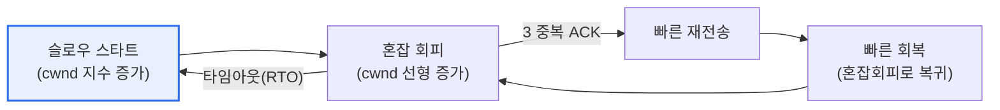
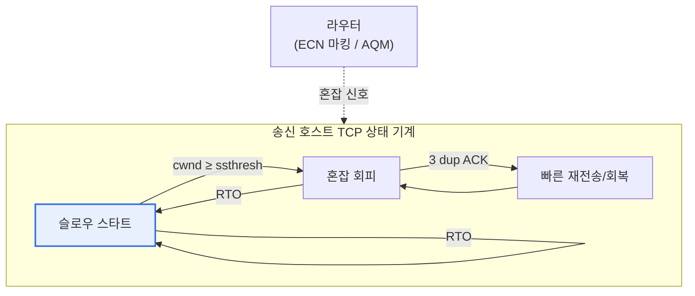

# TCP 혼잡 제어(Congestion Control)

## 1. 개요

### 가. 정의
> 네트워크 내부에 **혼잡(패킷 과부하)이 발생했을 때 송신 속도(혼잡 윈도우)를 스스로 조절해 혼잡을 완화·회피**하는 TCP의 종단 제어 메커니즘. 수신측 버퍼의 처리 속도에 맞추는 흐름 제어(Flow Control)가 '수신자 보호'라면, 혼잡 제어는 라우터·링크 등 '네트워크 공유 자원 보호'를 목적으로 한다.

혼잡 제어가 필요한 근본 이유는 '**혼잡 붕괴(Congestion Collapse)의 방지**'다. 여러 송신자가 네트워크 상태를 무시하고 데이터를 마구 쏟아내면 중간 라우터의 출력 큐가 넘쳐 패킷이 버려진다(tail drop). 그러면 송신자들은 손실된 패킷을 재전송하고, 이 재전송이 다시 큐를 키워 더 많은 손실을 부르는 악순환이 벌어진다. 결국 링크는 재전송 트래픽으로 꽉 차 있는데 정작 유효 처리량(goodput)은 0에 수렴하는 붕괴가 일어난다. 실제로 1986년 인터넷 초기에 처리량이 순간적으로 수백 배 떨어지는 혼잡 붕괴가 관측되었고, 이를 계기로 Van Jacobson이 슬로우 스타트·혼잡 회피 알고리즘을 도입한 것이 오늘날 TCP 혼잡 제어의 출발점이다.

TCP는 이 문제를 풀기 위해 하나의 영리한 가정을 한다. 무선 오류가 드문 유선망에서는 **패킷 손실을 곧 혼잡의 신호로 해석**하고, 손실이 감지되면 자발적으로 전송량을 줄인다. 즉 네트워크 코어(라우터)는 단순하게 유지하고, 지능(제어 로직)은 종단(호스트의 TCP)에 두는 '종단 간 원칙(end-to-end principle)'을 따른다. 개별 종단이 협조적으로 속도를 조절함으로써 중앙 통제 없이도 인터넷이라는 거대한 공유 자원을 안정적으로 유지하는 것이다.

### 나. 필요성과 흐름 제어와의 구분
인터넷은 수많은 종단이 동시에 나눠 쓰는 자원이므로, 각자가 자기 속도만 고집하면 전체가 붕괴한다. 혼잡 제어는 종단들이 자율적으로 협력해 대역을 공평하게 나누고(fairness) 네트워크를 붕괴로부터 지키는 핵심 장치다. 이때 흐름 제어와의 구분이 중요하다. 흐름 제어는 '빠른 송신자가 느린 수신자를 압도하지 않도록' 수신 윈도우(rwnd)로 조절하는 1:1 문제이고, 혼잡 제어는 '다수의 송신자가 공유 네트워크를 압도하지 않도록' 혼잡 윈도우(cwnd)로 조절하는 다:다 문제다. 실제 전송량은 두 윈도우 중 **작은 값**으로 결정되어 수신자와 네트워크를 동시에 보호한다.

두 개념은 자주 혼동되지만, 보호 대상과 신호원이 근본적으로 다르다. 흐름 제어의 신호는 수신자가 자기 버퍼 여유를 담아 보내는 rwnd라는 '명시적' 값인 반면, 혼잡 제어의 신호는 네트워크가 알려주지 않으므로 손실·지연 같은 '암묵적' 단서로 추론해야 한다. 이 차이 때문에 흐름 제어는 비교적 결정론적이지만, 혼잡 제어는 추론의 정확도에 따라 성능이 크게 갈리는 확률적 성격을 띤다.

| 구분 | 흐름 제어(Flow Control) | 혼잡 제어(Congestion Control) |
|---|---|---|
| **보호 대상** | 수신자 버퍼(1:1) | 네트워크 공유 자원(다:다) |
| **제어 변수** | 수신 윈도우(rwnd) | 혼잡 윈도우(cwnd) |
| **신호** | 수신자의 명시적 통지 | 손실·지연·ECN의 암묵적 추론 |
| **실제 전송량** | `min(cwnd, rwnd)`로 두 제약을 동시에 만족 | |

## 2. 혼잡 제어 메커니즘의 구성요소

전통적 TCP(Reno 계열)의 혼잡 제어는 네 요소가 상태 기계처럼 맞물려 동작한다. 각 요소는 '얼마나 공격적으로 대역을 탐색할 것인가'와 '손실 시 얼마나 물러설 것인가'라는 상반된 요구를 단계별로 조율한다.

**슬로우 스타트(Slow Start)** 는 연결 초기에 가용 대역을 전혀 모르는 상태에서 출발한다. cwnd를 1 MSS에서 시작해 매 RTT마다 배로(1→2→4→8…) 지수적으로 키워 빠르게 대역을 탐색한다. 이름은 '느린 시작'이지만 실제로는 증가 속도가 지수적이라 매우 공격적이며, '느린'은 '1에서 조심스럽게 출발한다'는 뜻이다. 지수 증가는 임계값(ssthresh)에 닿으면 멈추고 혼잡 회피로 넘어간다.

**혼잡 회피(Congestion Avoidance)** 는 이미 대역 한계에 가까워졌다고 보고 cwnd를 매 RTT마다 1 MSS씩 선형으로 늘린다. 이 단계의 철학은 'AIMD(Additive Increase, Multiplicative Decrease)'로, 평상시엔 조금씩 더해가며 대역을 탐색하다가 손실이 나면 절반으로 확 줄인다. 이 '천천히 늘리고 급히 줄이는' 비대칭성이 여러 흐름 사이의 공정성과 안정성을 만들어내는 이론적 근거다.

**빠른 재전송(Fast Retransmit)** 은 같은 순번의 중복 ACK가 3번 도착하면, 재전송 타이머(RTO) 만료를 기다리지 않고 즉시 해당 패킷을 재전송한다. 중복 ACK 3회는 '뒤 패킷들은 도착했는데 하나만 빠졌다'는 신호이므로, 값비싼 타임아웃을 기다릴 필요 없이 빠르게 복구할 수 있다.

**빠른 회복(Fast Recovery)** 은 빠른 재전송 직후 슬로우 스타트로 리셋(cwnd=1)하지 않고, ssthresh를 현재의 절반으로 낮춘 뒤 그 지점에서 혼잡 회피로 복귀한다. 경미한 손실인데도 처음부터 다시 시작하는 과도한 속도 저하를 막아, 부분 손실 상황에서 처리량을 유지한다.

| 구성요소 | 동작 | cwnd 변화 |
|---|---|---|
| **슬로우 스타트** | 초기 대역 탐색 | 지수 증가(RTT마다 ×2), ssthresh까지 |
| **혼잡 회피** | 신중한 대역 증가(AIMD) | 선형 증가(RTT마다 +1 MSS) |
| **빠른 재전송** | 3 중복 ACK 시 즉시 재전송 | (재전송 트리거) |
| **빠른 회복** | 재전송 후 혼잡회피로 복귀 | ssthresh=cwnd/2 후 그 지점 복귀 |

## 3. 혼잡 상황의 감지 신호

TCP가 혼잡을 '보는' 창은 명시적 측정이 아니라 간접 신호다. 라우터 내부를 직접 들여다볼 수 없으므로, TCP는 ACK의 도착 양상으로 네트워크 상태를 추론한다. 이 추론의 정확도가 곧 혼잡 제어의 품질을 좌우한다.

**타임아웃(RTO)** 은 일정 시간 안에 ACK가 전혀 오지 않는 상황으로, 연속된 다수 패킷이 사라졌음을 의미한다. 이는 심각한 혼잡(또는 경로 단절)의 신호로 해석되어, TCP는 ssthresh를 절반으로 낮추고 cwnd를 1로 초기화한 뒤 슬로우 스타트부터 다시 시작한다. 가장 강하게 물러서는 대응이다.

**중복 ACK 3회** 는 일부 패킷만 손실된 경미한 상황이다. 뒤 패킷은 도착했으므로 네트워크가 완전히 막힌 것은 아니라고 보고, 빠른 재전송·빠른 회복으로 cwnd를 절반만 줄이며 부드럽게 대응한다. 같은 '손실'이라도 신호의 종류에 따라 물러서는 강도를 달리하는 것이 TCP의 정교함이다.

**ECN(Explicit Congestion Notification, 명시적 혼잡 통지)** 은 손실이 나기 전에 라우터가 IP 헤더의 비트를 세워 '곧 혼잡하다'고 미리 알려주는 방식이다. 패킷을 버려서 혼잡을 알리는 대신 통지로 알리므로, 재전송과 지연을 줄일 수 있어 최신 데이터센터·모바일 망에서 활용이 확대되고 있다.

| 신호 | 의미 | 대응(cwnd) |
|---|---|---|
| **타임아웃(RTO)** | 다수 패킷 손실, 심각한 혼잡 | cwnd=1, 슬로우 스타트 재시작 |
| **중복 ACK 3회** | 단일 패킷 손실, 경미 | 빠른 재전송·회복(cwnd 절반) |
| **ECN 마킹** | 손실 전 라우터의 사전 통지 | 손실 없이 선제적 감속 |

## 4. 혼잡 윈도우(cwnd)와 톱니 동작, 그리고 알고리즘의 진화

핵심 상태 변수인 **혼잡 윈도우(cwnd)** 는 아직 ACK로 확인받지 않은 채 네트워크에 흘려보낼 수 있는 데이터량, 곧 순간 전송 속도를 나타낸다. 앞서 말했듯 실제 전송 가능량은 `min(cwnd, rwnd)`로 결정된다. 혼잡이 감지되면 ssthresh를 현재 cwnd의 절반으로 내리고 cwnd를 줄인 뒤 다시 서서히 늘려간다. 이 '선형 증가 → 손실 시 반감 → 다시 증가'가 반복되며 그리는 **톱니(sawtooth) 파형**이 전통 TCP 혼잡 제어의 상징적 특징이다. 톱니의 평균 높이가 곧 평균 처리량이므로, 손실이 잦을수록(톱니가 자주 깎일수록) 처리량이 낮아진다.

이 손실 기반 톱니 모델은 대역폭이 크고 지연이 긴 '롱 팻 파이프(long fat pipe)'에서 한계를 드러낸다. 예를 들어 대륙 간 고속 링크에서는 한 번 손실이 나 cwnd가 반감되면, 선형 증가로 원래 창을 회복하는 데 수백 RTT(수 초 이상)가 걸려 링크를 다 못 채운다. 이 문제를 풀기 위해 알고리즘이 진화해왔다.

**Tahoe**는 최초 형태로 손실 시 무조건 슬로우 스타트로 복귀한다. **Reno**는 빠른 회복을 도입해 부분 손실에서의 급락을 완화했다. 오늘날 리눅스 기본값인 **CUBIC**은 시간의 3차 함수(cubic)로 창을 키워, 반감 후 이전 지점 부근까지는 빠르게 회복하되 그 근처에서는 신중하게 탐색해 고대역·고지연 환경의 이용률을 크게 높였다. 구글이 개발한 **BBR(Bottleneck Bandwidth and RTT)** 은 아예 접근을 바꿔, 손실을 기다리지 않고 병목 대역폭과 최소 RTT를 직접 추정해 최적 전송률을 계산한다. 손실을 혼잡 신호로 오해하기 쉬운 무선·버퍼블로트 환경에서 특히 효과적이어서 유튜브 등 대규모 서비스에 적용되었다.

| 알고리즘 | 핵심 아이디어 | 특징·적용 |
|---|---|---|
| **Tahoe** | 손실 시 슬로우스타트 복귀 | 최초 형태, 회복 느림 |
| **Reno** | 빠른 재전송·빠른 회복 도입 | 부분 손실 대응 개선 |
| **CUBIC** | 3차 함수 기반 창 증가 | 고대역·고지연 최적(리눅스 기본) |
| **BBR** | 대역폭·RTT 직접 추정(모델 기반) | 무선·버퍼블로트에 강함(구글) |

## 5. 심화: 데이터센터·모바일 시대의 혼잡 제어

전통적 손실 기반 제어는 '버퍼가 꽉 차 패킷이 버려질 때까지 기다린다'는 점에서 지연(latency)에 불리하다. 라우터가 과도하게 큰 버퍼를 두면 손실은 안 나지만 큐잉 지연이 커지는 **버퍼블로트(bufferbloat)** 현상이 생겨, 화상회의·게임 같은 실시간 서비스의 응답성이 나빠진다. 이 때문에 최근 흐름은 '손실이 나기 전에, 지연 신호로 미리 대응'하는 방향으로 이동하고 있다.

첫째 축은 **능동적 큐 관리(AQM)와 ECN의 결합**이다. 라우터가 CoDel·PIE 같은 알고리즘으로 큐가 커지는 조짐을 보이면 패킷을 버리는 대신 ECN 비트를 세워 송신자에게 미리 감속을 요청한다. 데이터센터 전용으로 정교화한 것이 **DCTCP**로, ECN 마킹의 비율에 비례해 창을 세밀하게 줄여, 초저지연과 높은 이용률을 동시에 달성한다.

둘째 축은 **모델 기반 제어의 확산**이다. BBR로 대표되는 접근은 손실을 신호로 삼는 대신 링크의 물리적 특성(대역폭·RTT)을 직접 추정하므로, 무선 링크의 비혼잡성 손실을 혼잡으로 오해해 불필요하게 감속하는 문제를 줄인다. 셋째로, 전송 계층 자체가 진화하는 흐름도 있다. **QUIC**(HTTP/3의 기반)는 UDP 위에서 혼잡 제어를 사용자 공간에서 구현해, 커널 교체 없이도 CUBIC·BBR 등 알고리즘을 빠르게 실험·배포할 수 있게 했고, 연결·암호화·혼잡 제어를 통합해 초기 지연을 줄였다. 이는 혼잡 제어가 더 이상 커널 TCP에만 갇히지 않고 애플리케이션 계층에서 유연하게 진화하는 시대로 접어들었음을 보여준다.

## 6. 고려사항 및 시사점

1. **손실 기반에서 모델·지연 기반으로의 패러다임 전환.** Reno·CUBIC은 손실을 혼잡 신호로 삼지만, 이는 무선·고대역 환경에서 오판을 낳는다. BBR·DCTCP처럼 대역폭·지연·ECN을 직접 활용하는 방식이 초저지연과 고이용률을 동시에 달성하므로, 환경별로 적합한 신호 모델을 선택하는 안목이 중요하다.

2. **네트워크 특성에 맞춘 알고리즘 튜닝.** 데이터센터의 저지연·고대역, 위성·모바일의 고지연·고손실, 일반 인터넷은 최적 알고리즘이 각기 다르다. 리눅스에서 `net.ipv4.tcp_congestion_control`로 CUBIC·BBR 등을 선택할 수 있으므로, 서비스의 트래픽 특성(장기 대용량 전송 vs 짧은 요청/응답)에 맞춰 실측 기반으로 조정해야 한다.

3. **버퍼블로트 대응과 지연-처리량 트레이드오프.** 처리량만 좇아 큰 버퍼를 두면 지연이 악화된다. AQM(CoDel/PIE)과 ECN을 함께 적용해 손실 이전에 감속을 유도함으로써, 실시간성과 대역 이용률의 균형을 설계해야 한다. 특히 화상회의·클라우드 게이밍 서비스에서는 지연이 곧 품질이다.

4. **공정성(fairness)과 알고리즘 혼재 문제.** 서로 다른 혼잡 제어 알고리즘이 같은 병목을 공유하면 대역을 불공평하게 나눌 수 있다(예: 공격적 알고리즘이 소극적 알고리즘의 대역을 잠식). 대규모 인프라를 운영할 때는 알고리즘 혼재가 만드는 불공정·불안정 가능성까지 고려해 표준화·검증해야 한다.

5. **전송 계층의 유연화와 향후 전망.** QUIC/HTTP/3처럼 혼잡 제어를 사용자 공간으로 옮기면 커널 배포 주기에 얽매이지 않고 빠르게 개선·실험할 수 있다. 앞으로는 학습 기반(강화학습) 혼잡 제어나 애플리케이션 요구(지연 민감/처리량 민감)에 적응하는 제어가 확산될 전망이므로, 기술사 관점에서는 '고정된 TCP'가 아니라 '진화하는 전송 계층'으로 바라보는 시야가 필요하다.

## 참고자료
- RFC 5681 — TCP Congestion Control (https://www.rfc-editor.org/rfc/rfc5681)
- RFC 8312 — CUBIC for Fast and Long-Distance Networks (https://www.rfc-editor.org/rfc/rfc8312)
- Cardwell et al., "BBR: Congestion-Based Congestion Control", ACM Queue (https://queue.acm.org/detail.cfm?id=3022184)
- RFC 3168 — The Addition of Explicit Congestion Notification (ECN) to IP (https://www.rfc-editor.org/rfc/rfc3168)

---

> **한 줄 요약**: TCP 혼잡 제어는 *슬로우스타트·혼잡회피·빠른재전송·빠른회복* 으로 혼잡 윈도우(cwnd)를 AIMD 톱니 형태로 조절하고 타임아웃·중복ACK·ECN으로 혼잡을 감지해 혼잡 붕괴를 막으며, 손실 기반(Reno·CUBIC)에서 모델·지연 기반(BBR·DCTCP)과 QUIC로 진화하고 있다.
